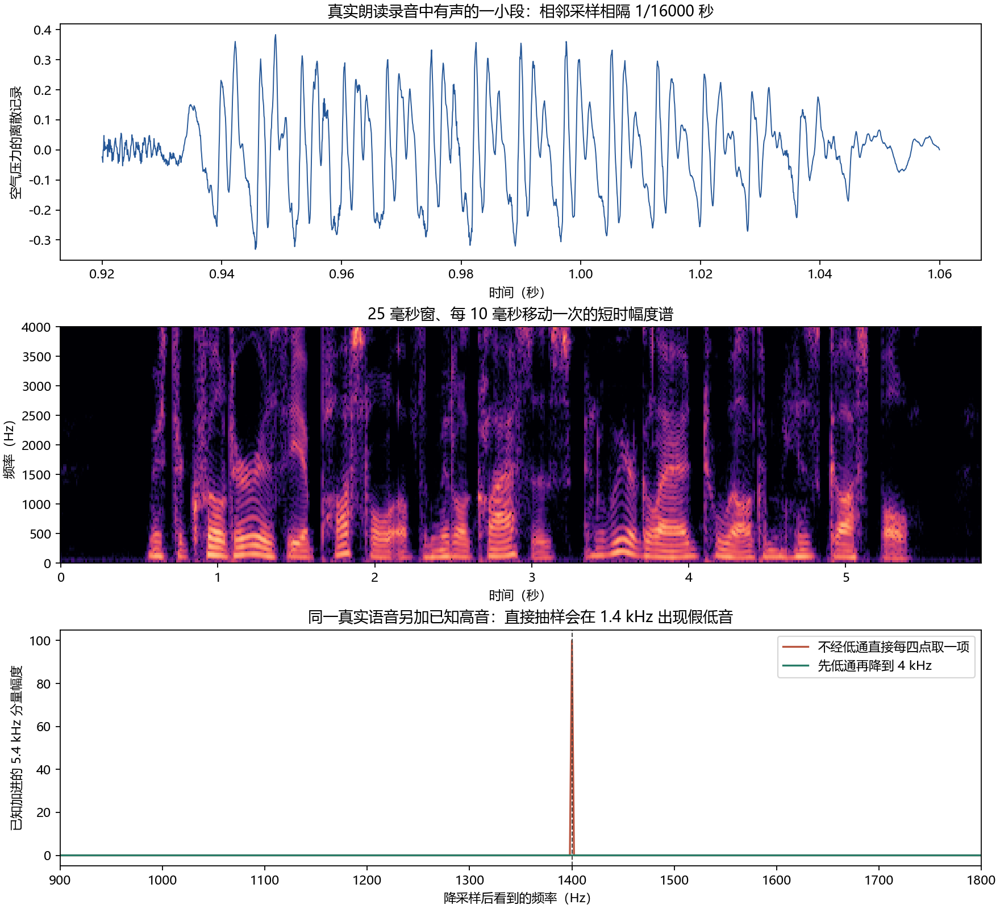
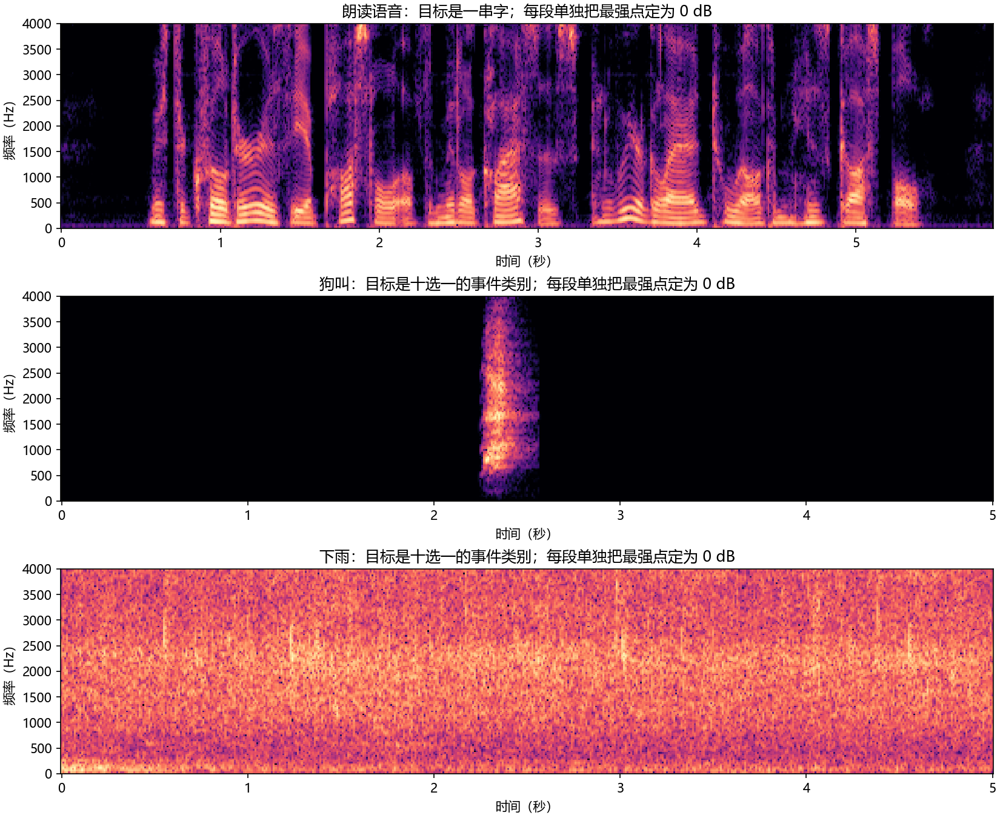
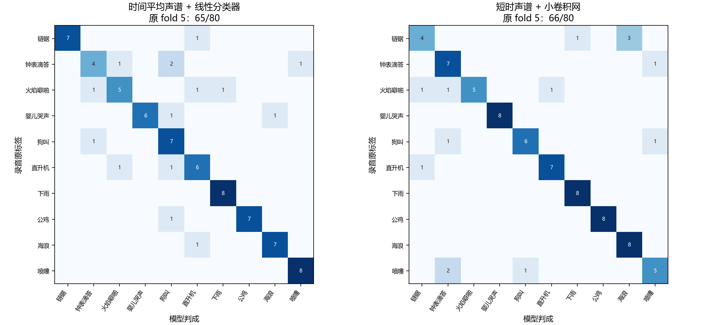
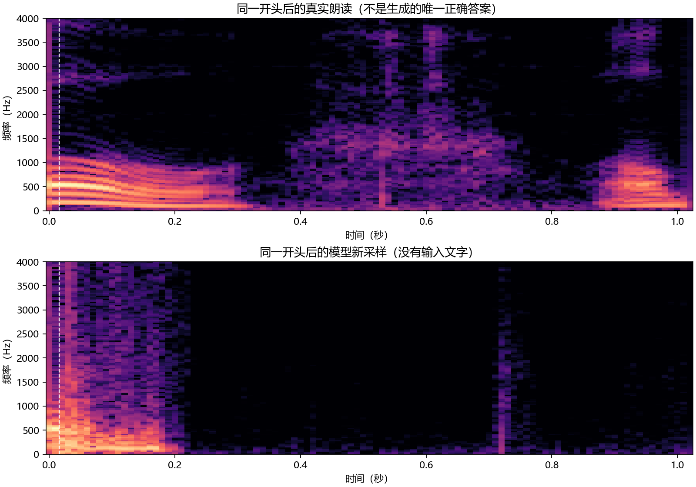

# 第三十二章　声音怎样从波形走向文字与新声音

上一章可以把一张图放在桌面上，指着同一个像素问：噪声变大时，这里还剩多少原来的颜色？声音却不会同时摆出所有时刻。耳朵收到的是不断变化的空气压力；电脑保存的是按时钟取下的一串数。一段五秒录音可以被转写成十几个词，也可能是一声狗叫、一阵雨，或者没有任何词可写。如果我们希望它自己发出一段声音，输出又必须重新成为一串能播放的采样值。这几件事可以共享声学表示，却没有同一份“正确答案”。

本章从一段真实的英语朗读和几段真实环境录音开始。我们会亲手看到采样、短时频谱、相位各自留下和丢掉什么；再让一个从随机权重开始的小网络在**有录音、有整句文字、却没有逐帧字母边界**的资料上学转写。随后换成狗叫、雨声等只给整段类别的录音，看看目标怎样改变；最后在原始波形上学下一采样值并真正生成一秒新声音。第三十一章的图像扩散只给了“可以学习生成路径”的一种背景，不为这些音频任务提供现成答案。

## 一秒声音为什么会变成一万六千个数

麦克风把某处的压力变化变为电信号。用 \(s(\tau)\) 记连续时间 \(\tau\) 上的信号，取样率 \(f_s\) 表示每秒量多少次；电脑中的第 \(n\) 个数是 \(x[n]=s(n/f_s)\)。本机取得的 [LibriSpeech 原始朗读](../data/librispeech_dev_clean/SOURCE.md)每秒取 16,000 次，单声道 FLAC 文件把这些样本无损保存。我们选出的训练段 `1272-128104-0000` 长 5.855 秒，实有 \(5.855\times16000=93680\) 个采样；它旁边确有整句文字，而不是作者给声谱图临时编出的标签。

采样率不是音量，也不是网络训练的步数。假设原连续声音只含不超过 \(f_s/2\) 的频率成分，并先经过相称的低通滤波，等间隔样本才有恢复原带限信号的条件。采样率一半这条界叫**奈奎斯特频率**：16 kHz 录音的界在 8 kHz，若把它降到 4 kHz，新界就变为 2 kHz，原来更高的部分要**先滤掉**。否则，记录可能把一个高音错写成低音。这个限制不会因文件还能正常播放而消失。

我们在真实朗读上另加一条**已知的** 5.4 kHz 正弦，只为单独测混叠；它不是原录音里真的有警报声。若直接每四点拿一点，新采样间隔对应 4 kHz，\(\sin(2\pi\cdot5400n/4000)=\sin(2\pi\cdot1400n/4000)\)，于是新文件里会出现原先并无的 1.4 kHz 低音。若先低通再降采样，这项已知正弦在同一频率格的隔离幅度由约 99.975 降到 0.016。图下排的红、绿两条线来自**同一份加了已知高音的真实声音**；被减掉的原声音使我们只看这次添加的分量，不把人声本来在 1.4 kHz 的能量混进证据。上排是这份朗读实际有声处的 0.14 秒波形。([程序和逐项数值](../code/c32_signal_lab.py)；[运行收据](../runs/c32_signal_real_speech_v2/receipt.json))

你可以从[原始朗读](../runs/c32_signal_real_speech_v2/original_speech.wav)、[先低通的4 kHz录音](../runs/c32_signal_real_speech_v2/proper_4khz_speech.wav)和[直接每四点抽一次的录音](../runs/c32_signal_real_speech_v2/naive_4khz_speech.wav)回到波形本身。图中的正弦是特意加入的数学检验，后两份可播放文件则是**原朗读本身**各用一种降采样办法处理，没有悄悄把那条测试正弦混进你的听感比较。

## 同时问“何时”和“什么频率”，代价是什么

一整段声音做一次傅里叶变换，能指出哪些频率总体出现过，却不告诉我们狗在第几秒叫、哪一个音节先来。1939 年 Homer Dudley 研究如何从音高、声谱等较慢变化的控制信号重新造出能听懂的语音，当时的问题包括传输、分析与合成；那不是文字训练模型。1946 年 Koenig、Dunn 与 Lacy 的声谱仪把时间、频率和强度放到一张可观察的记录里。他们把一小段声音留在磁带圈上反复播放，逐个频带分析，再让纸上深浅记录强度；论文第27页说当时的机器可截住最近约2.4秒，远不可能像今天一样随手读进几小时录音。我们没有从这些早期工作推出今天的神经网络会怎么设计；它们在这里改变的是**要保留哪一种声音信息**：只留整段一个频率总表，不够表示一个词何时发出，也不够把声音按原顺序造回来。([Dudley，1939，原文](https://pmc.ncbi.nlm.nih.gov/articles/PMC1077925/)；[Koenig、Dunn、Lacy，1946，原文第21—27页](https://languagelog.ldc.upenn.edu/myl/koenig1946.pdf))

频率分得多细，和变化发生的时间又怎样兼顾？原论文图15真拿一段同样的女声，在约90、180、300、475 Hz的不同分析带宽下观察：较窄时一条条谐波仍可分辨；带宽变大，谐波融合，声道共振区却还看得见。今天我们用数字窗做分析，仪器结构已不同，但同样不能只说“把频率刻得越细越好”而不问一个短促辅音还剩多少时间位置。([Koenig 等，1946，原文图15与第31—32页](https://languagelog.ldc.upenn.edu/myl/koenig1946.pdf))

本机把波形分成 25 毫秒的小窗：16,000 次/秒意味着一窗 400 个原样本。下一窗每隔 10 毫秒、即 160 个样本开始，因此前后窗重叠。对边缘按程序补零后，第 \(m\) 窗乘一条两端渐弱的 Hann 权，再用 512 个频率位置计算复数谱：
\[
X_{m,k}=\frac{1}{\sum_{r=0}^{399}w[r]}
        \sum_{r=0}^{399}x[m\cdot160+r]w[r]e^{-2\pi i kr/512}.
\]
这里的 \(i\) 是虚数单位，\(X_{m,k}\) 一般有实部与虚部。它的绝对值说这一小段中该频率有多强，辐角则保存相位。实际程序为了让第一窗也居中而在左边补零，所以公式里的 \(x[\cdot]\) 可理解为补零后的索引；这项边界处理不改变一窗400点、跳160点的工作。512 点频率格间距是 \(16000/512=31.25\) Hz，但后面的112点是补零，不会把25毫秒的真实分辨能力魔法般提高到随便两个极近频率都能分开。譬如两纯音只差10 Hz，25毫秒内两者的相对相位只错开 \(10\times0.025=0.25\) 圈；往这25毫秒后面写112个零，没让仪器真的多听到另一整圈。把窗拉长有助于分近频，却会把一次短促起声涂抹在更长时间里，所以本章的25毫秒是一个有代价的选择。

这条真实录音变成 \(257\times587\) 个复数：257 是实值声音从零到 Nyquist 的非重复频率格，587 是按上述补零/移窗得到的时间位置。保留复数 \(X\) 并用相配的窗重叠相加，本机回到波形的均方根误差仅约 \(6.18\times10^{-9}\)。把同一幅度强行都配零相位，即使再把播放音量归一到相同均方根，回到原波形的误差约 0.0876；[两份可播放录音](../runs/c32_signal_real_speech_v2/magnitude_with_zero_phase.wav)与[保留复数谱的重建录音](../runs/c32_signal_real_speech_v2/complex_spectrum_reconstruction.wav)可自己比较。这不证明某种聪明的相位恢复算法做不到好听的声音；它证明**“知道每窗有多少频率能量”本身没有把那次原波形完整交还**。生成频谱时，如何得到能播放的相位/波形还要另有方法。

识别文字未必需要保存每个采样的原相位。1946年原论文第45页已经讨论：他们当时的图用线性频率刻度，但若要更贴近听觉，低频较窄、高频渐宽的分析带也值得考虑。**这不是说他们写出了今天的mel公式。**([1946 原论文第45页](https://languagelog.ldc.upenn.edu/myl/koenig1946.pdf)) 本机另选 **mel** 这把经验刻度摆放频带中心：取 \(m(f)=2595\log_{10}(1+f/700)\)，\(f\) 以 Hz 计；它在低频留较细的间隔，在高频把更宽的范围汇在一起，并不是网络自行发现的声音“语义”。我们把 \(|X_{m,k}|^2\) 乘80条相邻重叠的三角形频带，并取对数，得到每窗80项的数：
\[
z_{m,b}=\log\!\left(\max\left\{
\sum_{k=0}^{256}W_{b,k}|X_{m,k}|^2, 10^{-10}
\right\}\right).
\]
\(W_{b,k}\) 是第 \(b\) 条 mel 频带落在频率格 \(k\) 的权重，本机每带规范到权重和为1；这些带在低频处分得更细。对数使非常强与很弱的能量不至于直接差成几个数量级，底下的正数防止对零取对数。于是刚才93680个波形值变成 \(587\times80\) 个可送给识别器的声学数。它**丢失了**具体相位和一部分频率细节，所以没有被拿来假装原波形的无损压缩。关于窗口、采样率和这80带的实际公式在[特征程序](../code/c32_audio_features.py)中同一处实现；我们已为2703段真实录音生成相应特征，而没有把图片的像素数组改名叫音频。

## 同一张声谱图，问题可以完全不同

把真实朗读、狗叫、雨声都画在0到4 kHz、相近时间轴上，会看见不同结构：朗读的频带随声道与音节变化，狗叫的强声只占五秒录音的一段，下雨的能量则铺得更连续。三张图在每段内部各把最强点设为0 dB，**不能**拿颜色深浅比较三份录音谁更响。更重要的是右边想取得的答案不同：朗读有顺序明确的字串，狗叫和雨声在这里各只有一个整段事件类别。后两段环境录音还没有“第2.30秒开始、第2.54秒结束”的人标边界。([实际三段及来源](../results/c32_three_real_sounds_v2.json))

1952 年 Davis、Biddulph 与 Balashek 的电话质量数字识别装置处理的是**一个说话者的十个数字词**，原刊摘要报告其在该限定下的高准确率，同时说换说话者需要重新调整。若把这个成果写成“1952年机器已经会自由听写”，真正困难的地方便被抹掉了：词汇从十种变成任意句子，说话人变多，音节长短和词界都不再由有限模板直接规定。这里关于原装置只依据可读到的原摘要，不能补写未读到的电路细节。([原刊页面](https://pubs.aip.org/jasa/article/24/6/637/618458/Automatic-Recognition-of-Spoken-Digits)；[可读的原摘要记录](https://colab.ws/articles/10.1121%2F1.1906946))

到了连续语音，不能假设第 \(t\) 个声学窗必对应句子的第 \(t\) 个字。1975 年 James Baker 介绍 DRAGON 时，面对的是多个知识来源都可能出错的连续语音理解；他用马尔可夫过程的概率结构组合这些来源。1989 年 Rabiner 的长篇教程整理了已在工作的隐马尔可夫模型和语音识别实现，不是到1989年才发明这套模型。这个阶段的一个合理安排是：给候选词串和发音先定可能的声学状态顺序，状态能停留或前进；每个短窗由状态给一个声学机会。动态规划把各种可能的停留长度加起来，并可另接词与发音、句子出现的机会。它能正常工作，代价是需决定状态、发音和各部件怎样拼接，不是简单一句“老方法必须被端到端取代”。([Baker，1975](https://research.ibm.com/publications/the-dragon-system-an-overview)；[Rabiner，1989，§II—III](https://www.fceia.unr.edu.ar/prodivoz/Rabiner_1989.pdf))

用第九章已有的隐变量语言，可以看见这里的数学必要性。设一段输入声谱为 \(z_1,\ldots,z_T\)，一条看不见的发音状态路径为 \(a_1,\ldots,a_T\)。在给定候选字/词串 \(y\) 和具体模型条件下，一条路径的机会由初态、逐窗声学项和逐步转移项相乘；整句的声学机会则要**对可能路径求和**：
\[
p(z_{1:T}\mid y)
=\sum_{a_{1:T}}p(a_1\mid y)
  \left(\prod_{t=1}^{T}p(z_t\mid a_t,y)\right)
  \left(\prod_{t=2}^{T}p(a_t\mid a_{t-1},y)\right).
\]
这只是说明一类 HMM 的对齐职责，不是本机另训了一套 DRAGON。状态路径多得无法一条条列，但若当前声学状态是 \(j\)，前一刻只能从允许的若干状态 \(i\) 来，就可以把所有“走到 \(j\)”的机会接在已经算过的前缀和后面。真正要保住的是这项**路径求和**：语音标注通常给整句，不给每个小窗一张精确的“字母出现时刻”表。2006 年的另一种做法将这项求和直接接到循环网络的可微输出上。

## 没有人告诉第几帧是哪个字，怎样还给网络误差

Graves、Fernández、Gomez 与 Schmidhuber 2006 年的 *Connectionist Temporal Classification*（CTC）研究的正是**未切好边界的输入序列与标签序列**；原论文的例子之一是TIMIT音素识别，也提到手写等序列，不是为今天的语音助手专造的一种字符串函数。它给每个声学时间位置一份分布，候选包括字母和一种“此处先不发字”的 **blank**。网络可以在许多不同时间位置发同一串字，只要这些位置选择经同一规则合并后是给定的目标。([CTC 原论文，§2—4](https://www.cs.toronto.edu/~graves/icml_2006.pdf))

先把合并规则做对。令 \(\pi=(\pi_1,\ldots,\pi_{T'})\) 是 \(T'\) 个网络输出位置各选的一个符号。函数 \(B\) **先合并连续重复符号，再去掉 blank**：例如 `A,A,blank` 变成 `A`；若目标确实是两个连续的 A，路径至少要有 `A,blank,A`。先删 blank 再合并就会把本来需要两个 A 的证据毁掉。这个区别会直接影响标注可达性：若目标长 \(U\)，有 \(r\) 对相邻重复字母，至少需要 \(U+r\) 个网络时间位置；训练程序在首次更新参数前就检查每条录音的这项条件。

已给整段声音 \(x\) 时，我们让网络第 \(t\) 个输出位置报 \(q_t(k\mid x)\)。本机双向 GRU 在算它之前能读这段声音的前后位置；CTC 的**输出层**仍把一条给定路径的机会分解成各位置分布的乘积：
\[
p_\theta(y\mid x)
=\sum_{\pi:B(\pi)=y}\prod_{t=1}^{T'}q_{\theta,t}(\pi_t\mid x),
\qquad L(\theta;x,y)=-\log p_\theta(y\mid x).
\]
训练者知道整句目标 \(y\)，但不选择其中某条对齐路径当“唯一正确答案”。如果一条路径早一点发 A、另一条晚一点发 A，两条都要给同一句的概率作贡献。最小化负对数使**这整个路径集合**得到更多机会；不是拿真实字串与每帧输出逐格硬作交叉熵。

怎么避免穷举 \((字母数+1)^{T'}\) 条路径？把目标在首尾及字间插 blank，得到 \(y'=(\bot,y_1,\bot,y_2,\ldots,y_U,\bot)\)。令 \(\alpha_t(s)\) 表示走完前 \(t\) 个时间位置、停在扩展目标第 \(s\) 个符号上的全部路径概率。新一步可以继续停在 \(s\)，从 \(s-1\) 前来；若 \(y'_s\) 不是 blank 且与 \(y'_{s-2}\) 不同，还可从 \(s-2\) 跳来。因此
\[
\alpha_t(s)=q_t(y'_s\mid x)
\left[\alpha_{t-1}(s)+\alpha_{t-1}(s-1)
+\mathbf1_{\{y'_s\ne\bot,\ y'_s\ne y'_{s-2}\}}
\alpha_{t-1}(s-2)\right].
\]
越界项按零处理；起步只能在最左 blank 或首字，结束把最后字与末 blank 两格相加。这个局部递推同刚才 HMM 的前缀求和有家族关系，却选择了不同的网络分布和合并路径。实际长度很长时我们在**对数域**算，避免许多小概率相乘变成机器里的零；PyTorch 的 `CTCLoss`替我们实现这部分稳定求和和导数，不替我们选择数据、输入长度或标签。

[三帧小程序](../code/c32_ctc_alignment_probe.py)先把所有路径真的列完，再和库函数比。目标 `AB` 的负对数概率约1.133204，目标 `AA` 约2.071473；两种算法的值和对每个原始分数的导数一致。它还造出一个容易踩坑的两帧例子：每帧报 blank 0.4、A 0.35、B 0.25。逐帧取最大是两个 blank，读成空串；**把所有通向 A 的路径相加**却给 A 约0.4025，是概率最高的标签。因而“逐帧贪心路径”只是便宜的解码近似，不等于上式求得的最大标签概率。我们在真实录音上使用的正是这个便宜解码器，没有事后假称已做高质量词典或搜索。

## 把整句文字交给训练者，再看一台小模型实际学到了多少

本机的 LibriSpeech `dev-clean` 是官方**开发集**，不是官方训练资料。我们只为这章在其内部按说话者做一次固定划分：32位说话者的2180段、约4.310小时供参数更新，另4位的233段、约0.541小时供选择，最后4位的290段、约0.537小时在选择固定后才打开。三个集合没有同一个说话者；逐字相同的完整转录在组间也没有发现。它仍是读书人朗读英语，不代表嘈杂咖啡馆、儿童口音或中文；尤其不能与论文在官方 `train-clean-100` / `test-clean` 上的成绩放同一表排名。([来源与内部切分](../data/librispeech_dev_clean/SOURCE.md))

完整程序从随机参数建一个约205万参数的网络：80维短时声谱先经一层步长2的时间卷积，把一段587帧压为294个输出位置；后面三层双向 GRU 给这些位置各一份字母/blank 分布。第十四章已用同一门控计算说明 GRU 怎样逐时更新隐藏活动；这里一个重要改变是**双向**，故每一位置还读到了后面的声音，不能把这台实训模型叫成“边听边出字”。目标串由配对录音的人工转录给出，网络没有接收目标句子作为音频输入。代码里真正把一批数据接到刚才路径求和的是：

~~~python
logits, output_lengths = model(log_mel_batch, input_lengths)
log_probs = torch.log_softmax(logits.float(), dim=-1).transpose(0, 1)
loss = torch.nn.functional.ctc_loss(
    log_probs, concatenated_character_targets,
    output_lengths, target_lengths,
    blank=0, reduction="mean", zero_infinity=False,
)
optimizer.zero_grad(set_to_none=True)
loss.backward()
torch.nn.utils.clip_grad_norm_(model.parameters(), 5.0)
optimizer.step()
~~~

`log_mel_batch` 的轴为“本批录音、时间窗、80条频带”；`logits` 也是按录音和压短后的时间排列，最后一轴为29个候选（blank、空格、26字母、撇号）。库的CTC要求时间在第一轴，所以 `transpose(0,1)` 只换布局，**不改变声音顺序**。`output_lengths` 是每条录音经步长2卷积后实际剩的时间位置数；本批短录音为了凑成矩形补的空白不能进入其CTC路径。`target_lengths` 告诉库每条文字各有几个字符，拼在一起的目标数组本身不含 blank。`reduction="mean"` 先按各句目标长度规范化再在批里平均，故报告的数不是整份资料逐字无权总似然。`backward()` 给参数导数，`step()` 才改权重；`zero_infinity=False` 使不可能对齐时直接暴露问题，而前面的长度检查防止它悄悄发生。([完整训练程序](../code/c32_ctc_speech.py))

预先定的第一轮计划跑12个训练轮次，验证CTC损失从随机初值约9.935降至1.211；按这个损失选第12轮。再从该权重开始、以较小学习率延续18轮，选择规则仍看**验证CTC损失**，而不是看到某句测试转录后挑好看的检查点。续训第1轮最好，验证损失约1.196；再往下训练，训练损失一路降到0.293，最后验证损失却升到1.471。有限资料上“训练越来越会背本批声音”与“其他说话者也越来越准”明显不是一个结论。完整30轮不因最后权重较新就自动更好。([首轮记录](../runs/c32_ctc_full_12/train.json)；[延续记录](../runs/c32_ctc_continuation_18/train.json))

固定续训第1轮权重后，我们首次读取那290段内部留出录音，用逐帧贪心、合并重复/blank、**不接外部语言模型**的办法解码。字符编辑距离总和除以真实字符数约 **35.17%**；单词编辑距离总和除以真实词数约 **81.78%**。编辑距离分别把插入、删除、替换算一次；一词只错一两个字母时，字符率可能尚可，但整个词已算错，所以两个比例能差很多。例如目标 `MOST WONDERFUL`，本机给出 `MOETO ONDERFUL`；已经捕到不少声学形状，却不能交给人作为可靠听写。词错率甚至可能在极弱模型时超过100%，因为一条真实短句可被插入许多错误词；它不是被数学强制截在0到1的准确率。([第一次内部留出测试及分母](../results/c32_ctc_first_test.json))

这份小模型的局限有可指认的条件：从零开始只见约4.3小时标注声音，输出只按字符贪心，验证/测试说话人完全不在训练里。上述条件一起存在，**没有单独消融证明哪一项造成了具体多少错误**。反过来，也不能拿 2020 年 wav2vec2 在海量无转录语音预训练后的数字，或 2023 年 Whisper 论文的数十万小时训练，填进本机这个格子。我们至少可以确实追踪：真实 FLAC 波形→80维窗特征→网络29路概率→所有可能对齐的损失→梯度更新→冻结后290段新朗读的文字。对齐不是人补造的细粒标签，识别质量也没有因为这条链跑通就被宣告足够好。

## 若要边听边出字，过去已经写过什么也要进计算

CTC每个位置的字符分布可利用双向声学编码的上下文，但它**没有**把刚输出的具体字母作为下一输出位置的独立输入；所有路径使用同一组按时间给出的分布。2012 年 Alex Graves 的 RNN Transducer（RNN-T）为另一项任务组织出两条状态：一条声学网络在时间 \(t\) 看到了什么，一条预测网络在已经写了 \(u\) 个字符后记得什么。两者在格点 \((t,u)\) 合并，给 blank 和各字母概率。这个思想没有从“CTC不工作”必然推出：CTC在自己的条件下仍会正常训练；新设计是在对齐路径中让**已输出前缀**也影响下一步，并允许同一声学时间位置连续输出不止一个符号。([Graves，2012，§2](https://www.cs.toronto.edu/~graves/icml_2012.pdf))

给固定目标 \(y_1\ldots y_U\) 作一张小格。\(\alpha(t,u)\) 是已消费 \(t\) 个声学位置、已发出前 \(u\) 个目标字母的总概率。一个 blank 从 \((t,u)\) 到 \((t+1,u)\)，**消耗声学时间**；发下一个正确字母从 \((t,u)\) 到 \((t,u+1)\)，**推进输出串**，可以暂不消费新的声学位置。于是一个内部格点从左边的blank边和下方的字母边收到两种前缀路径：
\[
\alpha(t,u)=\alpha(t-1,u)b_{t-1,u}
             +\alpha(t,u-1)\ell_{t,u-1},
\qquad \alpha(0,0)=1,
\]
边界项只在对应边存在时算。\(b_{t,u}\) 与 \(\ell_{t,u}\) 都由当前声学活动和已输出前缀的活动共同给出；若真实目标的下一字符是 B，不能把同一格给 A 的概率偷偷算进 B 的标签似然。本机[两声学位置、目标AB的有限格](../results/c32_rnnt_lattice_probe_v2.json)恰有三条完备路径，逐项相乘再相加得约0.196019；上式动态相加给同数，损失对格点原分数的导数最大差约 \(5.55\times10^{-17}\)。这只核了格子计算，**并没有在本机训练 RNN-T 声学网络或得到其识别率**。

“可以边听边发”还要问声学网络是否偷看未来。2012 原论文实验里的声学支曾用**双向**循环网络，不能把它的全部结果直接写成流式。2015年预稿、2016年发表的 Listen, Attend and Spell 又选了编码整段声谱、由注意力解码字符的路线，对此前端到端CTC作另一种输出依赖安排；它在自身任务上有实测，却常需等更多输入才能安全决定前文。2019 年面向手机的流式 RNN-T 工作才把低延迟、因果可见范围、设备容量和量化速度列成产品条件。它们不是一条方法每年“取代”前年的流水线：一台服务器可以容忍不同等待，一台离线手机不可以；同样的词错率若要等完整句子才出首字，交互感受会不同。([LAS，2016](https://research.google/pubs/listen-attend-and-spell-a-neural-network-for-large-vocabulary-conversational-speech-recognition/)；[流式移动识别，2019](https://research.google/pubs/streaming-end-to-end-speech-recognition-for-mobile-devices/))

## 回看另一条声音资料：狗叫和雨声没有“正确转录”

语音研究向逐字听写深入的同时，2015 年 Piczak 整理了环境声音 ESC-50：五秒一段，共50类，每类40段，来自 Freesound 上的真实录音。这不是把人声转录删掉以后剩下的“低级任务”。若目标是判断一次机器声、咳嗽或海浪是否出现，整段类别有用；若要写出词、给事件精确起止或描述几个重叠声源，这份标签却不够。本书实际只取上游明确另标 CC BY 的 ESC-10 小集，十类共400段。原作者给五个 fold，把同一原录音裁出的片段放在同一 fold，避免训练时已听过某个声音、测试却被当作从未听过的新片段。我们用 fold 1—3 共240段训练、fold 4 的80段选参数、fold 5 的80段作首次测试；**不是**原论文五折平均成绩。上游还警告某些片段经过与类别相关的带宽处理，模型可能从制作痕迹而非“狗的本质”得分。([原论文](https://karol.piczak.com/papers/Piczak2015-ESC-Dataset.pdf)；[本机固定原件与许可](../data/esc10_33c8ce9/SOURCE.md))

每份原 WAV 是44.1 kHz、五秒、单声道。为使本章两类声谱可对照，程序先用带低通的多相滤波把它降到16 kHz，再沿前面的25毫秒窗/80条mel带计算；不能拿每隔几个点硬抽代替这一步。与CTC不同，监督目标是**整段十选一**。给出十类分数 \(s_j(x)\)，真实类别是 \(y\)，该段损失就是 \(-\log[\exp s_y/\sum_j\exp s_j]\)。只有一份目标，不需要blank、重复字母合并或几百帧到十几个字符的路径和。程序真正改变参数的样本也只有240段，比刚才的语音转写小得多。([资料准备](../code/prepare_c32_esc10.py)；[两种实际分类器](../code/c32_esc10_sound_events.py))

我们不只给网络一个名字就报分。第一种分类器把每条频带在整段中的**时间平均与波动**汇成160个数，再按训练组均值/方差标准化，用一条多类线性规则判别。它故意不保存狗究竟在第2.3秒叫；作为整段类别的基线，若声音平均谱足够不同，它完全有机会成功。第二种在时间×频率的小块上做三层卷积，最后汇成整段类别；它能利用局部模式，仍**不能**仅凭全段类别loss输出事件开始和结束时刻。两者都只用本机资料从随机参数学，验证组选正则强度或轮次后才第一次看 fold 5。

验证负对数评分最低时，线性法选择的 \(C=1\)，验证80段答对63段；卷积网选择第46轮，亦答对63段。第一次 fold 5 测试，线性法 **65/80**，卷积网 **66/80**。多对一段不等于两种尺都更好：在实际类别的平均负对数评分上，线性法约 **0.630**，卷积网约 **0.690**。图里下雨两法都答对8/8，卷积网在链锯只答对4/8；样本每类仅8段，不能由这一格推普遍的声学难度。合理读法是：在**这次小资料、一个fold和这些训练选择**下，时间平均谱已经是强对照，卷积网的额外自由度没有给出全面领先的证据。([两法训练/验证记录](../runs/c32_esc10_one_fold/cnn_train.json)；[线性对照](../runs/c32_esc10_one_fold/baseline.json)；[首次测试的分子分母](../results/c32_esc10_first_test.json))

2017 年的 AudioSet 又把问题改宽：十秒片段可由人核出**多个**事件，一段有“人声”和“音乐”并不稀奇；后来的强时间标注才为一些片段补上事件开始和结束。把单标签分类器的66/80说成“听懂复杂声景”，便把这些不同标注工作全抹平了。2022 年 CLAP 则拿**音频与简短文字描述的配对**训练双编码器，试图让不在预定十类名单里的语言条件也能和声音比较；短描述也不保证详写所有声源和时间关系。我们的 ESC-10 只有类别，没有训练过自由文字描述，更没运行CLAP。([AudioSet官方数据及强标注说明](https://research.google.com/audioset/download_strong.html)；[CLAP原文](https://arxiv.org/abs/2206.04769))

## 无需逐句文字的声音，也不是没有学习信号

环境声音那条支线刚说到2022年的音文配对；现在回到同时发展的**语音转写**问题，先从2020年看另一种资料条件。刚才的CTC训练一次要有录音和相应转录，特别是小语言或无文字资料时，这种配对昂贵。wav2vec 2.0 先在大量**没有逐句文字**的声音上学习：原波形经卷积形成一串潜位置，遮去一部分后，让读到上下文的网络从量化出的真正潜目标和若干干扰目标中辨别对应者。遮哪一段、什么算正确潜目标、什么算负例，都由音频和训练设计提供信号。随后论文才拿少量**有转录**录音按识别目标微调；不能把第一阶段写成“模型独自听一听就会拼字”。本机没有复刻那份大规模自监督预训练，因而不继承论文在十分钟标注条件下的词错率。([Baevski等，2020，§1—2](https://proceedings.neurips.cc/paper/2020/file/92d1e1eb1cd6f9fba3227870bb6d7f07-Paper.pdf))

另一条路线在2022年预稿、2023年发表的 Whisper 研究里显得更清楚：搜集大规模带弱文字监督的网络音频，使用编码器—解码器直接训练跨语言、多任务的声音到文字预测。原论文称训练规模约68万小时，标注噪声和跨域评价也成为设计问题。它与“先无转录表征、后少量转录CTC”的信息顺序不同，更不能因为本机同样用了短时声谱就说我们复现了 Whisper。历史走到这里，声学网络、对齐目标、无文字预训、弱文字监督和部署延迟都在影响系统；没有一条叫“音频模型”的万能训练式。([Whisper，ICML2023原文，摘要与§2](https://proceedings.mlr.press/v202/radford23a/radford23a.pdf))

## 会把声音认成字，并不等于能把字说成声音

这个方向的区别可以用条件概率直接看。转写器学 \(p_\theta(文字\mid 声音)\)，回答“听到这段，哪串字可能对”；合成器要的是 \(p_\phi(声音\mid 文字)\)，回答“给这串字，哪一段能播放的声音可能出现”。在一个**已定义且已学会的联合分布**里，贝叶斯关系可把两项相连，但只得到前一个判别分布并不知道完整声音先验 \(p(声音)\)，不能在程序里把箭头反过来就生成波形。同一句话也能被不同人用不同速度、音高和停顿说出；文字没给唯一一条压力曲线。第三十一章从噪声生成图的经验提醒我们要说明采样路径，可它没有替这个文字条件提供录音—文字配对、时长，或把中间声谱变回可播放波形的合成器（声码器）。

合成声音的研究远早于现代转写网络。1939 年 Dudley 用声道频谱和激励重造声音，说明可听波形的形成与文字识别是不同的工程问题。1996 年 Hunt 与 Black 的单元选择路线面对已有文字/发音目标，从大量真实录音中挑音段，再按目标匹配与相邻拼接代价选连接；正常情况下它可生成自然的人声，弱处在语料覆盖和接缝选择，不能为了引出神经方法就写成全无用处。2016 年 WaveNet 进一步直接给**下一原始音频采样**报概率，在过去采样和可选说话者等条件下，用因果扩张卷积扩大能看的历史；原论文不只做语音，也试了音乐。这是从已会读文字到可听声音的一个强生成部件，却仍要问：文字怎样决定节奏与声谱？([Hunt、Black，1996，原论文](https://era.ed.ac.uk/items/07a1382d-ac96-4894-8532-b6c8eac44aad)；[WaveNet，2016，§2](https://arxiv.org/pdf/1609.03499))

2017 年预稿、2018 年发表的 Tacotron 2 给出了一个具体回答：先学**字/音素到mel声谱的长度变化与读出**，再让条件WaveNet把这一串声谱做成波形。前一层的文字—声音成对资料、后一个声谱—波形目标各有自己的训练职责；不能把有录音的转写模型权重直接接个扬声器，或者把我们下面无文字的波形模型叫 Tacotron。逐采样WaveNet虽然训练时能并行算许多目标，生成时却需依次抽样；2017年 Parallel WaveNet 另用蒸馏等训练把生成移向并行，以回应部署速度问题。后来 VITS 2021 把对齐、时长与生成作另一种结合，也没有让这些对象凭空消失。([Tacotron 2 原文](https://arxiv.org/pdf/1712.05884)；[Parallel WaveNet官方论文页](https://research.google/pubs/parallel-wavenet-fast-high-fidelity-speech-synthesis/)；[VITS原文](https://arxiv.org/abs/2106.06103))

## 先只学原波形的下一点：这能造声，离朗读还多远

我们在电脑上做一个身份清楚的小型**自回归波形生成**实验，而不把它冒充原 WaveNet。只取上述 LibriSpeech 内部训练说话者1272的一份声音：其中两个有声书章节共48段、346.145秒学参数，第三章25段、134.89秒供模型选择。原16 kHz录音先经低通降到8 kHz；一秒从16,000个数变为8,000个数，4 kHz以上细节也失去了。再用 \(\mu=255\) 的压扩把连续幅度 \(x\in[-1,1]\) 变成 \([-1,1]\) 上的压缩量
\[
c(x)=\operatorname{sgn}(x)
\frac{\log(1+255|x|)}{\log256},
\]
然后等宽量化为256个编号。弱幅度因此有较细的编码空间；解码时用反函数把编号近似变回可播放样本，量化仍会损失信息。[原段与量化重建录音](../data/librispeech_dev_clean/wavegen_speaker1272/mulaw_input_example.wav)和[量化后的对应录音](../data/librispeech_dev_clean/wavegen_speaker1272/mulaw_reconstruction_example.wav)可核它没有偷偷换一份说话人资料。

现在问题变成：已见编号 \(q_1,\ldots,q_n\)，给下一编号报一份256项概率。按第十五章已经建立的整串概率乘法，训练目标是逐点负对数之和：
\[
p_\theta(q_{1:N})=p_\theta(q_1)
\prod_{n=1}^{N-1}p_\theta(q_{n+1}\mid q_{1:n}),
\qquad L=-\frac1{N-1}\sum_{n=1}^{N-1}
\log p_\theta(q_{n+1}\mid q_{1:n}).
\]
本机程序的训练前缀**每512个采样重置一次GRU状态**，所以本次实现的有效已训练历史至多512/8000=0.064秒；上式是一般的概率分解，本机参数化的条件范围是特定选择。输入编号经64维嵌入、两层宽160的GRU，再到256分数；没有一个文字/音素/音节输入轴。训练时整段真实过去可同时给出所有位置的目标，生成时却必须自己抽到上一编号才能再抽下一编号。这是第十五章文本自回归在**完全不同时间尺度**上的同一逻辑：五秒8 kHz声音就要40,000次采样决定，不能拿文本模型五个词的速度直觉代替。

我们总共从这48/25段中分出5373/2091条各513个量化编号的片段，每条前512个给下一点作输入，末512个作目标，不跨两条原录音接缝。模型约32万参数，从随机权重训8轮；未见章节的下一采样负对数从随机约5.548 nat/点降到 **3.067 nat/点**。只按训练组各编号频率、不看过去声音的基线，在相同验证片段上约 **5.280 nat/点**；均匀报256个则为 \(\log256\approx5.545\)。因而这台模型确实学到了一些**短时波形的可预测结构**，而不是只学总体响度直方图。这个数不是听众觉得它会说英语的评分，也不测跨说话者泛化。([数据/分章身份](../data/librispeech_dev_clean/wavegen_speaker1272/manifest.json)；[正常退出的真实训练和基线](../runs/c32_wavegen_windows_stable_8/train.json)；[程序](../code/c32_waveform_generator.py))

最后固定第8轮权重，在同一说话人的验证章节取一小段**确有声音的16毫秒前缀**，接着让模型自己逐点抽出新的1秒。每步把256个分数除以温度0.9，再只保留最高的64项抽样；这两项控制生成时的随机选择，**没有**给模型补一次训练。另有从静音附近起步的[完全无文字新样本](../runs/c32_wavegen_stable_samples_1s/model_only_from_silence.wav)，这次几乎维持静音。它们不是从训练文件复制一整秒。[前缀后的新声音](../runs/c32_wavegen_stable_voiced_1s/voiced_validation_prefix_then_new_audio.wav)和[该前缀在真实录音中的后续](../runs/c32_wavegen_stable_voiced_1s/actual_validation_speech_reference.wav)可以并排播放；真实后续只是另一种可能，不是生成器必须逐点复原的唯一“正确答案”。图中白虚线后的两个声谱确实走开了，模型很快又转向安静。用“解码幅度绝对值小于0.01”这把简单尺量，训练片段约46.4%落在近静音，真实验证续段约57.5%，模型新续段却约83.1%。这只是局部样本的幅度诊断，不是人类可懂度；它具体显示**下一点概率变好与能持续说一句话之间还有差距**。([采样来源、速度与限制](../runs/c32_wavegen_stable_voiced_1s/sample.json)；[近静音诊断](../results/c32_wavegen_stable_quiet_diagnostic.json))

本机朴素CPU循环抽出这一秒新声音约需1.72秒，慢于要播放的那一秒；这只是这份小代码和设备的一次计时，不是自回归生成永远不能加速的定理。训练片段只让GRU直接练过64毫秒历史，推理却让隐藏活动连续走了一秒，也会进入没按同样方式训练的状态范围。想要稳定单词、说话人和韵律，需要更长的条件与相称的资料、目标或生成结构；若再指定文字，首先要把文字怎样对应时长和声学内容教给模型。本章这份有音频输出的实验完成的是“学了短时波形概率并实际采样”，**没有**完成TTS。

## 把真实文字交给真正的合成器，能力从哪份权重来

为了让“给文字发声”不只停在架构名字，我们在**同一台电脑**另跑一份身份明白的外部语音模型作对照。Piper 的英语 Kristin 声音有独立的 ONNX 权重和音素配置；这份固定版本的[公开模型卡](../data/piper_kristin_c10ece1/MODEL_CARD)说，制作者用约11.5小时 LibriVox 公版朗读从随机权重训练约2000轮。那些录音和轮次是**模型卡报告的别人的训练史**，不是我们刚才48段/8轮小GRU的后续。本机只校验所下载权重的SHA，加载现成参数，让Piper先以eSpeak-ng处理英语文字的发音，再由已训神经合成器输出22.05 kHz的可播波形；这里没有一次反向传播或新参数更新。([外部模型/软件来源](../data/piper_kristin_c10ece1/SOURCE.md)；[本机纯推理程序](../code/c32_external_tts_comparison.py))

输入 `The dog barked once, and then the rain began.`，本机得到[3.135秒、69120采样的朗读](../runs/c32_external_piper_kristin_v2/dog_and_rain.wav)；换成 `Please wait. The train is coming.`，得到[2.194秒、48384采样的另一段朗读](../runs/c32_external_piper_kristin_v2/train_arrives.wav)。两份声音和时长确实随文字改变，源权重/声道/采样率与输出哈希见[推理收据](../runs/c32_external_piper_kristin_v2/receipt.json)。这提供了一条可在本机亲手调用的**文字到波形**路径，尚没有请独立听众对自然度打分，也没有核这两句是否曾以相近文字出现在外部训练书里；所以它不是一项“本书小模型达到了外部质量”的比较。反过来看，我们的逐采样GRU拥有真实波形训练和较低下一点损失，却从未有文字输入轴；这个外部模型有文字到发音的前端及长得多的配对训练。两份可播放文件把“有没有一个接口”背后的**能力来源**放在了声音里，而不是一句宣传语里。

## 声音继续向音乐与实时对话走，哪些对象还缺着

自然语音、环境音与音乐都可以保存为波形，但音乐的“正确结果”通常不是一串可转录的词。2022 年 AudioLM 把声音压成离散音频单位，再学长程单位序列和较细音质的关系，用短音频作为续写条件；这同我们的256级原始采样目标有共同的“逐项预测”数学形式，却改变了**一个token代表多长声音、带多少信息**。2023 年 MusicLM 在文字描述和旋律等条件下生成较长音乐，MusicGen 用多条压缩音频token流及其安排来做可控音乐。文字“安静的小提琴”也不是每个音符的逐毫秒监督；配对描述、音乐资料、结构/音色和人的实际听感各有责任。图像一章的扩散/流可以成为音频生成的另外候选，但也需新的声学表示、条件资料和时长判断，不能把图片像素网络换个输入形状就宣布完成音乐。([AudioLM，2022](https://arxiv.org/pdf/2209.03143)；[MusicLM，2023](https://arxiv.org/abs/2301.11325)；[MusicGen，2023](https://arxiv.org/abs/2306.05284))

实时交谈还要求另外一组事实：什么时候声音开始/结束，是否可以在话音没完时给出暂时文字，后一句话何时开始播放，模型的每次调用和宿主设备各耗时多少。我们这台双向GRU转写器读完整段后才输出；有限RNN-T格子只核概率，没有训练一个因果声学编码器；逐样本波形生成器本次在CPU上连一秒实时都未跑赢。把三者接成一个调用循环，并不会改变各模型已学的任务，也不会自动获得低延迟全双工助手。语音出现“边听边说”的系统，需要把**训练信息、可见的未来、采样路径与执行时钟**放在同一条具体时间线上检验。

## 用这台电脑各改一个条件，而不是只看结论

以下命令从本书活动包根目录执行。本章已经将官方原件保留在 `work/data/`，`soundfile 0.13.1` 在单独的 `work/envs/c32-audio/`；各次重跑都指定新的输出名，程序会拒绝覆盖首次实验。最省时间的第一组只重算实际波形、三帧CTC和两维对齐格；后面的完整训练会占用GPU。若只想先看已有的音频和图，可直接打开上文链接。重复打开既有留出集属于复核，不能算第二次盲测。

~~~powershell
cd '.'
$audioPython = '.\work\envs\c32-audio\Scripts\python.exe'
& $audioPython work/code/c32_signal_lab.py --out-dir work/runs/c32_my_signal
& $audioPython work/code/c32_ctc_alignment_probe.py --out work/runs/c32_my_ctc_paths.json
& $audioPython work/code/c32_rnnt_lattice_probe.py --out work/runs/c32_my_transducer_paths.json
& $audioPython work/code/plot_c32_sound_tasks.py --out work/figures/c32_my_three_sounds.png --receipt work/runs/c32_my_three_sounds.json
~~~

真正训练语音转写要从同一数据分组与80维特征出发，不把已经生成的测试转录拿去调模型。当前Windows上的训练程序为避开循环网络后端的原生退出故障，使用了更稳但较慢的CUDA计算路径；本机全量第一轮实测约3.6分钟，12轮需要按自己的设备另留时间。后续较小学习率的延续可在验证上选择，但若验证损失上升，应按已定规则保留较早检查点。ESC-10两支、波形生成器都从随机权重独立开始，它们的参数并不是第一条语音模型“换头”得来。

~~~powershell
& $audioPython work/code/c32_ctc_speech.py --epochs 12 --batch-size 8 --out-dir work/runs/c32_my_ctc
& $audioPython work/code/c32_esc10_sound_events.py --epochs 50 --batch-size 16 --out-dir work/runs/c32_my_esc10
& $audioPython work/code/c32_waveform_generator.py train --epochs 8 --batch-size 32 --out-dir work/runs/c32_my_wavegen
& $audioPython work/code/c32_waveform_sample_voiced.py --run-dir work/runs/c32_my_wavegen --out-dir work/runs/c32_my_new_audio --seconds 1
& $audioPython work/code/c32_external_tts_comparison.py --out-dir work/runs/c32_my_external_tts
~~~

本书已留存[语音源卡](../data/librispeech_dev_clean/SOURCE.md)、[环境音源卡](../data/esc10_33c8ce9/SOURCE.md)、[外部声音权重源卡](../data/piper_kristin_c10ece1/SOURCE.md)、全部源归档与内部切分清单；原始数据下载/安全解包及特征缓存程序在[语音获取程序](../code/fetch_librispeech_dev_clean.py)、[LibriSpeech特征程序](../code/prepare_c32_logmel.py)、[ESC-10准备程序](../code/prepare_c32_esc10.py)与[外部声音获取程序](../code/fetch_c32_piper_kristin.py)。这些准备程序检查已存在原件时会停下，以免为“复现”无意覆盖；此处训练命令直接使用已校验的文件。结果变化时，先问改变的是抽样率/时窗、目标标签、说话人切分、模型权重，还是只改了解码方式；它们不会给同一结论提供相同证据。

本章从一条可播放的压力记录走到三条真正不同的学习问题：有整句文字时，可在不知逐帧边界下求所有对齐路径；只有整段事件类时，目标是声音类别而不是字母串；要发出新声音时，输出又回到采样序列，并须解释文字条件究竟从哪里来。已经在电脑上工作的分类器和小生成器各自有成绩与失败；外部合成器能按文字发声，其能力来自另一份更长的配对训练，不能替本书的随机小模型签收。下一章转向视频：同一画面前后次序变了，动作与因果线索可能随之改变；那会从相邻帧的运动证据重新起步，不要求先把语音合成当作看视频的硬前置。

## 自己检查：表示、标签与生成方向各在哪里

1. 一段16 kHz录音若未经低通便每四点留一项，5.4 kHz正弦在4 kHz新记录中变成什么频率？这与网络有没有训练过有关吗？若改用真正带低通的重采样，牺牲掉的是什么？
2. 目标字串 `AA` 只有三帧可用时，为什么路径 `A,A,blank` 不算一条答案路径，而 `A,blank,A` 算？如果目标是 `AB`，跳两格那条CTC前缀递推边为何可能出现？
3. 本机转写器的输入窗有587个、卷积后约294个位置，目标字串远短于294。指出实际代码中谁知道全文、谁知道逐帧字母时刻、谁参与求导和谁写回参数。若把模型改成只读过去的声学编码器，原双向模型的测试数字能直接拿来吗？
4. ESC-10的狗叫只在一段五秒音频中间出现。整段标签、全局平均声谱和本机卷积网各能回答哪一种问题？为什么66/80不说明它能报出狗叫的精确开始时刻？
5. 我们的波形模型验证下一采样负对数从5.548降到3.067，还真正抽出了一秒新波形，但大部分采样近静音。它有没有见过输入文字？如果要求它准确念“下雨了”，首先缺哪类配对和时间组织？让刚才的CTC转写器“反着运行”，会自动补足这些缺项吗？

核对思路

1. 新采样频率为4 kHz，5.4 kHz与1.4 kHz在这串离散样本上同相位重复，故会混叠成1.4 kHz；这是采样操作自身的限制，不靠训练修好。低通先去除新Nyquist以上的高频，换得可解释的低采样率，但不能同时保留那些已被滤掉的细节。
2. 连续两个 A 在CTC合并时先变一个A；blank隔开后先合并不会合掉两边，去blank才留下AA。扩展目标里的A与B不同，可以从前一个字/blank的更早状态直接跳到B；对AA不能如此跳过中间blank，否则会错误地把只连续发A的路径计作两个A。
3. 训练程序掌握整句文字，并从同一原音频抽声谱；双向网络在前向时读整段声谱、输出逐时29路分布，但没人提供“第几帧是第几个字”的单独真值。CTC对所有可达路径求和，反传给卷积/GRU/输出头的参数导数，`optimizer.step()`才写回。换因果声学范围已经换了模型的信息条件，须重新训练与评价。
4. 整段类别只教“这五秒的十类中哪一类”；时间平均特征主动丢掉发生时刻，卷积网虽看局部模式，最后做全段汇总且只受整段交叉熵训练。没有事件起止的训练目标/评价，66/80是分类数，不是定位成绩。
5. 没见过文字；它只学量化原波的512步以内历史到下一点。文字到发音/声谱/时长的配对目标和较长时间组织还没有接入。CTC近似的是\(p(文字\mid声音)\)，不能只调换输入输出接口就得到可播的\(p(声音\mid文字)\)或唯一声调、语速。

