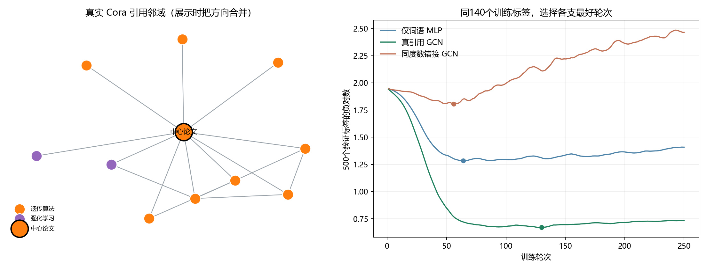
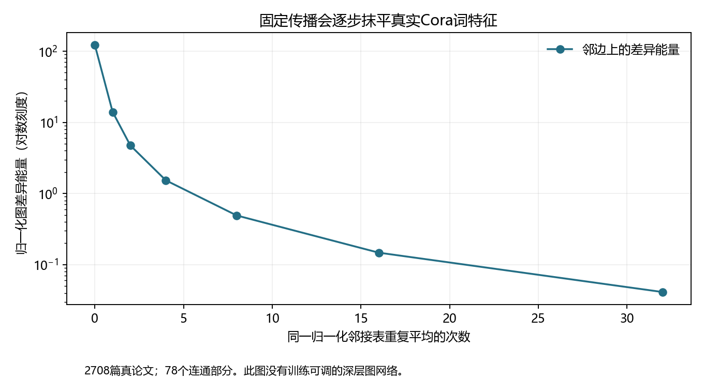

# 第三十六章　连接关系怎样进入学习

上一章把照片当像素格、把一句话当依次排列的词。那两种输入其实已经含有位置关系：像素知道上下左右，词知道前后。可是我们在章末提到的分子、道路、论文互引和人与商品的互动，连接方式不会整齐排成同一张方格。两篇论文写了相似的词，并不一定互相引用；两篇词表各有一点不同的论文，却可能被同一个研究社区反复相连。如果这道连接有助于判断它们属于哪类研究，我们要让训练中的参数**使用实际的边**，又不能让给论文重新编号改变结论。

现在就拿电脑上取得的真实论文网络做一章。我们会先让“只看每篇词特征”的小网络正常工作，再让它读取引用邻居，最后故意保持每篇论文的连接数、却把连向谁改错，观察留下的是“有更多计算”还是“这些具体关系有用”。同一计算还会逼出两种不同的对称性：给论文换一批编号应当只是换输出行序；把三维点云整体转向，标量性质可不变，向量方向却应跟着转。它们听来相似，约束的对象并不一样。

## 一篇论文、它的词与它引用的论文，各是什么数据

LINQS研究组保存的一份Cora资料含**2708篇机器学习论文**。原件对每篇给1433个零或一的数：经词干处理、去常见词并删太稀有词后，每个位置只表示某个词根在不在这篇论文里。下载包没有给这1433列逐项的词名，所以我们能说“论文的词特征”，不能指着第417列编造“它写了神经网络”。每篇另有七类研究主题之一，例如神经网络、概率方法、强化学习或理论；那是有人整理的答案，训练时不会全交给模型。第三份文件有5429行引用，**第一项是被引论文，第二项是引用它的论文**，所以原有向边应从第二篇指向第一篇。所有文件和实际读到的README、原归档哈希及尚无明确再分发许可的边界在[Cora源卡](../data/cora_linqs_original/SOURCE.md)。

先用读者能追踪的记号把它整理。\(V\) 是2708篇论文组成的节点集合；\(E\subseteq V\times V\) 记录引用者指向被引者的有向边；\(X\in\{0,1\}^{2708\times1433}\) 的第 \(i\) 行是第 \(i\) 篇的匿名词特征；\(y_i\) 是它的七类主题答案。今天要学的**节点分类**是从论文的已知词和已知引用关系推一篇的主题，目标是对少量已经给出 \(y_i\) 的论文算误差，再让同一套参数为别的论文报类别。这里“边有方向”“两个节点相关”“两个节点同类”是三件不同的事：论文甲引用乙，只保证原文件有这条书目关系，不保证甲乙观点相同或同类别。真正送进三支网络前，本机还把每篇词行除以该篇出现的词项数（空行则除以1），使长论文较多的词位不只靠总数压过短论文；三支都用同一份变换。原归档 \(X\) 仍是零一表，这个尺度调整是作者的输入选择。

为做一项可以核算的本机比较，我们**选择**把引用方向暂时合并：甲引用乙，就允许本章的两层模型从甲读乙，也从乙读甲。原5429行经去重复后成为5278对互异无向邻接。这个选择在“互引/被引能提示相近研究主题”时有理由试，却不是图数据本身的定律；若问“谁先引用谁”“信息沿谁流向谁”，合并方向就可能删掉任务答案。我们还从七类中每类固定取20篇，共140篇把真实类别交给训练器；500篇的类别只用于选轮，1000篇留作模型定好后的内部检查，另1068篇不计类别损失。**所有2708篇的词和引用边在训练前已经可见**，只有大多数类别不可见，这叫此处的*传导式节点分类*。它不等于给一本后来才发表、训练时连词与边都不存在的新论文作归纳式预测；也不是原研究社区通用的官方Planetoid划分。[作者切分、源文件列数与分组哈希](../data/cora_linqs_original/author_graph_v1/manifest.json)

左图的中心论文和十个邻接里，事后知道其中八个同类、两个不同类；它是选得**接近全图实际比例**的一小块，不是证明任一条引用都表示同类。图形只帮助我们看到“节点的邻居数、邻居身份会变”。若换成分子的原子与化学键，节点有元素、边有键型；若换用户与物品，边可能是一次看见、点击或购买。能不能沿边交换有用信息，必须由那道任务和边的含义来决定，不能先把任何两个数列接上一条线就期待成绩上升。

## 研究者并非等到“图卷积”才看见关系

上一章回看到2026年的多模态系统；为追查图学习这条并行支线，这里明确回到二十世纪末。那时神经网络已能用固定长数组和序列训练，但树、网页链接和分子的连接数随样本变化。Frasconi、Gori和Sperduti在1998年的研究，面对的就是怎样让可调整的模型处理**有组织的数据结构**，而非让每个输入都塞进预定长度的平铺表。这份论文的书目和摘要可核；本次未稳定取得全文，所以下文不会编造他们算法的一行更新式。[1998原论文摘要与书目](https://pubmed.ncbi.nlm.nih.gov/18255765/)

2005年Gori、Monfardini、Scarselli已有以“图域学习”为名的模型研究，随后Scarselli等人在2009年发表更完整的 *The Graph Neural Network Model*。与此同时，论文和网页的**关系型分类**也有不依赖当代图卷积的正经做法。Sen等人在2008年整理了这样的研究：分类一页网页，可以只读它自己的词；也可以读邻页的词或已经知道的类别；甚至邻页类别也未知时，需在整张网上协同猜测。他们讨论迭代分类、Gibbs抽样、环上置信传播等候选，各有信息和计算条件。旧办法能在相称任务上正常工作；我们今天选一个可求导的图模型，是希望学一套可共享的邻居读法，并在实际资料上检验，**不是**因为2008年的所有非神经办法突然无效。2005原会刊副本本轮限制访问、2009全文也未稳定打开；这里只依据可见的出版/摘要信息定位其问题，不把后来论文的整理冒充旧作者心理。([2005大学书目记录](https://usiena-air.unisi.it/handle/11365/19137)；[2009期刊摘要](https://pubmed.ncbi.nlm.nih.gov/19068426/)；[Sen等2008原报告第1—2页](https://eliassi.org/papers/ai-mag-tr08.pdf))

另一条历史线来自[第十三章已见的图像卷积](第十三章_同一种局部形状为何能在别处认出.md#thirteenth-sharing)：规则方格中，滤波器知道“上方一格、右方一格”的固定位置；图里某篇只有两位邻居，另篇却有几百位，而且它们没有共同的“右上角邻居”。2013年前后Bruna等人试着从**图拉普拉斯的谱与多尺度邻域**定义可共享滤波；2016年Defferrard等人用有限阶多项式形成只看几跳之内的滤波，避免每个前向都做一次昂贵的完整特征分解。Kipf与Welling在2016年公开、2017年发表的工作，针对少量类别已知的引文网络，把谱滤波缩到一阶邻域，再为了参数量和数值稳定作约束与重新归一。后面我们可从“向邻居借信息”的直接问题读懂最后式子，但那个现代教学路线**不是**证明三位研究者当初只凭一句“平均邻居”必然推到了它；原论文的实际起点还包括谱近似和权重/稳定性取舍。([Bruna等，2013/14](https://arxiv.org/html/1312.6203)；[Defferrard等，2016](https://arxiv.org/html/1606.09375)；[Kipf、Welling，§2](https://arxiv.org/html/1609.02907))

同在2016年，Battaglia等人的 *Interaction Networks* 面对的是几颗物体因弹簧、碰撞等相互影响后的**下一刻状态**。它把物体状态、从一物到另一物的关系属性、外力分成可给的输入，先算关系效应，再更新受影响的物体。这和引文论文分类同样重视节点/边，却没有同一训练标签、同一时间轴，也不是GCN谱式的一个特例。历史上并行研究的任务不同，后面“消息传递”这个统一说法可以归纳它们共享的计算形状，不能据此删掉各自的数据来源。([Interaction Networks，2016，§1—2](https://arxiv.org/html/1612.00222))

## 已会训练多层网络，怎样让它读一个大小不定的邻居集合

第三章的MLP已经给我们一条熟悉的路：输入向量乘共享权重、形成中间活动、由末端误差反传。把它直接逐篇用在Cora词行上，\(h_i^{(1)}=\sigma(x_iW+b)\)，所有论文虽共享 \(W,b\)，第 \(i\) 篇从未见到它引用谁。要利用边，先问最小的改变：每篇除自己的 \(x_i\)，还能从它的邻居取回某种**与邻居排列顺序无关**的汇总。节点的邻居没有一个被资料规定为“第一邻居”；仅把引用ID按文件出现顺序接成一条长向量，文件换行/编号变动就会改变训练任务。

一种可行的组成方式是，让每条边先有一个共享的小计算 \(M_\theta\) 形成消息，再把指向本节点的消息相加，让另一个共享计算 \(U_\theta\) 合并旧活动与来信：

\[
m_{i\leftarrow j}^{(\ell)}
=M_{\theta_\ell}\!\left(h_i^{(\ell)},h_j^{(\ell)},e_{ji}\right),
\qquad
\bar m_i^{(\ell)}=\sum_{j\in N(i)}m_{i\leftarrow j}^{(\ell)},
\qquad
h_i^{(\ell+1)}=U_{\theta_\ell}\!\left(h_i^{(\ell)},\bar m_i^{(\ell)}\right).
\]

这里 \(e_{ji}\) 只在边确有属性时才出现，例如化学键型；Cora原引用文件没有“这条边是什么键”的额外属性。\(\ell\) 是网络第几次读邻居，**不是**哪一年发表的论文或哪次优化器更新。所有边共用当前层的 \(M\)，所有节点共用当前层的 \(U\)，可训练的自由度不因多了一篇引文就必须新添一套参数；相加也使“邻居从文件哪一行先读”不影响结果。构造出基本意义后，这类模型叫**消息传递图神经网络**。它是一个组织家族：消息可只用邻居特征，也可依赖当前节点/键型；汇总可用和、均值或依内容决定的权重；更新可用MLP、门控或保留旧活动。不同选择所能区分的关系并不自动相同。2017年Gilmer等人在分子量性质预测中用MPNN把一批先行化学图网络写进相同的消息/更新/读出语言，贡献的是一种有用的共同框架及具体实验，并非一句缩写替每种图任务选好了唯一模型。([Gilmer等，ICML2017原论文](https://proceedings.mlr.press/v70/gilmer17a))

一层这样的计算，节点 \(i\) 的新活动只可能含一跳邻居的信息。第二层让一跳邻居先向自己的邻居取信息，\(i\) 才可能接触两跳以内的资料。**可能**不等于已保留所有两跳细节：把许多邻居压成固定宽向量可能丢掉顺序、重复次数或远处单独一位的信号。我们将在同一真实图上先检验两层能否比只看自己有用，再认真处理这几种丢失，而不是因写出“消息传递”四个字就宣布图中所有关系都可算。

## 让邻居共同影响一篇论文，为什么不能直接乱加

先不用一个庞大架构，只让邻居贡献上一步的活动。若篇A只有两条邻边，篇B有二百条，把邻居向量无条件相加，B的数值可能因为**邻居多**就大许多，和研究主题无关。一种选择是除以邻居数作平均；另一种选择不仅考虑本节点的连接数，也考虑**送信邻居本身**连接了多少。为使没有邻居的节点也能保留自己的词，并让每层有自我通路，我们在已经合并方向的邻接矩阵 \(A\) 上加单位矩阵：\(\tilde A=A+I\)。第 \(i\) 行的和 \(\tilde d_i=\sum_j\tilde A_{ij}\) 便是含自环的度数。给相连或相同的两个节点权重 \(\tilde A_{ij}/\sqrt{\tilde d_i\tilde d_j}\)，整体记成

\[
S=\tilde D^{-1/2}\tilde A\tilde D^{-1/2},
\qquad
\tilde D=\operatorname{diag}(\tilde d_1,\ldots,\tilde d_n).
\]

这样 \(SX\) 的第 \(i\) 行确实只用自己和相邻论文的词特征；一个离它两跳远的节点不会在**这一层**突然出现。如果 \(i,j\) 的含环度数分别是2和4，它们之间一条边的系数是 \(1/\sqrt8\approx0.354\)；\(i\) 自己的自环贡献系数 \(1/2\)，\(j\) 自己是 \(1/4\)。这与简单行平均 \(\tilde D^{-1}\tilde A\) 不完全一样：这里的 \(S\) 对无向图保持对称，并非每一行系数都恰好加成1。选它是模型与数值性质的决定，**不是图的公理**。原GCN论文的实际推导从谱图滤波到一阶、合并系数和加自环后的重新归一；我们的“别让高连接节点的原数无界放大”是今天方便读懂最终式的一条理由，不能冒充作者当年的唯一发现路径。[Kipf与Welling原论文§2.1—2.2](https://arxiv.org/html/1609.02907)

那条论文里的谱路线可以再展开关键一跳，而无需让读者先修一本图谱分析专书。对**原来尚未加自环的无向邻接** \(A\)，用度矩阵 \(D\) 定义 \(L=I-D^{-1/2}AD^{-1/2}\)；若 \(L=U\Lambda U^\top\)，一个按图“频率”分别乘系数的滤波原可写 \(Ug(\Lambda)U^\top x\)。为大图求全套特征向量代价高，而且一个任意谱系数可能让远节点也马上相互作用。若改用有限次 \(L\) 的乘法组成多项式，\(L^k x\) 只能沿自环/邻边把信息传到至多 \(k\) 跳；Defferrard等用切比雪夫多项式组织这类局部近似。Kipf与Welling进一步只取一跳并合并系数，得到“自己的量+一次归一化邻居量”的结构；这种简单相加反复堆叠可能使谱上的尺度过大，论文于是把 \(I+D^{-1/2}AD^{-1/2}\) **替换**为前面含自环的 \(S\) 作重新归一。最后一步是为稳定与简化作的设计替换，不能把两个矩阵误写成严格恒等。它和我们从“这篇该向谁借词”进入的教学路线相互解释，却不应互相冒充历史原点。([Defferrard等，2016，局部多项式滤波](https://arxiv.org/html/1606.09375)；[GCN原文式(3)—(8)](https://arxiv.org/html/1609.02907))

有了 \(S\)，一层图卷积可以用已知的矩阵和逐项非线性写：

\[
H^{(0)}=X,
\qquad H^{(\ell+1)}=\sigma\!\left(SH^{(\ell)}W_\ell\right).
\]

\(H^{(\ell)}\) 仍是一行一篇论文，列数是当前活动宽度；\(W_\ell\) 是所有论文共用的可训练参数，\(S\) 是由**资料的边**算出的固定权重，不由我们这次训练直接学哪篇引用哪篇。源码里的 `nn.Linear`还带偏置，且dropout只在训练时随机置掉部分中间活动；实际两层前向比上面无偏置的骨架多这两个已教过的选项。它们不是“图网络”另一个神秘系统：`torch.sparse.mm`按存在的边把邻居活动汇入同一论文行；`first`和`second`像第三、四章已经用过的线性层一样有参数、有梯度，`optimizer.step()`最后才把它们改掉。[实际两层实现](../code/c36_cora_node_models.py)与上一章的问答CNN都使用PyTorch；差别是这次输入真正还包含一张稀疏邻接表，而损失是140篇训练论文的七类交叉熵。

从[现行程序](../code/c36_cora_node_models.py)截下的几行，把“先变换通道”和“沿真实边汇总”分别指出；第一层的输入 `features` 是刚才按论文词项数缩过的 \(X\)：

~~~python
x = self.first(features)              # 各篇同用 W0、b0
if adjacency is not None:
    x = torch.sparse.mm(adjacency, x)  # S 沿边汇入同一论文行
x = F.relu(x)
x = F.dropout(x, p=0.5, training=self.training)
x = self.second(x)                    # 各篇同用 W1、b1
if adjacency is not None:
    x = torch.sparse.mm(adjacency, x)
~~~

`adjacency=None`便是**相同两层形状但不读边**的MLP对照，而不是把未知类别偷偷当输入。实际训练在 `output[train]` 上算七类交叉熵，`optimizer.zero_grad()`清旧导数，`loss.backward()`把这些已知类别的误差沿两次图传播传给共享权重，`optimizer.step()`才写回参数。所有论文都参加前向；没有类别标签的行**不计自己的分类损失**。这里的偏置在 `Linear` 后、`S` 前，故严格实码若写满应是 \(S(XW_0+\mathbf1b_0^\top)\) 而非在最终再加一次 \(b_0\)；上面无偏置骨架只是先把传播结构显出来。

稀疏计算在这里也有具体必要性：2708×2708的完整表有约733万格，但本章对称后的5278条无向边只对应10556个非自环方向，再加2708个自环，共13264处有值。`torch.sparse.mm`只沿这些存在的位置汇总，避免把一大片没有引用关系的零格当计算主角；两层各做一次传播，不能把“稀疏”误写成“没有反向梯度”。如果把图换成几百万用户节点，内存、邻居采样和请求时延又会成为新问题，GraphSAGE研究新节点/抽邻居的背景在后节再接。

## 同样的词和标签，真实引文究竟给了多少额外信息

我们让三支从随机权重起步的模型使用同样的1433→64→7两层参数形状、同一140个训练主题标签、同一500个验证标签和250轮可选训练过程。第一支是MLP，只读每篇自己的词行，完全不乘 \(S\)；它有正常用处：论文的词本来就能提示领域，少量标注下它不一定全靠猜。第二支使用**真实论文引用**合成的 \(S\)。第三支仍用图层，却在训练前将无向边做52780次合法交换，尽量换掉连接对象，同时保持每篇论文的连接数和总边数；原5278条无向边仅42条还在。这样，第三支无法说是因“边少了”“高连接论文度数变小了”而输；它检验的是**连到谁**这项资料。但是网络结构改变可能也改变其他长程统计，不是单独控制了世界上所有图性质。[错边的真实构造和逐点度数核验](../data/cora_linqs_original/author_graph_v1/degree_rewire_manifest.json)

对第 \(i\) 篇模型给七个分数 \(z_{ic}\)，训练者只对140个已知主题的论文算 \(-\log[\exp z_{i,y_i}/\sum_{c=1}^7\exp z_{ic}]\)，再平均并把导数传回共享的两层权重。其余论文的**词和引文边**可以参与前向邻居汇总，却没有它们的真主题参与这次损失。这一类“少量标签、更多未标节点和已知图关系”的资料安排，也正是2016/17 GCN研究的核心问题；我们另定了自己的哈希切分和超参数，不能把自己的分数写成原论文的Cora官方结果。[原GCN任务与假设，§1、§3](https://arxiv.org/html/1609.02907)

每支只按500篇验证论文的负对数选一次权重，再让固定的三支**第一次用作者内部1000篇留出标签计分**：只看词的MLP答对 **52.9%**，真引文GCN **77.2%**，同度数错接边的GCN **27.8%**。七类在这1000篇中数量不同；若**先在每类内部算正确率，再给七类相同权重**，三支约为54.6%、78.5%、28.4%，方向没有被某个大类一项独占。图如果只因为“神经层更高级”而取胜，第三支不应反而这样差。把真GCN那份**已经训好**的权重临时喂错边，仍由77.2%降到46.7%；它与“在错边上重新训练到27.8%”是两项不同干预，不能当同一数字。随后我们又在**已经打开过这套留出标签**的情况下固定第二种随机初值7重跑整套方案，得到MLP53.6%、真GCN77.5%、错边27.4%；这是同一来源上的事后稳健性复核，不是第二份全新盲测。[首次三支同题结果](../results/c36_cora_first_test.json)与[另初值的事后重跑](../results/c36_cora_seed7_posthoc_recheck.json)保留每支最佳轮和七类逐项结果。

这里还发生过一次值得留给读者的资料边界修订。最初的训练程序虽然**只对140篇训练与500篇验证做索引**，仍把含全部2708篇类别的文件载入进程内存；所以第一次计分前不能声称“进程从未读过测试标签字节”，只能说测试标签没参与梯度或选轮。作者发现后另存一份仅含训练/验证标签的文件，让现行训练加载器把其余2068篇的类别全置为-1；测试评估器才读取完整类别。同一留出已开，修订后两种初值的三臂又各从头运行，成绩分别与上段报告相同；它们是**事后复核**，不制造新盲测。[仅可见标签文件的来源](../data/cora_linqs_original/author_graph_v1/train_validation_label_view_manifest.json)与[重跑口径](../verification/C36_graph_protocol.md)给出实际文件，而不拿一句“防泄漏”代替检查。

为什么引用关系在这份数据上有用？只有在三个模型都定好之后，我们才用完整类别资料作描述性核数：5278对真实无向邻接里约 **81.0%** 两端同类；错接边仅约 **17.7%** 同类。它不是训练时偷偷给了所有邻居的标签；参数仍只被140个类别误差改动。它也**不是**“引用使论文变成同主题”的因果结论：研究领域相近本就更可能互引，资料整理亦会影响选入哪些论文。反过来，若图里的边主要连**不同**类别或代表买卖双方、抑制关系，像本章这样无差别混合邻居就未必是好选择。Cora上77.2%的存在条件，不准被压成“给任意数据加图边总会更强”。

## 把论文重新编号，能不能改变它所属的领域

一份引用文件今天把某篇叫第17行，明天换作第107行，论文内容和它引用谁并未变。令 \(P\) 是给2708行重新排序的置换矩阵，新的词矩阵为 \(X'=PX\)，相同真实边在新编号里应写作 \(A'=PAP^\top\)。自环随节点一起换，度矩阵也换成 \(\tilde D'=P\tilde DP^\top\)，所以用刚才相同的定义计算出的归一化邻接满足 \(S'=PSP^\top\)。现在核一层：

\[
S'X'W=(PSP^\top)(PX)W=PSXW.
\]

对每一行做同一ReLU，换行次序只会把ReLU后的行也同样换掉；后一层仍然成立。这里先看**推断状态**，代码的dropout已关闭；若训练时也要逐样本比较两次前向，就得把随机遮盖掩码随着论文行一同重排，不能给换名后的图另抽一张不同掩码却要求浮点结果逐项完全相同。因此在所述一致变换下，推断的节点模型满足
\[
f_\theta(PX,PAP^\top)=P f_\theta(X,A).
\]

这叫**节点置换等变**：输出仍是一行一篇，改编号则输出按同一编号改位置，而不是每个输出数值完全留在旧行。若最终只要“这整张分子图性质是多少”一项数，我们可在所有节点活动上做和或平均，再送入图级头；这种对节点顺序不敏感的读出称为**置换不变**。两者不要混：论文节点分类需要等变，不是把2708篇的类别都压成一个答案。本机对已训GCN在全真Cora上把词、引文边一致重编号，逐项输出与“旧输出再重排”的最大差约 \(1.9\times10^{-6}\)，图级均值最大差约 \(1.2\times10^{-7}\)；若**只改词行、不改边指向**，平均分数差反约1.317。后一种输入已经让“这篇论文引用谁”发生了错乱，不是对同一图合法换名。[可复算置换探针](../results/c36_permutation_probe.json)

这个性质来自共享权重、对邻居无顺序的汇总与一致重排，并不要求使用上一节**恰好**那份GCN系数；许多其他消息传递选择也有它。反过来，“我写了一个GNN”也不自动保证任何输入处理都合规：若程序把论文ID本身当独特词记住、把邻居按偶然文件顺序接起来，或测试时仅重排一半资料，条件就被改掉了。证明告诉我们该检查哪一个动作，而不是保证模型在新科学任务上一定答得好。

[第十三章的平移等变](第十三章_同一种局部形状为何能在别处认出.md#thirteenth-equivariance)已经让图片右移时局部响应跟着右移；这里是给论文**重新命名**时节点响应跟着换行。两个证明都靠共享参数，但所要求“保持关系不变”的变换不同：把论文换编号不应改变哪篇引用哪篇，图像平移则移动了空间位置。等到后面真实三维点整体旋转，还有第三种与物理坐标有关的约束，不能因三个地方都叫等变就只凭名字互相套用。

## 学会这张图里的节点，与遇见一张新图还能用，是两个目标

我们还应把“留出1000篇类别”中的**留出**读准确。那些论文的词和边早已在GCN的前向传播里；分类时只是不允许它们的真实类别改参数。如果以后给我们一批新论文及新的引用，或给一套从未见过的分子，能否用同样的读邻居函数产生表示？2017年的GraphSAGE把这个**新节点也能应用的函数**当成明确研究目标：取邻居特征、按可扩展的采样/汇总规则形成活动，学习共享的聚合器，而不是为训练图中每个节点单独存一张可调身份证。它还要检验新节点的属性和邻居关系是否按同种规则提供；“用了共享W”有帮助，却不让我们的Cora内部标签留出自动变成其原论文的归纳评估。[GraphSAGE原论文§1—2](https://arxiv.org/html/1706.02216)

同一时候，化学图给出另一种迁移问题：每个分子大小不同，原子类型、化学键和目标量可以让**整张分子图**有一个实验或计算结果。Gilmer等人2017年的消息传递框架让边的属性影响消息，再按节点读出整体；这与Cora“每篇论文各有主题”的输出轴已经不同。2016年的物理交互网络还会把边当弹簧、碰撞或其它作用，把节点活动更新放到一个具体时间步。后来的“图网络”家族之名，是在保留这些不同任务时找到了共有形式，**不意味着**一份Cora的77.2%已验证药物筛选或机器人下一秒预测。[Gilmer等，2017](https://proceedings.mlr.press/v70/gilmer17a)；[Interaction Networks，2016](https://arxiv.org/html/1612.00222)

## 平均邻居会忘掉什么：结构表达能力有可算的边界

给中心节点两个不同的邻居集合：第一种只有一个邻居，活动数值是 \(1\)；第二种有两个邻居，活动都是 \(1\)。若汇总只取均值，两边得到的都是 \(1\)，即使真正任务要区分“一个人引用我”与“两个人引用我”，后续同一更新函数也再看不出差异。若取和，分别得到 \(1\) 与 \(2\)，保住了这项**重复次数**；可是和也不自动保住任意复杂的邻居配置，例如不同数的组合可能同和。GCN的度数归一化不是字面上的简单算术均值，具体信息损失还要看其度数、活动和邻接；这个小例子检验的是**某类聚合选择**，不冒充刚才整支Cora GCN的逐点失败证明。

Xu等人于2018年公开、2019年发表的分析正是把邻居当作“元素可重复的集合”，问不同邻居多重集会不会被汇总成同一个向量。他们给出适当求和/可调映射能达到所考虑的1-WL图辨识测试的表达上限，并提出GIN；同时指出常用均值等有些结构无法区分。这里的“上限”有条件：1-WL本身也不能区分所有非同构图；更能区分结构，不保证在标签少、边有噪声时测试一定更好。我们不会把本机一种GCN在Cora上赢，当成“GIN理论错了”，也不会把理论最强当作不看数据的选模证书。[Xu等，§1—2](https://arxiv.org/html/1810.00826)

2017—2020年出现的这些候选还会互相改变取舍。GraphSAGE关心把聚合函数送给从未见过的节点；图注意力让不同邻居可按当前内容贡献不一样的权重；GIN更在乎某些结构能不能被认开；在用户—物品互动图上，LightGCN甚至研究删掉常规GCN若干线性变换和非线性，因那里的基本信号和目标不同。把它们背成“谁替代谁”的四个名字，会遮住真正应由任务回答的疑问：**需要保留邻居数量、区别某种边、推广到新节点，还是只想在既有互动中学一个排序？**([GAT，2017预稿/2018论文](https://arxiv.org/abs/1710.10903)；[LightGCN，2020](https://arxiv.org/html/2002.02126))

## 读邻居读得越久，为何可能把原本不同的论文抹平

用真实Cora图的词特征，先只重复刚才的**固定邻居汇总**，暂时不训练任何 \(W\)，也不加ReLU。与训练时相同，令 \(\bar X_{i\cdot}=X_{i\cdot}/\max(1,\sum_rX_{ir})\)，把每篇非零词项数作输入尺度；现在 \(H^{(0)}=\bar X\)，每次 \(H^{(k+1)}=S H^{(k)}\)。为了准确说“邻边上的差别在减少”，可定义归一化图差异能量

\[
E(H)=\operatorname{tr}\bigl(H^\top(I-S)H\bigr).
\]

它不是随意叫“能量”就有意义：在无向、对称、非负边和含自环度数的当前定义下，\(I-S\) 是**加过自环的**归一化拉普拉斯，和上一节为解释原论文先写的无自环 \(L\) 不是逐项同一矩阵；把第 \(r\) 列节点活动 \(h_{ir}\) 代入，可写成相邻节点\(h_{ir}/\sqrt{\tilde d_i}\)与\(h_{jr}/\sqrt{\tilde d_j}\)之差的平方和，因而非负。\(S\) 又是实对称矩阵，有正交特征向量。它的特征值为何不会跑出 \([-1,1]\)？\(S\) 与每行和为1的非负矩阵 \(P=\tilde D^{-1}\tilde A\) 相似：\(S=\tilde D^{1/2}P\tilde D^{-1/2}\)。若 \(Pv=\lambda v\)，选 \(|v_i|\) 最大的那个坐标，便有 \(|\lambda|\,|v_i|=|\sum_jP_{ij}v_j|\le\sum_jP_{ij}|v_j|\le|v_i|\)，所以 \(|\lambda|\le1\)。设第 \(a\) 个特征方向的特征值为 \(\lambda_a\)，把 \(\bar X\) 沿它的系数记作行向量 \(b_a\)，重复 \(k\) 次后这一部分变成 \(\lambda_a^k b_a\)。于是

\[
E(S^k\bar X)=\sum_a (1-\lambda_a)\lambda_a^{2k}\,\|b_a\|^2.
\]

因为 \(|\lambda_a|\le1\)，**在这项固定线性传播的条件下**，每项都不会随 \(k\) 增大而上升。这个推导并没有给任何带可学权重、跳连或非线性层强加相同结论；\(S\) 有多重值为1的方向时，不同连通部分或度数模式也可能留着，不会整个图都变成相同的一个数。Cora实际分成78个连通部分，最大的一部分2485篇。我们在真2708篇的词矩阵上核0、1、2、4、8、16、32次，\(E\) 从约 **121.40** 降到 **0.0413**；固定随机两篇之间的活动距离均方根也从0.371降到0.094。它具体说明“无目的地反复抹匀”会丢区分资料，而不是论证本章刚训练的**两层**GCN已经全被抹平。[核算程序与每步数](../results/c36_smoothing_probe.json)

这与研究中常说的**过平滑**有联系：层数增多，节点表示可能越来越难区别，分类随之受损。Oono与Suzuki的2020年分析还认真研究了某些可训练GCN在权重谱等明列条件下接近只保留连通/度信息的空间；它**没有**证明“任何图网络多于两层必坏”。我们此处的谱式只证明固定\(S\)的能量变化，原论文有自己的模型条件，二者要各守边界。[Oono、Suzuki，2019预稿/ICLR2020，§1、§3—4](https://arxiv.org/html/1905.10947)

## 还有一种相反困难：不是太像，而是远处消息挤不过来

即使每层都不把邻居完全抹平，远处很多来源也可能挤进一条很窄的通道。画一棵只有两跳的小图：目标论文 \(r\) 只连一个中间节点 \(h\)，\(h\)另一侧连 \(m\) 个来源叶子。设一片叶子给一个可变数 \(s\)，其它叶子和 \(r\) 的数先为0。若 \(h\) 对这 \(m+1\) 个邻居简单取均值，下一轮 \(r\) 只读 \(h\)，则 \(r\) 的输出对那片叶子的导数恰为 \(1/(m+1)\)。\(m=1\) 时是0.5；\(m=16\) 只剩约0.0588；\(m=64\) 约0.0154。[同一组算式的PyTorch导数核验](../results/c36_bottleneck_probe.json)还把均值改为求和，这个特定导数便保持1。因而我们不能把 \(1/(m+1)\) 写成所有GNN的通用衰减定理。

但若目标需要辨认**每一片叶子各自带的内容**，不只是它们的总和，固定宽度的一个 \(h\) 仍要从越来越多路信息里取舍；从和改成均值也没有神奇地创造新通道。这就是过挤压的基本担忧：很多原本远处可区分的信号必须穿过少数边和有限宽的中间表示。Alon与Yahav在2020年预稿、2021年发表的研究把它与过平滑分别提出，用长距离任务和结构瓶颈分析说明加深几层不一定解决问题；其论文不等于我们这张星形图的四行导数，也不保证任意加边/加注意力就安全。此处读者至少应能分辨：**过平滑**问多次混合把已到达的信息抹得太像；**过挤压**问远方本来就有很多独立信息却难沿窄通道送到。([Alon、Yahav，原论文§1](https://arxiv.org/html/2006.05205))

这也解释了为什么后来有人再问：远处两节点能否**不必层层走同一窄口**就交换信息？2021年的Graphormer让基于Transformer的节点读取可看更远处，但不能把图变成一串没有结构的匿名token：它把两节点在原图中的最短路径距离、度等信息放进读取的条件，才知道“远”在这张图里指什么。若普通注意力每个节点都同另外所有节点算一次分数，一层位置表的项数随节点数平方增长；Cora有2708篇，不能只因语言Transformer曾有效就忽略这份计算账。[Graphormer原论文§3](https://arxiv.org/html/2106.05234)

2022年的GraphGPS于是研究另一种可配的安排：局部仍按真实边传消息，较远位置另有全局读取，再用图本身的位置或结构编码告诉网络节点和路径是什么；具体全局注意力也可以选较省内存的近似。它并非数学定理说“局部+全局永远同时最优”，其原论文在不同图资料上逐项消融这些部件。到2025年仍有人专门研究：某个公开测试集被叫“长距离”，它的答案是否真的依赖远节点，应该怎样量？这意味着我们给星形图算出瓶颈，并没有替所有长程任务下了性能结论；更大的读取范围同时带来结构身份、计算和评价的新债。我们没有在本机训练Graphormer或GraphGPS，相关公开论文这里只用来说明这些可认真比较的候选与边界。([GraphGPS原论文§1、§4](https://arxiv.org/html/2205.12454)；[Bamberger等，ICML2025，摘要](https://proceedings.mlr.press/v267/bamberger25a.html))

## 同样叫对称：节点改编号与三维世界转身并不是一回事

直到现在，Cora节点是抽象论文，\(P\) 只改它们在文件中的名字。回到第三十四章的真实三维资料，每个点还有以米数表示的位置 \(r_i\in\mathbb R^3\)。若把整件物体连同相机世界坐标系一起平移 \(t\)、旋转 \(R\)（\(R^\top R=I\)），那不是把第17号点改名，而是把**物理坐标**变成 \(r_i'=Rr_i+t\)。物体的材质类名、两点间距离等标量不应因转身而改变；若输出是指向哪里的一条速度或受力向量，它应同样旋转。这两种要求分别叫刚体运动下的**不变**与**等变**。空间旋转/平移是一类变换，节点编号置换是另一类；模型可以满足一种而不满足另一种。

怎么把这件事写进一条真正可算的消息？若边 \((i,j)\) 来自空间近邻，先以两点距离给非负权重
\[
w_{ij}=\exp\!\left(-\|r_j-r_i\|^2/\sigma^2\right).
\]
只汇总原颜色第一通道 \(c_j\) 时，可取标量 \(s_i=\sum_{j\in N(i)}w_{ij}c_j\)；想要一条受邻居位置影响的向量，可取 \(v_i=\sum_{j\in N(i)}w_{ij}(r_j-r_i)\)。旋转平移后，\(r_j'-r_i'=R(r_j-r_i)\)；正交矩阵又使 \(\|R(r_j-r_i)\|^2=\|r_j-r_i\|^2\)。因此权重 \(w_{ij}\) 不变，\(s_i'=s_i\)，而 \(v_i'=Rv_i\)。这是直接由**我们选的距离与相对位置结构**推出，不需要先训练一亿条照片来“希望网络自己猜到对称”。但若把所有坐标放大两倍而固定 \(\sigma\)，距离/尺度之比变了，\(w\)也会变；刚体不变并不包含缩放不变。

为了不只对作者自画的三个点验算，我们拿[上一章实际保存的局部PLY点云](../runs/c34_eth3d_delivery_geometry_current/reference_partial_points.ply)：其22485点是ETH3D仓储真实**激光参考视差反投影**得到的部分表面，不是这章图模型学出的三维点。[来源卡](../data/eth3d_two_view/SOURCE.md)标明ETH3D的CC BY-NC-SA4和真值条件。从中按固定随机数取256点，**作者自行规定**在这256点里每点连最近8点，原PLY没有替我们认定这组边是物理刚体关节。按当前真距离取径向尺度约0.365米，整体旋转三轴角(23°,−41°,17°)、再平移(0.7,−0.3,1.2)米，近邻编号仍相同；\(s_i\) 最大差约 \(2.9\times10^{-15}\)，\(v_i\) 与“原向量先旋转”的最大差约 \(3.2\times10^{-15}\)。把原点云坐标放大两倍却仍用0.365米作尺度，标量消息平均改变约0.623。数值结果只是这一条手写消息的刚体性质核验，**没有训练出能预测分子能量或能识别木箱的几何GNN**。[实算的真点/近邻/旋转程序与结果](../results/c36_real_geometry_equivariance.json)

2021年Satorras、Hoogeboom与Welling的EGNN研究把这种选择推进到**可训练的**图层：边网络看两端节点活动、相对距离与边属性；位置更新沿相对位置向量乘由消息产生的不变标量，因而在明列条件下对旋转、平移和节点置换都有相称的变化规律。我们的 \(w,s,v\) 是帮助看清其中一条对称关系的透明小式，缺其学习出的边/节点映射、训练资料与任务评价，不能称本机已复现EGNN。也不是所有图任务都要转三维：引用网络的论文ID并没有可绕世界原点旋转的物理位置。([EGNN原论文，2021，§2.1—3](https://arxiv.org/html/2102.09844))

## 同一消息语法走入科学、推荐与机器人，输入和答案各变了什么

我们已经有两种确实算过的对象：Cora的引文边帮助少标签节点分类，仓储真点的距离消息满足一种刚体对称。若把它们推广到分子，节点通常是原子，边可从真实**化学键**来，也可按三维邻近另建；任务可能是整分子的某项计算能量、溶解性或实验结果，因此节点活动要经对顺序不敏感的图级读出，再与分子标签比较。键不是任意像素旁边画的线，元素、价态、三维构象和测量误差各有来源。2017年Gilmer等人正是在化学性质资料上把边消息与图级预测组织起来；我们的Cora七类主题错多少篇，不能抵扣一条分子预测。[Gilmer等，2017](https://proceedings.mlr.press/v70/gilmer17a)

推荐里的边又不是分子键。一个用户点过一本书，可以让用户与物品组成二部图，未来要猜某个用户是否会对另一件物品产生可观察的互动。未点击不自动表示讨厌：物品可能根本没呈现给他，时刻、排序界面和曝光来源都要进入评价。2020年的LightGCN甚至认为在它所研究的协同过滤任务里，常规GCN多层附带的特征变换/非线性未必是主要有用部分，宁愿清楚地传播已学用户—物品嵌入再组合层输出。这条历史没有宣布“图层越简单越普适”；它在提醒我们：**有边、边叫什么、目标到底要预测什么**先于把本章CNN式两层照搬到所有领域。([LightGCN原论文，2020，§1—3](https://arxiv.org/html/2002.02126))

机器人或物理系统里，节点可以是物体或关节，边可能是弹簧、接触或感知到的相对关系。输入还要有速度、质量、外力与当下时刻；目标若是下一时刻位置，模型需要真实连续轨迹或可靠仿真来检验。2016年Interaction Networks研究过把关系作用和物体更新分别学习，用于若干物理仿真；这与Cora静态标签已经换了**时间与反馈**。下一次机器要真行动，还须回到第二十一至二十四章的后果/规划条件，及后来控制与宿主执行章节的安全边界；某个几何图网络会输出向量，不等于它知道如何安全开车或能替人授权工具。([Interaction Networks原论文§2—3](https://arxiv.org/html/1612.00222))

## 在本机重排、错接与换一条物理变换

上述真Cora原包、派生数组、两种边表、六支真实训练检查点、留出报告和仓储部分PLY都在本书的 `work/`。运行下面命令时从活动包根目录开始，给重算结果指定**新的**路径；已经打开过的1000论文内部留出只可称复核，不能反复试出最喜欢的超参数后再把同一结果叫新测试。图模型本机使用PyTorch 2.11；完整原归档如已在磁盘，准备脚本会拒绝无意覆盖，训练则直接读已校验派生文件。[全部原件/切分、运行时序和许可边界](../verification/C36_graph_protocol.md)

~~~powershell
Set-Location '.'
python work/code/c36_cora_node_models.py --mode mlp --epochs 250 --out-dir work/runs/c36_my_words
python work/code/c36_cora_node_models.py --mode gcn --epochs 250 --out-dir work/runs/c36_my_real_edges
python work/code/c36_cora_node_models.py --mode rewired --epochs 250 --out-dir work/runs/c36_my_wrong_edges
python work/code/evaluate_c36_cora.py --mlp-ckpt work/runs/c36_my_words/best.pt --gcn-ckpt work/runs/c36_my_real_edges/best.pt --rewired-ckpt work/runs/c36_my_wrong_edges/best.pt --out work/runs/c36_my_recheck.json
python work/code/c36_permutation_probe.py --checkpoint work/runs/c36_my_real_edges/best.pt --out work/runs/c36_my_permutation.json
python work/code/c36_smoothing_probe.py --out work/runs/c36_my_smoothing.json
python work/code/c36_smoothing_probe.py --max-rounds 2 --out work/runs/c36_my_smoothing_two_rounds.json
python work/code/c36_bottleneck_probe.py --out work/runs/c36_my_bottleneck.json
python work/code/c36_real_geometry_equivariance.py --out work/runs/c36_my_geometry.json
python work/code/c36_real_geometry_equivariance.py --rotation-deg-xyz 61 5 -33 --translation-m 1 -2 0.5 --out work/runs/c36_my_geometry_variant.json
~~~

一开始先预测：只把 `features_uint8.npy` 的论文行打乱、但不对边表做同一个改编号，置换探针还能给接近零的差吗？再看真实数值。随后尝试改变一个**有理论身份**的条件：在 `c36_smoothing_probe.py` 的同一真实图上把固定传播次数停在2和32，观察差异能量如何变化；你不能从这张图单独推“把可训练GCN从2层改32层一定会跌到多少测试准确率”，因为可学习参数、非线性、训练和选模都不同。最后改变真实三维点的整体平移或旋转角：刚体式的哪一项必须保持相同，向量输出哪一项应随之变化？若把 `sigma` 固定又放大所有坐标，别把不具备的尺度不变性硬算作失败。

## 关系已被模型使用，真实请求到来还缺什么

图方法让我们有能力在**确实有意义的边**上共享小计算，既不依赖节点偶然编号，也能按任务选择要不变的标量和该等变的向量。本机论文网络里，真实引文比不看边或同度数错边提供了明显有用的主题证据；这份进步仍是已有节点、少量标签与同一划分下的结果。均值忘掉重复次数、深层固定扩散抹平局部、远处多路信号挤进窄口，是三种不能互相冒充的限制。旧的词分类、关系型非神经方法、局部图网络和几何等变网络，解决的问题也并非一条过时算法被下一条整体淘汰的流水线。

我们现在有许多不同的已训权重：第十九章能给文章续片段概率，本章能为论文节点报七类分数，还有前几章的视觉与声音模型。用户真的发来请求时，谁负责加载哪一份权重、何时算完整前缀、何时只算新增一步、怎样控制并发与内存？这些是下一章**从训练模型到推断服务**的问题。服务一个第十九章的文章模型并不以先学完本章图神经网络为逻辑前置；这里只是把“有模型可调用”这件事实交到了下一段系统工作。

## 读完后，自己从节点和边重建这条路

1. 原Cora一行“甲 乙”表示谁引用谁？本章为什么在一个节点分类实验里合并了方向？如果任务改成“预测谁下一年会引用谁”，原选择还合适吗？说明需要保留哪种信息，而不是只答“图模型会处理”。
2. 一个中心节点的邻居活动分别是 \(\{1\}\) 与 \(\{1,1\}\)。均值、求和各给什么？这能严格否定所有图神经网络都不能识别邻居数量吗？如果输入节点本身另带度数特征，结论又怎样改变？
3. 从 \(A'=PAP^\top,X'=PX\) 一步步推 \(S'=PSP^\top\) 和一层输出等变。为什么节点分类输出是等变，图级和/均值读出却应不变？只打乱词行不改边表为什么不是同一图的重新命名？
4. 本机真引文GCN测试77.2%、只词MLP52.9%、错边GCN27.8%。这证明了哪份资料在这项任务中有用？为什么不能由这些数字推出“引用必造成论文主题”或“分子任务也必提升24个百分点”？
5. 对固定对称\(S\)，把 \(X\) 沿特征向量展开，解释 \(E(S^kX)\) 为何按本文条件不增。若改成每层有训练权重、残差或任务只依赖全连通部分平均，哪一项结论还需重新审查？说明过平滑与过挤压各由哪个不同的信息路径造成。
6. 真三维点统一变换 \(r_i'=Rr_i+t\) 时，距离权重、标量颜色消息、向量位置消息分别应如何变化？若节点编号也同时重排，这又增加了哪一种独立要求？固定 \(\sigma\) 但把空间整体放大为什么不受刚体证明保护？

核对思路

1. README写第一ID被引、第二ID引用，因此乙指向甲。本章把两侧都作邻居，是为了试“互引/被引的主题线索”，不是抹去原资料方向；预测未来引用次序时必须保留发起者、接受者、时间与当时可见信息。
2. 均值都是1，求和分别为1和2，只说明一种均值汇总不能靠这份数区分数量；可添度数、带位置/类别的消息，或换有辨别力的多重集聚合。其它聚合的适用范围仍需算和测，不从一个例子推出万能排名。
3. 自环与度矩阵也随 \(P\) 共轭变换，故归一化后的矩阵同样共轭，\(P^\top P=I\) 让一层线性结果为旧结果换行；逐行共享非线性和更深层按归纳相同。给每篇报类应随篇换行；只要整图一个结果，和/均值把换行抵销。边表不动而词换行，已把旧论文的引用邻居接给另一篇。
4. 在当前来源/作者切分/两层训练预算下，真边身份向模型提供词行之外的有效线索。类相似可能先导致互引，不能把观察相关冒充引用的干预效果；分子键/分子标量目标与引文/七类节点题改变了对象和反馈，数字不能直接迁移。
5. 每个特征方向的能量项为 \((1-\lambda)\lambda^{2k}\|b\|^2\)，固定 \(|\lambda|\le1\) 使它不增；可学习权重和残差改变递推，不能套同一式。过平滑是已收到的信息在多次局部混合后难辨；过挤压是大量远处信息通过少数边/固定宽中间量时难以逐项保留。
6. 平移在差分中抵消，正交旋转保距离，所以 \(w\) 与标量和不变；向量差随 \(R\) 旋转，向量和也如此。节点重新编号另需所有坐标、特征与边同步重排的置换等变。缩放不是刚体变换，固定尺度参数 \(\sigma\) 下距离与其比值改变。

