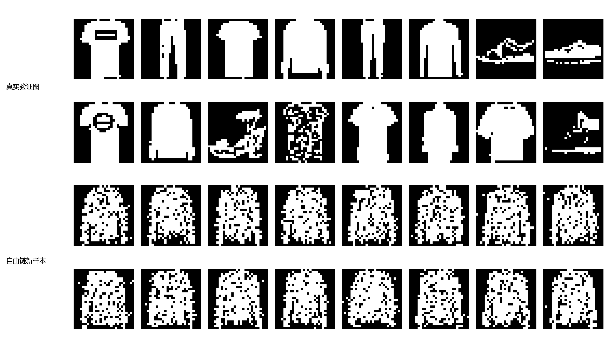
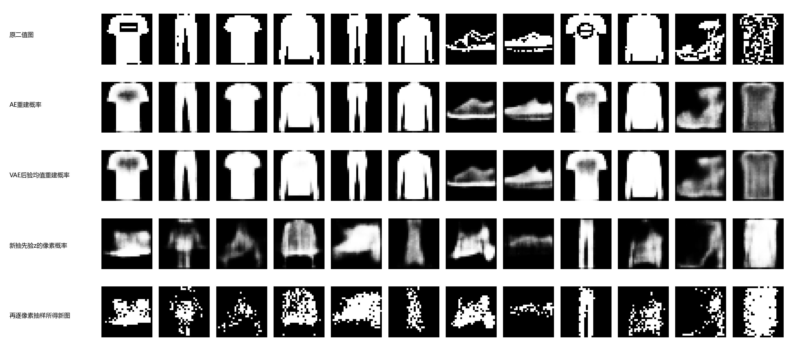
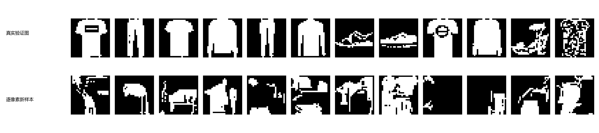

# 第三十章　从现有图像，到一张新图怎样出现

第二十九章学到的编码器，给一张已在眼前的图片算出一组数；遮住一半像素后，重建器还可以根据剩余部分补上轮廓。可是，若桌上根本没有一张图，只给程序一个随机数，它凭什么产生一幅像资料里的新画面？“会补洞”和“会从头产生”之间缺的，是对整张图如何出现的某种规定。

第九章其实已经**规定**过一套能这样抽样的小概率模型，只是对象是六项消费数：先按权重选看不见的成分 \(Z\)，再依该成分抽出六维观测 \(X\)。那章本机实际做的是拟合与遮一项后的推断，没有拿新抽的整行当实验成绩。给定旧行去推 \(Z\) 的后验、遮一项后补该项，和**先抽 \(Z\) 再产生一行全新的 \(X\)**，沿用同一联合模型却是不同的使用方向。那章只有两种隐藏情况，求和能直接算。图片每格有值，二值化的28×28图已有 \(2^{784}\) 种可能；若仍想给每张图合理机会、又能真正取样，模型表示和计算就成了新的困难。

本章沿这个困难看几条真实分岔。它们不是一套必须顺次安装的零件：能量模型先给整幅配置打未归一化权重；自编码器保留重建，变分生成模型再规定可抽的潜变量；对抗训练让一个网络从噪声作画、另一个网络分来源；自回归模型则按像素次序直接写出整图概率。我们会在这台电脑上把各自的训练、重建或生成实际跑出来，也要看清每项成绩到底量到了什么。

## 同一张服饰图，怎样成为能被准确评分的对象

先给数学和程序一份共同资料。第十三章的 Fashion-MNIST 是真实商品图，原像素为0到255的灰度。为了在本章把“第 \(p\) 格是0还是1”当成明确的随机事件，我们固定把原值**至少128**的像素变成1，其余变0。二值图仍有真实衣裤鞋轮廓，布料灰度却丢失了；它不是“原灰图的精确概率模型”。同第十三章的旧行号留下50,000张训练、10,000张验证；原切分在当时按类别分层，虽然本章派生和以下各模型的训练都不读类别文件，整段资料准备史不能被叫作从未用过类别。[原数据与转换收据](../data/c30_fashion_binary/SOURCE.md)记录了门槛和字节身份。我们不用早已在第十三、二十九章看过的官方测试假装再作第一次盲测。

另有第二十九章从官网核过的 CIFAR-10，32×32彩色自然场景。稍后的对抗网络在其中45,000张官方训练图上只读像素，不看记录开头的类别字节；5,000张随机留出场景只供展示与有限诊断。服饰二值图适合把每一格概率说清，彩色自然场景则检验“从噪声出新图”在更复杂资料里实际是什么样。两个对象不同，不能把它们的训练损失列成一场数值竞赛。

## 1985年：先给整幅配置一个能量

为了不从2025年自监督研究直接跳到2014年GAN，我们沿生成模型的支线先回到1985年。Ackley、Hinton 与 Sejnowski 研究带随机二值单元的对称连接网络。当时的一个问题是：可见输入有许多共同约束，却未给每个中间单元一个正确开关；能否让隐藏单元在网络内部形成有用的表示，并从资料出现的频率改连接？他们给全局开关配置一个**能量**，利用随机更新让不同配置出现的机会同能量相连。论文的全网络并不等于我们马上要用的简化二层结构，也不是为今日文生图产品准备的旧模块。它是在“复杂约束怎样让随机网络学习”这个当时的问题上作出选择。([Ackley、Hinton、Sejnowski，1985，§2—3](https://www.cs.cmu.edu/~bhiksha/courses/deeplearning/Fall.2016/pdfs/Ackley_Hinton_Sejnowski.pdf))

先只看一幅二值图摊平的可见向量 \(v\in\{0,1\}^{784}\)，再加 \(h\in\{0,1\}^{128}\) 个隐藏开关。我们选**限制玻尔兹曼机**（RBM）的较窄连接：可见层内部不相连，隐藏层内部也不相连，只许跨两层的权重矩阵 \(W\)。给可见偏置 \(b\)、隐藏偏置 \(c\)，定义

\[
E_\theta(v,h)=-b^\top v-c^\top h-v^\top Wh,\qquad
p_\theta(v,h)=\frac{e^{-E_\theta(v,h)}}{Z_\theta},
\quad
Z_\theta=\sum_{v,h}e^{-E_\theta(v,h)}.
\]

“能量低”意为指数中的**未归一化**权重高，尚不是该配置的概率。分母 \(Z_\theta\) 把所有可见和隐藏的配置都算进去，才使全部概率加成1；只把训练图的能量一味压低，又不管其它图的能量，不能单独判概率分布已学好。这里可见加隐藏共有912个开关，直接列 \(2^{912}\) 个状态不现实，所以公式有明确定义也不等于每项都能穷举。

为什么特意限制同层不连接？固定可见图 \(v\) 后，能量里每个 \(h_j\) 只剩自己的线性项 \(-h_j(c_j+\sum_i v_iW_{ij})\)。把“开”和“关”的两个未归一化权重相除，得到
\[
P_\theta(h_j=1\mid v)
=\sigma\!\left(c_j+\sum_i v_iW_{ij}\right),
\qquad \sigma(a)=\frac1{1+e^{-a}}.
\]
同理，固定 \(h\) 后，每个可见格按
\(P_\theta(v_i=1\mid h)=\sigma(b_i+\sum_jW_{ij}h_j)\)
独立抽样。这种**条件独立**使一整层开关可以并行更新；它来自我们规定的连接结构，不是所有能量模型都自带的便利。交替抽 \(h\mid v\) 与 \(v\mid h\)，便得到一条随机链；若链运行到相应平衡分布，才可拿它代表模型自己会产生什么。

## 一张真图应拉高，模型自己爱画的图也要算

我们想使观察到的真图 \(v\) 的 \(\log p_\theta(v)\) 较高。隐藏开关没写在资料里，所以同第九章一样，先把它们求和：
\[
\log p_\theta(v)
=\log\sum_h e^{-E_\theta(v,h)}-\log Z_\theta.
\]
对一个连接 \(W_{ij}\) 求导。第一项的每个指数对 \(W_{ij}\) 的导数带 \(v_i h_j\)，按“**给定真图后隐藏状态的机会**”加权；第二项的导数要按模型自己的**全体可见与隐藏配置**加权。于是
\[
\frac{\partial\log p_\theta(v)}{\partial W_{ij}}
=v_iE_\theta[h_j\mid v]
-E_{p_\theta(v',h')}[v'_i h'_j].
\]
正相告诉我们真图与哪一个隐藏开关常一起开，负相提醒模型不要把它自己常画的所有图无代价地一起抬高。这是由**规范化概率**严格导出的梯度，不是“看着真图加一次、看着假图减一次”的纯口号。

这条路之外，1995年 Hinton、Dayan、Frey 与 Neal 研究了另一种多层随机生成模型：一组自下而上的识别连接从观察找隐藏解释，自上而下的生成连接学习产生可见活动；两条方向各有学习责任。那不是我们眼前对称权重RBM的另一种叫法，也不是只会把现有图压缩后复印的确定自编码器。它提示一个持续存在的问题：要能从隐藏原因产生观测，还要能由观测反推可能的隐藏原因，后者未必容易。[原作者1995年论文摘要](https://www.cs.utoronto.ca/~hinton/absps/ws.htm)在此只支持这项结构与任务的有限说明。

全模型负相的困难正是 \(Z_\theta\) 的计算困难。小到只有四个可见、两个隐藏开关时，[本机穷尽核算](../results/c30_rbm_exact_probe.json)枚举64个联合配置：上式与自动求导逐项最大差约 \(4.4\times10^{-16}\)。若不从平衡模型抽负相，而从这张真图出发只走**一步**隐藏—可见—隐藏转换，我们甚至可以在64格里把这一步的所有可能严格求完；它给出的更新同真实梯度最大差仍约0.128。这不是计算机抽样噪声，而是“从真图只走一步”和“从模型平衡分布来”本来就不同。2000年技术报告、2002年发表的 Hinton **对比散度**研究，正是面对产品专家及能量模型的归一化/负相难算，探索这样的近似训练路线。这里的“对比”与第二十九章“同图两视图、批内其它图作负例”的 InfoNCE 不是同一个损失或负例来源。([Hinton，2000，作者公开原报告；2002年期刊版同题](https://www.cs.utoronto.ca/~hinton/absps/tr00-004.pdf))

把小模型带回真实二值服饰图，[程序](../code/fashion_rbm_cd.py)使用784个可见位、128个隐藏位，在50,000张训练图上做20轮一步对比散度：由真图算隐藏开启概率，按它抽一次隐藏，再抽一次可见，最后以新可见图算负相。2048张验证图的一步**均值场重建**BCE从每像素0.487降到0.197，说明这项局部任务在下降；它不是模型的精确 \(-\log p(v)\)。再让64条链从独立的随机二值图开始、各自由运行500次，得到的实图如下：不少像同类上衣轮廓，衣面有明显孔洞。生成图前景比例约0.494，原训练二值图为0.314。一步重建变好与自由链把各种衣裤鞋按原比例画出来，原来就是不同检验。我们不能用一句“模型学了分布”把它们合并。

## 从压缩后重建，怎样才走到可抽样的潜变量

另一条路线把编码和解码明确分开。第八章的主成分分析可压成少数线性数并投影重建；2006年 Hinton 与 Salakhutdinov 在当时深网难以直接训练的条件下，研究通过初始化让更深的**自编码器**学低维编码，并同PCA作比较。这种模型把已给图 \(x\) 送入 \(z=f_\phi(x)\)，再由 \(\hat x=g_\theta(z)\) 尽量还原 \(x\)。若只写 \(L_{\rm AE}=\ell(g_\theta(f_\phi(x)),x)\)，它可以把现有图重建好，却还没告诉我们：**从哪一个已知分布抽 \(z\)，才能让解码器在空白桌面上画新图？**任取标准正态输入，只因维度都为16，绝没有数学保证它会落在编码器常用的区域。([Hinton、Salakhutdinov，2006，原刊摘要](https://pubmed.ncbi.nlm.nih.gov/16873662/))

2011年 Larochelle 与 Murray 则沿刚才RBM配分函数难算的另一条问题线，设计逐变量给条件概率的 NADE，使整图概率可计算。它保留了“学数据分布”的目的，却不必在大RBM里硬求 \(Z\)；我们会在本章末把这条路线带回图像的逐像素生成。到2013年末、2014年发表的 Kingma 与 Welling 的变分自编码器研究，又把前一段的**生成与反推**问题写得更直接：先规定生成方向的概率模型，再在后验难算时教会一条可微的近似推断路径。它不是给普通AE补一个名叫“随机性”的小插件，而是改变了模型与目标。([NADE，2011，§1](https://proceedings.mlr.press/v15/larochelle11a/larochelle11a.pdf)；[Kingma、Welling，2013预稿/2014论文，§2](https://arxiv.org/pdf/1312.6114))

我们给潜变量 \(z\in\mathbb R^{16}\) 一个可从零抽样的先验 \(p(z)=N(0,I)\)。给定 \(z\)，解码器给二值图每格一个前景机会 \(\rho_{\theta p}(z)\)，并暂且假设**给定同一个 \(z\) 后，各格独立抽**。一格为1时取 \(\rho_p\)，为0时取 \(1-\rho_p\)；两种情况合在同一式子里，再把784格相乘：
\[
p_\theta(x\mid z)=
\prod_{p=1}^{784}
\rho_{\theta p}(z)^{x_p}
\bigl(1-\rho_{\theta p}(z)\bigr)^{1-x_p}.
\]
这项概率只对本章**已明确定义的二值图片**成立，不是原0—255灰度图的密度。先抽 \(z\sim N(0,I)\)，再逐格按 \(\rho_p(z)\) 抽 \(x_p\)，现在才有真正从无到有的操作；若只显示一张 \(\rho_p\) 的灰度概率图，还没有完成第二次随机抽样。

要给一张已见 \(x\) 的总机会，须把未知的 \(z\) 积分：\(p_\theta(x)=\int p(z)p_\theta(x\mid z)\,dz\)。第九章的二值 \(Z\) 只有两项可直接加，这里16维连续积分一般难算，真实后验 \(p_\theta(z\mid x)\) 也难直接取得。我们让另一个网络输出近似后验 \(q_\phi(z\mid x)\)。把 \(q\) 乘除进积分，再像第九章一样用对数的凹性，得到**证据下界**，简称 ELBO：
\[
\begin{aligned}
\log p_\theta(x)
&=\underbrace{
E_{q_\phi(z\mid x)}
\log\frac{p(z)p_\theta(x\mid z)}{q_\phi(z\mid x)}
}_{\mathcal L(\theta,\phi;x)}
+D\!\left(q_\phi(z\mid x)\Vert p_\theta(z\mid x)\right),\\
\mathcal L(\theta,\phi;x)
&=E_q[\log p_\theta(x\mid z)]
-D(q_\phi(z\mid x)\Vert p(z)).
\end{aligned}
\]
第一行的等式可以亲自核：把后验 \(p_\theta(z\mid x)=p(z)p_\theta(x\mid z)/p_\theta(x)\) 代进右端的KL，两个含 \(q\) 的对数项正好抵消，只剩 \(\log p_\theta(x)\)。KL非负，所以 \(\mathcal L\) 确为下界；只有近似后验恰好等于真实后验时才贴住。第二行把它拆成“生成方向愿意给这张图多大机会”与“这张图的潜变量分布偏离已规定先验多少”。这不是说两个数字必相等或有一把无需选的权重；这里使用的是这个概率模型本身的标准下界，改变数据或模型后目标也会改变。

先用两种隐状态而非16维积分核它的意义：若先验各一半，观测 \(x=1\) 在 \(z=0,1\) 下分别有0.1、0.9机会，则 \(p(x=1)=0.5\)，真正后验给 \(z=1\) 的机会是0.9。我们故意让近似 \(q\) 只报0.7，[有限穷尽计算](../results/c30_elbo_toy.json)得到 \(\log p(x=1)\approx-0.69315\)、ELBO约 \(-0.84681\)，差0.15366恰是 \(D(q\Vert p(z\mid x=1))\)。在这张小表上完整后验明明可算，不需要另训一个编码器；搬到连续高维 \(z\) 才是近似的理由。

## 随机抽一个潜变量，导数为什么仍能回来

本机近似后验选对角高斯，编码器给 \(\mu_\phi(x)\) 与每维的对数方差 \(l_\phi(x)=\log\sigma_\phi^2(x)\)。若每次直接说“从随参数改变的分布里抽 \(z\)”而不展示计算路径，读者不容易知道如何把一次重建错误传回输出 \(\mu,l\) 的编码器。把随机性搬到与这些参数独立的 \(\epsilon\sim N(0,I)\)，再算
\[
z=\mu_\phi(x)+e^{l_\phi(x)/2}\odot\epsilon.
\]
固定本次抽到的 \(\epsilon\)，每维都能沿已知运算求导：\(\partial z_j/\partial\mu_j=1\)，\(\partial z_j/\partial l_j=\tfrac12e^{l_j/2}\epsilon_j\)。因此解码器给出的负对数损失，可穿过 \(z\) 回到编码器；这叫**重参数化**。随机数没有被当成可训练参数，梯度经过的是加法与尺度。对角高斯与标准正态先验的KL还能直接积分成
\[
D(q_\phi(z\mid x)\Vert N(0,I))
=\frac12\sum_{j=1}^{16}
\left(\mu_j^2+e^{l_j}-1-l_j\right).
\]
每个 \(\mu_j^2\) 惩罚潜变量均值远离0，\(e^{l_j}-1-l_j\) 在方差为1处为0；它并不命令每张图都给同一个 \(z\)。程序把每张图784个二值像素的负对数相加，再加这16维KL，然后在批里平均；两个分母不能一会儿按像素、一会儿按图片混用。[实际AE/VAE训练代码](../code/fashion_ae_vae.py)的随机取样、重建BCE、解析KL、backward与step都对应这几行式子。

本机在同一二值服饰资料上把确定AE与VAE都从随机权重训练20轮，各按验证组自己的目标选权重。AE第19轮的重建BCE约 **88.83 nat／图**；VAE第20轮的重建部分约 **100.79 nat／图**，另付 **22.94 nat／图** KL，负ELBO的**固定一次潜变量抽样估计**合计约 **123.73 nat／图**。AE的88.83只说“用**这张图自身编码**后能重建到什么程度”，没有独立定义边际 \(p_{\rm AE}(x)\)；数学上**对潜变量求完整期望的**负ELBO是该VAE边际 \(-\log p_\theta(x)\) 的上界，实际123.73是一次抽样的估计，不能把它逐数字当成已认证的上界或精确NLL。二者也不能按数值大小宣布哪个会画更好的新图。AE验证编码坐标绝对值平均约7.17，标准正态从来没被它当成约束，尤其不能偷偷拿VAE的先验贴到它身上。[两支训练与选择](../verification/C30_generation_protocol.md)留有逐轮实数。

下图把**已见图的重建**与**先抽标准正态潜变量后真正抽新二值图**分成不同的行。AE与VAE从旧图取得的重建概率保留较清楚轮廓；VAE独立抽 \(z\) 后的条件像素概率有鞋、裤等形状，按这些机会逐格真抽又有许多盐粒。这并不是同一张图从上到下逐步“改善”：前三行依赖上排的已见输入，后两行与上排十二张没有一一来源关系。颗粒同我们选择“给定一个潜变量后各像素独立抽”的模型假设有关；更强的条件解码器可以改变这个选择，本机没有跑那个版本。

## 2014年：绕开每张图的可计算概率，还能学着出图吗

变分模型把一个难积分的边际似然换成可优化的下界；能量模型则为了规范化概率付出负相抽样。2014年 Goodfellow、Pouget-Abadie、Mirza、Xu、Warde-Farley、Ozair、Courville 与 Bengio 问了另一种问题：若首要目的是能从已知随机源做出像资料的样本，可否先不要求显式算每张图的 \(p_G(x)\)，而让另一网络辨认“来自真资料”还是“来自生成器”？论文的生成器和判别器是同时训练的竞争者，在其理想容量与优化条件下有分布一致的结论；现实有限训练仍可能不稳定。它不是因前述路线在所有任务失败才有的唯一正确继任者。([Goodfellow 等，2014，§1、§3—4](https://papers.nips.cc/paper_files/paper/2014/file/f033ed80deb0234979a61f95710dbe25-Paper.pdf))

让 \(u\) 从已经知道的先验抽出，例如本机128个独立标准正态数，生成器 \(G_\theta(u)\) 变成一张RGB图。判别器 \(D_\phi(x)\) 给“这图取自真实资料而非生成器”的机会。这个来源标签是**训练程序自己知道的**：它刚刚从原数据批次取了哪些图，又刚刚让生成器造了哪些图；绝不是人给每张新图投审美票，也不是第28章的用户偏好模型。原始游戏可写成
\[
\min_G\max_D\;
E_{x\sim p_{\rm data}}\log D(x)
+E_{u\sim p(u)}\log[1-D(G(u))].
\]
固定一个生成分布 \(p_G\)，暂假设真实与生成都能按同一基准写密度、且判别器对每个 \(x\) 可任意选数。它在该处想最大化
\(a\log d+b\log(1-d)\)，其中 \(a=p_{\rm data}(x),b=p_G(x)\)。对 \(d\) 求导为 \(a/d-b/(1-d)\)，令零得到
\[
D^*(x)=\frac{p_{\rm data}(x)}{p_{\rm data}(x)+p_G(x)}.
\]
若两分布处处相同，理想判别器才给各来源约 \(1/2\)。但本机一张训练表里“D平均接近1/2”，并不能倒过来证明分布已经相同：有限判别器可能能力不足或尚未训好，训练样本也不是所有可能图。这条推导只解释**给定无限足够灵活且已最优的D**时它的身份。

实际刚开始时，判别器容易识破新图，直接让生成器最小化 \(\log[1-D(G(u))]\) 可能给它很弱的方向。我们用原论文已讨论的**非饱和**选择：判别器仍学习把真/假分开，生成器另最小化 \(-\log D(G(u))\)。若判别器输出一个未压缩分数 \(s\)，\(D=\sigma(s)\)，后一项就是 \(\log(1+e^{-s})\)，对 \(s\) 的导数为 \(D-1\)；当 \(D\) 接近0时，它仍给生成器一条明显的方向。这改的是实际优化代理，不表示每一步都在严格求解上面写的同一极小极大目标。代码先用真图与停止梯度的假图改 \(D\)，再冻结当前 \(D\) 的参数，用另一批噪声和 \(-\log D(G(u))\) 反传改 \(G\)。两次动作各改谁，可以在[完整训练程序](../code/cifar_small_gan.py)中找到。

2015年的 DCGAN 工作将卷积结构与若干稳定训练经验带入这类对抗图像模型；本机使用相近的逐层放大图像思路，但判别器另用谱归一化，既不是原2014论文的多层感知机，也不是DCGAN原实验的完整复刻。这里不借后来的漂亮图替2014年的论文宣称问题已经结束。([Radford、Metz、Chintala，2015原稿](https://arxiv.org/abs/1511.06434))

本机把一台**随机权重**的小反卷积生成器和一台带谱归一化的卷积判别器放到CIFAR-10彩色训练图上，固定20轮，不拿判别器损失选“最好看的一轮”。图中每一列的同一个潜向量在第0、5、10、15、20轮反复作画；第0轮几乎灰平，第5轮有色块，到第20轮偶尔有动物样的轮廓和场景色彩，同时仍明显模糊、有粘连。最上行是真的留出图，提供肉眼比较对象，而非事后拿这些图教判别器。若把第20轮训练时 \(D\) 损失约1.190、非饱和 \(G\) 损失约0.968读成“艺术质量0.968”，那又把训练器自己给的内部信号冒充外部作品评价。

这些模糊图仍可作更具体的诊断。末轮64张新图的RGB平均和标准差与64张真验证图在粗数值上接近，图却不像同样清晰；相似的三项颜色统计无法告诉我们物体结构。64张新图字节各异，没有一张同45,000张训练图**完全逐字节相同**，也不能由此宣布“没有记住任何东西”：略改颜色或形状的复制同样不会撞上完全相同的字节。到最近训练图的原像素均方根距离，新图平均约0.167、真验证图约0.170，也相近，仍不能代替人看是否有合理物体。这个有限诊断在[本机结果](../results/c30_cifar_gan_pixel_diagnostic.json)；真正使用者若需要特定类别、细节或不重复，须另定独立检验。判别器自己的满意度不替她作这道判断。

## 不猜配分函数，也不用对手：按顺序给整幅图概率

能量模型的规范化常数难算，GAN却不直接给出每张图的可计算概率。有一条不同回答借用第十九章已经实际训练并解释的概率乘法规则。先把一张二值服饰图按行从左到右摊成 \(x_1,\ldots,x_{784}\)，则任何联合分布都可写成
\[
p_\theta(x_1,\ldots,x_{784})
=\prod_{t=1}^{784}p_\theta(x_t\mid x_{<t}).
\]
这是概率链式法则，不是2016年才成立的新定理。真正的设计是每一项条件概率由哪套共享计算给出，以及第 \(t\) 项绝不能看见自己或未来。前面提过2011年 NADE 如何把RBM的困难换成可算的顺序条件；到2016年 van den Oord、Kalchbrenner 与 Kavukcuoglu 的 PixelRNN/PixelCNN，又专为二维自然图设计重复使用的序列计算和遮罩。它们不是“语言模型发明后给图像随手套用一个名字”：图像的二维邻域、颜色通道、全图结构与抽样成本都迫使作者作具体选择。([PixelRNN/PixelCNN，2016，§1、§3.5](https://proceedings.mlr.press/v48/oord16.pdf))

本机先只做**黑白二值**图的一种较小 PixelCNN。第一层7×7遮罩A让当前位置只能读上面各行、以及同行更左的像素：本格和其后的权重置零。后面两层3×3遮罩B可以读**上一层同一格的活动**，因为上一层活动按归纳已只由更早原像素构成；让B读原图同一像素则会立刻泄漏答案。宽度只有64，两层之后每格实际可见的历史还受有限感受野约束，绝非网络真的看遍所有前面783格。但把每一项有限历史条件下的 Bernoulli机会照顺序相乘，仍是一份规范化的整图分布；它只可能因看得不够远而拟合不充分。

要核“禁看未来”而不是只相信 mask 名字，[程序](../code/fashion_pixelcnn.py)分别从第0、79、350、783个像素开始，把该格及其后的输入都翻转；训练前后，各被翻位置及之前的输出分数最大差都为0。这里的0核的是**本机指定连接结构**，不是模型已经会生成衣服。训练时把真实二值图整个送入网络，各格目标同时算负对数：每个格的输出仍只用了允许的左上历史，所以所有位置可以同批计算。生成时就相反：先按第1格的机会抽一个像素，把它写回，再算第2格，一直做784次；不能把训练时“并行算所有目标”误读成“一次前向就同时从无到有生成全图”。

本机在50,000张二值服饰训练图上跑12轮，验证组选第11轮，真实验证图的**本模型精确**平均负对数由随机初始每像素0.709降到约**0.143 nat**。只按训练集每个固定位置的前景频率各自猜、不看邻居，验证约**0.489 nat／像素**。这个比较说明局部已见图案确实给了可利用的预测信息。可24张顺序新图里，许多局部白块像衣片或鞋边，整件衣物常断裂。这不和0.143矛盾：图像局部条件概率乘起来是严格有效的分布，有限感受野却难以让远处衣袖、下摆、鞋底保持全局一致。

## 四种“好”不能互相代填

把我们真的算过的对象放到一起，比给四条曲线排高低更有用：

| 路线 | 训练中谁给信息 | 对一张完整二值图能直接评分什么 | 从空白开始取样 |
|---|---|---|---|
| 确定AE | 已见图自身的重建目标 | 经自身编码后的条件重建误差；未规定边际概率 | 没有已规定的潜变量先验 |
| VAE | 原二值图、近似后验和规定的标准正态先验 | 对潜变量求完整期望的ELBO是对数概率下界；本机固定一次抽样只估计它 | 先抽标准正态，再按条件像素机会抽图 |
| RBM/能量 | 真图与模型负相；本机负相只走一步近似 | 定义了规范化概率，但大图的配分函数未精确算出 | 从随机配置反复Gibbs，须问链走到哪里 |
| 遮未来PixelCNN | 已见图每个位置的真实0/1 | 顺序条件概率相乘给**当前小模型的精确**负对数概率 | 逐像素抽784次 |

彩色CIFAR上的GAN又给一条路：只要能抽潜向量并前向执行生成器，就能一次产生一张32×32 RGB图；**没有**在本章提供可逐图求的 \(p_G(x)\)，而判别器分真假的数也不是那个密度。它同上表还不在同一灰度二值资料上，故不加一行统一loss排名。

评价差别不是推辞比较。AE重建看原图后画回去；VAE负ELBO仍有近似后验与潜变量KL的差；RBM一步重建不是自由链分布；PixelCNN可给确切联合对数概率却在本机产出破碎衣形；GAN颜色均值接近真图，局部形状仍模糊。2015年预稿、2016年发表的 Theis、van den Oord 与 Bethge 专门指出，高维生成模型的平均对数似然、样本视觉质量与常见替代估计不能互相推出。我们本机几幅图也不足以替外部人群作质量投票。**要拿模型做什么**，决定该让谁以什么资料评价：压缩要看重建或码长，修补要看给定可见部分的多种合理性，开放作图要看清晰、覆盖与目标受众。([Theis 等，2015预稿/2016论文](https://arxiv.org/abs/1511.01844))

对抗路线在2016年和2017年又继续研究训练稳定与分布距离，水平方向上和PixelCNN同时推进。Salimans等给出多项训练改进；Arjovsky、Chintala与Bottou改问用哪种分布距离能给生成器更稳定的方向。那不是本机GAN已运行的算法，也不能跳过相应条件直接把一个Wasserstein公式塞进这里。它们说明2014年的选择打开了研究问题，而非交付了一台无需判断的终局机器。([Salimans 等，2016](https://proceedings.neurips.cc/paper/2016/file/8a3363abe792db2d8761d6403605aeb7-Paper.pdf)；[Arjovsky、Chintala、Bottou，2017](https://bottou.org/papers/arjovsky-chintala-bottou-2017))

## 把一张图从资料、目标走到新样本

这些实验都在本机 work 目录保留原件、权重、逐轮结果和图，不依赖强外部模型权重。下面从包根目录运行，先有C13 Fashion和C29 CIFAR原包；各命令把结果写到新的名字，避免覆盖正文引用的首次收据。读取训练结果时先看它是哪一种目标、能不能独立从先验抽样，再看图；不要拿每个 JSON 最小的数字替自己作结论。为了省掉较慢的重复训练，也可以先直接打开本章四张现有图，再挑一条路线动手改条件。

~~~powershell
cd '.'
$env:PYTHONUTF8='1'
python work/code/rbm_exact_probe.py --out work/runs/c30_my_rbm_exact.json
python work/code/c30_elbo_toy.py --out work/runs/c30_my_elbo_toy.json
python work/code/fashion_ae_vae.py ae --epochs 20 --out-dir work/runs/c30_my_ae
python work/code/fashion_ae_vae.py vae --epochs 20 --out-dir work/runs/c30_my_vae
python work/code/fashion_rbm_cd.py --epochs 20 --out-dir work/runs/c30_my_rbm
python work/code/fashion_pixelcnn.py --epochs 12 --out-dir work/runs/c30_my_pixelcnn
python work/code/cifar_small_gan.py --epochs 20 --out-dir work/runs/c30_my_gan
python work/code/fashion_ae_vae_inspect.py --ae-dir work/runs/c30_my_ae --vae-dir work/runs/c30_my_vae --out work/figures/c30_my_ae_vae.png --receipt work/runs/c30_my_ae_vae_visual.json
python work/code/plot_c30_rbm.py --run-dir work/runs/c30_my_rbm --out work/figures/c30_my_rbm.png --receipt work/runs/c30_my_rbm_visual.json
python work/code/plot_c30_pixelcnn.py --run-dir work/runs/c30_my_pixelcnn --out work/figures/c30_my_pixelcnn.png --receipt work/runs/c30_my_pixelcnn_visual.json
python work/code/plot_c30_gan.py --run-dir work/runs/c30_my_gan --out work/figures/c30_my_gan.png --receipt work/runs/c30_my_gan_visual.json
python work/code/c30_gan_diagnostic.py --run-dir work/runs/c30_my_gan --out work/runs/c30_my_gan_diagnostic.json
~~~

前两条分别核RBM正/负相与ELBO恒等式，都写进新的结果文件；RBM的新路径选项已经在本机复跑，字节结果与正文引用的[穷举数](../results/c30_rbm_exact_probe.json)相同。训练命令用新目录保存权重和逐轮结果；后五条从你刚训练的权重和样本重画带行名的图，并给对抗图作有限像素诊断。图与JSON也用新名字，正文引用的原结果仍可回查。你可以先只选一种路线跑，不需要为了看懂VAE而预先把所有方法跑一遍。

我们已有四种真实图像产生路线，各自把“怎样描述整张图”回答到一处。能量式需要照顾规范化与充分采样；VAE用已规定的先验和近似后验换可训练的下界；GAN直接学从噪声到画面的映射，却没有逐图密度；自回归把概率拆成可算的条件项，抽样则一格格往前走。它们没有一个凭名字就保证复杂自然画面和全部意义都齐备。下一章接一种尚未认真分析的选择：不是一步从随机数跳到图，也不必从左上角按像素生长，而让资料在一串可控制的扰动和逆向路径中变化；这将要求我们重新问每一步的概率或速度到底由谁给出。

## 自己核一处生成承诺

1. 若只用确定编码器 \(f(x)\) 和解码器 \(g(z)\)，且一万张训练图都可近乎原样重建，是否已经规定了从空白取 \(z\) 的概率？把一个从未训练过的标准正态 \(z\) 塞进 \(g\)，输出难看能否否定重建成绩？
2. 对一个二值像素、一个二值潜开关，设 \(p(z=1)=1/2\)、\(p(x=1\mid z=1)=0.9\)、\(p(x=1\mid z=0)=0.1\)。求 \(p(x=1)\) 和看到 \(x=1\) 后的 \(p(z=1\mid x=1)\)。这两项分别对应本章哪一个计算方向？
3. 把RBM的负相只从真图走一步，代替真正模型平衡分布时，改变的是能量定义、精确概率，还是**用于更新的统计估计**？小四位实验差0.128已经证明什么，仍不能判真服饰的什么？
4. 固定生成器时，若某种图形在真实资料密度和生成密度分别为3和1个相同单位，理想判别器在它处的 \(D^*\) 为多少？一台实际有限判别器输出0.75，就能推出生成器已覆盖其余所有图形吗？
5. 一张28×28二值图若按行扫描，已抽完第100格，再求第101格的机会，Mask A和B分别能否读原图第101格？若后层B读取**前一层在101格的活动**为何仍可能合法？本机四个未来改动的零差检查验证了什么，又没验证什么？

核对思路

1. 没有；重建只测已见图经编码后的点，未给潜空间上独立抽样的法则。随机 \(z\) 输出差不否定原条件重建，它指出新的生成要求尚未被模型规定。
2. 边缘机会 \(p(x=1)=\tfrac12(0.9)+\tfrac12(0.1)=0.5\)；后验 \(p(z=1\mid x=1)=0.45/0.5=0.9\)。前者从隐变量朝可见量合成，后者从观察回推隐藏情况；第九章和本章都须区别两方向。
3. 能量/精确模型概率定义没被改写；CD-1改变负相统计与实际更新方向。有限例严格显示那一组参数与观察下的更新可偏离精确对数似然梯度，不能凭0.128断定真实大RBM的偏差必为同数、长期链何时混合或最终样本好坏。
4. \(D^*=3/(3+1)=0.75\)。它只在所列理想条件下说该图形的相对来源；有限网络给同数可能是巧合，不能由一处判其它图，更不能让其自身票代替人看真实作品。
5. 首层A不能读当前格，后层B也不能重新接入**当前原像素**；但前一层101格活动已经只由更早像素构成，B读它不泄漏。零差核指定四处改变不会污染较早及当前输出，是结构可见性核验，不证明远处衣袖关联已学到或新图会好看。

