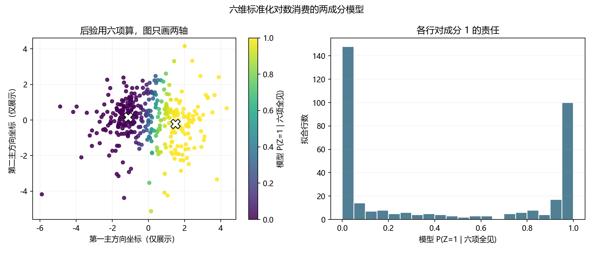
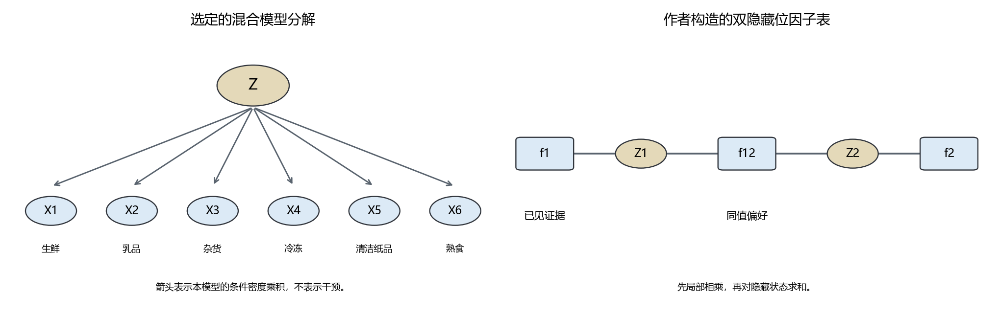

# 第九章　看不见的类别，怎样参与计算

第八章给无标签账本找了两种表示：连续的主成分坐标，或两中心的组号。第二种会让每行只拿到 0 或 1；离哪个中心近，就归哪边。这个做法确实减少了所选尺度下的平方距离，却没有回答：一行落在两组之间时，各种可能该怎样一起参与判断？如果六笔消费里有一笔暂时没看到，其余五笔又能帮我们算出什么？

我们先拿原文件第 152 行做一次回放。它在此前固定的 88 行留出段里，不参与本章模型拟合。暂时遮住 Grocery，只给模型看 Fresh 1289、Milk 3328、Frozen 531、Detergents_Paper 255、Delicassen 1774。这里没有“客户类型”的教师答案，甚至连要补的那笔钱也暂时不看。想从五笔已见数谈第六笔，光有两个几何中心不够：我们需要一个关于**哪些数可能怎样一起出现**的模型。模型给出的答案可以检验，也完全可能错；它不是从表里读出一位客户不可见的真实身份。

上一章若只留前两条 PCA 坐标，此时根本无法从少了一项的原始行算出它们：每条主成分都是六项消费的线性组合，缺一项就缺输入。因此，这一章让概率模型直接接收**六项经训练期 log1p 和标准化的消费数**；前两主成分只在画图时帮我们把六维结果投到纸上。第八章把这一行六维数记为小写 \(z_i\)；本章为了把大写 \(Z_i\) 留给看不见的二值分支，改记同一六维数为小写 \(x_i\)。数值与训练期变换没有改变，换的是记号承担的角色。源文件与 352 行拟合／88 行留出的身份仍按[第八章原约定](../verification/C09_wholesale_protocol.md)，本次六维模型的参数、初值和读数在[运行前新约定](../verification/C09_mixture_six_spending_protocol.md)写明。那 88 行上章已经看过，稍后再算分只能是同一档案里的探索性核对，不会突然变回全新盲测。

## 两团点是一个解释，还是只是一种写法

在进入算法前回看更早的一次尝试。1894 年 Pearson 处理一条不太像单个正态曲线的生物测量分布，考虑能否把它拆成两条正态曲线的合成。他尝试用若干矩建立方程，计算甚至会走到高次多项式；论文也没有把分出的两条曲线毫不犹豫地叫作两个真实群体。他明确讨论了另一种可能：材料本来相当一致，只是单一分布偏斜，也会让总曲线看起来“不正常”。理想混合模型的可辨认，与有限、带误差的实际测量能否判定哪种解释，是两回事。Pearson 当时研究的不是批发客户，我们也不把他的生物推测搬来解释买奶和杂货的人；他面对的**一条观察曲线可能有多种形成说法**，恰好是本章不得跳过的界线。([Pearson，1894，原文开头及第 73—76 页](https://www.quantresearch.org/1894_Pearson_Transactions_Royal_Society.pdf))

这段历史比第八章讲的 1901 年“点群最近的线”还早，时间在这里是有意回溯：两篇所问并不相同。最近的线只说怎样压缩已经看见的点；拆曲线则先作一项关于**观察值可能来自几种分布**的假设。两种办法都能组织数字，后一种却给我们机会谈未观察的组别以及只看到一部分消费时的预测。机会来自新假设，绝不是几何分组的数学必然延伸。

## 从“一个点有多可能”说到密度

第五章只用红蓝两种离散结果，给每一种一个概率。现在一笔标准化后的消费可以取许多实数；若把数轴上一段划得越来越细，某一个精确实数的概率可趋向零。要比较“落在 \(x\) 附近”的机会，改用**概率密度** \(p(x)\)：一条很短、宽为 \(\Delta\) 的区间，概率近似 \(p(x)\Delta\)。六维记录也一样，一个很小六维盒子的概率近似该处密度乘六个边长。密度数值本身可以大于一，它不是“这个精确点发生的概率”；把全部可能数值上的密度积分起来，才得到总概率一。

我们选择一个能算、但显然会限制现实的密度家族：在六维标准化对数坐标 \(x\) 上，以中心 \(m\) 和各方向**相同的**坐标方差 \(s^2>0\) 定义
\[
\varphi_6(x;m,s^2I)
=(2\pi s^2)^{-3}
\exp\!\left(-\frac{\|x-m\|^2}{2s^2}\right).
\]
这叫六维**各向同性正态密度**。离中心越远，指数部分越小；前面的系数让六维积分为一。\(I\) 是六维单位矩阵，写 \(s^2I\) 表示在这个已选尺度上每一项方差同为 \(s^2\)、给定中心后不同坐标的密度相乘。我们可以从原表检验这个家族合不合适，但不能因为公式有名字就说六类消费在自然界真按独立正态出现。尤其 log1p 后再套正态，模型在尾部甚至可能给原始非负消费之外的数留一点密度；它是近似。

若只许**一个**这样的成分，352 行上的观察对数似然就是 \(\sum_i\log\varphi_6(x_i;m,s^2I)\)。把上式代入，关于 \(m\) 的部分是 \(-\sum_i\|x_i-m\|^2/(2s^2)\)，所以均值 \(m=\frac1n\sum_i x_i\) 最合适；再对 \(s^2\) 求导，得 \(s^2=\sum_i\|x_i-m\|^2/(6n)\)。平方误差与第八章的“代表点取平均”在这里再次出现，但意义换了：现在还要用归一化密度评价整批已见记录。本机单成分在 352 行上的平均对数密度约 \(-8.514\) nat／六维行。它是本章选定尺度和模型下的数，不能与先前两个 PCA 坐标上的对数密度直接比较。

## 先选一条看不见的分支，才生成可见数字

现在再试一种候选，而不是宣告已发现两种客户。设每行有一个训练表里**没有记录的**二值变量 \(Z_i\in\{0,1\}\)。它按权重 \(\pi_0,\pi_1\) 选择一个成分，\(\pi_k>0,\ \pi_0+\pi_1=1\)；给定 \(Z_i=k\)，六维数从中心 \(m_k\)、共用方差 \(s^2I\) 的正态密度出现。若组号已给，完整的一行联合密度是 \(p(Z_i=k,x_i)=\pi_k\varphi_6(x_i;m_k,s^2I)\)。可是账本只写六项消费，没写 \(Z_i\)。因此真正给**已观察**的 \(x_i\) 分配密度时，必须把两种未见情况加起来：
\[
p(x_i)
=\pi_0\varphi_6(x_i;m_0,s^2I)
+\pi_1\varphi_6(x_i;m_1,s^2I).
\]
这一步叫**边缘化**：对未观察的离散 \(Z_i\) 求和，不是把它按最近中心偷偷填成一个确定值。模型的假设能产生观察分布；同一观察分布却未必唯一证明这种现实生成过程。

给一行已经看到的六项数，反过来问“按这个模型，它更像从哪一分支来”，第五章的条件概率在密度上给出
\[
r_{ik}=P(Z_i=k\mid x_i)
=\frac{\pi_k\varphi_6(x_i;m_k,s^2I)}
       {\sum_{j=0}^{1}\pi_j\varphi_6(x_i;m_j,s^2I)} .
\]
两个 \(r_{ik}\) 加起来为一，又叫这行对两个成分的**责任**。它与第八章的一硬组号不同：一行可以给两边各留一部分权重。但“0.7 属于成分 1”只是模型参数已经选择以后，由上式算出的**模型后验**；若密度家族错、先前资料变，0.7 不自动校准为真实客户身份的七成把握。

## 看不到组号时，为什么不能照已知组号的办法估参数

若每行的 \(Z_i\) 都已知，我们可以分别数两组有多少行、求两组均值，再估共同方差；第八章的两中心算法做过类似的硬分配。现在只有 \(x_i\)，真正要最大化的是
\[
\ell(\theta)=\sum_{i=1}^{n}
\log\!\left[\sum_{k=0}^{1}\pi_k\varphi_6(x_i;m_k,s^2I)\right],
\quad
\theta=(\pi_0,\pi_1,m_0,m_1,s^2).
\]
**对数外面套着求和**，不能把它拆成“先给每行定组、再各组求平均”的完整数据公式。看不到的组号究竟怎样参加参数更新，这才是下一步算法要补的空位。

这并非 1977 年才第一次有人碰到缺失或混合资料。Dempster、Laird 与 Rubin 在论文引言回顾了 Hartley 1958 年处理分组资料、Baum 等人 1970 年的一条序列模型路线、Orchard 与 Woodbury 1972 年的相关理论。在有限混合一节，他们还提到 Day 1969 年已经研究两群**共用协方差**的多元正态；我们现在选共同方差，是课堂中更窄的一种形式，并非从 EM 名字反推出来的唯一配方。Dempster 等人把多种“完整资料的一部分没有被观察到”的问题放到共同框架：有限混合只是其中一例，还有删截资料、方差成分和因子分析。论文在 1976 年 12 月的学会会议宣读，1977 年刊行；他们称每轮的两个动作分别为 expectation 和 maximization，简称 **EM**。这段史料没有说我们的批发客户就在作者原实验里，更不支持“1977 年从无到有发明了所有相关想法”。([Dempster、Laird、Rubin，1977，引言第 1—3 页、§4.3](https://www.maths.usyd.edu.au/u/jchan/GLM/Dempster1977EM.pdf))

怎样把“尚不知组号”变成可计算的更新？先对每行暂放一份**严格正**的权重 \(q_i(0),q_i(1)\)，让它们相加为一；这样下面除以 \(q_i(k)\) 才有定义。我们并不说这就是事实，只用它重新审视那项难处理的对数。因为对数函数向下弯，它的二阶导数为 \(-1/t^2<0\)；对正数 \(a_k\) 按权重平均，有 \(\log\sum_k q_k a_k\ge\sum_k q_k\log a_k\)。在这里令 \(a_k=\pi_k\varphi_6(x_i;m_k,s^2I)/q_i(k)\)，便得
\[
\log p_\theta(x_i)
\ge \sum_k q_i(k)\left[
\log\pi_k+\log\varphi_6(x_i;m_k,s^2I)-\log q_i(k)
\right].
\]
右边是这行观察对数密度的一项**下界**。它与左边到底差多少，还能直接用第五章的 KL 算出。把当前参数下的条件后验记作 \(r_i(k)=\pi_k\varphi_6(x_i;m_k,s^2I)/p_\theta(x_i)\)，代回右边并消去 \(\log p_\theta(x_i)\)，有

\[
\log p_\theta(x_i)-\sum_k q_i(k)
 [\log\pi_k+\log\varphi_6(x_i;m_k,s^2I)-\log q_i(k)]
=\sum_k q_i(k)\log\frac{q_i(k)}{r_i(k)}
=D(q_i\Vert r_i)\ge0.
\]

这回 KL 比较的是**同一行未见组号的两份分配**，不是第五章“下一次真实颜色与模型报价”的那两份分布。当前模型的正权重和正态密度使 \(r_i(0),r_i(1)>0\)；选 \(q_i=r_i\) 时差为零，下界恰好贴住观察目标。若要考虑把某个 \(q_i(k)\) 设为零，可从正权重趋近零取极限，但实际 E 步在此模型中给出的后验本身不会恰为零。于是可以先让下界贴住当前的观察目标，再在不动 \(q\) 时把它抬高。这不是数学强迫我们相信隐藏组别真实存在，只是在**已选混合模型**里处理 log-sum 的一种有理由的办法。

由此得到 E、M 两步。**E 步**用旧参数逐行算上面的 \(r_{ik}\)。若缺失的组号真是 0 或 1，完整记录本该有一个指示量 \(\mathbf1_{\{Z_i=k\}}\)；但在只见 \(x_i\) 时，它按旧模型的条件期望恰是 \(r_{ik}\)。E 步不是把组号强行补成一个整数，而是为两种完整记录留下相应权重。

**M 步**固定这些权重，调整新参数以最大化
\(\sum_{ik}r_{ik}[\log\pi_k+\log\varphi_6(x_i;m_k,s^2I)]\)；前面还有的 \(-\sum r_{ik}\log r_{ik}\) 此时不随参数变。把六维正态密度展开，真正随参数移动的部分成为
\[
Q(\theta)
=\sum_k n_k\log\pi_k
-3n\log(2\pi s^2)
-\frac1{2s^2}\sum_{i,k}r_{ik}\|x_i-m_k\|^2,
\quad n_k=\sum_i r_{ik}.
\]
在 \(\pi_0+\pi_1=1\) 下对权重求极值，得到 \(\pi_k=n_k/n\)；对各 \(m_k\) 求导，仍是“责任加权的平方距离最小于加权均值”；再对 \(s^2\) 求导，得到
\[
m_k=\frac{\sum_i r_{ik}x_i}{n_k},
\qquad
s^2=\frac1{6n}\sum_{i,k}r_{ik}\|x_i-m_k\|^2 .
\]
后一式分母有 6，是因为每条可见记录有六个按本章模型共用同一方差的坐标。M 步中 \(r_{ik}\) 始终是**旧参数**算出的数；若在求新均值的一半路上又重算责任，就不是刚才推导的同一步。

这一轮为什么不会让**训练观察对数似然**下降，也能从下界关系核对。E 步令旧参数处“下界＝真实观察目标”；M 步把固定 \(q\) 的下界抬高或保持；新参数处的真实观察目标又不低于这项新下界。因此新目标至少同旧目标一样高。本机程序对每轮实际核算这件事。不过，非降不是“找到了全局最高处”，也不是“形成的两条曲线在现实中确有两种客户”。不同初值可能停在不同局部结果；交换两个成分的编号，观察分布更是一点也不变。

## 本机这次算出了什么，仍有什么没算准

本章模型以第八章 352 行拟合段的**六维**几何中心作为初值，只是给 EM 一个起跑位置；组号不当作真实 \(Z_i\) 交给它。共用方差初值也只用这 352 行到初始中心的距离。程序在 14 轮后按事前的细小增量门槛停止，每轮的平均观察对数密度都没有下降。最后两成分权重约为 \(0.571,0.429\)，共用的标准化坐标方差约为 \(0.714\)。这些数指模型怎样给本档案的消费记录分配密度，不是两种真实客户在社会里的比例。([逐轮本机结果](../results/wholesale_six_spending_mixture.json))

在同一六维尺度上，单成分的训练平均对数密度约 \(-8.514\) nat／行，双成分为 \(-8.024\)；对那 88 行**上章已经看过**的留出记录，分别约 \(-8.668\) 和 \(-8.288\)。较大的对数密度表示这个候选家族给这些观察留了更高密度，这次双成分在两段上都较高。双成分若把两个中心设成相同，本来就能退回单成分的形状；它有更大的表达自由，训练密度变好并不令人意外。资料也只有一份，上章已用这 88 行帮助我们理解选什么尺度和表示，此处不能再把后一个数字说成全新独立证据。它更不能单凭分数告诉我们双峰来自两类人、一个连续偏斜机制，还是测量和年度条件的别种组合。Pearson 1894 年的提醒在这里仍有实际作用。

“参数能不能从可见资料辨认”还有一个更精确的边界。只交换 \(0,1\) 两个编号，并同时交换权重和中心，任何一行的 \(p(x)\) 都原封不动；若两个中心恰好相同，\(\pi_0\varphi+\pi_1\varphi=\varphi\)，这时**任意**相加为一的权重也给完全同一观察密度。前一种是编号无身份，后一种连两份权重都无法从观察数确定。这样的现象叫**不可辨认**；它不能靠再把已见行跑一遍 EM 消除。当前拟合的两中心不相同，并不因此证明世界里真有两个生成原因。

图中每个圆点还是 352 行拟合记录，颜色是模型在**六项都可见**时算出的 \(P(Z=1\mid x)\)，白叉是两个六维均值投到前两主方向的位置。纵横两轴只是画图；颜色实际用了全部六项标准化对数消费。右边的柱子显示这份模型把许多行的责任推近 0 或 1，也有居中的行。“接近 1”只表示此模型的两个候选密度对这行给出悬殊比值，不能自动翻译成“真实身份有九成九确定”。

## 把概率关系画出来，是为了解决哪一次求和

前面的联合密度还可写成一条更有用的分解：
\[
p(z,x_1,\ldots,x_6)
=\pi_z\prod_{j=1}^{6}\varphi_1(x_j;m_{zj},s^2).
\]
这项乘积之所以能写，是**本章另选的共用各向同性方差**带来的条件独立：一旦给定模型中的 \(Z\)，六个标准化对数坐标在模型里各用一维正态密度。它不是我们已证明真实消费在给定某种客户天性时互不影响。把变量 \(Z,X_1,\ldots,X_6\) 画成 \(Z\) 连到六个可见量，或把每项一维密度画成连着 \(Z,X_j\) 的小因子，这张**概率图**就在提醒读者联合式可拆成哪些局部计算。它不是替这些假设提供证据，更不因为箭头指向 \(X_j\) 就允许断言“改变 \(Z\) 会令客户改变消费”。

图的价值到有缺项时才充分显出来。设原文件第 152 行的 Grocery 被遮住，Grocery 对应的标准化坐标记 \(X_g\)。我们手里只算其余五个 \(x_j\)，于是
\[
P(Z=k\mid x_{\setminus g})
\propto \pi_k\!\!\prod_{j\ne g}\!
\varphi_1(x_j;m_{kj},s^2),
\qquad
p(x_g\mid x_{\setminus g})
=\sum_k P(Z=k\mid x_{\setminus g})
\varphi_1(x_g;m_{kg},s^2).
\]
第一式先用已见五项更新对两个成分的责任：未见那项的一维密度要在所有可能数上积分，而它的积分为一，因而不再出现在已见资料的乘积里。第二式**对看不见的成分求和**，给缺项一整份预测密度。这个计算只会在选定的条件独立密度家族下成立。若我们仍只在前两 PCA 坐标建模，少了一项原消费时连第一个 PCA 坐标都算不出；直接在六项上建模，才真正接住了第八章留下的问题。

历史上的概率图研究，也不是为了给本章一行客户画好看的箭头。Pearl 的 1988 年著作把多变量不确定性、依赖结构与证据传播组织成网络问题；同年 Lauritzen 与 Spiegelhalter 在专家系统等环境研究怎样把完整联合表的计算转成局部计算。2001 年 Kschischang、Frey 与 Loeliger 又从函数的因子分解讲**因子图**与求和乘积算法，并明说它接着通信编码、此前的信念网络和其他图上计算。我们眼前只有一个二值 \(Z\)，手算两项就够；这些历史工作真正要处理的是变量多起来以后，哪些乘积和求和可以复用，哪些完整表根本写不下。([Pearl，1988，原书目录与问题范围](https://www.educate.elsevier.com/book/details/9780080514895)；[Lauritzen 与 Spiegelhalter，1988，摘要](https://www.eecis.udel.edu/~shatkay/Course/papers/Lauritzen1988.pdf)；[Kschischang 等，2001，§I—II](https://www.mit.edu/~6.454/www_fall_2002/lizhong/factorgraph.pdf))

第 152 行在遮住 Grocery 后，五项已见消费使本章模型给成分 0、1 的责任约为 **0.672、0.328**。这两个数没有偷看那项 Grocery。要交出一个与原表同单位的具体数，还须从模型的**预测密度**选一个汇总办法。若代价是平方差，条件均值是相应点预测。训练时 Grocery 的 log1p 均值、标准差分别记 \(a_g,b_g\)；若模型在成分 \(k\) 下的标准化坐标服从 \(N(m_{kg},s^2)\)，则未标准化的 \(L=\log(1+\text{Grocery})\) 均值为 \(A=a_g+b_gm_{kg}\)、方差为 \(B=b_g^2s^2\)。为什么不能简单把 \(A\) 取指数？正态密度积分里的指数项可配方为
\[
l-\frac{(l-A)^2}{2B}
=-\frac{(l-A-B)^2}{2B}+A+\frac B2 .
\]
右边第一项仍是一份中心移到 \(A+B\) 的正态曲线形状，积分贡献一，所以 \(E[e^L]=e^{A+B/2}\)。故每成分预期的原始消费是 \(e^{a_g+b_gm_{kg}+b_g^2s^2/2}-1\)，再按刚才 0.672、0.328 加权。这个均值不是最可能消费额，也不是按绝对误差最合适的点；损失换了，点预测该重新选择。

本机两个成分分别给 Grocery 原单位条件均值约 **3563** 和 **18220**，加权后约 **8375**。现在才揭开原文件该行的 Grocery：实际是 **2022**。这一行的点预测差得很远，不能因为上节平均对数密度改善就把它藏掉；也不能由一行说模型在所有缺项上都没用。较高消费成分的宽尾和那 0.328 的责任，把条件均值拉了上去。我们需要更多真正未参与模型选择的缺项检验，或换更适合消费非负和偏斜形状的密度；不能靠把模型内部的 0/1 号改成有吸引力的客户名字解决。若六项全揭开，该行的成分责任会改变，那是**事后解释**，不可倒填进刚才遮住 Grocery 时的预测。

## 一项隐藏量能求完；许多隐藏量呢

本章的客户混合只有一个二值 \(Z\)，对它求和不过两项。为了看清概率图为什么有计算价值，以及何时才需要近似，另造一张**完全独立于客户资料的教学表**。有两个看不见的二值量 \(Z_1,Z_2\)，观察到某种证据后，用三个非负因子写它们的相对权重：
\[
f_1=(1,2),\qquad
f_{12}=
\begin{pmatrix}4&1\\1&4\end{pmatrix},\qquad
f_2=(1,1).
\]
行标为 \(z_1=0,1\)，列标为 \(z_2=0,1\)。其中 \(f_1\) 可看作已见证据对 \(Z_1=1\) 给两倍权重，\(f_{12}\) 让两个隐藏位取同值时权重为 4；这些是作者明确规定的数，不是对真实客户测出的概率。每格乘上相应三个因子，得到未归一化的四格表
\(\bigl(\begin{smallmatrix}4&1\\2&8\end{smallmatrix}\bigr)\)，总和是 15；除以 15 后才是后验联合概率。读者现在可以亲自得到 \(P(Z_1=1)=10/15=2/3\)，\(P(Z_2=1)=9/15=3/5\)。两者仍有联系：\(P(1,1)=8/15\)，并非边际相乘的 \((2/3)(3/5)=2/5\)。

左图的六个 \(X_j\) 是客户的标准化对数消费，箭头表示**本模型规定的条件密度乘积**；右图是另造四格表的三个因子连着两个隐藏位，方框不表示另一套客户资料。我们画它们，是为了知道哪项乘积能先在局部算、又该把哪个看不见的变量求和。任何一张图都不能替研究者证明真实世界的因果方向。

不必每次都先列整张大表。要求 \(Z_1\) 的边际，可先让 \(Z_2\) 一侧把它的两个可能情况相加，传来两项数
\[
m_{2\to1}(z_1)
=\sum_{z_2=0}^1 f_{12}(z_1,z_2)f_2(z_2).
\]
当前两行的消息都是 \(5\)，再乘 \(f_1=(1,2)\)，得未归一化的 \((5,10)\)，除以 15 便是刚才的 \(1/3,2/3\)。这就是局部乘积与求和如何替代重做全部列举的最小例子；在链或树结构里，许多这样的消息可以复用。若隐藏位逐个增多，直接写联合表会有 \(2^m\) 格；图上局部化能利用稀疏关系，却不保证任意有环网络都能便宜而精确地算完。

刚才为了理解局部求和，历史线索走到 2001 年的因子图；现在回到 1999 年另一项紧贴此问题的研究。若图更大，研究者会考虑用一份较简单的分布替代难算的后验。Jordan、Ghahramani、Jaakkola 与 Saul 研究的是在真实图模型里**精确推断不可行**时，怎样用变分方法取得可计算的界和近似。我们四格本可一眼算完，绝不需要近似；只拿它把“为了省计算而扔掉了什么”看清。([Jordan 等，1999，摘要与引言](https://people.eecs.berkeley.edu/~jordan/papers/variational-intro.pdf))

这次试把后验限定成 \(q(z_1,z_2)=q_1(z_1)q_2(z_2)\)，即使原来的两个隐藏位相关，也强迫代用品彼此独立。第五章已有 KL 散度；对这里已归一化的精确后验 \(p\)，我们可以试着让 \(D(q\Vert p)=\sum q\log(q/p)\) 尽量小。由于 \(p=f_1f_{12}f_2/15\)，这等同于在因子化的 \(q\) 里尽量抬高
\[
\mathcal F(q_1,q_2)
=E_q[\log(f_1f_{12}f_2)]
-E_q[\log q_1]-E_q[\log q_2],
\]
而两者只差固定的 \(\log15\)。先固定 \(q_2\)，对 \(q_1\) 的两个值带着“相加为一”求最大，得到
\(q_1(z_1)\propto\exp E_{q_2}[\log(f_1(z_1)f_{12}(z_1,Z_2)f_2(Z_2))]\)；固定新的 \(q_1\) 再更新 \(q_2\)。它们叫**均值场的坐标更新**，是有意受限的近似，不是 EM 的 E 步在本章客户混合里突然算不动。

从两边各半开始，本机交替至稳定，因子化结果的四格约为
\(\bigl(\begin{smallmatrix}0.076&0.159\\0.248&0.517\end{smallmatrix}\bigr)\)，其 \(D(q\Vert p)\approx0.180\)。精确后验是
\(\bigl(\begin{smallmatrix}0.267&0.067\\0.133&0.533\end{smallmatrix}\bigr)\)：因子化近似把一部分共同取 0 的机会挪走，还把原本较小的“一个 0 一个 1”情况抬高。它的 \(Z_1=1\) 边际约 0.765，也不同于精确的 \(2/3\)。一份乘积分布根本表示不了这张表里的相关，所以运行多几轮也不会让它变成精确答案。我们先知道**何时有精确解**，才值得讨论为更大模型付出的近似代价。

## 在这台电脑上重跑同一个问题

[六维混合与图上求和程序](../code/wholesale_six_spending_mixture.py)从 UCI 原包重新读六项消费，核对第八章的行号、对数缩放和结果版本；训练资料始终是 352 行。代码中的 log_normal 给每个分布对每行的对数密度，logsumexp_each_row 先减每行较大的对数项再求和，避免把很小的密度直接相加时被浮点数舍成零。核心更新在程序里可对应成：

~~~python
r = posterior(x, weights, means, variance)
n_k = r.sum(axis=0)
next_weights = n_k / len(x)
next_means = (r.T @ x) / n_k[:, None]
squared = np.sum((x[:, None, :] - next_means[None, :, :]) ** 2, axis=2)
next_variance = float(np.sum(r * squared) / (len(x) * x.shape[1]))
~~~

这里 \(x\) 是 \(352\times6\)，\(r\) 是 \(352\times2\)；r.T @ x 于是为 \(2\times6\)，每行是一个成分按旧责任加权的六项消费和。分母 \(n_k\) 把它变成该成分的新均值；最后一行把六项、352 行和两成分的加权平方偏差合起来除以 \(352\times6\)。有一项责任总量或方差变得太小，程序会停下，不能悄悄宣布病态模型成功。

同一程序也在拟合段原文件第 153 行上核对刚才的 KL 下界关系：若暂取 \(q=(1/2,1/2)\)，最终参数给该行的模型后验约为 \((0.99769,0.00231)\)，下界离实际观察对数密度约 **2.34329 nat**；直接算 \(D(q\Vert r)\) 也得到同一数。把 \(q\) 换成模型后验，差在浮点精度内归零。这不证明成分 0 是第 153 行的真实身份，只核对“E 步为什么应使用当前后验”的数学与代码对应。完整每轮对数似然、单／双成分比较、原文件第 152 行的遮挡推断、四格精确和近似表，都在[结果文件](../results/wholesale_six_spending_mixture.json)；[逐行责任](../results/wholesale_six_spending_responsibilities.csv)也可用原行号回查。

在项目根目录的 PowerShell 终端执行：

~~~powershell
$env:PYTHONUTF8='1'
python work/code/wholesale_six_spending_mixture.py
~~~

这次本机运行很短，因为客户混合每行只对两个 \(Z\) 求和，小图也仅有四格。速度不是 EM 以后面对更大隐变量系统仍轻松的证据。此前单独保存的[两个 PCA 坐标的探索协议](../verification/C09_mixture_protocol.md)与结果没有被抹去；它只适合演示“遮住投影坐标”，无法回答原表缺 Grocery 时怎么做，所以正文以当前六维运行来回答第八章真正留下的问题。

## 一个概率模型能帮忙，也会把自己的假设带进答案

现在回看开头的问题。我们没有给第 152 行编一个先验的硬组号，而是先假设两种六维密度，训练时对未见组别留两份责任；EM 在本模型里把观察对数似然一步步抬高。缺一项原消费时，模型能用其余五项更新责任，再把两种可能求和成缺项的预测分布。我们也真正在一行已见留出记录上试了：条件均值约 8375，而实际 2022。这是模型能执行的推断和需要继续质疑的表现，同时成立。

图把联合概率怎样拆分、要消去哪一项写得可见；小表说明能精确求和时应先精确求和，因子化近似虽可能省算力，也会失去相关。两个成分的颜色和箭头仍是我们选来描述资料的数学结构：密度改善不能证明客户在现实中有两个根本类别，更不能说改动一项消费会因图上的箭头造成另一项改变。下一章才有资格认真问：若不只观察这些数，而主动改变某个条件，我们凭什么推断后果？那会需要新的对象和假设，不是给这张统计图换一个更有力量的名字。

## 自己把看不见的量算回来

1. 假设双成分权重为 \(\pi_0,\pi_1\)，某行在两个成分下的六维密度为 \(a,b\)。先写出它的观察密度，再写出两项责任。若把两个成分的编号完整互换，观察密度与责任数组各会怎样变化？
2. 在 E 步与 M 步之间，固定 \(r_{ik}\) 后，把关于 \(m_k\) 的加权平方项对 \(m_k\) 求导，重建本章均值更新。再在一行责任 \(0.2,0.8\) 的简例中解释：为什么不能把它先硬归组 1，又声称仍在执行同一项 EM 下界？
3. 在[本机结果](../results/wholesale_six_spending_mixture.json)找第 152 行遮住 Grocery 时的两项责任、两个成分给出的原单位均值及最终加权均值。先手算 \(0.672\times3563+0.328\times18220\) 的近似值，再揭开实际 2022。若改用绝对误差作任务尺，还能直接把这个条件均值当它的最优点吗？
4. 对教学四格表先不看程序，算出 \(\bigl(\begin{smallmatrix}4&1\\2&8\end{smallmatrix}\bigr)/15\) 的两项边际，再只用消息 \(m_{2\to1}(z_1)=\sum_{z_2}f_{12}(z_1,z_2)f_2(z_2)\) 算 \(Z_1\) 边际。若把 \(f_{12}\) 四格都改成 1，两个隐藏位还会因这一项相关吗？届时因子化 \(q_1q_2\) 能否精确表示后验？这是**作者制作的条件变更**，不改变客户模型已经看过的分数。
5. 设两成分的六维中心与共同方差都相同。把权重从 \((0.2,0.8)\) 改成 \((0.7,0.3)\)，任何已观察消费行的密度会变吗？该例中“责任”还能从消费中辨认出一个现实类别吗？

**核对。**第一题观察密度为 \(\pi_0a+\pi_1b\)，责任为 \((\pi_0a,\pi_1b)/(\pi_0a+\pi_1b)\)；换号只交换责任位置，观察密度不变。第二题导数为 \(2\sum_i r_{ik}(m_k-x_i)\)，置零得加权均值；硬分配把 \(0.2\) 的那份完整资料权重删掉，目标已变。第三题约为 8375，实际为 2022；平方损失下的条件均值与绝对损失下通常要找的条件中位数不同。第四题精确 \(P(Z_1=1)=2/3,\ P(Z_2=1)=3/5\)；消息给 \(f_1(0)\cdot5=5,\ f_1(1)\cdot5=10\)，归一化同样得到 \(2/3\)。若 \(f_{12}\) 全为 1，归一化联合会按 \(f_1(z_1)f_2(z_2)\) 分解，因子化家族这次可以表示精确后验。第五题 \(p(x)=(0.2+0.8)\varphi(x)=(0.7+0.3)\varphi(x)\)，观察密度不变；后验责任仅反映事先选的权重，资料本身无法告诉我们它属于哪种“真实类别”。
