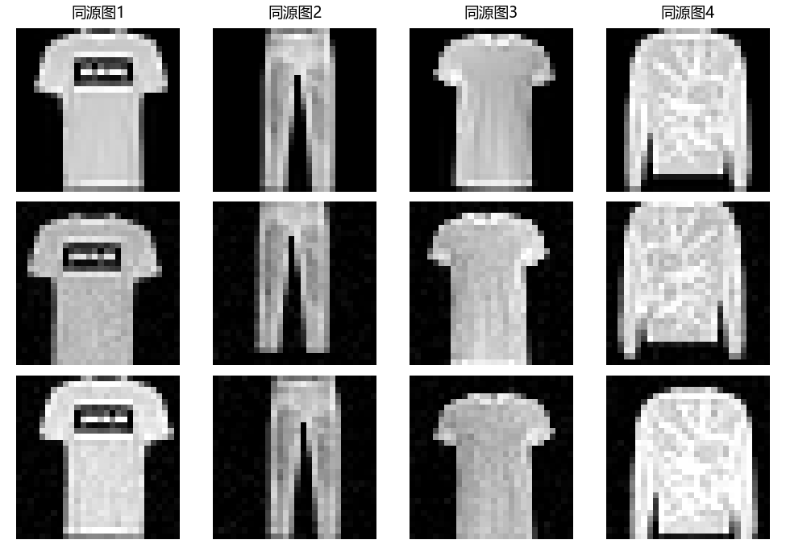
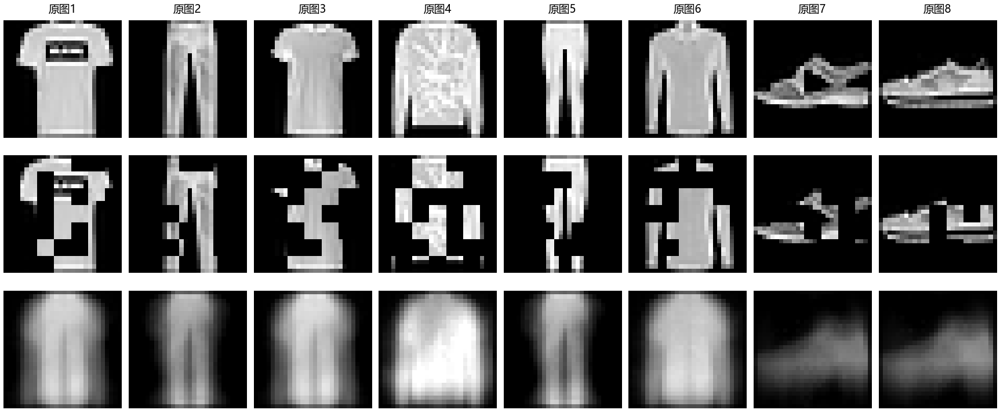

# 第二十九章　没有逐张答案，图像还能教会网络什么

第二十八章里的比较，必须有人看过两份具体答复，按某个目标说哪一份更好。第十三章的服饰分类也有明确的十类答案。这样的信息很珍贵，却不可能为每一张将来收集的图片、每一段声音和每一篇文章，都提前写好所有任务的答案。拿掉十类编号，训练就真的停了吗？第八章已经给过一个反例：批发商的六项消费额没有“客户类型”的标准答案，我们仍能规定重建误差，找少数连续坐标或两个代表点。第十九章的文章模型也没有人逐词写语义说明，原文的下一个片段却能成为预测目标。

现在我们要做的事比“给现成六维表降维”多一步：**让一个可调的图像编码器从原始像素学出中间表示**，再问这份表示能否帮助另一项工作。图像本身可以给出几种关系：同一张图经过两次轻微变化，仍来自同一件商品；盖住一些像素前，我们保存了它们的原值；同一幅图的两个局部块在原图里有相对位置。它们都不需要人写“这是一件衬衫”，却没有一项等于“图像没有向训练提供信息”。这类从资料自身构造训练目标的方法叫**自监督学习**。它并不保证网络学到了人希望的意义；“自”只说明这一轮目标从哪里取来。

## 让什么留下来，先由将来要做的事决定

第八章的主成分分析留下的是一个固定线性投影：它选择少数方向，使六项消费的平方重建误差小。那是一个完整、合理的任务。可若改问“这些客户来年会不会更换采购渠道”，原来的最大方差方向未必刚好保留预测所需的细节。图像更明显：逐像素还原背景纹理、认出服饰类别、判断衣服左右是否反穿，想保留的东西并不完全一样。**表示**在这里就是函数 \(h=f_\theta(x)\) 给原图 \(x\) 算出的向量 \(h\)；\(\theta\) 是训练会改变的卷积层和末端连接权重。它不是藏在网络里的已被证明的“语义”，而是某个目标训练后可拿来试用的一组数。

第十三章的卷积结构已先给了这台编码器一种偏向：相近像素先合算，同一小权重表在不同位置重复使用。那章用十类标签的负对数损失，经分类头把导数传回每个局部权重；本章保留类似的编码器结构，**换掉训练反馈的来源**。要检验换反馈是否真的有用，我们会冻结编码器，再交给一个只学直线分界的读出器少量标签。冻结很关键：如果此时还允许所有卷积权重受十类标签调整，最后的好成绩就说不清来自无标签训练，还是来自新一轮完整监督训练。

这个问题也使我们能看清两种经常混用的“没有标签”。一个数据文件可以有类别列，但训练阶段不读它；一个资料集也可能根本没有类别列，却仍能由同图、邻近时间、隐藏像素或图文配对形成训练目标。反过来，若“同一”的配对弄错，文件依旧没有人工类别，训练目标却已经变了。我们必须指明谁生成配对、遮盖或教师输出，谁后来才见到类别，不能只在结果表上盖一个“无监督”印章。

## 局部结构早已有了，参数怎样学习却一直有分岔

上一章的偏好研究已经谈到2025年。为追查图像表示的另一条来路，这里明确沿第十三章留下的视觉问题回到1980年，而不是假装时间重新从头开始。Fukushima 的 neocognitron 让局部反应逐层组合、逐步容忍图案位置变化，并使用无教师自组织；1989年 LeCun 等人的邮政数字网络，同样认真对待局部位置和共享参数，却让已知数字类别的末端误差通过反向传播改变权重。二者在结构上相遇，学习信号并不相同。第十三章已经讲过两者各自解决的任务；我们在这里借回那道尚未回答的问题：没有足够逐图类别时，怎样把“哪种中间活动值得留下”变成能算的目标？([Fukushima，1980](https://www.cs.princeton.edu/courses/archive/spr08/cos598B/Readings/Fukushima1980.pdf)；[LeCun 等，1989](https://proceedings.neurips.cc/paper/1989/file/53c3bce66e43be4f209556518c2fcb54-Paper.pdf))

这条支线没有从1989年突然跳到今日的对比学习。1995年 Hinton、Dayan、Frey 与 Neal 的 wake–sleep 研究让一组自下而上的连接从观察形成隐变量，又让自上而下的生成连接尝试重建；它研究的是多层随机生成模型及难以直接计算的隐变量推断，和我们接下来写的“冻结图像向量做分类”并非同一个目标。2006年 Hinton 与 Salakhutdinov 让深层自编码器通过较好的初始化学低维编码，再与主成分分析作比较；当时“训练许多层”本身仍是重要难题。这条重建与生成支线会在下一章继续，但它说明无类别训练在卷积分类走红前一直有人认真研究。([Hinton 等，1995，原论文](https://www.cs.utoronto.ca/~hinton/absps/ws.htm)；[Hinton、Salakhutdinov，2006](https://pubmed.ncbi.nlm.nih.gov/16873662/))

同在2005年写成、2006年发表的 Hadsell、Chopra 与 LeCun 的研究，则想从高维图像学出一条**对新图也能直接计算**的映射，而不只给训练集各点一张坐标表。他们用已知邻近关系让相近对靠近、相远对在规定间隔内分开；邻近关系可由先验也可由人工标注给出，因此不能把那篇论文本身说成“一点外部判断都没用”。它点明一个数学危险：若只奖励相近对变近，把所有输入映成同一个向量，损失也可能很低；相远对的约束在该目标里制止这种平凡办法。第八章 PCA 的线性投影与这里可用于未见图像的参数函数，解决的表示任务相连，但不是同一套程序。([Hadsell、Chopra、LeCun，2006，§1—2](https://www.cs.toronto.edu/~hinton/csc2535/readings/hadsell-chopra-lecun-06-1.pdf))

2008年 Vincent 等人在另一种当时的困难里作选择。多层网络训练尚不轻松，研究者尝试先用不依赖类别的目标，把每层的中间活动训练成较好的起点，再为具体任务微调。他们故意损坏输入的一部分，让自编码器从残存信息恢复原图；原图就是目标，不需人描述每个像素。论文还用后续分类比较这种初始化是否有用，同时承认“好的中间表示究竟是什么”没有被重建损失彻底回答。2015年 Doersch、Gupta 与 Efros 转而取同一图的两个局部块，要求网络判断第二块在第一块的哪个方向：答案由作者取块时的**几何位置**产生。他们并未用一张“正确物体名称”表；位置判断是否迫使网络认出对象部件，是要靠迁移实验检查的假说。像素恢复、局部关系辨认，是两种不同的资料提问方式。([Vincent 等，2008，§1—2、§5](https://www.cs.toronto.edu/~larocheh/publications/icml-2008-denoising-autoencoders.pdf)；[Doersch 等，2015，§1、§3](https://www.cv-foundation.org/openaccess/content_iccv_2015/papers/Doersch_Unsupervised_Visual_Representation_ICCV_2015_paper.pdf))

到2018年前后，文本和图像路线又提供更多可比较的答案。BERT 从文章里遮住部分词，让可见的左右文字预测原词；第十九章的语言模型则只能看左边，预测下一个片段，两者都从**原文**取正确编号，信息许可不同。同年 CPC 用已见片段辨认真实后续潜特征与抽来的其他特征；Wu 等人把“这两幅图是不是同一个实例”的辨别当视觉任务，虽不需要预先命名物体类别，另一幅同类衣服仍会被当成**不同实例**。这种区别后来会直接出现在我们自己的负例里。([BERT，2018，§3.1](https://arxiv.org/pdf/1810.04805)；[CPC，2018，§2](https://arxiv.org/abs/1807.03748)；[Wu 等，2018](https://openaccess.thecvf.com/content_cvpr_2018/papers/Wu_Unsupervised_Feature_Learning_CVPR_2018_paper.pdf))

## 一张图怎样给出两次观察

先拿第十三章的 Fashion-MNIST 商品灰图。这里的正例不由人说“两件衣服同类”，而是拿**同一张原图** \(x_i\)，独立做两次很轻的变化：至多两格的小平移、左右翻转、亮度和噪声扰动，得到 \(v_i=a_1(x_i)\)、\(v'_i=a_2(x_i)\)。本章要试的假设是：对这套十类服饰任务，经过这些变化后，原图的主要可辨别结构仍在。图里同一列三行正是原图和两次实际采出的视图，能检查我们并未把衬衫擦成一片噪声。

这项假设需要任务限定。若目标是辨左右鞋、读衣服上的字，水平翻转就可能改变答案；若把一张照片裁到只剩背景，模型把两裁块强拉近又会学错关系。我们选择增强，不是无条件宣布“图像变形都不改意义”。本机的变化较轻，也没有用原测试类别调节每种增强。类别目标本身在这一轮仍不参与梯度。

给编码器 \(f_\theta\) 后接一个可训练的投影头 \(g_\theta\)，把最后的64维输出归一化成单位长度 \(z\)。编码器原来的128维 \(h=f_\theta(v)\) 留作下游读出；投影头帮助训练时比较，并非另一个人写给每图的语义描述。把一批 \(B=256\) 张原图各做两视图，便有 \(2B=512\) 个 \(z\)。对第 \(i\) 个视图，记同原图的另一视图为 \(j(i)\)；其余原图的两视图是当前批内的候选负例。温度 \(\tau=0.2\) 控制相似度竞争有多尖。我们给“认出同源视图”定义概率：

\[
q_i(k)=
\frac{\exp(z_i^\top z_k/\tau)}
{\sum_{m=1,\;m\ne i}^{2B}\exp(z_i^\top z_m/\tau)},
\qquad k\ne i.
\]

分母有 \(2B-1=511\) 项：**包含真正同源的那一项，排除当前视图自己**。若把自己的向量也放进去，它的内积为1，网络便会被要求和一位永远完全相同的假竞争者比赛。把同源项 \(j(i)\) 当这道选择题的答案，逐视图损失为

\[
\ell_i=-\log q_i(j(i)),\qquad
L_{\rm pair}=\frac1{2B}\sum_{i=1}^{2B}\ell_i.
\]

这与第十三章“十个分数归一化再对正确类取负对数”在数学接口上相似：答案从**人工十类编号**换成**同一原图的另一次观察编号**。但它没有因此变成十类分类器，512个候选每批都随数据换。若把相似度 \(s_{ik}=z_i^\top z_k\) 当可变数，链式求导给
\(\partial\ell_i/\partial s_{ik}=[q_i(k)-\mathbf1_{\{k=j(i)\}}]/\tau\)。
真正同源项获得向上拉内积的方向，其余候选获得向下压的方向；再由 \(s=z_i^\top z_k\) 的导数把这些方向分给共享的编码器权重。[短核算](../results/c29_objective_probe.json)把三候选导数与自动求导逐项对齐，也核512个全同视图的损失恰为 \(\log511\)。代码中的零梯度、反传和优化器写回，与第四、十三章同一个训练过程，没有一个独立的“语义理解”步骤。

这个损失保留了 Hadsell 等论文里“只拉近有常量解”的警惕，却不是他们2006年的间隔公式；本机更接近2020年 SimCLR 的两视图、批内负例、投影与温度安排。2019年预稿、2020年发表的 MoCo 为取得许多较一致的负例，用慢变编码器和队列；SimCLR 则强调增强组合、大批和投影头。二者的设计都在回答“哪些实例应分开、多少候选一起比较”，不是“自监督”一词天然规定的唯一算法。([MoCo，2020，方法](https://openaccess.thecvf.com/content_CVPR_2020/papers/He_Momentum_Contrast_for_Unsupervised_Visual_Representation_Learning_CVPR_2020_paper.pdf)；[SimCLR，2020，§2—3](https://proceedings.mlr.press/v119/chen20j/chen20j.pdf))

这里还埋着**假负例**。训练只知道两视图是否来自同一条原图，不知道两张不同照片可能都是踝靴。把这两张靴图推远，是当前实例辨别题的要求，不是十类任务给出的真相。反过来，若将一幅鞋图的第二视图误配给衬衫，正例就错了。目标构造本身提供信息，也可能把错误信息送进优化。

## 从两次取图，到一次真实参数更新

[可运行程序](../code/fashion_ssl_lab.py)的核心计算直接对应上式。图像张量一批形状为 \((256,1,28,28)\)：第一轴数图，第二轴是灰度通道，后两轴是行列。两次增强后沿第一轴拼成 \((512,1,28,28)\)，编码器和投影头给 \((512,64)\) 单位向量；矩阵乘法 \(z z^\top\) 才给全部 \(512\times512\) 相似度。下面保留实际损失函数的关键几行：

~~~python
scores = z @ z.T / temperature
scores.fill_diagonal_(float("-inf"))
partner = (torch.arange(2 * batch_size, device=z.device) + batch_size) % (2 * batch_size)
loss = F.cross_entropy(scores, partner)
optimizer.zero_grad(set_to_none=True)
loss.backward()
optimizer.step()
~~~

负无穷让每行的“我和我自己”不参加 softmax；partner 把前半批第 \(i\) 项指向后半批同原图位置，也把后半批反指回来。交叉熵对 512 行取平均，与 \(L_{\rm pair}\) 对应。zero_grad 清先前的导数，backward 依同源编号求当前导数，step 才真正改变卷积层和投影头。若把“不同图片同类”误当 partner，代码照样能运行，但训练题已不再是我们推过的那个。

本机从随机初值对 50,000 张服饰训练图跑八轮，每轮196批；末批不足256张时，程序按该批实际图数重算候选，前面的511项专指满批。验证时用原官方训练中另留的10,000张里的前2,048张，固定增强随机数，以**同源辨别损失**挑权重。训练程序不读取十类标签文件，最佳在第八轮，验证损失约1.896；如果满批的所有单位向量完全相同，每个候选等分，损失是 \(\log 511\approx6.236\)。1.896说明本机网络已能在这种同源辨别题上明显胜过均匀猜。它还没有说明十类被整齐分开，必须暂时把这个结论留到冻结后的读出。

为了看配对关系的作用，第二支保持同样原图、两次增强、网络、轮数和优化预算，只在拼接前把第二批视图循环挪一位。于是每个被指定的“正例”来自**另一张原图**，真正的同源视图反在分母里与别的负例竞争。其最好的固定验证目标约6.23637，几乎就是均匀猜的水平。可我们暂不能从这个训练损失就断言它的编码器“什么也没有留下”：共享卷积、增强、优化和后面的少标签读出都仍可能改变最终表现。下一节会直接给它同样的下游考试；没有拿训练目标的漂亮曲线替代那场考试。

## 盖住一部分，再问原图是什么

对比学习问的是“哪一个视图同源”，还有另一种可以从图像自己取得答案的问题。把原图的一些像素块藏起来，留下未遮挡的部分 \(o\)，让编码器和解码器产生补全图 \(\hat x\)。只有原图被藏的像素集合 \(M\) 参与损失。先对一张图写：

\[
L_{\rm mask}
=\frac1{|M|}\sum_{p\in M}(\hat x_p-x_p)^2 .
\]

一批图的程序把全批被挡像素的平方误差相加，再除以该批被挡像素总数；若每张遮挡数略不同，这不等于先逐图平均再不加权平均。目标像素 \(x_p\) 来自那张原图，训练者知道，编码器本次输入却看不见。若把目标像素原样留在输入，又允许计算在同一位置直通，程序可能只练习复制；遮挡与目标可见性必须是**实际张量上的区别**。平方误差也不是唯一选择，我们采用它，是因为可以逐像素检查误差及看清一个重要后果。

固定未遮部分 \(O=o\)，假设某个被挡像素 \(X_p\) 在可见轮廓下仍有几种合理取值。若解码器只能给一个数 \(a\)，它为该位置承担的平均平方损失是 \(E[(a-X_p)^2\mid O=o]\)。对 \(a\) 求导为 \(2[a-E(X_p\mid O=o)]\)，所以最小点是**条件平均像素**。当多种衣物细节都与可见部分相容，平均图可能看起来模糊；这不是“模型被要求选一张最清楚的合理服饰却故意不选”，而是目标本身偏爱这类平均。预测平均的数学结论是在有相应条件分布和平方损失时成立，不说明现实中每一张模糊图的唯一成因。

2008年的去噪自编码器已经在“受损输入恢复原图”上建过另一条表示路线。2021年预稿、2022年发表的 MAE 则在图像 patch 上采用特别的非对称安排：**只有可见 patch 入编码器**，较轻的解码器再连同被遮位置作重建，并以未见任务检验表示。我们本机为了让同一个小CNN同前面直接比较，把约一半4×4块置零，再把**整张含零图**交给编码器，末端用线性解码器补全。这是本书的**简化遮块重建实验**，不是原 MAE 结构或论文成绩的复现。([Vincent 等，2008](https://www.cs.toronto.edu/~larocheh/publications/icml-2008-denoising-autoencoders.pdf)；[MAE，2022，§3](https://openaccess.thecvf.com/content/CVPR2022/papers/He_Masked_Autoencoders_Are_Scalable_Vision_Learners_CVPR_2022_paper.pdf))

本支八轮里，以固定验证遮盖损失选第六轮，约为0.04817。为了知道这是否只是输出一幅不看输入的平均服饰，我们还用训练段算三个**不会学习类别**的猜法，在同一2,048张验证图和同一遮盖上计分：全零图约0.20636，训练图的单一平均亮度约0.12515，训练图逐位置平均成的一幅图约0.08695。0.04817明显更低，说明本机重建器确实从可见部分取到了信息；这与“后面分类很弱”可以同时成立。下图的第三行有些衣服轮廓、裤管和鞋形，又普遍模糊；它是八个实际验证例子，不是对全体图片质量的定量评价。

## 能否只让两次观察一致，不挑任何负例

对比学习的负例既会把同类不同图推开，也会随着批量和抽样改变。2020年 BYOL 提出另一条路线：在线编码和投影函数 \(u_\theta\) 看一个视图，预测头 \(q_\psi\) 尝试接近目标编码和投影函数 \(v_\xi\) 对另一视图的表示。目标支的参数 \(\xi\) 不由这项损失直接同时反传，而从与它结构对应的在线参数 \(\theta\) 做慢变平均：\(\xi_{\rm new}=m\xi_{\rm old}+(1-m)\theta_{\rm new}\)，其中 \(0<m<1\)；预测头的独有参数 \(\psi\) 不参与这份平均。目标支的输出在当前这步停止梯度。一种简写目标为

\[
L_{\rm align}=
\|q_\psi(u_\theta(a_1x))-\operatorname{stopgrad}(v_\xi(a_2x))\|^2 .
\]

先看危险而不是背名称：倘若两支对所有图都输出同一常向量 \(c\)，且预测头也输出 \(c\)，此式为零。**没有显式负例本身不排除坍塌。**BYOL作者在他们的架构、归一化、慢变目标和训练条件下实测到有用表示；我们不能把那项经验观察提升成“凡是老师学生互相看就一定不会塌”的定理。2021年的 DINO 以自蒸馏视图和教师输出的中心化、锐化等具体安排研究另一种无标签图像表示，它的物体边界图也是原论文条件下的观察，不是任何注意力图自带的物体分割真值。([BYOL，2020，方法与消融](https://papers.nips.cc/paper/2020/file/f3ada80d5c4ee70142b17b8192b2958e-Paper.pdf)；[DINO，2021，方法](https://openaccess.thecvf.com/content/ICCV2021/papers/Caron_Emerging_Properties_in_Self-Supervised_Vision_Transformers_ICCV_2021_paper.pdf))

三条路线在“哪个关系来自原资料”上各不同：对比目标给同原图的两视图一个匹配编号，并用别的图竞争；遮盖目标给被挡像素原值；慢变目标给另一视图当前教师的向量。最后一种的“老师”不是懂服饰的人，而是另一套随训练更新的参数。它可以少用显式负例，但不是凭空多出真实类别答案。后来 DINOv2 与 DINOv3把图像资料、筛选、规模和稠密表示继续向前推进；本书不会用本机小图的结果替它们声称相同能力。([DINOv2，2023](https://arxiv.org/abs/2304.07193)；[DINOv3，2025](https://arxiv.org/abs/2508.10104))

## 终于可以问：留下的数对新任务有用吗

选轮完成后，我们把各编码器的卷积权重冻结。现在才读取 Fashion-MNIST 的十类编号：从训练段每类固定取500张，共5,000张。先只用这5,000张表示求每一坐标的均值和尺度，得到缩放后的 \(\tilde h\)；再让十类各有一个线性分数 \(s_c=w_c^\top\tilde h+b_c\)，用第十三章已经推过的 softmax 与真实类别的负对数损失**只调整 \(w_c,b_c\)**。读出强度由原官方训练段里另留的10,000张验证图决定；验证图不用于重新拟合坐标尺度。最终把已固定的编码器、尺度和读出应用到官方10,000张测试图。这叫**线性探针**：它检查当前类别能否在冻结表示上用简单分界读出，不能检查所有可能的视觉意义。

| 冻结后交给同样标签预算的编码器 | 验证正确率 | 官方测试正确率 |
|---|---:|---:|
| 同结构、仍为随机参数 | 79.95% | 79.76% |
| 同原图两视图正确配对训练 | 82.73% | 82.08% |
| 第二视图故意错配给另一原图 | 81.37% | 81.26% |
| 本书简化遮块像素重建 | 51.04% | 50.01% |

这些数来自[已冻结的四支读出记录](../results/c29_fashion_linear_probe_wrong_pair.json)。一个没有无标签预训的随机CNN，在这种28×28商品图上也能给线性分类头较高的起点；这正是需要认真保留的基线。正确配对比随机支高2.32个测试百分点，支持这次预训练在**这个任务和预算**下留下一些可用结构。错配支的自监督目标几乎停在均匀猜，下游却仍有81.26%，与正确支只差0.82个百分点；同一单种子结果不足以宣布“正确配对是这些下游增益的唯一原因”或“配对无关紧要”。数据增强、共享CNN结构和优化后的非语义特征也可能贡献；要分清这些因素需更多专门对照，而不是给这一行数字加确定的因果故事。

遮块支从0.08695的平均图基线把重建MSE降到0.04817，却只给十类读出50.01%。这个对照直接拆开“预训练目标学得好”与“指定下游读得出”两件事。本机128维中有126个坐标在一批验证图上的原始标准差小于0.01，并且重建图普遍模糊；这些迹象与弱表示一致。但坐标尺度可以被后续线性权重补偿，低方差并不独自证明所有图向量完全相同；重建还显著胜过无条件平均图。因此精确结论是：**这套简化结构/遮盖率/损失/训练轮数的编码器，不适合当前线性十类读出**。它不推翻去噪、MAE或其它掩码设计。

第十三章曾用**全部50,000张训练图的类别**训练另一套十类CNN，官方测试正确率87.79%。那是有监督、不同网络及标签预算的结果，供我们知道此前已做到什么，不能和只给线性头5,000个标签的四支直接排算法胜负。本章官方测试也曾在第十三章和本章早期探针被作者看过；表是对这份已见测试集的复核，并非一场崭新的作者盲测。它仍允许读者复算和理解机制，只是不该承担更大的泛化证明。[资料、参数、检查点及这些评价限制](../verification/C29_representation_protocol.md)都可在本机查到。

## 换成彩色场景，商品灰图的经验还能走多远

Fashion-MNIST 确实来自真实商品图，却很小、灰度、背景较单纯。仅在它上面成功，离用户关心的自然图片还远。于是我们另从 CIFAR-10 [官方页面](https://cave.cs.toronto.edu/kriz/cifar.html)下载并核对二进制原件。Krizhevsky、Nair 和 Hinton 从更大的 Tiny Images 资料中建立这份带类别的低分辨率基准，Krizhevsky 2009年的技术报告是官网请求引用的资料。这里有50,000张官方训练图、10,000张官方测试图，每张32×32、红绿蓝三通道，画面里可有动物、交通工具、天空和背景。它比刚才的商品图复杂，也依然只是低分辨率十类基准。官网每条记录先放一个类别字节，再放3072个像素字节；本机训练程序读取记录时**跳过首字节，只把后三段像素交给编码器**，不把十类编号送到增强、损失或选轮里。[原包MD5与逐成员身份](../data/cifar10_binary/SOURCE.md)可核。

我们不沿用第十三章按类别分层的划分：这次从官方50,000张训练图**只按固定随机行号**取45,000张训练、5,000张验证。仍用刚才的同图两视图对比目标，RGB编码器的卷积数目与128维输出职能相同，因图片多三通道、边长增至32，具体输入张量和末端连接维度随之改变；视图平移范围改为四格。下面四列是实际验证图的原图和两次变化，能够看见狗、鸟或背景可能受不同程度影响。若增强把决定类别的主体挤出画面，“同源”虽仍为真，给分类留下的视觉信息却会变少；这是增强任务选择的真实代价。

这支从随机权重训练八轮，按不读类别的固定视图验证损失选第八轮，损失由第一轮约2.368降到1.932。等编码器冻结，才解释训练记录的类别字节；同样每类只取500张、共5,000张拟合特征尺度和线性读出，用5,000张验证图选读出强度，**此后才第一次用官方测试图的内容给这项实验打分**。同结构随机编码器的验证／测试正确率为35.78%／36.27%；对比训练编码器为44.58%／45.48%，在这次测试上相差9.21个百分点。[完整训练与首次探针](../results/c29_cifar_linear_probe.json)可追到同一个[训练记录](../runs/c29_cifar_contrast/train.json)和权重。下载器先前为核来源解压、计算过测试文件散列，“首次”说的是测试图像和类别**此前没有参加训练、选轮和读出选择**，不假装机器从未碰过该文件的字节。

这组更复杂图像的增益比商品灰图明显，但45.48%也清楚说明小编码器加八轮实例辨别远没有学完现实视觉。两套数据的类别、背景、验证人数、平移范围都不同，不能从9.21与2.32的大小推出“彩色图必定更适合这种目标”；每套内部的随机/预训对照才比较同一任务。我们得到的更可靠认识是：**真实图像不必先有人为每张写好十类答案，像素来源关系仍能实际改变共享权重，并在有限标签的另一任务上留下可读出的差异**。至于细粒物体、图文问答及跨域新照片，尚须它们自己的资料与评价。

## 同样叫“自监督”，文章和图文会给不同的问题

把十类标签暂时收起，不能让所有资料都照着“同图两视图”训练。文章的顺序给第十九章下一个片段；若允许左右文字同时可见，BERT式遮词又是一道不同的条件预测题。视频相邻帧提供时间邻近，却不能默认所有连续帧都拍着同一物体；声音被盖住一小段，也要考虑波形和语义时间尺度。资料与任务之间的关系若错了，自监督一样会把梯度送向错误目标。

用户曾追问：哪有足够人力把每张图的每一处都描述得极细？2021年 CLIP 的研究利用网上已有的**图文配对**，用配对关系训练图像与文字表示相互辨认。网页文字确实不必是一张图的逐像素完整解说，模型仍能从“这段文字通常同哪幅图一起出现”取得较弱的关系；配对也会有噪声、遗漏和来源偏差。这里的图像对比实验没有训练文字编码器，更没有从服饰图自动学会答图文问题；图文对齐的输入、负例、训练和评价，要到后面的多模态会合章实际承担。([CLIP，2021，§2](https://proceedings.mlr.press/v139/radford21a/radford21a.pdf))

若本章学到的是 \(f_\theta(x)\)，给一张现有图可以算一个向量。即使再给遮块补全器，它回答的也是“**已有这张图的可见部分**，被挡处可能怎样”；它尚未给出从零采样、产生整幅新图的概率分布。第八章的重建、第十九章的文章预测与本章的局部补全、实例辨别，各留下了可用的训练信号，也各有不同的生成能力。下一章要正面问：若目标不止是把已见对象表成一个向量，而是描述资料怎样出现、怎样产生新样本，什么样的概率模型和训练办法才够？

## 改一条关系，再看哪些结论跟着改变

在项目根目录的 PowerShell 中，先确认第十三章的官方服饰四包和固定切分已存在。下列命令用新的输出名字，允许你实际重训并查看每轮目标、冻结探针和两张图片；GPU可用时用CUDA，否则用CPU，耗时要以自己的机器为准。若已有同名输出，程序会拒绝覆盖，换一个新名字再运行。重跑官方测试仍是同一份已被作者看过的测试，不会因路径改名而变成全新盲测。

~~~powershell
cd '.'
$env:PYTHONUTF8='1'
python work/code/fashion_ssl_lab.py train --objective contrast --out-dir work/runs/c29_my_contrast
python work/code/fashion_ssl_lab.py train --objective contrast_wrong --out-dir work/runs/c29_my_wrong
python work/code/fashion_ssl_lab.py train --objective masked --out-dir work/runs/c29_my_masked
python work/code/fashion_ssl_lab.py masked-baseline --out work/runs/c29_my_mask_baselines.json
python work/code/fashion_ssl_lab.py probe --contrast-dir work/runs/c29_my_contrast --wrong-dir work/runs/c29_my_wrong --masked-dir work/runs/c29_my_masked --out work/runs/c29_my_probe.json
python work/code/cifar_ssl_lab.py train --run-dir work/runs/c29_my_cifar
python work/code/cifar_ssl_lab.py probe --run-dir work/runs/c29_my_cifar --out work/runs/c29_my_cifar_probe.json
~~~

先试着自己回答，再展开下面的核对。

1. 这批有256张原图，每张两视图。对一个锚点，分母为何是511项而非512项或510项？若所有 \(z\) 都完全相同，损失是多少？这时能否说网络识别出十类？
2. 把两视图按同一原图配对改成按两件不同衣服随机配对，人工十类标签仍没读。训练信号有没有改变？本机错配支的预训练损失与类别探针分别支持什么，不能推出什么？
3. 一件鞋的被挡鞋面可能是亮灰，也可能是深灰，在可见鞋底 \(O=o\) 下二者各有一半机会。只许输出一个亮度数、用平方损失时该输出取什么？若改为必须产生一件清晰完整鞋图，光靠这个逐像素平均目标是否足以定义任务？
4. 若将来要分辨左右鞋和鞋上文字，本章哪些增强不宜照搬？设计一个新的无十类标签训练关系时，写清它从原始资料的哪项事实取得目标，以及该事实在哪些场景可能错误。

核对思路

1. 两视图共512个候选位置，不能拿锚点和自己比，所以排掉1项；另一同源视图是要被找出的正例，不能再排，剩511项。全同得到 \(-\log(1/511)=\log511\approx6.236\)；这对十类没有任何证明。
2. 有改变：被指定拉近的两项来源换了，原本真正同源的另一视图还可能被当负例。错配支目标约6.236，说明它没能解决这个错误的同源选择题；它的十类读出仍81.26%，所以不能直接说编码器全空，也不能凭这一次0.82个百分点差异给正确配对立普遍因果定理。
3. 两个数若为 \(a,b\)，平方损失平均在 \((a+b)/2\) 最小，可能是原图从未出现过的中间灰度。清晰的整图生成还需要定义对多种可能结果的分布和检验办法；只让每个被挡像素报单一平均，不会自动满足。
4. 左右翻转可能交换左右属性，也可能让文字镜像；大裁切更会删掉对象。可考虑同一物体不同摄像角度的实际连续记录或真正同步的图文配对，但须核物体有没有换、文字是否指向该图；“没有十类标签”不准省去这些关系的来源和错误检查。

