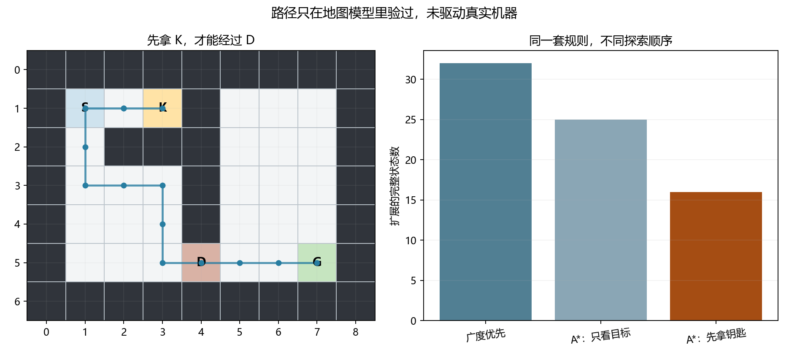

# 第十一章　规则已经知道，为什么还需要搜索

第十章问“看到的关系能否告诉我们主动改变后的结果”，答案必须依赖改变怎样进入机制。现在再换一种任务：改变的规则、允许的动作和目标**已经写出来**，我们要让程序自己找到一串能到达目标的步骤。这里没有一批“每个局面该走哪步”的正确标签供它拟合，也没有第九章那种未知分布参数。难处在于合法步骤可能很多，走错一处便到不了；程序必须在不把所有动作串都试到底的情况下，找出一次可检查的解。

这类工作属于**符号表示与搜索**的一条路线。它和本书前几章的可调神经网络、概率模型并行地回答智能问题：若规则明确，是否能据规则推出结论或找到行动？“符号”在这里指可逐条检查的局面事实、逻辑式和操作条件，并非在纸上写了字母就变聪明。先看当年研究者究竟要找什么，再把一个小到能在本机穷尽的任务做完。

## 1950 年代的机器不是都在调权重

第一章曾见到 Newell、Shaw 与 Simon 的逻辑理论机：给定公理与推理规则，让程序寻找一个指定命题的证明。1956 年已有方案论文；1957 年他们报告 JOHNNIAC 上的运行，正文特意问：一个机器即使**每一步都合法**，按便宜的次序不断生成证明片段，为什么仍可能迟迟碰不到要证的那一个？他们以《数学原理》中的命题为例，比较暴力生成的数量与选择子问题的启发式。定理不是因程序猜中一句话就成立，输出要由先前公理或命题逐步合规地推出；而能检验一份候选证明，远不等于能在可用时间里找到它。([Newell、Shaw、Simon，1957，第 218—222 页](https://iiif.library.cmu.edu/file/Newell_box00028_fld01976_doc0005/Newell_box00028_fld01976_doc0005.pdf))

用更小的一步看这两种劳动。若已知 \(P\)，又已知“\(P\) 成立就有 \(Q\)”，则可以依**肯定前件**（又称 modus ponens）写下 \(Q\)。检验这一步只要查两条前提是否在先前证明里；可在复杂问题中，程序起初不知道要先找 \(P\) 还是哪一个能通向目标的中间命题。逻辑理论机用替换、代入、脱离等方法选择可能有用的步骤；原论文自己也承认这些启发式有时很快找到证明，却不保证所有目标都能由这些方法找到。它不是一段通往今天 Transformer 的唯一前史，也不是一个“老方法必败，新方法必胜”的戏。([同篇原论文的方法与限制，第 222 页起](https://iiif.library.cmu.edu/file/Newell_box00028_fld01976_doc0005/Newell_box00028_fld01976_doc0005.pdf))

证明问题给出一个可迁移的区别：**答案的验收条件可以先写清，寻找答案仍需要组织。**这不要求本章复刻 JOHNNIAC 的逻辑程序。我们另造一张房间地图，让读者在位置、钥匙和一扇门上亲眼看见“局面怎样表示、什么动作合法、搜索是否找到真正最短的路线”；原系统与我们的教具各保留自己的身份。

## 一间有钥匙的房间，究竟什么算一个局面

下面地图每个字符是一格。S 为起点，K 为钥匙，D 是上锁的门，G 是目标，# 是墙，点是可走地面。上下左右移动一格都花一步；没拿钥匙不得进入门格，走进 K 后钥匙永久保留，门不会消耗它。地图是[本章事先固定的教学世界](../verification/C11_key_door_protocol.md)，并非某台现实机器的传感器读数。

~~~text
#########
#S.K#...#
#.###...#
#...#...#
#...#...#
#...D..G#
#########
~~~

只有位置 \((x,y)\) 够不够记录局面？从 S 向右走到 K，取到钥匙后必须向左返回 S 一带，才有路绕到最下面的门。因此同一个格子 \((1,1)\) 可以经历两次：第一次尚无钥匙，第二次已经有。对未来动作来说，它们不是同一个局面；程序若只记“这个坐标见过”，会错误地把第二次回到 S 的路线删掉。本章的**状态**写成 \(s=(x,y,k)\)，其中 \(k\) 为是否持钥匙。原位置不变、只改 \(k\) 便会改变门是否可进，这就是把它放进状态的可检验理由，不是照模板多添一列。

给定状态与一个方向行动 \(a\)，先检查目标格是否在地图内、是否为墙、若为门是否已有钥匙；不合法便没有后继。合法时把位置移一格；若进入 K，就令 \(k\) 变真，以后普通移动保留它。程序中的这个**状态转移**是确定函数 \(T(s,a)\)。允许的行动只有 N、E、S、W，目标条件是“到 G 且持钥匙”，每次合法移动代价为 1。这样定义以后，我们可以问**是否有解**、**怎样找到一条路**、**是否最少步**三个不同问题。计划是一串行动及其在模型内产生的状态；验收则要从初态重新执行这串行动，而不是只相信搜索器打印“成功”。

## 从近的局面开始找，为何能保证最少步

先不急着猜哪边像目标。把 S 放进队列，取出队首，按 N、E、S、W 次序产生所有合法而未见的**完整状态**，加入队尾；再取下一个。这样第 0 层只有起点，第 1 层是一动作可到的局面，第 2 层是两动作可到的局面。只要每条边同花费 1，队列第一次取出某状态时，抵达它的步数不会大于后来才入队的路径；若目标第一次出队，其步数便是最少的。这是**广度优先搜索**（BFS）的保证所在，不是“电脑足够快所以找得全”。

本机按固定地图得到一条 14 步路线：
\[
\mathrm{E,E,W,W,S,S,E,E,S,S,E,E,E,E}.
\]
头两个 E 走到 K；两次 W 把人带回原先的 S 格，此时钥匙位已经从假变真；再向下绕到门，最后向右到 G。程序另运行一个**错误状态版本**：队列去重只看 \((x,y)\)。它发现 13 个位置后报告无路，因为带钥匙回来的一格早在无钥匙时被划为“去过”；错在问题表示，不能把它跟有效 BFS 当公平性能对照。[逐步状态和结果](../results/key_door_planning.json)可逐格核对。

这里有效 BFS 扩展了 32 个完整状态，见到 35 个，队列峰值 4。小地图上并不惊人；在每个状态都能分出许多行动的任务里，走到深度 \(d\) 之前可能已生成指数多的候选。逻辑理论机面对的“可检验证明很稀、生成顺序很要紧”，与这里的压力有共同结构，**不是**两项历史任务的算法等价。搜索能利用问题中的信息改变尝试顺序，下一步便要看什么信息可用，又在什么条件下不丢最短路保证。

## 到目标看起来近，真的足以决定先走哪边吗

图上的最短路并非神经网络领域独有的问题。Dijkstra 1959 年讨论有限图中的最短路径，给已知边代价的路线问题一条有保证的计算路；我们的地图各步代价恰好全为 1，BFS 便可按层做最短**步数**搜索，若某条边突然要花五倍成本，这一论证就要重新来。1968 年在 SRI 的 Hart、Nilsson 与 Raphael 又研究如何把来自问题领域的剩余代价估计，接到已经走过的成本上，形成有数学条件的启发式图搜索。论文后来还就一项较强的最优性论证发表过修订；本章只用自己可核的有限图下界与最短路证明，不照搬“任何启发式都能又快又对”。([Dijkstra，1959，原论文](https://hal.science/hal-03171590v1/document)；[Hart、Nilsson、Raphael，1968，原刊](https://ai.stanford.edu/~nilsson/OnlinePubs-Nils/PublishedPapers/astar.pdf)及[1972 修订](https://cse.sc.edu/~mgv/csce580sp15/astarHNR1972.pdf))

若一条已找到的路到局面 \(s\) 花了 \(g(s)\) 步，还估计至少要 \(h(s)\) 步到目标，便可按 \(f(s)=g(s)+h(s)\) 从小到大探索；这种组织称 **A\***。\(g\) 是已经支付的真实代价，\(h\) 是尚未支付部分的估计，二者身份不能对调。若 \(h\) 高估，程序可能先拿到一条较贵的目标路便停；若 \(h\) 从不高估，且在相邻合法状态上满足 \(h(s)\le1+h(s')\)、目标 \(h=0\)，它还具有**一致性**，沿一条路走时 \(g+h\) 不会凭空下降。我们在程序里对所有合法转移和有解状态的真实剩余距离都核了这两项条件。

一种容易想到的估计是当前位置到 G 的**曼哈顿距离**：横向格数加纵向格数。它故意当墙不存在，因而不会比真实路线更长；但没钥匙时，它也忘了必须先到 K。另一种估计在无钥匙时为“当前位置到 K 的曼哈顿距离，加 K 到 G 的曼哈顿距离”，取得钥匙后才改为“当前位置到 G 的曼哈顿距离”。任何真正可行路径在拿钥匙前必须到 K，两个下界可以相加。进入 K 的那一步，两边恰相差 1；普通相邻移动下，曼哈顿距离最多变 1，所以这项新估计仍一致。它是我们对这张地图的选择，不是通用 A* 必须写“钥匙”。

这次三种有效搜索都找到了 14 步。BFS 扩展 32 个状态；A* 只看 G 的距离扩展 25 个；把取 K 也计入的 A* 扩展 16 个。虽然两种 A* 在起点同样给下界 10，后一种在探索离钥匙更远的局面时更能反映还欠的路。但队列峰值分别是 **4、6、7**，本图里少扩展状态没有顺便使临时队列也最小。完整状态数量只有几十，两个不同指标都应按本机结果报告，不用“一定更快更省”替代比较。

为什么满足下界的 A* 可在**目标出队时**停？设真正最短路长 \(L\)。若队首竟是成本 \(C>L\) 的目标，沿那条尚未被完整探索的最短路总有一个候选状态在前沿；它已走的真实代价加上不高估的剩余代价不会大于 \(L\)，理应排在成本为 \(C\) 的目标前面，矛盾。一致性让我们在此有限图中用当前已知最小 \(g\) 扩展节点而不误锁更便宜的到达；代码对重复状态还保留改进 \(g\) 的能力。启发式若来自一个会高估的学习模型，仍可帮助排序，但这份最短性证明便不能免费沿用。例如有 \(S\to G\) 成本 3、\(S\to A\) 成本 1、\(A\to G\) 成本 1 的小图，若胡乱给 \(h(A)=100\)，按 \(g+h\) 可能先取成本 3 的直接目标，错过成本 2 的路。此反例只针对高估后的“仍保证最短”说法，不否定启发式本身的实用价值。

## 把一步移动写成前提和效果，计划是否就等于行动了

刚才的地图规则还可换一种有利于计划的语言：若当前在 \((x,y)\)，邻格开放，便允许“向东”；效果是位置改为邻格，其余没有被该动作改变的事实继续成立。进入 K 会把“持钥匙”设为真；进入 D 的**前置条件**是已有钥匙。这样的表述方便程序讨论“为了到 G，先缺哪项条件，又有哪些动作能补它”。它没有为每一个未来局面保存一个训练标签，而是让同一条动作规则在许多局面中复用。

1971 年 Fikes 与 Nilsson 在 STRIPS 论文里处理的是现实机器人规划：一个“世界模型”需记机器人、箱子、位置、通道等事实；算子有适用条件与使事实增加或删除的效果。他们不只想把所有动作串从头试完，还用针对目标差异的办法引导模型空间搜索。论文特意把**模型中施加算子**与**机器人真正执行相应动作例程**分开。这一区别直到今天仍重要：计划在一份正确的小地图里能回放，并不说明真实门已开、传感器没误报或远端动作成功。本章 Python 的有限三元状态比原 STRIPS 的一阶逻辑世界简单得多，借的是“把前提、效果与搜索对象说清”的责任，而不是假称复现了那台机器人。([Fikes 与 Nilsson，1971，§1—2 及脚注](https://i-trofimov.narod.ru/1971-Fikes-STRIPS_A_New_Approach_to_the_Application_of_Theorem_Proving_to_Problem_Solving.pdf))

还有一个小而必要的“什么没有变”问题。取到钥匙后，向南走一步若只写“位置变了”，程序不能因此把钥匙状态忘掉；它应在未受动作影响时继续保持真。把所有不变事实逐条列出，在复杂世界会很累，这通常称作**框架问题**的一面。本章直接在转移函数里写 \(new\_key=has\_key\lor(\text{进入 K})\)，所以持有状态有明确的保留规则；它只是这个教具的处理办法，不解决任意现实行动的全部框架问题。

## 不逐个扩展局面，能否把整串步骤一起约束

搜索队列一面生成可走状态，一面问何时到 G。另一条有理由的选择是先说“假定恰走 \(T\) 步”，为每个时刻留一个状态 \(s_0,\ldots,s_T\) 和一个行动 \(a_0,\ldots,a_{T-1}\)。我们要求 \(s_0\) 为 S、无钥匙；\(s_T\) 为 G、有钥匙；而每个三元组 \((s_t,a_t,s_{t+1})\) 必须是同一套合法后继规则列出的某一行。例如，从 \((2,1,\mathrm{False})\) 向东进入 K，合法下一状态是 \((3,1,\mathrm{True})\)，因此这组前态、行动、后态可放进表；从 \((3,5,\mathrm{False})\) 向东进门则没有表项。现在的任务是给所有这些变量**同时找值**，使全部条件成立；找不到且已证明不可能，就把 \(T\) 加一。这叫一个**约束满足**问题。它并未增加地图事实，只改了组织候选计划的方式。

这种组织也有自己的历史来处。上节为解释机器人算子讲到 1971 年；现在沿**机器证明与约束求解**这条并行路线回到 1960 年。Davis 与 Putnam 1960 年、Davis、Logemann 与 Loveland 1962 年研究机器证明与命题条件求解；Kautz 与 Selman 到 1992 年才专门提出“把规划写成可满足性”来比较只靠逐步推导的路线，在给定计划长度下让动作与状态的逻辑条件一起接受求解。这里不能把早期 SAT 求解直接说成已经会规划，也不能因后来规划编码有效便说符号状态搜索已过时。我们本机使用的是 **OR-Tools CP-SAT 的有限整数变量与允许元组约束**，而非他们当年的布尔 SATPLAN 编码。把历史的共同问题与当前库的实际接口分开，读者才知道哪些机制被继承、哪些由软件另做。([Davis 与 Putnam，1960，原刊](https://web.stanford.edu/class/cs357/DP60.pdf)；[Davis、Logemann、Loveland，1962，原刊书目](https://doi.org/10.1145/368273.368557)；[Kautz 与 Selman，1992，原论文摘要与§1](https://www.cs.cornell.edu/selman/papers/pdf/92.ecai.satplan.pdf))

当前世界中可列出 58 个“位置加钥匙位”的形式状态及 158 条合法三元转移；其中一些状态从 S 根本到不了，列入候选空间不会使它们真的可行。程序按 \(T=0,1,\ldots\) 逐次询问求解器。对于 0 到 13，库均明确返回 **INFEASIBLE**；到 \(T=14\) 首次找到可行行动串。它与 BFS、两种 A* 的最短长度相合，但实际行动次序可略有不同：搜索器和约束器都可能在左侧开放房间选择不同的等长绕行。程序把每一条计划从 S 重新按规则回放，逐步检查墙、门、钥匙和最终 G。库若只报 UNKNOWN，即使还没找到计划，也不能说那个 \(T\) 已被证明无解。[求解状态与回放结果](../results/key_door_planning.json)保存了这次到底得到了哪一种证据。

这种相合仍有边界：BFS、A*、约束求解和回放共用本章的**同一后继规则**。它们能互相发现某些编码或输出错误，不能四票赞成就证明这张地图与真实建筑相符。正如 STRIPS 论文分开算子与动作例程，真正行动还需感知位置、取得钥匙、门实际是否响应与失败后的重试；那属于后来系统执行的章节，不由一份最短路径自动交付。

## 代码里哪些行是真的规则，哪些只换了求法

[完整程序](../code/key_door_planning.py)在这台电脑上运行。最重要的共享部件是 next_state：它先在当前状态与行动上检查合法性，再返回下一个完整状态。BFS 把返回的状态放队尾，A* 按 \(g+h\) 放入优先队列，约束模型则把每一种合法的 \((s,a,s')\) 存成允许表。这使“三种求法面对同一世界”成为可查的代码事实，而不是作者口头说公平。

~~~python
def next_state(state, action):
    x, y, has_key = state
    dx, dy = dict(ACTIONS)[action]
    target = (x + dx, y + dy)
    if target not in WALKABLE:
        return None
    if target == SPECIAL["D"] and not has_key:
        return None
    new_key = has_key or target == SPECIAL["K"]
    return (*target, new_key)
~~~

None 表示这一行动根本不允许，不能把它当一条“代价很高但可以穿墙”的边。return 中三个量会作为**下一局面**一起保存；若只保存前两项，拿了钥匙再回同一格的后继就被错误去重。约束路线从相同函数生成合法三元组，库的承重一行是

~~~python
model.add_allowed_assignments([s[t], a[t], s[t + 1]], tuples)
~~~

它要求时刻 \(t\) 的状态号、行动号和下一状态号合起来等于允许表中的一行；库不知道 K、D 或“钥匙”在自然语言里什么意思，这些含义已经在我们造表时承担。有限域求解器负责在许多同时约束里找赋值，验收函数 replay 又从头执行行动，独立于它宣称已找到可行赋值的那句话。程序使用本机已有的 OR-Tools 9.15；若换软件版本，具体接口仍须按新环境核对。([OR-Tools 官方 CP-SAT 说明](https://developers.google.com/optimization/cp/cp_solver)及[允许元组接口](https://or-tools.github.io/docs/pdoc/ortools/sat/python/cp_model))

在项目目录的 PowerShell 终端运行：

~~~powershell
$env:PYTHONUTF8='1'
python work/code/key_door_planning.py
~~~

左图的线在 S 与 K 之间**来回走过同一格**，叠在纸上看似只有一条线；结果文件的逐步状态把无钥匙第一次经过和带钥匙第二次经过分开。右图只比较扩展的完整状态数，不是现实耗时或机器内存曲线。读到这里，读者可把路径每一步与地图规则核对，自己提出新的合法行动串也能交给 replay 检查，而不需相信图里画的那条是唯一解。

## 这一章真正找到的是什么

我们从已给规则出发，先把“位置相同而钥匙不同”分成真实不同的状态；BFS 逐层找出最少步，A* 用有根据的下界改变顺序，有限域约束则在每个计划长度上让全串条件同时成立。三者各给一条合法的 14 步路线，程序再回放验收。这是一次**模型内求解能力**，不依赖从带标签样本调出权重，也不等于因果估计或真实设备执行。

历史上的逻辑证明、图最短路、机器人算子规划与满足约束，不是一位研究者把前一法修坏了才接下一法。它们面对不同已知条件，分别解决“规则早有，组合空间仍太大”的不同部分。后来学习器也可以帮忙估哪一步值得先试、从自然语言读目标或识别当前世界；这种贡献须和谁保证动作合法、谁核最终结果分开。接下来若评价候选的办法是黑箱的、没有一条可直接反传的导数，我们还能怎样分配实验与搜索预算？下一章才在这个新条件下讨论黑箱优化，不从本章 A* 的下界直接改名得来。

## 自己改一项条件，再让程序验收

1. 从地图写出 S 第一次与取 K 后再回 S 的两个状态，说明位置去重为什么会删掉后一条。然后读[本机结果](../results/key_door_planning.json)里只按位置去重的版本实际返回了什么；别把它错称作 BFS 正常算法失败。
2. 不运行代码，先数 S 到 G 的曼哈顿距离，以及 S 到 K 再从 K 到 G 的曼哈顿距离。两者在 S 为何都等于 10，而最短合法路是 14？在进 K 前一格到进 K 后，第二种 \(h\) 怎样变化？这一步是否满足一致性不等式？
3. 给定 \(T=13\) 的约束模型若明确返回 INFEASIBLE、\(T=14\) 给出行动串，并且 replay 验证终点，究竟证明了什么？若 \(T=13\) 只返回 UNKNOWN，可否同样宣称 14 是最短？
4. 在一份自己的地图副本里，改变一项真正的任务条件：例如让进门 D 花 3 单位而普通步仍花 1。区分“最少移动步数”和“最低总代价”；当前 BFS 的层次保证、两个 A* 的 \(g\) 与 \(h\)、逐个 \(T\) 的约束检验哪一处须改？这不是只把结果 JSON 的 14 改成别的数。
5. 若以后用一个学到的模型给 \(h(s)\)，它常常能引导搜索，但要继续宣称“第一个目标出队就是最低成本”，至少该核它有什么性质？在 \(S\to G\) 成本 3、\(S\to A\) 成本 1、\(A\to G\) 成本 1 的小图里，试给 \(h(A)=100\) 并自己排前沿，检查保证究竟怎样失败。

**核对。**第一题是 \((1,1,\mathrm{False})\) 与 \((1,1,\mathrm{True})\)；错误版本回不到已标记位置，最终报无计划。第二题两项下界在起点都为 10，墙和 K 死路要求额外回走四步；进 K 的前后第二种 \(h\) 正好下降 1，满足 \(h(s)\le1+h(s')\)。第三题只有此前所有更短长度被**证明不可行**，而 14 步计划又经回放合法时，才由这条路线得到本模型内最少步；UNKNOWN 不足够。第四题 BFS 仍可找最少步，却不再自动最省总代价；A* 的 \(g\) 应累加实际行动成本，\(h\) 要重新证明不高估并满足相称边成本的一致性；只按 \(T\) 递增的约束问法也还只在最小化步数。第五题 \(h(A)=100\) 高估从 A 到 G 的真实成本 1，直接 G 的 \(f=3\) 会比 A 的 \(f=101\) 先出队；若此时停下，得到成本 3 而非 2。可靠的最短性保证需要前文相称的下界与图搜索条件，不能从模型“通常给有用分数”推出。
