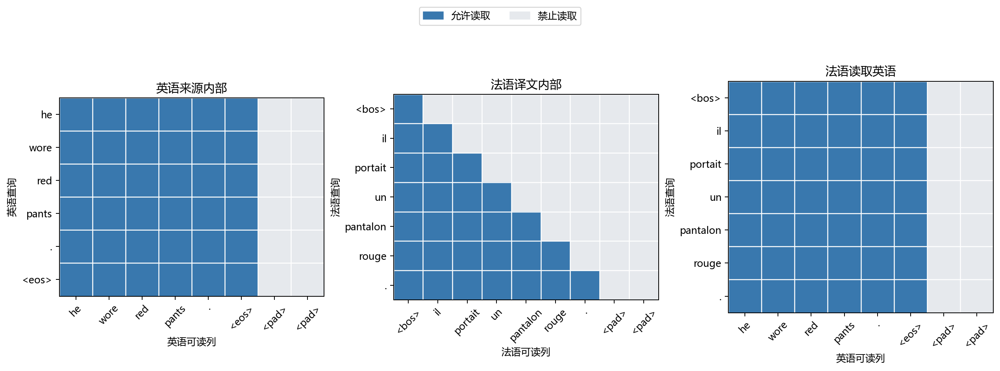

# 第十七章　每个位置怎样读到需要的信息

第十六章的译码器一边保留已经译出的法语，一边按需要重读英语。红裤子那句就是一个提醒：red 在 pants 前，rouge 却在 pantalon 后；译到 rouge 时，读哪处英语不能靠“同一序号”决定。我们让译码状态给英语各位置打分，再把那些位置的表示按分数加权，法语当前词的错误便能改变这组分数。这样已经能做翻译，本机留出句子上的软读取模型也确有收益。

但它并没有回答另一个问题：英语各位置自己的表示怎样形成？第十六章仍靠 GRU 从左到右逐个更新；法语译码状态也一步接一步地更新。英语的 pants 要利用后面的句号或前面的 red，法语的 pantalon 要利用更早的 il，除了让循环状态一路带着走，能否让**同一句内部的位置也主动读取别的位置**？这正是本章要研究的序列模型结构。我们将把上章的一次“译文读原文”，扩展为来源内部、译文内部、译文读来源三种读取，并亲手检查哪些位置允许互看。这套结构名叫 **Transformer**。名字现在就给出；接下来仍需弄清它是什么问题下的一种选择，而不是用名字代替构造。

## 从 2014 年的源句对齐，走到 2017 年的三个候选

第十六章已经看见 2014 年的两条真实成果：固定摘要的编码—译码模型能完成短语或句子任务；Bahdanau 等人让译码器从整句英语的各个位置选取当下有用的信息，缓解所有细节都压在一个向量里的压力。此时保留循环并继续把它做好，完全有理由。注意力最初帮的是**两句之间**的读取，它并没有自动取代读英语、写法语的循环计算。([Bahdanau 等，2014 首版，§3](https://arxiv.org/pdf/1409.0473v1))

到了 2015 年，Luong、Pham 与 Manning 并没有把“注意力”当成只有一种公式。他们比较读完整来源的全局方式和只读一段来源的局部方式，也比较直接点积、带一层映射的匹配等打分。局部读取可以少看位置，却要决定窗口放在哪；直接点积便于计算，也未必在任何资料和设置中胜出。这些试验使本章稍后的点积有一段真实来路：**选择打分办法本身就是设计问题**，不是 2017 年有人突然从概率公理里推得唯一的 Q、K、V。([Luong 等，2015，§3、§5.3](https://aclanthology.org/D15-1166.pdf))

2016 年，两类思路都在认真前进。Google 的 GNMT 使用八层编码、八层译码的 LSTM，保留跨源注意力和残差连接；论文还专门处理稀有词、训练与译出速度，说明深层循环系统不仅是课堂上的过渡模型。另一边，Kalchbrenner 等人的 ByteNet 用膨胀卷积组成编码器和译码器：一层看一定宽度的邻域，叠上不同跨度后让较远位置可以交换信息。这是减少逐位置串行等待的另一条实际路线，并没有等 Transformer 才第一次想到“不用循环”。([GNMT，2016，摘要与§3](https://arxiv.org/pdf/1609.08144v1)；[ByteNet，2016，§2—4](https://arxiv.org/pdf/1610.10099v1))

2017 年 **5 月 8 日**公开首版的 ConvS2S 又给卷积路线一个明确答案：训练时，同一层的各位置可一起计算；它在译码器的**每一层**仍安排了跨源注意力，报告了翻译质量和速度。称它为“卷积不要注意力”，会抹掉当时真实的设计。随后 **6 月 12 日**公开首版的《Attention Is All You Need》把问题再推进：既然跨源读取已有用处，能否连来源和目标内部的远处信息交换也主要交给注意力，免去按位置排列的循环或卷积？论文把计算量、必须串行的步数、远位置之间要经过多少层路径一起比较，并在大规模翻译上检验选择。两篇公开日期相邻，但上传先后本身不足以证明谁是另一篇的唯一灵感。([ConvS2S 首版记录](https://arxiv.org/abs/1705.03122)及[正文](https://proceedings.mlr.press/v70/gehring17a/gehring17a.pdf)；[Transformer 首版记录](https://arxiv.org/abs/1706.03762)及[NeurIPS 论文，§1—4](https://papers.nips.cc/paper_files/paper/2017/file/3f5ee243547dee91fbd053c1c4a845aa-Paper.pdf))

这篇 Transformer 论文是八位作者共同的成果。论文脚注具体写了：Jakob Uszkoreit 提议用自身注意力替换循环并启动评估；Ashish Vaswani 和 Illia Polosukhin 设计、实现最初模型；Noam Shazeer 提出缩放点积、多头与无需训练的位置表示；其他作者在模型变体、代码、推断和训练系统上做了工作。这比把八个人的研究说成一位天才“突然想到 QKV”更接近留下的同期记录，也提醒我们：数学构件与可训练、可比较的系统并不是同一项工作。脚注没有记下他们的全部私下讨论，我们也不替他们编造。([原论文作者脚注](https://papers.nips.cc/paper_files/paper/2017/file/3f5ee243547dee91fbd053c1c4a845aa-Paper.pdf))

## 先把“从别处取什么”说清，再写矩阵

第十六章预测一个法语词时，已有译文处境 \(s_{i-1}\) 负责提出“我现在需要哪部分英语”；每个英语位置 \(h_j\) 既参与匹配，也把信息送进加权平均。若现在想让英语位置 \(i\) 去读英语位置 \(j\)，可以用当前位置的表示产生一个**查询** \(q_i\)，用可读位置的表示产生一个**键** \(k_j\)，再由那里产生真正带回来的**值** \(v_j\)。这三个名字是计算中的分工：查询用于提出需要，键用于计算匹配，值用于按匹配权重汇总。它们都从已有向量经过待训练的线性映射得到，不是数据文件额外标好的三栏，也不保证某个维度能直接译成人类语言中的“需要”。

先看一个人为给定的三位置算例，只为看清运算，不冒充模型已经学会翻译。取 \(q=(1,0)\)，三个键为 \((1,0),(0,1),(1,1)\)，三个值另取 \((1,0),(0,1),(0,2)\)。若用点积并除以 \(\sqrt2\)，三个匹配分数是约 \(0.707,0,0.707\)；逐行 softmax 给出约 \(0.401,0.198,0.401\)。于是取回的不是“赢家的词”，而是 \(0.401(1,0)+0.198(0,1)+0.401(0,2)\)，约为 \((0.401,1.000)\)。第二处的键虽不匹配第一坐标，它的值仍贡献了 0.198 的第二坐标。**键决定多少，值决定带回什么**；若把二者写成同一符号，这个选择余地便看不见。

现在令一整句的表示按行放在矩阵 \(X\in\mathbb R^{n\times d}\)，每一行是一个位置。我们选三套可训练矩阵：\(Q=XW_Q\)、\(K=XW_K\)、\(V=XW_V\)。一次计算全部位置，便得到

\[
S=\frac{QK^\top}{\sqrt{d_k}},\qquad
A=\operatorname{softmax}_{\text{每一行}}(S+M),\qquad
O=AV.
\]

\(S_{ij}\) 是位置 \(i\) 查询位置 \(j\) 的匹配分数；同一行所有**允许读取**的列经 softmax 合为 1，再以这些数加权值。\(M_{ij}\) 在允许处为 0，在禁看处为 \(-\infty\)，使禁看列的指数为 0。一次矩阵乘法中的行、列就有了可追踪的含义：`Q @ K.transpose(-2, -1)`生成“谁读谁”的分数，`weights @ V`取得内容。源句内部自己读自己时，三套投影都取同一批输入，这叫**自身注意力**；法语位置读英语时，查询取法语当前层，键和值取英语编码结果，这叫**跨句注意力**。两者的分数形式相同，能看到的对象不同。原论文在这两种位置关系上使用的是**缩放点积注意力**，而上章用带 `tanh` 的加性打分；它们是同一“软读取”任务的不同参数化。([Transformer，§3.2](https://papers.nips.cc/paper_files/paper/2017/file/3f5ee243547dee91fbd053c1c4a845aa-Paper.pdf))

为什么偏要除 \(\sqrt{d_k}\)？先作一项有假设的计算：若查询与键的各坐标相互独立、均值为 0、方差为 1，那么 \(q^\top k=\sum_{r=1}^{d_k}q_rk_r\) 的方差为 \(d_k\)；除以 \(\sqrt{d_k}\) 后方差变为 1。维数增大时，未缩放点积容易有较大的绝对值，softmax 一行可能很快挤到接近 0 或 1，许多方向的导数随之变小。缩放是一个针对这种计算情形的设计，不是说训练后的所有键都独立同分布，也不是保证每行永不饱和。[本机随机向量核算](../results/transformer_bridge_probe.json)取 8192 对 64 维向量，未缩放样本方差约 65，除以 8 后约 1.02；它核的是刚才的条件计算，不是翻译质量。论文也把这一点作为缩放点积的动机。([Transformer，§3.2.1 及注 4](https://papers.nips.cc/paper_files/paper/2017/file/3f5ee243547dee91fbd053c1c4a845aa-Paper.pdf))

上面的矩阵式在[实际程序](../code/transformer_bridge.py)里仍是同一行、同一列，只是先把宽度分成几个头。暂时把 `allowed` 当作已经说明了哪些列可读的布尔表：

~~~python
q = self._split(self.q(query))
k = self._split(self.k(memory))
v = self._split(self.v(memory))
scores = q @ k.transpose(-2, -1) / math.sqrt(self.head_width)
weights = scores.masked_fill(~allowed, float("-inf")).softmax(dim=-1)
values = weights @ v
~~~

`query` 与 `memory` 若是同一批表示，就是自身读取；若分别是法语与已编码的英语，就是跨句读取。`scores` 的末两维是“提问的位置 × 可读的位置”，因此 softmax 必须沿**可读位置**那一维做。若不小心沿提问位置做归一，一个英语词反而要在所有法语问题之间分配总权重，已经不是刚才所定义的逐问题读取。

上章已经看过软权重怎样接收误差，这里可以把**键和值为什么要分开**再推进一步。只取一个查询行，令 \(z=\sum_j a_jv_j\)，从后续损失传回这一行的向量梯度记为 \(g=\partial L/\partial z\)。对于允许读取的位置，softmax 的链式法则给出 \(\partial L/\partial s_j=a_j\,g^\top(v_j-z)\)。所以增加位置 \(j\) 的分数是否能减小损失，要看它带回的值 \(v_j\) 相对当前平均 \(z\) 在误差方向上的差异；光说“这个键很相似”还不够。这个分数的梯度再经过点积传给查询：\(\partial L/\partial q=\sum_j(\partial L/\partial s_j)k_j/\sqrt{d_k}\)；键 \(k_j\) 得到 \((\partial L/\partial s_j)q/\sqrt{d_k}\)，而值 \(v_j\) 直接得到 \(a_jg\)。被遮住的列权重为零，也不通过这次读取取得这些梯度。代码中的 `backward()` 沿这些具体通道把输出错误送回三套投影。这里说的是一行一次读取的局部导数；多层网络还会把各层路径的贡献相加。

用本章三位置的数值，在 PowerShell 运行 `python work/code/attention_gradient_check.py`，可以逐项核对这三类导数与 PyTorch 的反向传播。[核对记录](../results/attention_gradient_check.json)里查询梯度最大差约 \(2.8\times10^{-17}\)，键和值为 0；这验证的是这个已知函数的局部导数，不是模型学到的人类语言关系。

## 如果所有位置长得一样，程序从哪里得知先后

GRU 读到第 \(i\) 项时，更新先前状态的动作本身带有顺序；卷积的左右窗口也带有相对位置。若只对一组词向量作上述“全员互读”，同步调换输入各行的次序，查询、键、值也只是被同样调换；分数矩阵的行列同步重排，输出随之重排。没有额外位置线索，这一层不会从词向量**自身**知道 red 原来排在 pants 前还是后。这是我们刚才公式的对称性，不能靠“注意力能看全句”一句话解除。

具体地，若 \(P\) 是交换行次序的矩阵，把输入换成 \(PX\)，则 \(Q'=PQ,K'=PK,V'=PV\)。于是 \(Q'K'^\top=P(QK^\top)P^\top\)；逐行 softmax 对相同的行列重排给出 \(A'=PAP^\top\)，最后 \(A'V'=PO\)。这种**同步重排只同步重排输出**的性质说明：全局连接让远处可达，却没有单靠它把先后写进表示。译码器的三角形可见性会破坏这个完全对称性，但它仍不能替代来源侧的词序和距离信息。[本机五位置重排](../results/transformer_bridge_probe.json)在不加位置时最大差约 \(6\times10^{-8}\)；把位置数加在词向量后，同一项检查差约 0.098。

2017 年论文把一组**位置编码**加到词向量上。本章程序沿用原论文的正弦、余弦选择：在位置 \(p\) 的第 \(2r\) 与 \(2r+1\) 维放入

\[
\mathrm{PE}(p,2r)=\sin\!\left(p/10000^{2r/d}\right),\qquad
\mathrm{PE}(p,2r+1)=\cos\!\left(p/10000^{2r/d}\right).
\]

例如第 0 处每对是 \((0,1)\)，第 1 处便随频率改变；词向量和位置向量维数相同，才能逐坐标相加。正弦与余弦还满足 \(\sin(a+b)=\sin a\cos b+\cos a\sin b\) 及相应余弦式，所以固定距离的位移可以在每一对坐标里表示成一次旋转。这给相对距离成为可学关系一个理由，**不证明**模型在没见过的任意长度上都一定会外推。作者也试过可学习的位置向量，在原论文一组开发集试验上得分很接近；他们选择正弦形式有对更长长度的设想，并非实验已证明它在所有长度上优胜。([Transformer，§3.5、表 3(E)](https://papers.nips.cc/paper_files/paper/2017/file/3f5ee243547dee91fbd053c1c4a845aa-Paper.pdf))

## 同时算七个法语位置，怎样不让它们互相偷看未来

仍用“he wore red pants . EOS → il portait un pantalon rouge . EOS”。训练时程序已有整条参考法语，不等于每个预测位置都**允许**读整条参考。第十六章已把输入与目标错开：输入依次是 BOS、il、portait、un、pantalon、rouge、句号，目标依次是 il、portait、un、pantalon、rouge、句号、EOS。预测 rouge 那一行放的是输入位置 `pantalon`；输入中的 rouge 在**下一列**。当前行若读到下一列，哪怕输入目标错开一位，也会把正确答案直接泄给自己。

所以原版编码—译码 Transformer 有三种不同的可见性，不能用一张“注意力图”含混带过：

| 位置在做什么 | 查询从哪里来 | 可以读哪些键和值 | 为什么这样限 |
|---|---|---|---|
| 英语来源内部互读 | 英语各位置 | 整句英语的真实位置 | 整句源文在翻译开始时已经给定，前后都不是秘密。 |
| 法语译文内部互读 | 已错位的法语输入位置 | 同行及其左边的法语输入；未来列禁看 | 预测当前目标时，后续参考词不能给答案。 |
| 法语位置读英语 | 法语当前层位置 | 全部真实英语位置 | 每一步翻译都可依据完整已给源句。 |

图里每侧多添两个 PAD 列，正好让“已给的真实词”和“为凑齐批次的空位”分开。只画了真实查询行：英语来源各行可读整句六个位置，法语第 \(i\) 行只能读自己的输入位置及左侧，法语读英语则每行都可见完整英语。比如法语 `pantalon` 那行是在预测 **rouge**，右边的输入列 `rouge` 是浅色禁看的。蓝格只表示这条连接**允许**存在，绝不是训练得来的权重热图；上章那张深浅不一的图回答的是另一件事。[画图程序和逐格布尔表](../results/attention_mask_figure.json)保留了实际可见矩阵。

三类读取都不能把批次补齐用的 PAD 当正文。法语自读在权重分母中去掉未来与 PAD，跨句读取去掉英语 PAD；来源自读也去掉英语 PAD。我们的 `causal_mask()` 构造左下三角形并与真实目标输入键相交，`source_mask()` 按每行真实来源位置建可见列。禁看分数在 softmax **之前**换成 \(-\infty\)，若只把求和后的权重乘零，剩余权重已被错误分母压小。还要保证每行至少有一个可读键：本章目标从 BOS 起，来源至少有 EOS，程序碰到全禁看行会报错，不把全 \(-\infty\) 的 softmax 当合法概率。

这样，训练可以把七个已知输入位置同时送入矩阵乘法。遮罩是**信息限制**，并不要求 Python 按七次循环逐词算训练损失；但独立生成时第二个法语词确实得等第一个词先被模型说出来。训练中的位置计算可并行，**生成词序仍是逐步决定**，这两个“并行”不能混为一谈。([Transformer，§3.1—3.2、图 1—2](https://papers.nips.cc/paper_files/paper/2017/file/3f5ee243547dee91fbd053c1c4a845aa-Paper.pdf))

程序里，法语前缀的可见性没有藏在训练循环里，而是由目标输入本身决定：

~~~python
triangle = torch.ones(length, length, dtype=torch.bool, device=target_input.device).tril()
allowed = triangle[None, None, :, :] & (target_input != PAD)[:, None, None, :]
~~~

三角形管“不能读比自己晚的列”，右边的比较管“不能读补齐的列”。两个条件必须同时成立。真正运行的 `causal_mask()` 随后交给读取层，读取层会检查每个查询行至少留有一个键。

## 一次读取还不是完整的 Transformer 层

我们目前只得到单次加权汇总。原论文让它以多套不同投影同时进行：本机宽度 \(d=96\) 分成四个头，每头的查询、键和值宽 24；每头各自给所有可读位置打分与取值，再将四份结果接在一起，经一套输出矩阵回到宽 96。这里的**多头注意力**给了模型在不同可训练子空间中形成不同读取的机会；不能先把四个头贴上“词法、句法、语义、翻译”标签，实际学到什么要看数据、任务和检查。原版宽 512、八头，每头键和值宽 64；我们缩小是为了使同一个结构能在本机清楚运行。([Transformer，§3.2.2](https://papers.nips.cc/paper_files/paper/2017/file/3f5ee243547dee91fbd053c1c4a845aa-Paper.pdf))

读取把**不同位置**的信息汇在一起；接着，每个位置还需要加工自己刚拿到的向量。原版的逐位置前馈层在每行使用同一组参数，先线性变换、过 ReLU、再线性变回来：\(\mathrm{FFN}(z_i)=W_2\max(0,W_1z_i+b_1)+b_2\)。它不会在这一小层直接访问别处的位置；跨位置交流已由前一子层完成。“前馈”不是说训练只能前向，梯度仍能从末端穿过这两次线性运算。我们把内宽设为 192，原版是 2048；每个大层各有自己的 FFN 参数，但一层内部各个位置共用它们。([Transformer，§3.3](https://papers.nips.cc/paper_files/paper/2017/file/3f5ee243547dee91fbd053c1c4a845aa-Paper.pdf))

把这些子层叠深时，还需让原输入有一条可加回去的路。对输入 \(x\) 和一个子层 \(F\)，原版执行 \(\mathrm{LayerNorm}(x+F(x))\)：加回 \(x\) 叫**残差连接**；之后的 LayerNorm 在同一位置的特征维上取均值 \(\mu\) 与方差 \(\sigma^2\)，按 \((z-\mu)/\sqrt{\sigma^2+\varepsilon}\) 归一，再由可学习的逐维缩放与平移调整。它不把一个批次或整句混成同一个均值。残差为旧表示留下直接路径，归一化帮助控制各层数值尺度；二者是有依据的训练设计，不是凭这条公式就能保证任意深网络可优化。`x + read` 与 `LayerNorm(...)` 在[本章程序](../code/transformer_bridge.py)里保持这个 **先加、后归一** 的原版顺序；后世也有改变次序的实现，不在这里悄悄把它们称作“2017 原版”。([Transformer，§3.1](https://papers.nips.cc/paper_files/paper/2017/file/3f5ee243547dee91fbd053c1c4a845aa-Paper.pdf))

现在可以完整数清两侧：编码器一层是“英语自身读取 → 逐位置 FFN”，每个子层各有残差与归一；译码器一层是“法语遮住未来的自身读取 → 法语读取英语编码结果 → 逐位置 FFN”，也分别有残差与归一。堆多层后，用译码器各位置的最终向量给法语词表打分，并对当前目标求负对数。第十六章的目标并未换掉，只是承载它的可训练计算换了结构。原版是六层编码和六层译码；本机各两层。因此，“会写 QKV”与“已经有可训练的完整 Transformer”之间的编码器、译码器、前馈、位置、遮罩和词表输出，在这里都有实际对象。([Transformer，图 1、§3.1—3.4](https://papers.nips.cc/paper_files/paper/2017/file/3f5ee243547dee91fbd053c1c4a845aa-Paper.pdf))

例如[译码器一层的原代码](../code/transformer_bridge.py)只占几步，但每一步的可读对象已经不同：

~~~python
read, self_weights = self.self_read(x, x, causal)
x = self.norm_self(x + read)
read, cross_weights = self.cross_read(x, source, source_allowed)
x = self.norm_cross(x + read)
return self.norm_ffn(x + self.ffn(x)), self_weights, cross_weights
~~~

第一行只在法语前缀内部读取，第三行才接触已编码的英语。把第三行删掉，训练资料即使仍传入英语，法语分数也失去这一条实际的源句路径；把 `causal` 换成全许可表，则训练时会读到参考译文的后文。代码短，边界不能省。

## 较短的信息路径，换来了怎样的计算负担

回看历史选择，三种结构各有真实代价。循环层从 \(h_{i-1}\) 得 \(h_i\)，一条句子内部要按位置等前一步；卷积层同层可并行，但小窗口内的两处远词要靠堆层或膨胀窗口接上；全局自身读取把所有位置两两打分，一层即可让任意两个真实位置在信息图上直接相连。论文表 1 把“最少串行操作”与“每层运算量”放在**不同的列**：作为抽象机制比较，全局自身读取的位置混合约需 \(O(n^2d)\)，循环更新约需 \(O(nd^2)\) 且有 \(O(n)\) 次按位置等待；宽 \(k\) 的卷积可按位置一起算，却要靠更多层连远处。这解释了 2017 年为何值得重新组织计算，却还不是本机一个**完整 Transformer 块**的全部账。([Transformer，§4、表 1](https://papers.nips.cc/paper_files/paper/2017/file/3f5ee243547dee91fbd053c1c4a845aa-Paper.pdf))

把前面已经写出的 Q、K、V、输出映射和逐位置 FFN 也算上，区别便清楚了。若长度是 \(n\)、总宽 \(d\)、FFN 内宽 \(d_f\)，只数矩阵乘法中的乘数，一次自身读取块约有：四个线性投影 \(4nd^2\)，两次位置配对矩阵乘 \(2n^2d\)，两层 FFN \(2ndd_f\)。这还没数 softmax、归一化、反传、词表输出与硬件时间，不能冒充实测秒数。本机 \(d=96,d_f=192\) 时，[可改长度的小核算](../results/attention_cost_probe.json)给 \(n=18\) 的三项约 **66.4 万、6.2 万、66.4 万次乘法**：两两位置这项仅占这三笔约 **4.5%**。若把长度改成 512，三项约 **1887 万、5033 万、1887 万**，平方项才超过一半。四个头各留一张 \(n\times n\) 权重表，512 位置时仅一层的一份浮点权重就约 4 MiB；训练还会为其它中间量付账。**信息路径短**与**整层计算便宜**不是同一结论；长上下文时位置配对反会成为重负。

2017 年论文报告的是在 WMT14 英德约 450 万句对、英法约 3600 万句对及八张 P100 等资源上的机器翻译结果；其大模型分别达到 28.4 与 41.0 BLEU。那些数字说明这一结构在当时的任务和预算下值得认真对待，不能替我们本机最多十八单位的 Tatoeba 句对测质量，也不能证明每种长度、设备或语言上注意力都比循环快。更准确的认识是：它把某些必须等待的位置依赖改成可一起执行的矩阵计算，同时付出了全位置配对的成本。([Transformer，§5—6、表 2](https://papers.nips.cc/paper_files/paper/2017/file/3f5ee243547dee91fbd053c1c4a845aa-Paper.pdf))

## 在本机跟一次分数、遮罩、梯度和真实句对

在本书项目根目录的 PowerShell 中，使用第十五、十六章已固定的真实资料：

~~~powershell
$env:PYTHONUTF8='1'
python work/code/attention_gradient_check.py
python work/code/attention_cost_probe.py
python work/code/attention_mask_figure.py
python work/code/transformer_bridge.py probe
python work/code/transformer_bridge.py train --train-limit 189037 --val-limit 24015 --epochs 8
~~~

前三条分别核查询/键/值的一行导数、改变长度时的运算量、真实红裤子句上的三张许可表；都不训练真实译文，第二条可改 `--lengths 18 128 512` 比较。第四条则不只问“能否 `forward()`”。它让两条真实英法句对同批进入模型，其中一条短、一条是上章的红裤子句，借此实际出现 PAD；来源宽 6、目标输入宽 7、四头后编码自身权重形状为 \([2,4,6,6]\)，译文自身为 \([2,4,7,7]\)，跨源为 \([2,4,7,6]\)。程序改动第一条来源词，输出最大变约 **0.563**；只改较晚的法语输入，较早列分数最大变化为 **0**。译文被遮列、来源 PAD 的权重都是 **0**，许可列的行和偏离 1 不超过约 \(1.2\times10^{-7}\)。这些数核的是模型**能读与不能读的边界**，不是“译得好”。([完整核算记录](../results/transformer_bridge_probe.json))

同一核算还取第十五章 WikiText 真实文章的连续 19 个编号：前 18 个作输入，各自预测右邻一个编号。它建一条只有遮住未来的自身读取、没有英语编码器和跨句读取的小模型，算负对数，调用 `backward()` 后首层查询映射的梯度范数约 **1.28**；直到 `optimizer.step()`，那组参数才实际改变，最大单项变化约 **0.0001**。改动第 13 个输入，前 12 个位置的输出仍原样不变。这说明从真实文本目标到查询参数有一条梯度路径，也说明它保住了下一词的信息边界；**一次更新没有证明会写文章**。[程序](../code/transformer_bridge.py)把 `zero_grad`、`backward`、`step` 分开放着，方便你停在任一步看参数究竟变没变。

第五条用 C16 同一份英法词表和按整句英语分组的切分，从随机权重训练宽 96、四头、编码与译码各两层的缩小模型。其来源、目标词表分别是 8004 项，不偷用原论文共享词表的条件；训练资料也不是 WMT14。每批输入先按**本批真实最大长度**裁切，再把目标 PAD 排除在损失之外，错误按所有非 PAD 目标词（含 EOS）平均。训练完整记录、验证选择、训练后才打开的测试、固定句子的独立贪心生成在[结果文件](../results/transformer_bridge_train.json)；权重在[本机检查点](../results/transformer_bridge_best.pt)。下面只留决定我们怎样理解模型的少数结果。

## 真实训练能说明什么，还没说明什么

模型共有 **2,684,868** 个可训练数，从随机值起步，实际读了训练 **189,037** 对、验证 **24,015** 对；在每次完整运行中，测试 **23,175** 对只在八轮训练与验证选定权重后评价。本轮返修前已经看过同一批测试结果，现按原设置重训是**复核**，没有根据测试分数另挑架构或轮次，也不能把复核说成一批全新盲测。目标始终是“给定完整英语与先前正确法语，预测当前法语直到 EOS”的逐词负对数；它与上一章的翻译目标相同，便于看结构变化，但**不等于**独立翻译质量。

| 八轮中的时点 | 训练目标词平均负对数 | 验证目标词平均负对数 |
|---|---:|---:|
| 第 1 轮 | 约 2.854 | 约 2.024 |
| 第 4 轮 | 约 1.175 | 约 1.292 |
| 第 8 轮 | 约 0.879 | 约 1.136 |

训练列是在每个批次更新时累计的，验证列则在该轮结束后用固定权重计算；两列可以看学习走向，不能把同一行的差额直接当成同一时刻测出的泛化误差。验证按同一口径选第八轮，随后测试目标词负对数约 **1.134**。这条曲线说明本机两层编码、两层译码的完整计算从真实短句资料中学到了有用的条件概率，并非只通过了形状检查。它也显示训练与验证已有差距，继续盲目多轮并不自动带来同样的留出收益。上一章的循环软读取在**同一份切分与词表**上的测试教师条件负对数约 **1.185**；本章略低，但参数数量、每步计算、优化过程与实现细节不同。我们没有用这两个数字宣判架构的普遍胜负，更没有跑 WMT14 的 BLEU。此次 RTX 5090 Laptop GPU 上八轮加评估约 **154 秒**，记录的 PyTorch 已分配峰值约 **398 MiB**；这是这份短句、批量和软件的现场值，不是长文章训练所需显存。([本机逐轮结果及模型身份](../results/transformer_bridge_train.json)；[上章三路翻译结果](../results/tatoeba_translation.json))

留出原句让“学到条件概率”和“译得对”之间的距离变得具体。预先固定的短测试句 [“He owns a dishwasher.”](https://tatoeba.org/en/sentences/show/1744330) 在参考译文 [“Il possède un lave-vaisselle.”](https://tatoeba.org/en/sentences/show/861621) 下，本机独立贪心生成了同一规范化法语；“Tom made a good suggestion.” 也与保留参考吻合。这是正常成功，不应为了抬高下一种方法而藏掉。较长测试句 “Spending time with friends on the beach is fun.” 则被译成词序和意义都有缺口的句子；清理排水沟时摔下梯子的句子，更把关键对象译混。九条事前按英语来源哈希选定的短、中、长例句及贡献者都留在[逐句记录](../results/transformer_bridge_train.json)。它们只用来检查实际输出，没有构成全测试集的人工质量评分。

前章那条**验证**红裤子句尤其能指出断裂发生在哪儿。沿正确参考前缀，模型给 `portait` 的概率约 **0.810**，给 `un` 却只有 **0.027**；一旦人工提供正确 `un`，下一步给 `pantalon` 又约 **0.968**。独立生成不再有人把 `un` 塞回来，结果是“il portait rouge .”就停了。这不是遮罩失效——程序没有偷看未来——而是教师前缀概率与模型自己走出的前缀是两种评价处境。我们可以具体检查词表、训练资料和生成策略怎样影响它，却不能用一处错误直接归罪于某个头或把再加层数当作必然解法。

## 译码器保留下来后，任务又发生了一次改变

到这里，我们造的是 **2017 年翻译用的编码器—译码器**：英语给定，法语预测；法语内部遮未来，跨句时看整句英语。这与后来从大量无标注文字做下一词训练的模型有结构联系，但并非同一个任务。2018 年 Radford 等人的生成式预训练工作明确采用**只有遮住未来的 Transformer 译码器堆栈**，在连续书本文字上预测后续单位，再把学到的参数用于有标注任务。它不需要这套翻译模型里的另一个英语编码器和“法语读英语”子层；其论文用的是 12 层、遮住未来的自身读取、可学习位置向量与约 7000 本书的 BooksCorpus，不是本章随机初始化的一批英法短句。([2018 原论文，§3.1、§4.1](https://cdn.openai.com/research-covers/language-unsupervised/language_understanding_paper.pdf))

本机 `CausalTextTransformer` 只用第十五章文章作一次真实下一词梯度核算，目的是让“留下哪条计算、撤去哪条计算”可见；它没有复现 2018 年的预训练结果，也没有在这章冒充已建成主语言模型。接下来的工作需要让真实文章怎样成为训练序列、词表和分割边界都可追踪，再估算一个从随机权重继续训练、保存、恢复、生成与独立评价的预算。能写前向结构，是这条路的必要材料；**训练信号、数据选择和能力检验**仍各有自己的问题。

读程序时会看见一个容易误会的类名：这个小语言模型复用了名为 EncoderBlock 的子层，其中有逐位置前馈、残差和归一；但它传入的是遮住未来的可见表，也没有另一个来源编码器或跨句读取。判断它能否读到未来，须看实际传入的表和计算路径，不能从这个复用类的名字推断。

## 带着模型改条件

1. 红裤子句预测 rouge 时，法语译码输入在哪一列，当前行允许看哪些法语列、哪些英语列？若只把 `target_input` 与 `target_output` 错开，却撤掉三角形遮罩，正确 rouge 会从哪里漏进来？
2. 给出一行三处匹配分数 \(1/\sqrt2,0,1/\sqrt2\)，手算权重，再用本章三个值向量求输出。把第三个**值**改了，匹配权重会变吗？把第三个**键**改了，为什么所有权重都可能变？
3. 如果来源句调换 red 与 pants 而不提供位置信号，自身读取输出与原输出是什么关系？第十六章的单向 GRU 与本章的正弦位置各从哪里取得先后信息？
4. 把 `causal_mask()` 中的三角形移除，再跑 `probe` 的未来输入变更检查。哪个数应不再为零？这项检查为什么仍不能作为“模型会翻译”的测量？
5. 对比三种目标：固定来源摘要翻译、带跨源注意力的循环翻译、本章 Transformer 翻译。它们**目标损失**是否必须不同？第十五章从文章预测下一词又改掉了哪项数据条件？在改实验时把这些问题分开，比只换模型类名更重要。
6. 只数乘法，若本章 \(d=96,d_f=192\)，什么序列长度会让一次自身读取块里的位置配对 \(2n^2d\) 恰等于投影与 FFN 合起来的 \(4nd^2+2ndd_f\)？这能直接预言 GPU 秒数吗？再运行 `python work/code/attention_cost_probe.py --lengths 18 384 512 --out work/results/attention_cost_probe_384.json` 检查，不覆盖正文引用的默认结果。

**核对。**第一题预测 rouge 对应法语输入的 pantalon，可读 BOS 到 pantalon，英语整句真实列都可读；未遮住未来时，输入中的 rouge 在下一列便可能直接被当前查询取到。第二题权重约 0.401、0.198、0.401，输出约 \((0.401,1.000)\)；只改值不会改本次权重，只改一个键会动一个分数，而 softmax 的分母又把三权重耦在一起。第三题无位置信号的全局自身读取只会随输入同步重排，GRU 的逐步更新顺序与加入的 PE 则是两种不同来源的信息。第四题较早输出可能随较晚输入变动，这只证明信息泄漏，与翻译泛化无关。第五题前三路可保留同一英法条件下一词目标，变的是可调的条件计算；WikiText 的来源是同一篇文章的前文，训练答案来自右邻单位，没有额外的法语参考句。第六题消去共同的 \(nd\) 后得 \(2n=4d+2d_f\)，故 \(n=2d+d_f=384\)；这只是所数乘法项目的交点，真实速度还看内存搬运、softmax、反传、批次与硬件。答案之所以在这里完整给出，是让你能自己检查实验；先遮住这一段再改程序，也可保留探索过程。
