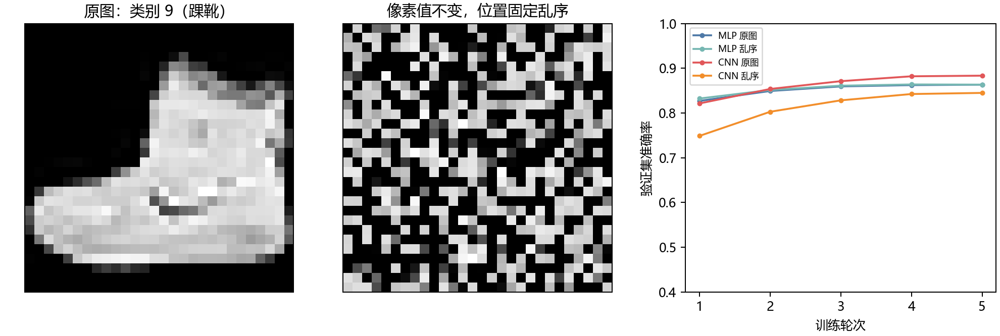

# 第十三章　同一种局部形状，为何能在别处认出

第十二章讨论怎样在有限次数里挑选下一套设置。可是，即使设置选得很聪明，学习器仍要面对输入本身的形状。一张 28×28 的灰度图有 784 个亮度值。若把它们当成 784 个互不相干的栏目，鞋边缘出现在左下角和右下角，程序就得分别学两套关系吗？我们能否让一段在某处有用的局部计算，到了另一处仍然有用？

这便是本章要研究的**卷积神经网络**（CNN）为什么在图像上值得试。它不依靠第十二章黑箱方法替模型找到一组神奇超参数，而是先规定一种可学习的计算组织：近处的像素先合起来，同一组局部权重在不同位置重复使用，再把较局部的结果交给后面的层。我们会先用一张七格见方的小图逐项算清，再让随机初始化的网络在这台电脑上学真实服饰图片。后者仍只是十类分类，不会因为输入是照片就自动会描述场景或回答图文问题。

## 把图像摊平，会丢失什么已知关系

本章用的是 Zalando 发布的 Fashion-MNIST：每张图片有 28 行、28 列灰度像素，以及十类服饰中的一个类别编号。[原项目说明与数据下载](https://github.com/zalandoresearch/fashion-mnist/blob/master/README.md)和[2017 年数据论文](https://arxiv.org/abs/1708.07747)给出 60,000 张官方训练图和 10,000 张官方测试图。图中这个具体例子在固定训练划分里，原标签编号 9，意为踝靴；它不是作者画出来的两像素玩具。每个像素在原包中是 0 到 255 的整数，程序除以 255 后再交给模型。标签告诉模型整张图该分到哪一类，并**没有**逐个圈出“鞋底”“鞋面”应在哪些位置。

左边的灰度图让人能看到靴子的轮廓，中间那张却像散落的亮点。两张图有**完全相同的 784 个亮度值**；我们只用一个预先固定的排列，把原位置的像素搬到了新位置，所有图都按同一排列搬。若保留这份排列，信息在数学上可以搬回去，并未被删掉。但局部相邻关系变了：原来相邻的鞋边可能被分到相距很远的位置。这个改变恰好帮助我们问“网络是否在利用邻域”，不能把乱序图写成新采集的真实照片。

上一章的简单外层目标容许我们挑选学习率，却不会告诉网络哪些输入位置应该合用一套规则。最直接的一层全连接网络把 784 数摊成向量 \(x\)，算 \(h=\operatorname{ReLU}(Wx+b)\)，每个隐藏单元对每个像素都有自己的系数。这里的 ReLU 只是逐项取 \(\max(0,z)\)，让负的活动变零、正的保留；前三章已经见过非线性中间表示的必要性。本章实际的全连接模型用 128 个隐藏单元，因此第一层有 \(784\times128+128=100480\) 个可训练数，后接十类输出一共 101770 个。它**能够**学图像，并非被我们安排成注定失败；只是同一局部形状在两个位置出现时，第一层没有明写“这两处应该使用同一套探测权重”。

## 局部和层级，最初要回答的是另一个问题

局部位置为何值得认真对待，并不是 2012 年大规模视觉网络成名后才补出的解释。Hubel 与 Wiesel 在 1962 年研究猫的视觉皮层，逐个考察细胞对视野里不同位置、方向的光刺激怎样反应；“感受野”在这类实验里指会影响一个细胞反应的输入范围。这是生理观测，不是一份训练 CNN 的算法说明。它给后来的建模者一个值得试的线索：视觉处理也许可以先看局部、再把较复杂的反应逐层组成；不能因为有这条线索就说大脑严格按下文的 PyTorch 矩阵公式计算。([Hubel 与 Wiesel，1962，原论文](https://pmc.ncbi.nlm.nih.gov/articles/PMC1359523/))

第三章曾把 1980 年的 Fukushima 放在多层网络仍有不同研究路线的历史位置，这里回到他实际研究的视觉问题：同一图案挪了位置，早先的识别装置可能当成另一个图案；若图案稍变形，事先精确对齐又不容易。他提出 neocognitron，用多级局部细胞平面处理图案，让同类局部反应在不同位置出现，后级逐步容纳位置变化。他明确说网络靠重复呈现图案**无教师地自组织**，不需要为每张图提供我们今天训练分类器用的十类正确答案。论文也把视觉生理层级当作启发和有待修正的假说。这里有一个真实的方法分岔：局部、重复、层级这几种结构想法已经有了，**参数靠什么反馈学到**却仍可走不同路线。([Fukushima，1980，摘要及§1—2](https://www.cs.princeton.edu/courses/archive/spr08/cos598B/Readings/Fukushima1980.pdf))

## 一张小权重表怎样扫描一张图

先别让“卷积”二字替代计算。给一张单通道图 \(X\) 和一张 3×3 的小权重表 \(K\)。把表的左上角放到图中某个位置 \((i,j)\)，九对数逐项相乘再相加，加一个偏置 \(b\)，得到一个输出：

\[
Y_{i,j}=b+\sum_{a=0}^{2}\sum_{d=0}^{2}K_{a,d}X_{i+a,j+d}.
\]

把同一张 \(K\) 向右、向下移动，重复九项乘加，便得到一张输出图。输出图上的 \((i,j)\) 只看输入图那块 3×3 邻域，所以那块邻域就是**这个输出位置的感受野**；整张输出叫一张**特征图**。若图有 7×7 格、窗口 3×3、每次走一格且不补边，左上角能停在 0 到 4 的五种行位置和五种列位置，输出便是 5×5。我们故意选一张带竖边和横边的七格小图，在[本机逐格记录](../results/spatial_filter_probe.json)里保存了全部输入、权重和 25 个输出，程序还逐项与 PyTorch 的结果核对。

这个式子严格说是**互相关**：\(K\) 按表中原来的上下左右方向与输入相乘，没有先翻转 180 度。数学教科书里的离散卷积常先把核翻转；PyTorch 的 Conv2d 接口虽叫 convolution，官方文档写出的实际运算也是互相关。训练时权重可自由调整，换一套翻转后的初始表示仍能表达同类局部线性规则；但核对某个固定表的手算输出时，这个方向不能含糊。([PyTorch Conv2d 官方说明](https://docs.pytorch.org/docs/main/generated/torch.nn.Conv2d.html))

## 为什么 25 个位置可以共用九个权重

若 5×5 个输出位置各有自己的 3×3 表及偏置，就要 \(25(9+1)=250\) 个独立数。让它们共用一张 \(K\) 和一个 \(b\)，便只有 \(9+1=10\) 个；这叫**权重共享**。它不是把 25 次乘加省成一次：仍要在 25 个位置计算，省下的是需要从数据决定的独立权重。该选择把一句可检验的假设写进结构——同一种局部形状，不论出现在图的哪里，都值得先用同一套探测办法试。假设若不适合数据，比如图的上方和下方在任务中必须按完全不同的局部规律处理，共享就会成为限制，而不只是效率奖励。

共享也改变学习时的梯度来源。设最终损失为 \(L\)，同一个 \(K_{a,d}\) 在很多输出位置被使用；链式法则要求把这些使用处送来的贡献相加：

\[
\frac{\partial L}{\partial K_{a,d}}
=\sum_{i,j}\frac{\partial L}{\partial Y_{i,j}}X_{i+a,j+d}.
\]

只看两处输出，若把它们直接相加作为检查目标，两个输出对 \(K\) 的导数就恰好是两块输入窗口逐格相加。[探针源码](../code/spatial_filter_probe.py)手算这项，再让 PyTorch 反传；九个梯度实际为

\[
\begin{pmatrix}
1&1.5&0\\
1&1&0.5\\
1&2&1
\end{pmatrix},
\]

与两块窗口的和逐项一致。真实服饰分类时，每个 \(\partial L/\partial Y_{i,j}\) 不再都等于 1，而是由十类输出的误差经后面各层传回来；**不同位置共同改变同一权重**这件事没有变。你已在第三、四章见过反传怎样分配末端误差，这里只是把“同一参数被反复用到”加入那条链。

## 图案挪一格，输出是“跟着挪”还是“不再改变”

如果同一张 \(K\) 在每个位置扫描，图里的形状向右下各移一格，输出中的相应反应也应向右下各移一格。只要所比较的窗口仍完整落在图内，把位移后的输入代入上一式即可看到：位移后位置 \((i+1,j+1)\) 读到的九项，恰是位移前位置 \((i,j)\) 读到的九项，权重又完全相同。这种“输入怎样移，输出也按同样办法移”的关系叫**平移等变**。它没有让特征图的数值矩阵保持原样；反应的位置也变了。

小图程序把原图右下各移一格、空出来的行列补零，只在两张 5×5 输出图的重叠内部比较，得到最大差 \(0\)。图的边缘有些原来的窗口已经跑出画面，那里不能套用刚才的等式。[小图与两张响应图](../figures/spatial_filter_probe.png)可把位置对应逐格看出来。实际网络又会做补边、两格一次的池化和末端全连接；这些操作未必保持“一格输入移动、一格特征图移动”的严格关系。

让最终**类别**在形状挪了位置后仍相同，叫**平移不变**；它比刚才“特征图跟着移动”多一步。一个常见选择是把邻近一块的响应压成一个数，例如本章每个 2×2 块取最大值，叫最大池化。一个局部高响应在同一池化块里稍挪，最大值可能不变；若跨过块的边界，输出又可能改变。训练过的后续层也可能学会容忍某些移动，绝非单层共享权重自动保证整套分类器对任意移动不变。我们稍后会直接在本机已留出的图上改位置，看看这个限制有多实在。

## 多张特征图怎样接成真正的网络

一张小表只会算一种局部组合。若要同时让不同表试着响应不同局部形状，便用多个**输出通道**：第一层的 16 张 3×3 表各扫描同一张灰度输入，得到 16 张特征图。下一层的一张输出表不再只看一张输入图，而是对 16 张特征图各有一张 3×3 表，同一空间位置上的 16 份局部乘加再相加。若 \(c\) 是输入通道、\(o\) 是输出通道，完整式子为

\[
Y_{o,i,j}=b_o+
\sum_{c=1}^{C_{\rm in}}\sum_{a=0}^{k_h-1}\sum_{d=0}^{k_w-1}
K_{o,c,a,d}X_{c,i+a,j+d}.
\]

参数张量的轴依次是 \((C_{\rm out},C_{\rm in},k_h,k_w)\)，所以这一层待学的数为 \(C_{\rm out}C_{\rm in}k_hk_w+C_{\rm out}\)。在给定通道数与核大小后，它不随输入图的高宽增加；需要执行的乘加次数却会随输出位置增加。批量训练再在最前面加一个“这批第几张图”的轴，因而程序输入是 \((N,C,H,W)\)。卷积先给每张图、每个输出通道、一张仍有空间位置的特征图；绝不是把 60,000 张图和 16 张特征图混成同一轴。([PyTorch Conv2d 的轴约定](https://docs.pytorch.org/docs/main/generated/torch.nn.Conv2d.html))

本机分类器依次做 3×3 卷积、ReLU、2×2 池化，再做一轮同样的卷积与池化。每层看得到的原图范围逐步变大：第一个卷积位置看 3×3；一次池化合四个相邻位置，最多涉及 4×4；第二个 3×3 卷积在前层相隔两格的活动上工作，单个位置最多涉及原图约 8×8；再池化后约为 10×10。边缘补零处有一部分范围落在画面外，不能都算作真实像素。随后把 32 张 7×7 特征图摊平交给 64 个隐藏单元与十类输出，使末端能合用图上多处线索。前面学过的“局部可以改变活动”、此处“同一局部权重可反复使用”，以及末端“跨位置合成整图判断”，各接一项不同职责。

这个实际网络的第一层有 \(16(3\times3+1)=160\) 个可训练数，第二个卷积层有 \(32(16\times3\times3+1)=4640\) 个。摊平后的连接也要付账，整网为 **105866** 个可训练数，和本章全连接对照的 **101770** 个处在同一量级。因而若后者在实验中有差异，我们不能只说“卷积赢是因为总参数少”；本机设计没有让它总参数少。差别在于一部分参数怎样受空间几何约束、怎样在各位置复用，同时还混有层数、池化和末端连接的区别。

## 相似的局部结构，后来有了不同的学习信号

1986 年反向传播的路线给多层可微网络一条分配末端误差的方法；本书第三、四章已经在小网络和 PyTorch 中把这条计算走过。到 1989 年，LeCun、Boser、Denker、Henderson、Howard、Hubbard 和 Jackel 面对美国邮政中分离出的手写数字。他们不想为每一种笔画位置各写一套特征工程，也不能忽略邮编数字会轻微移位；于是把局部连接、各位置共享权重和局部平均／降采样放进结构，让从**归一化图片到数字类别**的网络由带标签实例通过反向传播训练。论文明确指出，这种层级局部结构使人想到 Fukushima 先前的工作，但学习机制的重要区别正是监督反传与无教师自组织。1980 年的研究不是被宣判“失败”后才有 1989 年；两组作者在不同问题和反馈条件下做出相邻的结构选择。([LeCun 等，1989，§1—3](https://proceedings.neurips.cc/paper/1989/file/53c3bce66e43be4f209556518c2fcb54-Paper.pdf))

十年左右后，LeCun、Bottou、Bengio 和 Haffner 的 1998 年论文回顾文档识别：局部感受野、共享权重、空间降采样仍在，但真正读一张支票还涉及字段定位、切分、识别与语言约束等部分，并不因为十类数字分类器不错就自动接成可靠的整单读取系统。他们的 LeNet-5 使用的降采样细节也与本章 PyTorch 的最大池化不完全相同；我们借的是可检验的建筑关系，**没有复现当时硬件或系统成绩**。这段历史提醒我们，图像表示如何学与整个应用如何运行，是相连却不能互相抵扣的工作。([LeCun 等，1998，摘要、§II-A](https://gwern.net/doc/ai/nn/cnn/1998-lecun.pdf))

## 2012 年的大变化，卷积本身并非新发明

若时间直接从 1998 年跳到后来深视觉成绩，只说“网络变大”仍会漏掉条件。2009 年 ImageNet 数据建设与随后从 2010 年起的大型识别挑战，把大量图像、类别标注、训练／评价划分和共同任务交给研究者；它们也让模型需要面对比归一化邮编数字复杂得多的变化。2012 年 Krizhevsky、Sutskever 和 Hinton 的卷积网络在这类百万量级、千类任务上取得重要成绩。论文同时写了多层卷积、ReLU 这类让正分数不饱和的激活、高效 GPU 实现和防止拟合训练图的办法；不是把 1989 年同一模型原封不动搬上新数据，也不是 2012 年才发明局部权重共享。([ImageNet／ILSVRC 原项目](https://www.image-net.org/challenges/LSVRC/)；[Krizhevsky 等，2012，原论文](https://papers.nips.cc/paper_files/paper/2012/hash/c399862d3b9d6b76c8436e924a68c45b-Abstract.html))

规模变大后又显出新的问题：已有局部结构并不保证加很多层就容易训练。He、Zhang、Ren 和 Sun 在 2015 年比较同深度的普通网络与带**捷径连接**的网络，让若干层学习对输入 \(x\) 的补充 \(F(x)\)，输出写成 \(x+F(x)\)。他们以训练误差和识别成绩检查这项改动，而不是用“层数越多必更好”作保证。本章的两层卷积没有这条捷径，也没有进行残差网络对照；这里先把它放在真实进展中的位置：空间结构解决一部分自由度，数据、计算与深网优化又各有自己的责任。([He 等，2015，§3.2 及控制比较](https://arxiv.org/abs/1512.03385))

## 真正喂给本机网络的图从哪里来

Fashion-MNIST 是 2017 年公开的**商品服饰灰度图分类基准**，比本章早期手算小图有真实图像来源，却仍与自然街景、框出物体的位置或给图片配一句话相距很远。官方已有训练 60,000、测试 10,000；[准备程序](../code/prepare_fashion_mnist.py)从原项目取四个压缩包，对照官方 MD5，再核 IDX 文件标头、每张 28×28、每类数量和全部字节长度。下载的原包、实际 SHA-256 与原项目许可陈述保存在[数据来源记录](../data/fashion_mnist/SOURCE.md)。把像素除以 255 只是统一数值范围，没有按测试资料拟合任何均值。

要在训练过程中决定“练到哪一轮算合适”，又不能偷看官方测试，我们从官方训练部分**每类固定取 1,000 张**作验证，共 10,000；余下 50,000 作参数更新。每个模型都用同一批原行号。十类标签只进入十类交叉熵，不提供像素级答案。固定乱序条件用一份 784 位置的双射，在每张训练、验证和测试图上做相同重排；它的身份与真实行号都存入[本地划分文件](../data/fashion_mnist/chapter_split.npz)。官方测试没有用于定这份排列，也没有参与挑训练轮数。

## 从整张图的标签到一张局部权重表

对一批有类别 \(y\in\{0,\ldots,9\}\) 的图，网络末端给十个实数 \(s_0,\ldots,s_9\)。它们只是**分数**，可正可负，也不会自己加成一。第五章讲的是“已经报出概率以后，怎样给实际发生的类别记负对数损失”；当时并没有教任意十个网络分数如何变成一份概率。现在这一步第一次需要承担训练责任，必须自己建立。

一种可微的选择是先把每个分数变成正权重 \(e^{s_c}\)，再除以十项总和：

\[
q_c(s)=\frac{e^{s_c}}{\sum_{j=0}^{9}e^{s_j}},\qquad c=0,\ldots,9.
\]

这十项都为正且和为一；两类的比值 \(q_c/q_d=e^{s_c-s_d}\) 只看分数差。给全部分数同时加一个常数，概率因此不变。这种归一化称为 **softmax**，是我们在此选择的分数到概率接口，并非“十类任务只有它能用”。数值程序会先从每个分数减去本行最大值，再做指数：共同平移不改 \(q\)，却可避免大的 \(e^{s_c}\) 溢出。

训练标签只告诉我们这一张图的正确类编号 \(y\)。照第五章的选择，对事前报给实际类的概率取负对数，每张图的训练损失是

\[
\ell(s,y)=-\log q_y(s)
=-s_y+\log\sum_{c=0}^{9}e^{s_c}.
\]

它的调整方向也能从这行式子而不是从库名猜出来。对第 \(j\) 个分数求导，\(-s_y\) 只在 \(j=y\) 时给 \(-1\)；对数总和那一项给 \(e^{s_j}/\sum_c e^{s_c}=q_j\)。因此

\[
\frac{\partial\ell}{\partial s_j}=q_j-\mathbf1_{\{j=y\}}.
\]

正确类的导数为 \(q_y-1\le0\)，沿负梯度会抬高它的分数；其他类各得到正导数，会相对压低。十项导数相加为 \(\sum_jq_j-1=0\)，恰与“所有分数一起平移不改概率”对应。这还不要求某个 3×3 窗口有一个人手给定的“鞋边缘”目标：一批 256 张图的损失取平均后，反向传播才从十个分数经过末端连接、池化与两层卷积，把贡献送到同一张局部权重表的所有使用位置。前面推过的共享梯度求和就在这条更长的计算链里工作。

先用三类小数核对这项十类通用关系：分数 \((2,1,0)\)，正确类为第 0 类时，概率约 \((0.665241,0.244728,0.090031)\)，损失约 0.407606，三个分数的导数约 \((-0.334759,0.244728,0.090031)\)。[短程序](../code/categorical_loss_probe.py)把手算与 PyTorch 自动求导逐项对照，还给三个分数都加 1000，确认概率与损失不变。你可以先预测若把正确类改为第 2 类，哪一项导数会变负，再运行自己的修改。PyTorch 的 `CrossEntropyLoss` 直接接收未归一化的 **logits**（这十个分数）和类别索引；它在内部以数值稳定的方式处理归一化与负对数，代码不应先取最大类号再拿那项离散判断求梯度。([PyTorch 2.11 交叉熵接口](https://docs.pytorch.org/docs/2.11/generated/torch.nn.CrossEntropyLoss.html))

四个条件都从随机初值起步，训练五个完整轮次、每批 256 张，优化器为 Adam，学习率固定 0.001。它仍使用反传得到的梯度 \(g_t\)，只是改参数时不直接使用第四章那条固定倍率的 \(g_t\)：对每项参数，它维护先前梯度的加权平均 \(m_t\) 与梯度平方的加权平均 \(v_t\)，并用二者调整这一步的大小。设初值为零，PyTorch 的默认系数为 \(\beta_1=0.9,\beta_2=0.999,\epsilon=10^{-8}\)，主要计算是

\[
\begin{aligned}
m_t&=\beta_1m_{t-1}+(1-\beta_1)g_t,\qquad
v_t=\beta_2v_{t-1}+(1-\beta_2)g_t^2,\\
\theta_t&=\theta_{t-1}
-0.001\,\frac{m_t/(1-\beta_1^t)}
{\sqrt{v_t/(1-\beta_2^t)}+\epsilon}.
\end{aligned}
\]

平方和除法在每个参数分量上各自执行；分母让近期梯度平方较大的分量按较小尺度迈步，前两个分母修正从零启动时平均值偏小的影响。它并不保证每个批次、每个参数都使总体损失下降；这里选它作四臂共同的更新办法，**不是宣称它胜过所有可选优化器**。真正改变参数的是优化器的 step，调用 backward 只算并累积梯度。([Adam 原论文](https://arxiv.org/abs/1412.6980)；[PyTorch 当前接口默认值](https://docs.pytorch.org/docs/main/generated/torch.optim.adam.Adam_class.html))

## 四组对照在改什么、没有改什么

四组为全连接原图、全连接乱序图、卷积原图、卷积乱序图。图片、标签、训练／验证／测试行数、五轮、批量、学习率和训练数据洗牌次序相同；前两组各有 101770 个参数，后两组各有 105866 个。**模型结构本身**仍不同：两组卷积网络比全连接对照多了局部层、池化和另一个隐藏计算，不能把任何成绩差全部归于“共享”一个按钮。像素乱序也只检验这一固定排列，不能证明任意自然照片上的结论。

全连接模型为什么值得做乱序对照？让 \(P\) 表示那份固定排列，把原向量 \(x\) 改成 \(Px\)。如果原模型第一层是 \(Wx+b\)，新模型只要把第一层权重改为 \(WP^{-1}\)，便有 \((WP^{-1})(Px)+b=Wx+b\)。所以在**可表示的函数集合**上，全连接第一层不会因为固定像素排列而失去信息；其训练过程却不保证每一次初始化和梯度顺序给完全相同的成绩。卷积若仍把被乱排后的“相邻三格”当成原图局部块，它的 3×3 表看见的是被抽来的远处像素，先前那条空间假设就不合适了。数学上两种结构的区别在这里先于成绩出现。

训练程序先按验证交叉熵选每一组的轮次，并保存权重，再统一打开官方测试。它还保存十类混淆表和 10,000 行测试预测，而不是只留一个漂亮百分数。可以在[完整运行记录](../results/fashion_spatial_training.json)里从类别编号查到每类错在何处；[四组测试逐行预测](../results/fashion_test_predictions.csv)给出真正能核查的行号。下面报告的是这台电脑上、这一种随机种子、这四个固定结构的**一次实验**。

## 实验告诉我们什么，也没有告诉什么

这次四组都由**第五轮**取得最低验证交叉熵，故在最后一轮的权重上各做一次官方测试。表中的测试准确率是 10,000 张官方测试图里答对的比例；“右下移两格”是对原图两组模型额外做的诊断，图外位置填零、边上信息可能被裁掉，未拿来选择轮次。

| 输入与网络 | 参数数 | 第五轮验证准确率 | 官方测试准确率 | 右下移两格后的测试准确率 |
|---|---:|---:|---:|---:|
| 全连接，原图 | 101770 | 86.33% | 85.41% | 42.08% |
| 全连接，固定乱序 | 101770 | 86.34% | 85.56% | — |
| 卷积，原图 | 105866 | 88.34% | 87.79% | 58.15% |
| 卷积，固定乱序 | 105866 | 84.49% | 83.86% | — |

全连接在原图和固定乱序图上的测试数很接近，与上面的重排等式相容；这不证明训练算法对任意乱序都严格等价。卷积原图比本机全连接原图高 **2.38 个百分点**，而同一卷积结构遇到固定乱序下降 **3.93 个百分点**。这些数支持一个较具体的解释：在这份服饰图和五轮训练里，卷积结构利用了原图的局部邻域，乱序打坏了它所偏好的邻域关系。一次随机种子、两套不完全配平的结构和五轮训练，都不够把这 3.93 点宣称为“共享参数的纯因果效应”，也不够给所有图像任务排方法总榜。

位置改变的结果同样不容我们夸大“位置不变”。原图上的卷积模型在官方测试为 87.79%，右下零填充移两格后只有 58.15%；全连接模型从 85.41% 降到 42.08%。卷积模型在这项变化下保留了更多正确答案，但远非“一移动还完全一样”。这里既有模型真正的位置敏感性，又有固定 28×28 边界对原图的裁切，不能只用准确率差把两种影响精确分开。上一节数学保证的只是**单次有效互相关在重叠内部的等变关系**；它从未保证本章带补边、两次池化、末端全连接的分类器严格不变。

若把十类平均数拆开，差别也更具体。原图卷积模型在官方测试对“衬衫”（编号 6）只答对 645/1000，145 张衬衫被报成“T 恤／上衣”（编号 0）；对“外套”（编号 4）答对 723/1000，其中 135 张被报成“套衫”（编号 2）。这不是网络已掌握服装语义后偶尔手滑，而是在这些类别的灰度轮廓与训练信息下仍有大块混淆。图是商品图片、分辨率只有 28×28，不能拿这次十类得分为现实街景检测、图像问答或图像生成颁证。

## 从原始字节到保存的权重，亲手接一遍

在项目根目录的 PowerShell 终端依次运行：

~~~powershell
$env:PYTHONUTF8='1'
python work/code/categorical_loss_probe.py
python work/code/prepare_fashion_mnist.py
python work/code/spatial_filter_probe.py
python work/code/fashion_spatial_training.py
~~~

第一条只核三类分数怎样得到概率、损失和导数，不读服饰数据；第二条从原项目下载或核对四个原包，检查 IDX 格式并保存分组行号与像素排列；第三条计算七格小图，核对手算、PyTorch 互相关、有效内域位移和共享权重梯度；第四条才加载 50,000 张训练图、用标签更新模型，逐轮在 10,000 张验证图上记录损失，选好权重后评价官方测试。若原包已经在[数据目录](../data/fashion_mnist/SOURCE.md)，准备程序会先核 MD5 而非重新下载。四个保存的权重文件都在 work/results/，运行记录中有路径、SHA-256 和所选轮次；重新载入后在验证图上的分数与保存前逐项相同。

训练代码的图像张量轴为 \((N,1,28,28)\)；固定置换先把后两轴临时摊成 784 项，同一索引表取出后再变回 \((N,1,28,28)\)。若误把“每张图”当成“每个通道”，网络仍可能得到四维张量，却已在计算另一件事。每批的十类 logits 和类别索引进入交叉熵；zero_grad 清上轮梯度，backward 沿已做的所有局部乘加与末端连接求导，step 才改权重。这段接口与第四章训练循环相连，增加的是图像轴和共享参数的实际含义，而不是突然换一套不解释的训练魔法。

本机使用 Python 3.13、PyTorch 2.11.0+cu128 和 RTX 5090 Laptop GPU。四臂五轮的训练阶段各约 1.2—2.0 秒，运行中 PyTorch 记录的峰值已分配 CUDA 内存约 441—483 MiB；这些数包含当时驻留在显存里的图像张量，不包含下载、全部机器功耗，也不等于某个更深网络在另一台电脑上的成本。程序在没有 CUDA 时也会选 CPU，但时间应重新测，不继承本机 GPU 读数。此处只是一个可运行、可检查的起点，绝不是第 2012 年 ImageNet 百万图训练的缩小同义词。

## 离开这些服饰图片，留下的是什么

从整图类别反馈走回一张小权重表，我们看到“会看图”至少有两份不同工作：结构先说哪些输入值得共用规则，训练再用真实图与正确类别改变那些共同权重。局部窗口省掉逐位置独立拟合，逐层组合扩大能用的原图范围；它既给网络一种有用的偏向，也在像素排列没有空间意义时成为负担。小图的位移等式说明一个算子确实等变，本机服饰移位得分则提醒我们整套分类器还未被证明不变。

这章训练的是十类服饰分类器，数据与标签身份、模型权重、损失、验证选择、测试误判均可回查。它还没有回答一段长度可变的声音或文字怎样反复使用同一计算：图像上“向右移动一个窗口”有平面邻域，时间上新输入到来时却还需决定保存哪些过去信息。下一章将从那个新的需要进入序列模型，不把图像核的平移当成已经解决了记忆。

## 自己核对两种“同一”，再改一项条件

1. 七格见方的小图用 3×3 表、步幅一、不补边，输出有多少位置？若每个位置独立有九个权重和一个偏置，需要多少可调数；共享后又是多少？这个节省改变了乘加次数吗？
2. 只取小图程序中输出 \((1,1)\) 与 \((2,2)\) 的和作损失。写出对同一个 \(K_{a,d}\) 的导数，再看[本机探针结果](../results/spatial_filter_probe.json)中的九项梯度。为什么不能只选其中一块窗口的贡献？
3. 假设一维图片向量先被固定双射 \(P\) 乱排，原全连接第一层为 \(Wx+b\)。给出乱排后的新第一层，使两者对每张原图都算出相同活动。这里证明的是可表达的关系，还是本机 Adam 五轮一定得到相同权重？
4. 不运行代码，先判断把 28×28 图右下各移两格、空处补零后，本章 CNN 的类别会否**严格不变**。运行并观察表中数字后，分别指出哪些操作可能破坏单层互相关的位移等式，哪些原始信息可能因裁边而消失。
5. 按网络顺序算一个最后卷积／池化位置大约能见到原图多大的范围。若把第二次池化删去，末端摊平维度、参数数与位置变化的作用各会怎样变？不能只改图中的“7×7”标签而不改代码的 Linear 输入维度。

**核对。**第一题输出 \(5\times5=25\) 处，独立时 \(25(9+1)=250\)，共享时 \(9+1=10\)；二者每张图仍做 25 个位置的局部乘加。第二题是两块窗口同一相对位置的像素之和，因同一 \(K_{a,d}\) 在两处都参与了目标；探针实际九项如正文矩阵。第三题第一层取 \(W'=WP^{-1}\)，因 \(W'(Px)+b=Wx+b\)；这不保证优化轨迹相同。第四题没有严格不变保证：边界补值、固定池化分块、摊平后的末端位置权重都会影响结果，零填充移位还可能裁掉原图边缘。第五题按本章步幅顺次算，感受范围约为 \(3\to4\to8\to10\) 格；若去掉第二池化，末端图从 7×7 变成 14×14，第一层全连接权重随之从 \(32\cdot7\cdot7\cdot64\) 变为 \(32\cdot14\cdot14\cdot64\)，近邻压缩与位移响应也变，须重新训练和检验。
