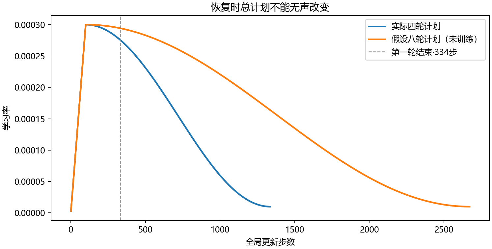

# 第十九章　从随机权重训练到真实生成

第十八章末，第一篇 WikiText 文章已经走过了整条路：标题和正文从可查的源行进入分词器，变成以 BOS 开头、以 EOS 收尾的片段序列，再切成只能读左边的训练块。第一块的输入从 `[1, 303, 7849, …]` 开始，答案从 `[303, 7849, 3724, …]` 开始。我们还让随机模型在这批文字上算过一次梯度。但一次梯度只是说“这些参数若稍稍变化，当前错误会怎样变化”；它没有把变化留下，也没有回答看完更多文章以后，模型是否真的学到了可转用于新文章的东西。

这次要让同一条计算持续工作。模型从随机权重起步，依次看训练文章的块，算损失、求梯度、更新参数；走到轮末，把当时的模型拿去读未参与更新的验证文章。中途真的停一次、从磁盘恢复，再继续到事先约定的终点。最后才打开留出的测试文章，并且让模型**自己接续文字**，不在每一步递给它参考答案。在具体问答或写代码的教学之前，先用大量原文预测右邻片段，这种工作通常叫**生成式预训练**；这里完成的是一个来源明确、规模很小但从头运行的版本。把这些环节连起来，才有资格讨论“训练过一个语言模型”究竟意味着什么。

## 结构定下来以后，历史上还要解决什么

上一章的数据史已经走到 2020 年；现在沿**训练方法**这条并行的线回到 2014 年。这样的回看是为了回答眼前的计算问题，并不是说后来的人退回过去重造一次语料。第十五章曾见到“一条文字就给下一词答案”，第四章则让 PyTorch 在一个已经懂的计算里求导、更新、保存。两者接上时会遇到新难点：几百万个目标不可能每改一次参数就全算一遍；小批文字的梯度又会随抽到的文章而摇摆。一步的导数正确，并不保证上千步后数值与泛化都会好。

Kingma 和 Ba 在 2014 年提出、于 2015 年发表的 **Adam**，正面处理这种有噪声的小批次梯度。它不只记本步方向，还为每个参数坐标保存梯度与梯度平方的移动平均，并修正“最初从零开始”的偏差。这样做的价值不在于替模型理解一句话，而在于让大小不同、出现频率不同的坐标更新有一套可重复的规则。它是多种可行优化方法之一，原论文也没有声称给所有模型一个唯一最优步长。([Adam，Algorithm 1、§2](https://arxiv.org/pdf/1412.6980))

2017 年的 Transformer 把序列位置间的信息交换改成上章见过的多头读取，但论文不只是画出了 Q、K、V：它报告了用 Adam 训练、前 **4000** 步逐步提高学习率、随后按步数平方根的倒数降低，还使用了 dropout。这些选择让一个结构成为当时翻译任务中可训练、可比较的系统。同年晚些时候公开的 AdamW 预印本则把“压小权重”从 Adam 自适应梯度中分开，指出在 Adam 里直接往损失加平方罚项，和单独衰减权重不是同一更新。([Transformer，§5.3—5.4](https://papers.nips.cc/paper_files/paper/2017/file/3f5ee243547dee91fbd053c1c4a845aa-Paper.pdf)；[AdamW，§2](https://arxiv.org/pdf/1711.05101))

2018 年的生成式预训练把这条训练线带到大段连续书本文字。Radford 等人公开的模型是十二层、宽 768、上下文 512 的单向 Transformer；论文报告用 Adam，前 2000 步升率、随后余弦下降，并在其资料与抽样方式下训练 100 轮。那不是我们的规模，也不意味着“100 轮”是所有语料的正确答案：一轮多大、同样文字重见多少次、什么时候开始记住而不泛化，必须连数据一起看。我们沿用的是第十七章已经解释的读取、残差和位置关系，另在第十八章固定的小资料上做可完整核验的本机训练。([2018 生成式预训练，§3.1、§4.1](https://cdn.openai.com/research-covers/language-unsupervised/language_understanding_paper.pdf))

## 这台电脑究竟在改哪些数

实际模型只有**四层**遮住未来的自身读取；它没有翻译模型那条“译文读英文”的跨句通道。每层有四个读取头，表示宽 192，逐位置前馈层中间宽 768；128 是一次允许读取的最多位置数。词表沿用上一章仅在训练文章上拟合的 8192 项字节级 BPE。位置采用第十七章讲过的正弦、余弦向量，子层仍按原版的“残差相加后归一”次序。这个选择让读者能把新训练与旧结构逐处对上；它不冒充 2018 模型的层数、宽度、激活函数或语料。([完整模型与训练程序](../code/train_causal_wikitext.py))

模型拿到输入编号时，词嵌入先把每个编号变成 192 维可训练向量；固定的位置向量告诉它这一块中的先后。四层里，每个真实位置经 Q、K、V 只取回自己及左边真实位置的信息，经过逐位置前馈变换和残差归一。末端线性层再把每个位置的 192 维表示变成 **8192 个分数**，一项对应一种可能的下个片段。分数经 softmax 才成为条件概率。例如第一块的首输入只有 BOS；这一处要给目标编号 303 一个概率，而不是先偷看下一列的 303 再把它报出来。第十八章的因果与 PAD 遮罩在每层都生效。

参数数目也能由这些部件核对：输入嵌入有 \(8192\times192=1,572,864\) 项；末端输出权重与偏置有 \(192\times8192+8192=1,581,056\) 项。每层四个宽 192 的读取矩阵、两次前馈线性变换和两处归一参数，合计 **444,096** 项，四层共 **1,776,384**。相加得 **4,930,304** 项。分词器的合并表来自训练文字，不是另一份已训练好的语言模型权重；模型的这些参数用固定种子从随机初值生成，再由当前资料改变。参数量是存储和计算规模的说明，不是智力分数。

## 一处“猜错”怎样触到整座网络

把某个真实位置的正确片段记作 \(y\)，模型末端给第 \(j\) 项的分数记作 \(z_j\)。softmax 给它的概率是 \(p_j=e^{z_j}/\sum_k e^{z_k}\)，这一处的损失是 \(-\log p_y\)。概率分给正确项越少，损失越大。若全部 8192 项恰好等概率，这一项损失是 \(\ln8192\approx9.01\)；我们随机初值在首两个真实满块的 256 个目标上平均约 **9.162**，稍高于均匀值，并不奇怪：随机分数不是整齐划一的概率。

这一式还能说明为什么“只改最后一层”不足以代表训练。对任一输出分数求导，有

\[
\frac{\partial(-\log p_y)}{\partial z_j}=p_j-\mathbf 1[j=y].
\]

正确项收到 \(p_y-1\)，其他项收到各自的 \(p_j\)。误差从末端线性层传回当前位置的表示；表示又由前馈、残差以及四层读取组成。第十七章逐项算过一次读取的查询、键、值怎样分到梯度，所以这里的反向传播并非神秘地“告诉模型答案”：它沿已经执行的运算，把这个具体错误对各参数的影响累加。若某列在因果遮罩中不允许读到，它不会通过那条读取边得到当前目标的梯度。

第十八章已说明：尾块的 PAD 标签是 −100，不能当成第 8193 种正确片段，也不能进入损失分母。对一个有 \(N_B\) 个真实目标的小批次 \(B\)，程序计算

\[
L_B(\theta)=\frac{1}{N_B}
\sum_{(i,t)\in B,\;y_{it}\ne-100}
\bigl[-\log P_\theta(y_{it}\mid x_{i,\le t})\bigr],
\qquad
N_B=\sum_{(i,t)\in B}\mathbf 1[y_{it}\ne-100].
\]

程序先用 `reduction="sum"` 得到分子，再用 `(labels != -100).sum()` 作分母。平均对象是**真目标位置**，不是 64 篇文章，更不是一个 `64×128` 矩形的全部格子。每次 `backward()`只算并积累这批对参数的梯度；下一批前 `zero_grad(set_to_none=True)` 清掉旧梯度；随后 `optimizer.step()` 才真的改参数。第四章在十几项参数上分开过这三个动作；现在它们承担的是同一类责任，只是参数和资料都变多了。

## 一轮文章，与一步小批，不是同一个平均

训练组有 600 篇，切成 **21,353** 个不跨篇的块，共 **2,695,132** 个真目标。每轮先用当轮固定随机种子打乱**块的顺序**，每批最多取 64 块，所以一轮有 **334** 次更新，最后一批只有 41 块。打乱并不把两个块的文字接起来：第十八章建立的文章边界和每块的因果遮罩仍在。四轮意味着每个既有训练块被处理四次，总共经历 **10,780,528 次目标呈现**，不是新发现了同数目的独立文字。

如果模型参数整个一轮都固定，把各批“损失总和”再按全轮目标总数除，才得到这组训练文字在**同一参数**下的逐目标 NLL。实际训练时，第 2 批看到的是已被第 1 批改过的参数；每步又按自己那批的真实目标数归一。因此日志中的“在线训练 NLL”是一路上许多不同模型的读数汇总，不能直接与轮末验证 NLL 当成同一参数的公平比较。程序另固定抽出 1024 个训练块，每轮结束让当时模型统一读它们；那条曲线可帮助观察训练状态，但也只代表这 1024 块。要讨论泛化，仍须看所有留出验证文章。

小批次数不只为了显存。假设两批各给出梯度 \(g_1(\theta)\) 与 \(g_2(\theta)\)：若一次性在同一 \(\theta\) 上平均，所得方向与先沿第一批更新到 \(\theta'\)、再计算 \(g_2(\theta')\) 不同。不同块顺序、批大小、损失分母都能改变训练轨迹。我们固定随机种子和顺序，是为了让今天的结果可追，而不是证明只有这个顺序会成功。

## 梯度已经有了，为什么还保存两份“过去”

设第 \(s\) 次更新前的参数为 \(\theta_{s-1}\)，这批的梯度为 \(g_s=\nabla_\theta L_{B_s}(\theta_{s-1})\)。最朴素的做法是用同一学习率 \(\eta_s\) 沿 \(-g_s\) 走一步。可是某个坐标这批方向强、下一批方向弱，另一个坐标只偶尔出现在少见片段的计算里；把每个刚到手的梯度当同等可靠，会让训练对抽样和尺度很敏感。Adam 保存

\[
m_s=\beta_1m_{s-1}+(1-\beta_1)g_s,\qquad
v_s=\beta_2v_{s-1}+(1-\beta_2)g_s^2.
\]

平方按坐标做。\(m_s\)保留最近一段梯度方向；\(v_s\)保留最近一段梯度平方的大小。初值都是零，因此第一步的 \(m_1=(1-\beta_1)g_1\)、\(v_1=(1-\beta_2)g_1^2\) 会被人为压小。除以 \(1-\beta_1^s\) 和 \(1-\beta_2^s\) 得到校正量 \(\hat m_s,\hat v_s\)，再逐坐标使用 \(\hat m_s/(\sqrt{\hat v_s}+\varepsilon)\)。第一步校正后恰有 \(\hat m_1=g_1,\hat v_1=g_1^2\)；这能让读者检查“偏差校正”不是一句魔法术语。我们的 β₁=0.9、β₂=0.95、ε=10⁻⁸，是本机计划的值，不冒充 Adam 原论文的全部默认设置。([Adam，Algorithm 1](https://arxiv.org/pdf/1412.6980))

程序用 **AdamW**，还让参数按当前步长独立衰减：忽略实现细节的一步可写为 \(\theta_s\approx(1-\eta_s\lambda)\theta_{s-1}-\eta_s\hat m_s/(\sqrt{\hat v_s}+\varepsilon)\)，这里 \(\lambda=0.01\)。前半项把已有参数稍稍朝零缩，后半项根据语言损失的梯度调整。本机把嵌入、矩阵、偏置和归一化参数都放在同一个优化器参数组，**都接受**这项衰减；这与一些研究只衰减矩阵权重的设置不同。若改为往 \(L_B\) 里加 \(\lambda\|\theta\|^2/2\)，罚项梯度会和语言梯度**一起进入** Adam 的平方平均，更新不再等同于刚才的独立衰减。选 AdamW 有方法史和数学上的理由，却没有本机 Adam 对照实验，所以不能把这次验证下降归功于“AdamW 一定胜过 Adam”。([AdamW，§2、Algorithm 2](https://arxiv.org/pdf/1711.05101))

## 让上千步能够走完

学习率不是一轮只选一个常数。这里先把**总计划**锁为四轮、1336 步：第 1 步用 \(3\times10^{-6}\)，到第 100 步线性升到 \(3\times10^{-4}\)；其后用余弦曲线平滑降到第 1336 步的 \(10^{-5}\)。把全局更新步数记作 \(s\)，本机训练器实际调用的日程是

\[
\eta_s=\begin{cases}
(3\times10^{-4})\,s/100,&1\le s\le100,\\
10^{-5}+\dfrac{3\times10^{-4}-10^{-5}}{2}
\left[1+\cos\!\left(\pi\dfrac{s-100}{1336-100}\right)\right],&100<s\le1336.
\end{cases}
\]

头 100 步慢起，避免随机权重刚接触文字就按峰值大改；后面逐渐收小，让训练末端不继续以早期幅度摆动。这是明确的实验设计，不是由损失公式推得的唯一日程，也不同于 2017 年翻译模型的 4000 步加倒平方根，更不等于简单照抄 2018 年 GPT 的 2000 步设置。第一轮 334 步后恢复，下一步必须继续用 \(s=335\)：这条四轮计划给 \(\eta_{335}\approx2.74894\times10^{-4}\)。如果一开始便计划八轮，总步数会是 2672；同一第 335 步按新的余弦位置算成约 \(2.94067\times10^{-4}\)。因此“我已经训练到第 335 步”还不够，**原定总步数也是训练状态的一部分**。图中的八轮线只是一项数学对照，我们没有用它训练八轮模型。([直接调用训练器日程的核算](../results/learning_rate_plan_probe.json))

每批前向在本机 CUDA 上使用 BF16 自动混合精度，模型的可训练参数仍存为 FP32；算交叉熵前，程序把输出分数转回 FP32。损失、梯度若出现非有限数就报错，不把 NaN 写成下一份检查点；全参数梯度的范数若超过 1，先按比例缩小再交给 AdamW。这里的**梯度裁剪**改变的是本批送入优化器的方向幅度，不删除任何训练样本，也不能替代数据与学习率诊断。PyTorch 官方说明了 autocast 如何选择运算精度以及为什么反向传播放在 autocast 作用域外；本次没有使用 GradScaler，实际一次完整运行的梯度和验证数值都有限，这只是本机所用 BF16 路径的观察。([PyTorch 2.11 自动混合精度说明](https://docs.pytorch.org/docs/2.11/notes/amp_examples.html))

一次两块的先行测量有 **256** 个真目标，更新前 NLL **9.162**；梯度范数 **3.318**，所以该步确实触发 1.0 的裁剪。由于第一步学习率只有 \(3\times10^{-6}\)，同一小批更新后 NLL 仅到 **9.156**。这不是“训练成果”，而是把数据、模型、反向、裁剪、更新和显卡内存都走一遍：它没报形状或非有限错误，才进入全训练。完整 64 块训练时，本机最高 PyTorch 已分配显存约 **1.36 GB**；那是此进程张量分配的峰值，不包括驱动缓存和别的程序，也不证明把规模放大十倍仍能装下。([一步测量](../results/causal_lm_step_probe.json))

## 停下再跑，凭什么还能称为同一次训练

只存四百多万个权重，再从磁盘加载继续，表面上像“恢复”，实际上 AdamW 会失去 `m_s,v_s`；学习率若从第 1 步重新升，块顺序也可能重排。那已是另一条训练轨迹。因此保存的不止 `model.state_dict()`：还有优化器状态、总步数、当前轮和下一批的位置、随机状态、完整设置以及第十八章数据清单的哈希。程序在每 100 步和每轮末先写临时文件，再替换 `latest`；只有验证 NLL 变得更小时才更新 `best`。`latest` 用来继续走，`best` 用来最终评价，二者职责不同。

这次确实在第一轮 **334 步**后退出。第二次调用先检查数据和训练日程仍相同，读回模型、AdamW 状态与随机状态，从第 **335** 步开始，直到四轮共 **1336** 步。两次调用的真实记录在[逐步日志](../results/causal_lm_history.jsonl)，末态和最佳检查点在[本机结果](../results/causal_lm_train.json)。程序也保存批内游标以便中途按上次检查点重取同一批顺序；本次实际演示的是**轮界恢复**，没有借此声称已逐位验证所有可能的突然断电时刻。检查点保存时含 51 组参数的优化器状态、CPU/CUDA 随机状态；整个检查点文件约 59 MB。([保存内容核对](../results/causal_lm_verification.json))

只看日志里的 `resume` 还不足以知道继续后的模型是否回到同一条计算。为核这件事，我们在**另一独立目录**用同一数据、随机种子和四轮日程从头不中断地跑完一次，没有拿测试资料挑选。把两个最佳检查点逐项比较：模型保存的 **51 个张量全部逐位相同**，AdamW 状态中的浮点张量也逐位相同，CPU/CUDA 随机状态相同；四轮验证负对数最大只相差约 \(2.1\times10^{-7}\)，是本机两次评价的微小数值差。两个检查点文件的 SHA 仍不同，因为保存的验证读数等元数据并非逐位相同；文件哈希不同不等于模型权重已变。[完整对照](../results/c19_resume_comparison.json)支持**这次轮界恢复**保住模型和优化状态，不把结论外推到任意批中断、电源故障或另一台机器。

这里也有一个不容易从“训练四轮”四个字看出的选择：我们没有每轮去看测试组、挑看起来最好的那一次。验证组的 **60 篇、284,331 个目标**负责比较检查点；初次施工时，测试组在轮数、数据表示、学习率曲线和最佳检查点选定之后才打开。本轮返修前旧测试成绩已经看过；现在在相同资料和预定设置上重跑，结果是**复核**，不能冒充又获得了一批全新盲测文章。若发现验证开始上升，合理做法是用验证记录判断过拟合或修改下一轮方案，而不是偷偷用测试成绩选自己喜欢的模型。

## 数字确实下降了，下降的是哪一种能力

先看每轮结束**同一时刻模型**在固定 1024 个训练块与全验证组上的读数。在线训练列另列出，提醒它混合了这一轮不断变化的参数：

| 轮次 | 在线训练 NLL | 固定训练块末态 NLL | 全验证 NLL |
|---|---:|---:|---:|
| 1 | 7.093 | 6.315 | 6.354 |
| 2 | 6.099 | 5.893 | 5.986 |
| 3 | 5.819 | 5.726 | 5.848 |
| 4 | 5.711 | 5.684 | **5.816** |

四轮里验证都下降，按这个事先固定的候选集合，第四轮是最佳。作一个窄而有用的参照：只用训练组的片段频率、对每项计数加 1 平滑、**完全不看前文**，验证 NLL 是 **7.187**。本模型的 **5.816** 表示它学到了比这个无条件频率表更有用的预测规律；单凭这两数还不能把收益精确分摊给“词序”“标题格式”或“事实知识”，因为模型同时利用输入片段和位置。它也不能直接拿来和第十五章按空格词计算的困惑度比较：预测单位已经变了。

按本轮选好的权重，再用留出的 **60 篇、325,674 个目标**复评，得到逐 BPE 目标 NLL **5.799**，对应困惑度 \(e^{5.799}\approx330.06\)。这里“困惑度”只是平均负对数取指数，表示模型在这套固定片段单位下给正确项的几何平均倒数；它不是“模型面对一道问题有 330 个真实选择”。同一测试文字上的无前文频率表 NLL 为 **7.198**。测试略低于验证，是这次分组的实际数字，不应该倒推成“测试天然更简单”。[完整验证和测试记录](../results/causal_lm_evaluation.json)保留了确切计数、选中轮次和检查点哈希。

还要确认较好的损失没有靠偷看未来。[单独的可见性核对](../results/causal_lm_verification.json)只动训练文章：把满块第 10 位输入改掉，前 10 位的输出分数最大变化是 **0**；改第 1 位，后面第 10—19 位变化最大 **3.25**。把首篇尾块一个已经遮住的 PAD 输入改成普通编号，原有 **114** 个真实位置的输出仍完全不变。这支持程序中“过去能影响未来，未来不能影响过去，被遮住的填充不影响真实位置”的实现；它不是模型理解了一篇文章的语义证明。

## 撤掉参考答案，让模型自己把话接下去

测试 NLL 的每一项都在问：**给定真实文章到此为止的前缀，下一项标准片段有多大概率？**生成时条件换了：第一步给一个提示，此后不断把模型自己刚输出的片段接回前缀。若第一步偏了，第二步面对的前缀便可能不在原文章里。用式子说，测试沿真实的 \(y_{<t}\) 计算 \(P_\theta(y_t\mid y_{<t})\)；独立生成沿已生成的 \(\hat y_{<t}\) 抽取 \(\hat y_t\)。训练损失变好并不自动给后一个过程中的题旨、事实和终止行为担保。

还有第十八章已实际核到的一层区别：训练文章由确定的分词器走一条规范编号路径，生成器却在完整词表里逐项选编号，没有另设“只许走规范合并”的门。某些不同编号序列可能解码成同一字串，所以测试中“给规范下一片段的概率”与自由生成“这段文字出现的总概率”也不是同一个量。本机没有统计六条样例里有多少片段走了非规范组合，不能把下面的错误都归咎于分词；这里只保住两个评价对象不被悄悄混同。

我们事先固定三个提示，每个最多接 **100** 个新片段，并做两种选择。**贪心**每步取最大概率项；**采样**把最高 40 项按温度 0.8 重分配概率，再按固定种子抽一项。贪心并非“不随机所以更正确”：对 `The city of`，它接上 `the United States` 后很快反复写出 `the first time of the first time of…`。一个局部高概率短语进入自己的前缀后，又让相似后续容易成为最大项，循环便能自我维持。温度采样减少了这条固定循环，却出现破碎的地名、数字与 `@-@`、`@.@` 之类记号。例如同一提示的采样包含 `472 ) have a major line`，后面又串出不成句的数值和单位。那些记号并非训练程序额外发明：第十八章已指出 WikiText raw-v1 本身就带有上游处理痕迹，模型能学到这些痕迹，却不会因此把它们修成可靠百科。([六份原样生成](../results/causal_lm_evaluation.json))

六份接续都没有在 100 个新片段内输出 EOS。这一项不能简单判作“程序漏教结束”：第十八章明确给每篇仅一个 EOS，训练组 2,695,132 个目标中只有 600 个 EOS；普通文章中间的提示也不一定接近真实篇末。但它提醒我们，长文章的结束、段落结构与合乎事实的叙述，当前资料量和 128 位块还没有教好。随机采样让表面变化增加，不等于事实能力增加；贪心的循环也不能单凭一例宣判所有选择策略无效。这里能扎实得出的判断是：**从随机权重开始的完整训练已经建立了可测的局部语言预测能力；这一个小模型在独立写作时仍很弱。**

这是一个真正有用的分岔，而不是把弱生成用“以后换个大模型”搪塞掉。如果继续只把同样 600 篇重放更多轮，验证可能先改善也可能转为上升，生成也未必随它同步改善；需要实际看曲线。若增加资料，还要重新做第十八章的来源、许可、去重与目标权重；若增加上下文和参数，显存、优化步数、训练目标与评价也一起变。2018 年那份书本预训练的 512 长度和大得多的网络，不是给今天的 128 位小模型贴标签就能借来的能力。下一章将让参数、数据与计算预算的相互限制成为明确问题，同时保留这份已经运行、可恢复、可生成的模型作为比较起点。

## 沿着同一批文章亲自跑一遍

在项目根目录的 PowerShell 里，若只想先看学习率为何受总步数约束，可运行 `python work/code/learning_rate_plan_probe.py`；它只重画上面的两条数学曲线。随后把你自己的新训练放进单独目录，这样不会覆盖书中的本机参考检查点：

~~~powershell
$env:PYTHONUTF8='1'
python work/code/train_causal_wikitext.py probe --output-dir work/runs/c19_my_run
python work/code/train_causal_wikitext.py train --epochs 4 --stop-after-epoch 1 --output-dir work/runs/c19_my_run
python work/code/train_causal_wikitext.py train --epochs 4 --resume --output-dir work/runs/c19_my_run
python work/code/train_causal_wikitext.py evaluate --epochs 4 --output-dir work/runs/c19_my_run
python work/code/verify_causal_lm.py --output-dir work/runs/c19_my_run
~~~

第一条只在两块真实训练文字上核一次更新，那个临时模型不成为正式训练的起点。第二条从固定随机初值做完第一轮，第三条从其检查点读回再走完后三轮，第四条只在已经完成验证选择后做一次测试和独立生成。第五条只用训练块改输入，核对因果可见性与保存的状态。参考运行的[代码](../code/train_causal_wikitext.py)、[训练日志](../results/causal_lm_history.jsonl)、[最终评价](../results/causal_lm_evaluation.json)可以逐项对照；你的设备、库版本或运行时间若不同，应保留自己的结果和条件，而不是把两个文件都叫“同一次复现”。若一次运行已经有检查点，程序要求明确使用 `--resume` 或另选新目录；测试评价也只在该目录首次执行，避免在看过测试后反复调整再把最终最高分当独立结果。

若还想亲自检验“轮界恢复是否真的接回原训练”，可额外跑一条**相同四轮日程、但不中断**的轨迹，然后比较两份最优检查点；这一项会再做一次完整训练，不影响上面的参考结果：

~~~powershell
python work/code/train_causal_wikitext.py train --epochs 4 --output-dir work/runs/c19_my_continuous
python work/code/compare_c19_resume.py --restored-dir work/runs/c19_my_run --continuous-dir work/runs/c19_my_continuous --out work/results/c19_my_resume_compare.json
~~~

比较程序会核数据清单、结构、总步数、模型与优化器张量，并列出每轮验证差；不要求不同设备一定逐位相同。正文报告的“51 个张量相同”来自这台电脑本轮两条已执行轨迹，不能从你尚未跑的文件先替你宣布。

读代码时不必先记住所有 PyTorch 接口。顺着一批数据走：`load_split` 核文件哈希与目标数；`batch` 把数组放到显卡；`CausalLM.forward` 给每个位置的 8192 项分数；`loss_sum` 只收真目标；`backward()` 给参数算导数；`clip_grad_norm_` 限制本批极端梯度；`optimizer.step()` 才更新；轮末 `evaluate_loss` 在固定模型上读验证组。`torch.save` 写下的不只权重，也包括使下一步继续有相同意义的优化器和进度。每个接口都能指回刚才的数学对象，而不是一行“训练器会处理”。

## 改一个条件，看看结论还能不能说

1. 第一轮最后一批只有 41 块。若它有 5140 个真目标，把损失总和除以 `41×128` 会怎样改变日志数字？若另一个满批有 8100 个真目标，两批各取自己的平均后简单取平均，与把 13,240 项目标一次性平均一定相同吗？
2. Adam 的两份移动平均从零开始。写出第一步的 `m_1,v_1`，再代入校正分母；如果恢复时只加载权重、不加载它们，下一步会与原轨迹相同吗？为什么仅把学习率设回相同数字仍不够？
3. 检查第 10 位未来输入扰动为何不能改变前 10 位预测。若只给第四层加三角遮罩、前面三层都允许看未来，第 0 位最后还能否间接获得第 10 位的信息？
4. 验证 NLL 5.816、测试 NLL 5.799，为什么不能说“测试文章已经参与了训练”或“模型会可靠写百科”？用教师给真实前缀与自由生成自己接续的条件差异回答。
5. 把 21,353 个块按每批最多 64 块划分，核算每轮和四轮的更新步数；再用真目标数核算四轮的目标出现次数。然后说清：如果打算从四轮检查点接着改成“总共八轮”，为什么原先的学习率曲线不能无言沿用为一条预先计划好的八轮曲线？

**核对。**第一题错误分母会把尾批 NLL 假压低；两批目标数不相同，两个批平均的简单平均一般不等于按全部目标加权的平均。第二题 \(m_1=(1-\beta_1)g_1\)、\(v_1=(1-\beta_2)g_1^2\)，校正后分别为 \(g_1,g_1^2\)；丢失过去状态会改变下一步，即便此刻权重、学习率相同。第三题会间接泄漏：早层能把未来写进当前位置表示，末层再遮已经太晚。第四题两项 NLL 都在给定真实前缀的固定切分上测概率；生成遇到自己造出的前缀与事实核查，是另一类证据。第五题 \(334\times4=1336\) 次更新，\(2,695,132\times4=10,780,528\) 次既有目标呈现；把总步数改为八轮会改变从第 101 步开始的余弦位置，若要比较须设计并标识新的训练计划，而不是把今天四轮成绩倒写成“八轮实验的中间结果”。
