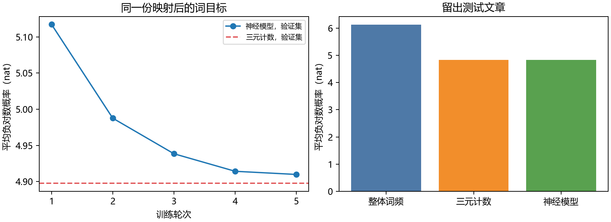

# 第十五章　一句话，怎样变成“下一词”的训练

第十四章已经让循环网络按顺序读数，也看到它能把某些早期信息留到末尾。但那章的正确答案是我们亲手放在第一步的一个比特。若换成真正的文章，没有人在每个位置标注“这一句的深意”。我们到底要它学什么？先从一种既朴素又能实际检验的任务开始：给出已经写下的部分，预测接下来会写哪个**符号单位**。谁把原文变成单位、哪个单位算答案、哪里是另一篇文章、概率低意味着什么，都必须先定下来；网络结构不会替我们完成这些决定。

这里说“预测”也不等于每处上下文只有一个正确续词。比如“the game”后面可能是句号、was、in，或者所有格。资料里已经发生的那个词是训练目标，模型输出的是对许多可能词的**条件分布**。这份分布可给文本打分、帮助语音识别在几个候选间选择，也能按步抽样续写；只因一次续写表面像英语，不能说模型已获得事实知识或数学推理能力。第五章讨论过概率和负对数损失，今天让它们真正落到来源可查的文本上。

## 先找到文章，才有资格切出训练片段

本章使用 WikiText-2 的 raw-v1 版本，来源是 Wikipedia 的 Good/Featured 文章，作者在 2016 年提出它，希望保留较长文章与较真实的罕见词情况供语言模型研究。[WikiText 作者论文](https://arxiv.org/abs/1609.07843)与[Salesforce 发布镜像](https://huggingface.co/datasets/Salesforce/wikitext)给出研究身份。本机固定下载了三份文件，解析成 **600 篇训练文章、60 篇验证文章、60 篇测试文章**。实际原字节哈希、数据卡许可说法及处理步骤写在[语料来源](../data/wikitext2_raw/SOURCE.md)。测试文章从头到尾没有参与词表或参数训练。

“文章”不能随便由一个换行猜出。来源中一行顶层“= Valkyria Chronicles III =”是文章开头；下面还有“= = Gameplay = =”一类小标题，正文也分成多行。第一次只凭行首尾等号切文章，竟把一篇冰球条目里的“= Goals ; A =”表格项目切成几词长的假文章。[准备程序](../code/prepare_wikitext2.py)回看相邻原行后，要求顶层标题本身在两侧空行之间，才把它当新文章。我们保存每篇来源行号、标题与原文哈希；三组之间没有重复的标题或**完整原文哈希**，这仍不等于已排除所有局部重复或近似转载。让同一篇的段落同时进训练和测试，才会制造更明显的“新文章”假象，所以本章沿用来源的整篇划分。

来源名里有 raw，但它不是从百科网页一字未动地爬下的 HTML。许多标点已经被空格隔开，连字符附近能看见 @-@ 等数据集记号。我们在**这份现成间隔**上用 Python 的 split 分成字段，空段落记一枚 PARA；文章起始预放两个 BOS，末尾加 EOS。BOS 是供最初两词上下文使用的起点，EOS 是网络真正要学着在文章末尾预测的终点，PARA 让段落分隔别被直接抹掉。这套词级处理不能无损还原原来的空白，也不是一套对任意语言都正确的“自动分词器”。([实际文章索引与首条源行](../data/wikitext2_raw/article_index.json))

## 从一条原文到一条可训练的问答

第一篇训练文章从零计数的第 3 行，即它的第一段正文，写着“Senjō no Valkyria 3 : Unrecorded Chronicles …”。程序按给定空格取出 Senjō、no、Valkyria、3、冒号等字段。词表只从训练文章建：选最常见的 10,000 个普通字段，再加 UNK、BOS、EOS、PARA 四项。于是这条原文里的 Senjō 不在所选词表，被映成 UNK（编号 0）；no 是 129，Valkyria 是 3933。两词窗口“Senjō no”在模型面前实际变为 \((0,129)\)，这一行的下一词答案 Valkyria 变为 3933。稍后还有 \((3933,92)\to45\)，即“Valkyria 3”后确实接冒号。[原文—字段—编号—两种概率的逐项记录](../results/word_source_trace.json)保存了这两处。

从文章最左端开始，第一条训练问答是“BOS、BOS → 顶层标题的等号”；之后窗口每次向前挪一格，直到“最后两个字段 → EOS”。每个目标来自**同一篇原文的下一个字段**，不是模型自己凭空造的“正确推理过程”。不同文章重新给 BOS，不能把上一篇最后两词拿去预测下一篇标题。程序最终有 2,063,579 个训练目标，验证 215,046 个、测试 242,531 个；其中包括 PARA 和 EOS。训练字节仍在本机，词序列和偏移量在[准备好的文章数组](../data/wikitext2_raw/word_documents.npz)，并非只给读者一个手写小样本。

为什么逐处预测可以变成整篇的学习目标？对任何给定的文章概率分布，乘法规则都能把一串字段连同末尾 EOS 的概率拆成逐处条件概率的乘积：第一个字段看文章起点，第二个看第一个，后面的原则上可看**全部已出现字段**。这是概率恒等式，不要求我们只能看两词。本章另作一项明确的模型选择：每处只保留最近两个字段；文章开头缺的历史用两枚 BOS 补齐。于是三元计数器和下文神经网络都给同一份截短历史报 \(P(w_t\mid w_{t-2},w_{t-1})\)，整篇分数是这些概率的乘积。两词窗口计算容易、便于公平核对两种表示，却把更早的上下文有意丢掉；第十四章的循环状态和后续读取机制正是对这项限制的不同回答。

## 在能训练向量以前，局部统计已能做什么

回到更早的问题现场。Shannon 1948 年在通信理论中比较过按字母独立抽取、按前一个字母、按前两个字母的统计来生成英文近似，后来也试了词频与词的相邻关系。随着条件多一点，局部形状更像英语；这没有宣称几个前字母就能保住一段论证，也没有等到神经网络出现才首次想到“前文影响后文”。我们今天改用现成文章的词字段和现代训练／留出评估，不把 WikiText 测试数字当作 Shannon 当年的实验。([Shannon，1948，§3](https://home.csulb.edu/~cwallis/382/readings/482/shannon.mathematical.theory.communication.1948.pdf))

1956 年 Chomsky 在信息理论期刊讨论的却是另一个目标：一种语法装置能否生成**全部且仅有**合语法的句子。他认为有限状态的 Markov 装置不足以担这件事，转而比较更强的句法描述。这不能被偷换成“给有噪语音候选打概率分数也毫无用处”的定理；Shannon 的英文近似、Chomsky 的语法刻画和稍后的语音识别各在问不同问题。把它们放在一起，才不会以今天的语言模型成绩倒推当时只有一条路。([Chomsky，1956，原论文摘要与论证](https://chomsky.info/wp-content/uploads/195609-.pdf))

若只看紧邻前两个词 \((u,v)\) 预测下一词 \(w\)，这是一种**三元词模型**：三元说的是 \(u,v,w\) 三个单位，真正给定的历史只有前两个。把训练中“\(u,v\) 后接 \(w\)”的次数记为 \(c(u,v,w)\)，把“出现 \(u,v\) 这个历史”的次数记为 \(c(u,v)\)，最直接的估计是

\[
\widehat P_{\rm freq}(w\mid u,v)=\frac{c(u,v,w)}{c(u,v)}.
\]

条件固定时把所有 \(w\) 的次数相加恰得 \(c(u,v)\)，所以这是一个和为 1 的分布；对已看过的词组，它能保留很精确的局部规律。这不要求网络自己发明词义。譬如训练原文里“Valkyria 3”出现五次，其中四次后接冒号，直接频率就是 \(4/5\)。可若一个新历史从未出现，分母为零；即便历史出现过，一个合情合理但未见过的后续词仍会被给零概率，整个验证文章的概率乘积随即变零。

从 1948 到后来语音识别，并非“大家数完频率便停了几十年”。1975 年 Jelinek、Bahl 和 Mercer 设计连续语音的统计解码器：声音处理先给有误差的语音候选，系统还要用发音词典、语言序列的概率与搜索，找较可能的句子；词序列统计在这里承担了**声音不够清楚时怎样选词**的工作。1980 年 Jelinek 与 Mercer 又研究稀疏资料下不同阶历史的插值。Katz 1987 年在 IBM 实时语音识别里明确把**没见过、只见过一次**的词组当真问题：从低频但已见组合拿出一部分概率，交给较短历史，让本来零的候选还有机会。1992 年 Brown 等又把词按统计行为归类，使同类词能共享部分相邻关系。这些是当时有任务、有数据与计算理由的候选；不能安排成“旧法全都不行，所以神经法才出现”。([Jelinek、Bahl、Mercer，1975，原刊摘要](https://www.researchgate.net/profile/Robert-Mercer/publication/220049390_Design_of_a_Linguistic_Statistical_Decoder_for_the_Recognition_of_Continuous_Speech/links/5523ce9d0cf223eed37fe3a8/Design-of-a-Linguistic-Statistical-Decoder-for-the-Recognition-of-Continuous-Speech.pdf)；[Jelinek／Mercer，1980，原刊书目](https://ndlsearch.ndl.go.jp/en/books/R100000136-I1573387448854586240)；[Katz，1987，原文](https://www.cis.upenn.edu/~danroth/Teaching/CS598-05/Papers/Katz87.pdf)；[Brown 等，1992，原论文](https://aclanthology.org/J92-4003.pdf))

## 真把“没见过”留一条有来历的概率路

1995 年 Kneser 与 Ney 要解决的是退到短历史时该借用什么分布，原论文用的是“没见过高阶组合才退”的形式。后来 Chen 与 Goodman 在 1998 年报告、1999 年刊版中比较了多种平滑方式，也讨论**插值**形式：即使三元组见过，也让较短历史得到一点发言权。本机选择后者，使用同一个折扣 \(D\)，不是复现 1995 年的原程序，更没有用后来的多折扣改进替旧研究者作选择。([Kneser 与 Ney，1995，§2—3](https://www-i6.informatik.rwth-aachen.de/publications/download/951/Kneser-ICASSP-1995.pdf)；[Chen 与 Goodman，1999，§2.7—2.8](https://u.cs.biu.ac.il/~yogo/courses/mt2014/papers/chen-goodman-99.pdf))

这份**插值 Kneser–Ney 三元模型**先给已见三元组合一个折后份额，再把剩余份额交给低一阶。但低一阶不能简单把原始二元次数再数一遍。记 \(N_1^+(u,v,\cdot)\) 为历史 \((u,v)\) 后有多少种不同的词；再记 \(\widetilde c(v,w)=|\{u:c(u,v,w)>0\}|\)：它数的是“\(v,w\)”曾接在多少种**不同的更早词** \(u\) 后，而不是“\(v,w\)”总共出现多少次。令 \(\widetilde c(v)=\sum_w\widetilde c(v,w)\)、\(T_2(v)=|\{w:\widetilde c(v,w)>0\}|\)。本机三层分布为

\[
\begin{aligned}
P_3(w\mid u,v)
&=\frac{\max(c(u,v,w)-D,0)}{c(u,v)}
+\frac{D\,N_1^+(u,v,\cdot)}{c(u,v)}P_2(w\mid v),\\
P_2(w\mid v)
&=\frac{\max(\widetilde c(v,w)-D,0)}{\widetilde c(v)}
+\frac{D\,T_2(v)}{\widetilde c(v)}P_{\rm cont}(w).
\end{aligned}
\]

\(0<D\le1\) 表示每一种已见后续先拿走 \(D\) 个计数的份额。\(N_1^+(u,v,\cdot)\) 是历史 \((u,v)\) 后面出现过**多少种不同的词**；高阶所有已见词一共让出 \(D N_1^+\)，恰好交给 \(P_2\)。二元层也按 \(\widetilde c\) 做同样的事。若高阶历史未见过，就直接用下一层，不做零分母除法。最低层的 continuation 分布按词曾跟在**多少种不同前词**后面计：\(P_{\rm cont}(w)=N_1^+(\cdot,w)/N_1^+(\cdot,\cdot)\)。只要训练中每个实际目标都可在这层找到，对所有候选词求和时，高阶保留的质量与交出的质量正好补成 1；本机在已见和未见历史上都逐项核过。

二元层的改动不是记号游戏：训练文章中“the game”这对词原样出现 **763** 次，却只接在 **171** 种不同的更早词后。本机 \(P_2\) 使用 171，不把同一个左侧环境里的重复当作 171 之外的新环境。若在这里误用 763 的原始二元次数、只在最低一层改用不同前词的数量，依然能造出归一分布，却已经是另一种平滑器；先前版本恰犯了这个错误，后面的对照成绩也必须重算。([Chen 与 Goodman，1999，§2.7 的低阶计数](https://u.cs.biu.ac.il/~yogo/courses/mt2014/papers/chen-goodman-99.pdf))

为什么底层改数前词的种类？Kneser 与 Ney 1995 年举过 dollars：它可能总共很常见，却主要接在数字与少数相称词后；若遇到一个从未见过的新前词，单凭 dollars 的总频率就给它很高回退概率，并不合理。不同上下文能否接上它，比总共出现多少次更对准“没有当前组合时怎么办”。这是作者提出的一种有实际代价和收益的设计，不是由概率公理唯一逼出来的公式。([Kneser 与 Ney，1995，§1—3](https://www-i6.informatik.rwth-aachen.de/publications/download/951/Kneser-ICASSP-1995.pdf))

本机训练计出 **1,168,476** 种不同三元组。验证目标中约 **47.74%** 的三元组合从未在训练里出现，约 **13.38%** 连前两词的历史也未出现；这正是低阶分布要担的工作。折扣只在验证文章上从 \(0.5,0.75,1.0\) 三项里选，\(0.75\) 的平均负对数最低。回到那处**训练原文**，“Valkyria 3”五次、冒号四次，直接频率 \(0.8\)，折扣后再用低阶补回的最终概率约 **0.6568**。它比 0.8 保守，却没有抹掉这个强局部证据。[计数、低阶不同左侧词数与归一化检查](../results/word_ngram.json)可逐项重跑。

## 把词放进可学习的空间，是在改变哪一种共享

1997 年的 LSTM 在上一章已经出现，按发表时间早于我们现在要读的 2003 年论文。课文先研究循环、再回到较短词窗口，并不是历史倒流。Bengio、Ducharme、Vincent 和 Jauvin 当时明确承认 n-gram 的成功，同时指出另一处组合困难：离散词只要换一项，原来的精确词组计数就不能直接给新组合传递经验。1992 年的词类方法已经让同类词共享统计量；他们选择进一步给每个词一行**可学实向量**，再用这些向量组织下一词概率，试着让相近用法跨不同词组互相帮助。这是连续参数化的候选，不是声称旧统计方法全错，也不是后世 Transformer 的结构已经藏在 2003 年图里。([Bengio 等，2003，摘要及§1—2](https://jmlr.csail.mit.edu/papers/volume3/bengio03a/bengio03a.pdf))

先把这个动作说成读者能查的代码对象。设词表有 \(V=10004\) 项，造矩阵 \(E\in\mathbb R^{V\times64}\)。编号为 \(j\) 的词取第 \(j\) 行 \(E_j\)，并非词本来附带一份 64 维“意义”。第十四章的状态由先前输入逐步算出；这里仅取前**两个词** \(u,v\)，查 \(E_u,E_v\)，按顺序接起来得 128 维向量，再算

\[
q=\tanh\bigl(W[E_u;E_v]+b\bigr),\qquad
z=Uq+a,\qquad
P_\theta(w\mid u,v)=\frac{\exp z_w}{\sum_{j=0}^{V-1}\exp z_j}.
\]

括号 \([E_u;E_v]\) 是把两个向量按位置接起来，不是相加；同一个词若在不同文章、不同位置出现，仍查**同一行** \(E_j\)。\(W,b,U,a\) 也由所有训练例共用。每个候选下一词有一个分数 \(z_j\)，softmax 把它们变成和为 1 的概率。当前词 ID、两行向量、隐藏活动、全部输出分数和真正答案 ID 都可在[本机神经代码](../code/word_neural_lm.py)找到。计算全部 \(V\) 个输出也要付代价；2003 年原论文就把大词表输出层的计算列为难点，不能只讲“向量更会泛化”而不算训练开销。

## 原文自己给答案，训练器究竟改了什么

若一篇文章变成 \(w_1,\ldots,w_T\)，在文章左边放两个 BOS 并在末尾添 EOS，我们在每个可预测位置给真实下一个编号 \(w_t\)。这一次训练的目标是这些真实编号的平均负对数：

\[
L(\theta)=\frac1N\sum_{\text{训练文章}}\sum_{\text{文章内目标 }t}
-\log P_\theta(w_t\mid w_{t-2},w_{t-1}).
\]

\(N\) 是被计入的目标总数，而非文章数；本机是 2,063,579。公式不是让模型先猜出一段“正确思维”再对照：标签就来自原文的下一字段。若窗口为“Valkyria 3”，目标冒号，损失只要求模型提高这次冒号相对其他词的概率；同样的上下文若在别处出现别的续词，那个例子会把梯度推向另一边。训练在一批 512 个窗口上取平均，backward 沿输出、隐藏层回到被查过的词向量行，Adam 的 step 才实际改数。

这条回路也可以从第十三章已经算过的导数逐层写出来。对一条窗口，把正确目标编号记作 \(y\)，输出分数 \(z_j\) 的损失导数是 \(P_\theta(j\mid u,v)-\mathbf1_{\{j=y\}}\)。把这些导数组成向量 \(g_z\)，前面的隐藏活动 \(q\) 收到 \(U^\top g_z\)；\(\tanh\) 每项的局部导数是 \(1-q^2\)，所以接在两份词向量后的那条梯度为

\[
g_{[E_u;E_v]}=W^\top\bigl((1-q^2)\odot U^\top g_z\bigr).
\]

前 64 项属于第一次查表，后 64 项属于第二次查表。如果 \(u=v\)，两次查到的是**同一行** \(E_u\)，程序必须把两份贡献相加，不能只留后一份。[独立的小计算](../code/word_embedding_gradient_probe.py)故意让编号 1 同时占两个位置：两处手算梯度分别约为 \((-0.14968,0.22245)\)、\((-0.11484,-0.26142)\)，合到同一行是 \((-0.26452,-0.03897)\)，与 PyTorch 差不到 \(10^{-16}\)。只对这行走一次 0.1 的梯度步，在这个小样本上损失由约 1.35156 降到 1.34445；这核的是同一条计算，不是对真实语料泛化的实验。若目标词没在上下文里出现，它的**嵌入行**不会因为当目标就被查到；输出层中对应的那一行仍会收到分数导数，两种参数职责要分清。

第一批的运行记录让“嵌入被学到”不再是口号。那一批某条真实训练窗口是“concrete . → The”；concrete 那一行的梯度范数约 \(0.000361\)，没有出现在该批上下文里的 BOS 行梯度为零。[首批梯度与每轮结果](../results/word_neural_lm.json)保存具体 ID、词和数。零梯度只表示该行没从**这批上下文**收到信号，不表示该词以后永不学习；输出层对各候选词的参数又是另一条梯度路。向量由预测任务共同调整，某两行靠近也不能只看一张近邻表就宣称模型懂了它们的全部语义。

## 同一份测试，到底比较的是哪一种文字

第一次比较用验证文章选计数折扣和神经模型轮次，测试文章到选择结束才评价。本轮发现低阶计数的实现错误时，我们**已经看过旧版本的测试成绩**。改正依据论文中的计数定义，并没有按测试名次搜索另一套公式；但下面这张表确实是同一批留出文章上的复评，不能再称一次全新的盲测。神经模型从随机初值开始，词向量 64 维、隐藏层 128 维，总可训练数 **1,947,284**；五轮完整训练、每轮对同一 600 篇文章洗牌，验证负对数从约 \(5.117\) 降到 \(4.910\)，第五轮被选中。词级分数用

\[
\mathrm{NLL}=-\frac1M\sum_{i=1}^{M}\log p_i,\qquad
\mathrm{PPL}=\exp(\mathrm{NLL})
\]

报告，\(p_i\) 是模型给第 \(i\) 个**已经映射的目标编号**的概率。PPL 可读成所选概率分布在这类目标上的几何平均分叉尺度；它不是一句话究竟有多少真正合理续写的直接计数，更不是“智力分”。比较 PPL 前，必须先核两法预测的单位和目标集合相同。

| 本机方法 | 验证平均 NLL | 官方测试平均 NLL | 官方测试 PPL |
|---|---:|---:|---:|
| 只按整体词频 | 6.186 | 6.122 | 455.59 |
| 单折扣插值三元 Kneser–Ney | 4.897 | **4.822** | **124.26** |
| 两词窗口、共享向量的前馈神经模型 | 4.910 | 4.826 | 124.69 |

先前把二元回退层误写成原始出现次数时，图上是神经模型略好；把它改为不同左侧词的数量并保持同一训练文章、验证候选和独立测试之后，**计数模型在这个映射词表上反而略好**。两法测试平均负对数只差约 \(0.0034\) nat，不能用这一回的细微差别排出方法的普遍名次。神经词向量确实从随机初值学到了可用的共享计算，却不因此自动压过一个认真平滑的三元模型。看那条**训练中的**“Valkyria 3 → 冒号”，计数法给冒号约 \(0.6568\)，神经模型只给约 \(0.0247\)；精确见过的专名搭配，计数能保留得更好，连续向量的共享也可能把它冲淡。训练例用于追踪两套计算，不能充当独立泛化证明；留出测试的分数仍只属于这次数据、词表和预算。

这里还有一个若只报总 PPL 就会藏住的损失：测试原目标约 **12.57%** 不在那 10,000 个训练高频普通词内，统统变成 UNK。那包括原词本来不同、读者可能很关心的人名或外语。两法对同一个 UNK 编号都能给概率，因此总 NLL 可公平比较**映射后的任务**，却不能说它们预测对了各自被抹掉的原词。在测试目标里，只看 UNK 时，更正后的计数法平均 NLL 约 \(2.168\)、神经模型约 \(2.140\)；只看已知词时分别约 \(5.204\)、\(5.212\)。计数法这次的总微弱优势来自占多数的已知词；神经模型在合并成一个编号的 UNK 上略好。这个分列最初是看见 UNK 比例后才追加的**结果解释**，本轮纠正计数公式后也按相同目标重算，没有拿测试分解回头改词表、折扣或神经轮次；完整身份在[实验协议](../verification/C15_text_protocol.md)里。

## 一个“词”到底有多大，关系到模型看见什么

UNK 的损失来自我们选择了**完整字段作单位**，而只保留训练里最常见的一部分。换成一个一个 Unicode 字符，Senjō 不会整体消失：可以把 S、e、n、j、ō 分给模型；但每个字的上下文单位变细，同一段文字需更多步，还得解决测试出现训练从未见过的字符。若走得更底层，用 UTF-8 字节，基础值只有 0 到 255，任何可编码文本都能拆成字节，未知**字节**不再是问题；一个汉字却通常分为几个字节，模型还得学会这些字节怎样组回字符。完整词、Unicode 字符、字节各保留不同关系，谁也不因名字显得更“聪明”便必然适合一切任务。

另一种办法在**词内**把常见小片段合并、少见词仍拆开，这叫子词编码的一类做法。本章[实际子词程序](../code/word_subword_probe.py)从训练文章按频数选最多 30,000 个纯字母字段，从每个字段的 UTF-8 字节出发，按训练中加权出现最多的相邻对逐轮合并 256 次。第一轮合出 th，随后有 in、the 等；它们并非教师列的词根。一个新字段只使用训练时保存的合并次序，所有基础字节仍在，所以可以拼回原字段。验证文章里的 Homarus 在本章完整词表中只能是 UNK；这份子词表却将它拆为 H、om、ar、us 四段，再按字节合回 Homarus。[合并表与逐字节回读记录](../results/word_subword_probe.json)既能核这一成功，也能看到代价。

本机第一篇文章那条来源行，截前 18 个已间隔字段：完整字段单位为 **18**，字段内部有 **87** 个 Unicode 字符、**108** 个 UTF-8 字节，经过本章 256 次词内合并为 **83** 个子词片段。后面三种长度都**不含**原字段之间的空格／段落符号，因此它们只是同一段字段内部的编码成本对照，不能拿 18 对 83 说“词模型比子词模型准确”。我们也没有用这份子词表重训上面的语言模型；词级 PPL 不能与字符或子词“每单位 PPL”直接横向排胜负，单位变了，负对数相加的项数也变了。

这条路线的历史同样不是“2003 年神经论文一出，人们立刻发明 BPE”。Gage 1994 年的 byte-pair 算法原是找高频相邻**字节**并替换，用于数据压缩；Sennrich、Haddow 和 Birch 2016 年面对神经翻译固定词表的罕见／未见词问题，把频次合并改作子词表示的办法。两者问题、输入和输出都不同。本章课堂程序又选择了“词内 UTF-8 字节、最多 256 次合并”这套具体方案，既不是 1994 的全文件压缩器，也不是 2016 翻译模型或任何现成 GPT 分词器的复刻。它恰好把一个问题显出来：**分词不是输入前无关紧要的清洗，它决定了训练器还能不能看到原字串。**([Gage，1994，原文](https://jacobfilipp.com/DrDobbs/articles/CUJ/1994/9402/gage/gage.htm)；[Sennrich 等，2016，原论文](https://aclanthology.org/P16-1162.pdf))

## 会给下一词概率，不等于能守住一篇文章

概率模型可以从“the game”出发，按分布抽一个词，再把窗口挪到最近两个词，继续抽。我们保存了一次固定种子的[本机逐步采样](../results/word_generated_sample.json)：开头一小段能出现像英语的词组，接下去却把水手、1953 年和别的题材任意接在一起，期间还输出 UNK。因为本章前馈模型每次只看**最近两个映射字段**，它既没有第十四章那种递推状态，也没有存放百科事实的外部资料；长输出局部通顺而整体飘走，完全不违反它被训练的目标。即便某个更大的模型能在远处保持主题，也还须单独核事实、组合与新任务，不能从“做下一词预测”逻辑上直接授予它。

## 这些程序让哪一份原文进入了哪一行梯度

在项目根目录的 PowerShell 终端依次运行：

~~~powershell
$env:PYTHONUTF8='1'
python work/code/prepare_wikitext2.py
python work/code/word_ngram.py
python work/code/word_embedding_gradient_probe.py
python work/code/word_neural_lm.py
python work/code/inspect_word_trace.py
python work/code/word_subword_probe.py
python work/code/word_generate.py
~~~

第一条核三份来源 Parquet 的字节哈希，按文章分组并只用训练文章建词表；第二条按计数和折扣算条件概率。第三条只在四词小表中手算两次查到同一词时的梯度并与 PyTorch 核对，还执行一次明确的单行更新；它不读取 WikiText，也不改变真正的语言模型。第四条才在真实文章的同一上下文／目标数组上随机初始化词向量，完整训练五轮，从验证集选轮次、最后开测试；第五条把一条实际原文的编号与两种概率重新接起来；第六条只学子词合并并核回读；第七条加载已保存权重按概率采样，不重新训练。真实语料上的参数更新发生在第四条的 backward 与 optimizer.step；其余程序不会靠运行次数让那份模型自己变强。

本机 PyTorch 2.11.0+cu128、RTX 5090 Laptop GPU 上，神经模型五轮训练及逐轮验证约 25 秒，PyTorch 记录的峰值已分配显存约 218 MiB；计数模型构建与验证／测试约 6 秒，课堂子词表训练约 15 秒。这些时间依赖本机、词表和已下载语料，不含互联网获取，也不是后来随机 Transformer 的资源预算。神经模型保存了权重、被选轮次、词表与文章数组哈希及优化器状态，重新载入后在同一验证输入上的输出逐项一致。显存能容下、负对数下降以及真正获得广泛语言能力，仍是三件不同的事。

## 离开这批文章时，真正获得了哪一种本领

这一章从原文抽出训练目标，知道谁提供答案——**文章的下一字段**——以及计数器与训练器各在哪里获得新信息。三元计数通过分配已见组合的概率质量，让未见词组也有合法概率；低阶不数重复次数而数不同左侧环境，这次改正使它在相同留出文章上略胜五轮神经模型。连续词向量则让同一词在不同上下文共用参数，梯度能从实际目标到达被查过的行；它提供另一种可学习的共享办法，本次不需替它宣布胜利。两法都只看最近两个字段。词、字符、子词会改变输入和可恢复性；UNK 让总分只覆盖被压成同一符号的目标，而非原文全部词项。我们已能解释并重跑一个**真实语料上的小型神经语言模型**和一个有力的统计对照，不能用它们抵扣以后从随机权重、更多真实语料训练并独立评价 Transformer 的目标。

下一项真正新问题不是把词向量叫成翻译器。给定一段英文、要输出可能更长或更短的另一种语言句子时，输入与输出没有同一步对齐的正确词，目标概率应怎样条件化？上一章循环状态和本章下一词分布都可提供部件，却还没说明该在输出每一步怎样读取原句。下一章从真实循环翻译的成功和固定摘要的局限继续研究。

## 用原文、概率和训练记录各核一步

1. 打开第一篇训练文章从零计数的第 3 行，指出“Senjō no → Valkyria”的**原字段**和本机**模型编号**分别是什么。若把两个不同未见原词都映成 UNK，模型还能在这条词级任务里区分它们吗？
2. 假设历史 \((u,v)\) 在训练中出现五次，后面恰有两种词，其中冒号四次。若折扣 \(D=0.75\)，把本章三元公式前项与交给低阶的总质量各算出来。为何二者相加后对所有候选词仍为 1？
3. 只根据本机[来源追踪](../results/word_source_trace.json)，在“Valkyria 3 → 冒号”这一**训练实例**上哪种方法给真实目标的负对数更小？它证明留出测试的普遍名次吗？
4. 给一个测试中出现、词表里没有的原词。完整词模型会看到什么？本章词内 byte-BPE 为什么仍能把它回读？如果原段有三个连续空格，用本章字段级回读能还原那三个空格吗？
5. 若把词表从 10,000 普通词改为 20,000，原词进入 UNK 的比例、模型输出大小、训练计算量、映射后每词 PPL 的数值可能怎样变？为什么即使同一个原文测试集，两次 PPL 也不能直接当“能力提升”？
6. [小型梯度探针](../results/word_embedding_gradient_probe.json)让编号 1 连续占两个上下文位置、编号 2 作目标。为什么编号 1 的嵌入行梯度要把两份贡献相加？编号 2 的嵌入行在这条样本里是否必有梯度？输出层对应编号 2 的权重又如何？

**核对。**第一题 Senjō→UNK 为 0，no 为 129，目标 Valkyria 为 3933；两个被并成 UNK 的原词身份已经丢失。第二题高阶已见冒号先拿 \((4-0.75)/5=0.65\)，两种后续一共拿出 \(0.75\times2/5=0.30\) 交给低阶分布；另一个只见一次的词先拿 \(0.05\)，高阶前项合计 \(0.70\)，低阶质量 \(0.30\)，总和为 1。第三题计数法训练中约 \(0.420\) nat，神经模型约 \(3.700\) nat；这条训练例展示局部保留，不是留出总体判定。第四题词级是 UNK，子词至少保留基础字节，按保存合并表逆解每个字段；原空白结构在 split 时已丢失，字段回读不能还原。第五题 UNK 通常可能减少、输出类别和每步 softmax 计算增大，PPL 可随新目标映射和学习难度双向变化；必须同时报告原词未知率、统一任务定义和独立评价，才谈得上比较。第六题同一行在一次前向被使用两次，链式法则的两条路径回到同一参数时须求和；目标编号 2 只通过损失作用于输出分数，若没在上下文里被查，它的嵌入行在这条样本里没有梯度，但输出层负责编号 2 的参数仍收到 \(P(2)-1\) 传来的梯度。
