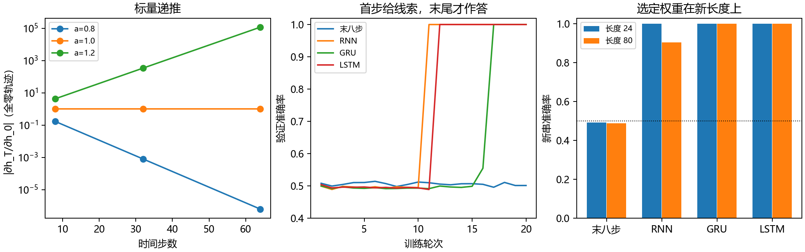
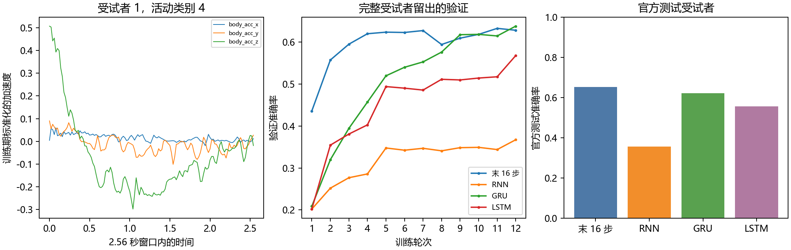

# 第十四章　过去的信息，怎样留到需要时

上一章的图像有一张二维平面：一块局部形状向右移动，同一张小权重表仍可在那里检查它。现在换成按时间一个接一个到来的数。第十三章没有回答：新的一项出现时，程序该留下前面哪些信息，什么时候才拿出来用？一段声音、一次传感器读数或一句尚未说完的话，都有这个问题。但它们的学习目标并不相同；本章先把“过去的信息怎样进入当前判断”算清，再让真实传感器资料检验一条具体任务。下一章才正式问文本从哪里来、哪些符号应被预测。

## 固定看最近几步，什么时候已经足够

最简单的序列办法，是把最近 \(k\) 项排在一起，交给前面学过的全连接网络。若任务只看最近几次变化，这很合理：窗口内每一项都完整保留，不必让一个隐藏状态猜要压缩什么；也能并行处理不同窗口。手机运动里几个采样就可能显示正在走路，而不是站定。不能为了引出循环结构，先宣布窗口必然无用。

但我们也可以造一个能把“看不见”和“学不会”分开的任务。每条长度 \(T=24\) 的序列在第一步给一个随机线索位 \(B\in\{0,1\}\)；后面 23 位独立随机，末尾才要求回答最初的 \(B\)。每步还给一个标记，告诉程序是不是第一步。若只取**末尾八步**，它们与 \(B\) 在我们规定的生成办法下独立。无论末八步分类器有多少参数，从这些输入推 \(B\) 的最佳机会仍是 \(1/2\)：对同一末八步，开头为 0 或 1 都有同样的可能。这是关于**给它的信息**的结论，不能用“再训二十轮”修好。若任务把决定答案的位移到最后八步，或让中间位透露线索，结论就不再按这条证明成立。

一条状态更新路线至少能**表示**另一种做法：第一步把 \(B\) 写入某个活动，此后面对干扰尽量保持它，末尾再读出来。它还要学会什么时候写、什么时候不覆盖，以及训练误差怎样回到第一步。状态不是一块天然有意义的语义记忆；它只是当前算法依过去输入算出的数。我们可以问它是否真保留了任务需要的位，而不能因变量名叫 memory 就替它作答。

## 先前的输出、先前的内部活动，可以怎样回到下一步

1986 年 Jordan 研究有轨迹的连续行为，讨论一种由网络部件构成的序列机器：先前的输出活动回到后续计算，有助于让行为按时间展开。1988 年 Werbos 把此前更广义的反向求导关系用于循环的预测与敏感度问题，举的是天然气市场模型，并非今日聊天模型。到 1990 年，Elman 在《Finding Structure in Time》中把前一刻**隐藏层的活动**复制到一组上下文位置，下一刻让当前输入与这组旧活动一起决定新的隐藏活动；他用逐位呈现的序列等任务研究时间结构。Elman 自己区分了 Jordan 输出回馈与隐藏活动回馈，还提醒上下文活动不必是过去输入的逐字副本。我们采用接近后一种的课堂方程，不把全部循环研究和循环求导归给一个人。([Jordan，1986，原文档案](https://escholarship.org/uc/item/1fg2j76h)；[Werbos，1988，原论文](https://gwern.net/doc/ai/nn/rnn/1988-werbos.pdf)；[Elman，1990，第 182—185 页](https://gwern.net/doc/ai/nn/rnn/1990-elman.pdf))

给当前输入一个向量 \(x_t\)，给前一步留存活动一个向量 \(h_{t-1}\)。一种直接的循环单元每步用**同一组**参数算

\[
h_t=\tanh(W_xx_t+W_hh_{t-1}+b),\qquad h_0=0.
\]

\(t\) 是这条记录的第几步，不是训练轮数；\(W_x\) 管当前读数怎样进入，\(W_h\) 管过去状态怎样参与，\(b\) 是偏置，\(\tanh\) 把每项结果压在 \((-1,1)\)。图像卷积把一张小表跨**空间位置**复用；这里把同一状态更新跨**时间位置**复用，但时间有先后，\(h_t\) 必须等 \(h_{t-1}\) 算完。对每条新记录，程序将 \(h_0\) 置零；若不清零，上一位受试者的活动可能偷偷混进下一位的判断。这只是本章的独立窗口任务选择；真正不断流的任务会需要另一套状态边界。

## 把时间展开，末尾的误差怎样找到第一步

将上式连续写几次，\(h_1=F_\theta(x_1,h_0)\)、\(h_2=F_\theta(x_2,h_1)\)、一直到 \(h_T\)。纸上好像画了 \(T\) 个方框，方框里的 \(\theta=(W_x,W_h,b)\) 却是**同一份数**，不因为时间增长就多一套待学参数。末尾若有损失 \(L(h_T,y)\)，反向传播须沿实际依赖链回去，这叫**通过时间反向传播**，简称 BPTT。它仍是第三章已经用过的链式法则，只是现在同一组参数在许多时刻被重复调用。

为看清那条链，令 \(J_t=\partial h_t/\partial h_{t-1}\)。在上述 \(\tanh\) 单元中，\(J_t=\operatorname{diag}(1-h_t^2)W_h\)；这里对角矩阵把每个活动的 \(\tanh\) 局部导数放在对应位置。若只在末尾计一次损失，给定最后一步传回的列向量 \(\delta_T=\partial L/\partial h_T\)，前一步的贡献为

\[
\delta_{t-1}=J_t^\top\delta_t.
\]

每时刻的参数仍要从它当时那次使用收梯度。把计算当前 \(h_t\) 时暂时固定 \(h_{t-1}\) 得到的局部参数导数记为 \(G_t\)，总梯度便是 \(\nabla_\theta L=\sum_{t=1}^{T}G_t^\top\delta_t\)：同一 \(W_h\) 在各时刻收到的贡献必须加起来，不是只在末尾更新一次。若某个问题还在中间时刻计损失，相应时刻也会有新的梯度加入这条回流。PyTorch 的 autograd 只对实际保存的计算图反传；若程序在中途 detach 状态，便主动截断了更早时间的这条链，不是优化器“自动记得更远”。

## 长间隔难题在乘积里，不能写成一句绝对诅咒

用一个可算到底的标量情形诊断：没有新输入，\(h_t=\tanh(a h_{t-1})\)。若从 \(h_0=0\) 出发，每一步活动都为零，\(\tanh'(0)=1\)，所以

\[
\frac{\partial h_T}{\partial h_0}
=\prod_{t=1}^{T}a\,\tanh'(0)=a^T.
\]

本机用双精度与 autograd 逐步核算：当 \(a=0.8\)、\(T=64\)，导数约 \(6.3\times10^{-7}\)；当 \(a=1.2\) 且仍沿全零轨迹，导数约 \(116842\)。前者让末尾信号难碰到起点，后者会把微小变化放大。若 \(a=1\)，这条**特定零轨迹**的导数恰为 1。可是一旦同样的 \(a=1.2\) 从 \(h_0=0.7\) 开始，\(\tanh\) 的导数不再总为 1，本机 \(T=32\) 的导数反而只有约 \(3.5\times10^{-6}\)。因此不能只凭 \(a>1\) 就宣布所有实际序列梯度都爆炸，更不能凭一个 \(a=1\) 就宣布网络已学会长期保存线索。[逐步数值与曲线](../results/cue_memory_training.json)记录了这两种条件到底哪里不同。

1994 年 Bengio、Simard 和 Frasconi 从**稳健扣住信息、抗无关输入、还要让梯度在合理时间里学到**这几项要求出发，分析某些动力状态稳定性条件下为什么长依赖会变难。他们不仅给了现象，还明确讨论保存和易训练之间的张力；结论有模型条件，不能改写成“普通 RNN 从数学上绝不可能学 24 步”。我们本机稍后就会看见它实际学会一次。论文的问题与我们开头的线索任务相似，但本章数据、网络和优化设置都由现在的作者另定，不称历史复现。([Bengio、Simard、Frasconi，1994，§1—2](https://www.cs.cmu.edu/~bhiksha/courses/deeplearning/Fall.2016/pdfs/Bengio_94.pdf))

## 要让信息留下，先给它一条能少改动的路

Hochreiter 和 Schmidhuber 1997 年的 LSTM 论文，不是简单把普通 RNN 的 \(a\) 人为调成 1。他们先看出：若只设一个线性自连接单元，旧内容和误差信号可以沿系数 1 的路径传很久；可是一旦所有新输入都随时能写入，过去要保存的内容会受干扰。原版于是给内部状态一条**相加**的路，并在写入和读出两侧安排可学的乘性门。用现代简化记法可写成

\[
c_t=c_{t-1}+i_t\odot g_t,\qquad h_t=o_t\odot\tanh(c_t).
\]

\(c_t\) 是单元内部保存的向量，\(g_t\) 是待写的候选，\(i_t\) 决定这一刻写多少，\(o_t\) 决定向外露出多少；\(\odot\) 表示同位置数相乘。若沿“旧 \(c_{t-1}\) 直接传给新 \(c_t\)”这一条局部路看导数，系数为 1，而不是每步又乘一次 \(\tanh'\) 与 \(W_h\)。输入门保护旧内容不被无关新项覆盖，输出门使暂时不该参与外部判断的内容不必全露出来。论文还用了与当今软件不完全相同的具体单元连接和梯度截断方式；本章拿它的动机解释现代门控，不宣称下文 PyTorch 代码逐行重现了 1997 年程序。([Hochreiter 与 Schmidhuber，1997，§3—4](https://deeplearning.cs.cmu.edu/F23/document/readings/LSTM.pdf))

原版没有今天常画在 LSTM 图上的**遗忘门**。面对连续不断、未明确分段的输入，状态若只会加新内容，什么时候能清掉已经过时的东西？Gers、Schmidhuber 和 Cummins 的遗忘门工作已有 1999 年会议报告，2000 年刊版专门把这一困难说清：给旧内容也安排可学的保留比例。数学上把刚才的第一式改为 \(c_t=f_t\odot c_{t-1}+i_t\odot g_t\)。若某一分量的 \(f_t\) 接近 1，旧值大体留下；接近 0，它被主动擦去。这是一个有条件的设计选择，不是遗忘门一加就保住所有长依赖。([Gers 等发表目录：1999 会议／2000 刊版](https://prof.bht-berlin.de/gers/publikationen)；[2000 刊版摘要](https://pubmed.ncbi.nlm.nih.gov/11032042/))

## 现在程序里的一步 LSTM 到底算哪些数

本机 PyTorch 的 LSTM 采用带遗忘门的现代常用形式。每个门先把当前输入 \(x_t\) 和上一隐藏活动 \(h_{t-1}\) 各乘一套可学习权重、加偏置，再经过函数 \(\sigma(u)=1/(1+e^{-u})\)，所以门的值在 0 与 1 之间。候选 \(g_t\) 则用 \(\tanh\) 生成可正可负的新内容。四条计算写全是

\[
\begin{aligned}
i_t&=\sigma(W_ix_t+U_ih_{t-1}+b_i),&
f_t&=\sigma(W_fx_t+U_fh_{t-1}+b_f),\\
g_t&=\tanh(W_gx_t+U_gh_{t-1}+b_g),&
o_t&=\sigma(W_ox_t+U_oh_{t-1}+b_o),\\
c_t&=f_t\odot c_{t-1}+i_t\odot g_t,&
h_t&=o_t\odot\tanh(c_t).
\end{aligned}
\]

第一行不是四个神秘名字：输入门管新内容写入，遗忘门管旧内容保留，候选给出可能写什么，输出门管当前可读部分；\(c_t\) 和 \(h_t\) 是**两份不同的活动**。若先把 \(h_{t-1}\) 固定，只沿旧 \(c_{t-1}\) 到新 \(c_t\) 的直通项求偏导，得到 \(\partial c_t/\partial c_{t-1}=f_t\)。跨几步这条**直接路径**的系数是各步 \(f\) 的乘积，门可学着在需要留存时靠近 1，在信息过时时降低。完整网络的总导数仍有门依赖旧活动的其他路径、输出 \(\tanh\) 和末端损失；这不是“LSTM 的所有梯度永远不消失”的定理。([PyTorch LSTM 官方逐步方程](https://docs.pytorch.org/docs/main/generated/torch.nn.LSTM.html))

[显式一步探针](../code/recurrent_gate_probe.py)不是只打印类名。它拿一个二维 \(c_{t-1}=(0.4,0.1)\)，从真实库单元的权重逐项算四门。第一个分量实际得到 \(f_t\approx0.733,\ i_t\approx0.697,\ g_t\approx0.801\)，于是

\[
c_t^{(1)}\approx0.733(0.4)+0.697(0.801)=0.851.
\]

两分量完整结果约 \((0.851,-0.420)\)，乘输出门并过 \(\tanh\) 后 \(h_t\approx(0.395,-0.319)\)。探针把显式计算与 PyTorch LSTMCell 的两份输出逐项比，最大差为 0；固定上一隐藏态时，自动求出的内部状态直通导数也逐项等于本轮遗忘门。这能核**一个时间步**的公式，不能从一次参数尚未训练的门值推出长任务表现。

## 另一种门控：只留一份隐藏状态

门并不只有 LSTM 一种安排。Cho 等人在 2014 年讨论可变长短语的编码—解码，把一个有重置门和更新门的循环单元用在英法短语对建模，再把其打分接入当时的统计机器翻译系统。研究目标不是“发现 LSTM 完全不能用”，更不是已经有今日语言模型的完整训练链；它是一种较简洁的状态更新候选。门 \(z_t\) 决定旧隐藏活动保留多少，门 \(r_t\) 决定候选新内容在多大程度上查看旧活动。([Cho 等，2014，§2.2—2.3](https://aclanthology.org/D14-1179.pdf))

本机训练使用的是 **PyTorch GRU 的具体顺序**。为不让软件名替代机制，令

\[
\begin{aligned}
r_t&=\sigma(W_rx_t+U_rh_{t-1}+b_r),\qquad
z_t=\sigma(W_zx_t+U_zh_{t-1}+b_z),\\
n_t&=\tanh(W_nx_t+b_{in}+r_t\odot(U_nh_{t-1}+b_{hn})),\\
h_t&=z_t\odot h_{t-1}+(1-z_t)\odot n_t .
\end{aligned}
\]

当 \(z_t\) 靠近 1，当前 \(h_t\) 可主要沿旧 \(h_{t-1}\) 传；靠近 0，更多采用 \(n_t\)。\(r_t\) 不是直接把保存状态删掉，它先影响**候选如何使用旧状态**。这里没有 LSTM 那份单独的 \(c_t\)。与 1997 LSTM 原版一样，门只提供了可学的路，何时开关仍要靠数据与目标。

原始 Cho 论文把重置门先乘到 \(h_{t-1}\) 上、再交给候选的矩阵 \(U_n\)；PyTorch 为实现效率先做 \(U_nh_{t-1}\)，再逐项乘 \(r_t\)。矩阵与逐项乘法一般不能交换。探针取 \(r=(0.8,0.2)\)、\(h=(1,1)\) 和交换两坐标的矩阵：先重置再乘矩阵得 \((0.2,0.8)\)，先乘矩阵再重置得 \((0.8,0.2)\)。因此正文说的是**这次真正运行的 PyTorch 变体**，而不把原论文公式和软件结果强行写成逐项相同。探针显式计算的 PyTorch RNNCell、GRUCell、LSTMCell 一步输出均与库相等。([PyTorch GRU 公式及原论文差异说明](https://docs.pytorch.org/docs/main/generated/torch.nn.GRU.html))

## 真让网络在干扰之后回答，谁先学到那一位

前面的标量导数只核数学机制，没有让网络学任务。现在给四种模型同一批可检查的线索串：16,384 条长度 24 的训练串、4,096 条独立长度 24 的验证串，另留两份各 4,096 条**新串**到最后一次评价，长度分别为 24 与 80。每条第一步的随机 \(B\) 是末尾标签，随后各位独立；输入有“当前位是正还是负”与“是否第一步”两项。最后八步全连接基线只收到这八步；普通 RNN、GRU 和现代 LSTM 逐步收到完整串，隐藏宽度都为 32。末尾给两个类别分数 \(s_0,s_1\)，沿上一章已算过的交叉熵，以 \(-\log(\exp s_B/(\exp s_0+\exp s_1))\) 惩罚真实线索位的低分，梯度才能沿时间回到早期。每模型训练最多 20 轮，批量 256，Adam 学习率 0.003，按最低验证交叉熵选权重，不拿长度 80 的结果调训练。四个模型参数数分别为 610、1218、3522、4674；输入信息相同不表示模型容量相同。

这次曲线很值得慢一点读。末八步模型的验证准确率一直在约 \(0.5\) 附近；选出的第三轮权重在新 24 步、80 步上分别为 **49.19%**、**48.80%**。这与独立性证明吻合，但不是凭两次百分比才推得证明。普通 RNN 头十轮也几乎只猜，**第十一轮**的验证准确率却到了 100%；LSTM 在第十二轮，GRU 在第十七轮。不能先想好“门控必先赢”再读结果：普通 RNN 在这次任务里比 GRU 更早找到可行参数。三种循环模型选好的权重在新 24 步串上都答对全部 4,096 条，说明这次训练不只是背下原训练串。

把长度改到未参加训练选择的 80 步，普通 RNN 在新串上为 **90.55%**，GRU 与 LSTM 这次都是 **100%**。这说明在本次随机初始化、任务与预算下，门控两法把线索保持得更稳；它不证明两法对任意长串都能保持，也不证明普通 RNN 到 80 步必然失败。20 轮的突然改进也只是一条实际训练轨迹：我们看见了它发生，不能仅凭曲线断言当时内部每个单元具体存了“首位”的哪个编码。完整每轮损失、最佳轮次、权重和新串结果在[本机记录](../results/cue_memory_training.json)；图左是**特定全零标量轨迹**的时间导数，中间是真训练验证曲线，右边是新长度的最终准确率，三幅图不能互当证据。

## 换成真实手机读数，不能把“长依赖”当成任务标签

上面故意把答案藏在第一步，适合检查一条学习链能否把早期信息送到末尾。现实时间数据不会按作者的教学愿望生成。我们另取 [UCI Human Activity Recognition Using Smartphones](https://archive.ics.uci.edu/dataset/240/human+activity+recognition+using+smartphones)：30 位志愿者腰间佩戴手机，做走路、上下楼、坐、站、躺等六种活动。原项目的加速度计和陀螺仪按 50 Hz 记录，作者已滤噪、把身体加速度与重力成分分开，按 128 个时刻即 2.56 秒切窗，相邻窗口还重叠一半。我们读的是其中六条随时间变化的数：身体加速度的三轴、角速度的三轴；没有拿官方另外算好的 561 项时频特征伪装成时序，也不能称它是完全未处理的连续传感器流。[数据来源、许可与实际划分](../data/uci_har/SOURCE.md)保存了官方引用与本机包的身份。

同一人相邻两窗有 50% 的原读数重叠。若把所有窗口随便打散，一些几乎重复的片段就可能一边训练、一边验证。官方已经把受试者分为训练 7,352 窗和测试 2,947 窗。我们只从官方训练的受试者中抽完整的 3、6、11、29 号作验证，共 1,326 窗；其余 17 位的 6,026 窗用于改参数，官方测试九位受试者保留到四模型选完才打开。六条信号的均值与标准差也只由这 6,026 窗计算。标签是**整段 2.56 秒窗口的活动类别**，不是每个采样点的下一值。新的记录从零状态开始，模型没有从一个人连续读到下一人。真实任务要求辨别活动，却没有承诺“必须记住 80 步以前的一位”；此处短窗模型若表现好，完全有正当理由。

## 这次真实任务，短窗反而更好

四组仍用同一受试者划分、同一轮数上限 12、批量 128、Adam 学习率 0.001、六类交叉熵。短窗全连接只看最后 **16** 个时刻；普通 RNN、GRU 和现代 LSTM 看完整 128 时刻，循环隐藏宽度为 32，并只拿末态作整窗分类。验证损失最低的权重才送进官方测试；训练／验证曲线、类别错分和[2,947 行官方测试预测](../results/har_test_predictions.csv)均已保存。

| 本机方法 | 可训练参数 | 选中的轮次 | 验证准确率 | 官方测试准确率 |
|---|---:|---:|---:|---:|
| 末端 16 步全连接 | 6598 | 12 | 62.82% | **65.25%** |
| 普通 RNN，整段 128 步 | 1478 | 11 | 34.39% | 35.60% |
| GRU，整段 128 步 | 4038 | 12 | 63.80% | 62.06% |
| LSTM，整段 128 步 | 5318 | 12 | 56.79% | 55.62% |

这不是为了维护前面“门能留远处线索”的故事而应该遮掉的结果。**末端 16 步在本任务、本批训练条件下最好**；GRU 虽在验证准确率略高，按事先约定的验证**损失**选好的权重，官方测试仍低于末端短窗。普通 RNN 在 12 轮内也没有学到有竞争力的整段分类器。这个对照不能说明活动本身“没有时间结构”，也不能证明 RNN、LSTM 在更合理的输入、训练或网络上普遍较差；它只告诉我们，能够接收完整 128 步不等于这次就学到了更有用的状态。四组参数数、信息范围和计算路线也不一样。

这和前面的“末八步至多猜中一半”没有冲突。人工线索任务是**我们亲手规定**末八步与首位答案独立，因此无论后来使用多大的末八步模型，它看到同一段尾巴时都缺少判别 \(B\) 的信息；这个上限先于训练成立。手机活动资料却没有给出“最后十六次加速度、角速度与活动标签独立”的假设，近期读数完全可能带着步态或静止姿态的线索。短窗在本次官方测试上达到 65.25%，说明这组输入与训练办法在留出受试者上确实取得一些辨别力；它不告诉我们只看十六步在所有人、所有活动中都足够。一个结论来自**输入缺失的证明**，另一个来自**具体资料和训练的有限观察**，不该因为模型名气把它们互相抵消。

总准确率还藏着一处更根本的困难：本机 GRU 在官方测试的“坐”只答对 **2/491**，“站”只答对 **13/532**，却几乎都答对“躺”。我们给它的身体加速度按官方说明已把重力分量分出去，三轴角速度在静止姿态也不一定能把坐和站分清。看到这个错分后，我们**另立了事后输入诊断**，不重写上表：只比较每窗三轴的平均数，用训练受试者拟合一条坐／站逻辑回归。身体加速度均值在新受试者上的坐站准确率约 **54.45%**；若换成官方的总加速度三轴均值，约 **80.84%**。[诊断记录与图](../results/har_posture_input_diagnostic.json)支持“这次六路输入丢掉一份与姿态有用的信号”这个解释方向，却不是四个原模型加了重力后重训所得的分数，更不能把后验补做当成预先冻结的主比较。

## 在电脑上重跑时，留意三处容易混淆的身份

在项目根目录的 PowerShell 终端依次运行：

~~~powershell
$env:PYTHONUTF8='1'
python work/code/recurrent_gate_probe.py
python work/code/cue_memory_training.py
python work/code/prepare_uci_har.py
python work/code/har_sequence_training.py
python work/code/har_posture_input_diagnostic.py
~~~

第一条[显式门控探针](../code/recurrent_gate_probe.py)只核一次计算与导数；第二条[线索训练](../code/cue_memory_training.py)使用作者可重建的独立随机比特，不借真实数据证明人工任务的统计结论。第三条[UCI 数据准备](../code/prepare_uci_har.py)核官方双层压缩包、六路每窗 128 项、受试者分离；第四条[真实时序训练](../code/har_sequence_training.py)才从随机权重学活动类别，保存四份被验证选中的模型与逐行测试预测。第五条是看过错分后才设计的[单独输入诊断](../code/har_posture_input_diagnostic.py)，不能偷改主表身份。代码都只在 work/ 写新文件，原官方 ZIP 仍在本机；没有预训练语言或活动模型。

PyTorch 在本章收到的真实时序轴为 \((N,128,6)\)：第一项是这批第几窗，中间是窗口内第几时刻，最后是六条传感器通道。普通 RNN、GRU、LSTM 都按时间更新；最后一个隐藏活动再给六个类别分数。受控任务则是 \((N,T,2)\)，最后一轴为当前随机位与第一步标记，不是两个类别标签。每批 zero_grad、forward、交叉熵、backward、step 的职责仍同第四、十三章。两项训练都让自动求导穿过当前整条序列；我们**没有**在 24、80 或 128 步中途 detach 状态，也没有做跨官方窗口的在线状态传递。若以后为了长流节省内存而每 \(k\) 步截断，得到的是另一种训练信息条件，必须重新说明哪些早期误差已无法直接传回。

本机用 PyTorch 2.11.0+cu128 与 RTX 5090 Laptop GPU。数据已装入显存后的训练／验证计时，受控任务四臂各约 1.7—2.1 秒，真实惯性任务各约 1.0 秒；PyTorch 报的峰值已分配 CUDA 内存前者约 22—52 MiB、后者约 49—116 MiB。这些数不含网络下载、压缩包解析、全机功耗或别人的 CPU 运行时间，也不能外推到长篇语料模型。程序没有 CUDA 时会选 CPU，读者应让同一命令在自己的设备上重测时间。

## 有状态以后，仍要问它记住了什么

有限窗口把一段已知过去原样交给模型，适合信息确实在窗口内、也容易并行的任务；递推状态让同一套规则反复处理可变长度，并用一份任务相关活动概括过去。时间展开让末尾误差回到早期，却可能遇到长导数乘积缩小或放大；LSTM 的内部相加路与后来遗忘门、GRU 的更新／重置门，都是让写入、保留和读取有可调条件的路线，不是对任意距离或任意资料的无条件保证。本机开头线索实验恰好显示普通 RNN 也能学短程、门控两法在一次 80 步外推更稳；真实手机窗口则让末端短窗赢，并提醒我们**输入有没有辨别任务所需的信息**先于模型名次。

下一步若把输入换成文字，问题还会多一层：哪些连续记录算同一份文本、怎样把字符或词变成可训练符号、每个位置到底要求模型预测什么？循环结构本身没有提供这些数据与目标。下一章从真实文本的计数与预测任务进入，而不把这一章的首位比特成功说成会理解一段话。

## 自己用两条序列和一份运行记录核验

1. 给出两条长度 24、末八步完全相同但第一位不同的序列。说明为什么任何只看末八步的函数都必须给同一输出，而完整序列模型**有可能**分开它们。若中间位并不独立，证明哪一步失效？
2. 对 \(h_t=\tanh(a h_{t-1})\) 从零开始求 \(\partial h_{32}/\partial h_0\)，分别代 \(a=0.8\) 和 \(1.2\)。若初值改为 \(0.7\)，为什么不能继续把导数写成 \(a^{32}\)？
3. 在现代 LSTM 的一个分量里，给 \(c_{t-1}=0.4,f_t=0.733,i_t=0.697,g_t=0.801,o_t=0.571\)。先算 \(c_t\)，再算 \(h_t\)，指出哪一步让旧内容能够直接传。若 \(f_t=0\)，关于旧 \(c\) 的**直接**导数是什么？为什么不能由此宣布完整训练梯度必为零？
4. 对 GRU 取 \(r=(0.8,0.2)\)、\(h=(1,1)\)，候选中的矩阵只交换两坐标。自己算 \(U(r\odot h)\) 与 \(r\odot(Uh)\)。哪一个对应本机 PyTorch 的顺序？这两种写法在一维或 \(r\) 两项相等时还会不同吗？
5. 打开[真实活动的混淆表](../results/har_sequence_training.json)，解释为什么 GRU 官方总准确率超过六成却仍不能说它学好了六类。再看[事后输入诊断](../results/har_posture_input_diagnostic.json)：它实际比较的是什么、没有重训什么？为什么不能把 80.84% 填进原来 GRU 的官方测试一格？

**核对。**第一题两条串可只改第一位、保持后 23 位相同；给末八步的输入相同，输出必相同，但完整模型的输入不同。若后面携带第一位线索，末八步与答案不再独立，\(1/2\) 的推论失去前提。第二题全零轨迹导数为 \(a^{32}\)，分别约 \(0.000792\) 与 \(341.822\)；非零时每步还乘 \(\tanh'\) 的实际数，前文的 \(a=1.2,h_0=0.7\) 反而得到很小的梯度。第三题 \(c_t\approx0.851\)、\(h_t\approx0.395\)；旧 \(c\) 经 \(f_t c_{t-1}\) 直达新 \(c\)，\(f_t=0\) 时这条直接偏导为零，但门、候选和隐藏活动还有别的参数路径。第四题前者是 \((0.2,0.8)\)，后者是 \((0.8,0.2)\)，PyTorch 用后者；一维时标量乘法交换，若 \(r\) 为两项相同的同一倍数，它与矩阵也能交换。第五题官方 GRU 的坐、站分别只对 2/491、13/532；诊断是另用三轴**窗口平均**训练一个逻辑回归比较 body_acc 与 total_acc，不是给原 GRU 添通道重新训练。两种模型、六类与二类目标、事前与事后身份都不同。
