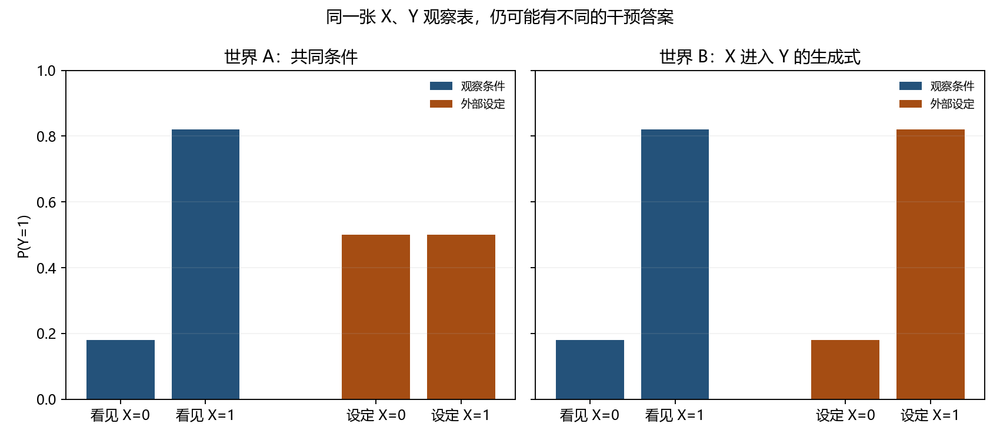

# 第十章　看见相关之后，能否判断改变的后果

第九章的概率图可以把一行消费的联合密度拆成较小的因子，也能在一项消费暂缺时算模型的条件分布。这种图很有计算价值，却还没有告诉我们：若主动改变其中一个量，其余量会怎样。看到 Milk 与 Grocery 在一份客户表里一起升降，并不等于给一位客户增加牛奶采购，就会令他的杂货消费按同一条条件概率改变。前者是观察到什么，后者要求一个“改变如何进入世界”的说明。

我们先不把批发客户当试验对象。他们的原档案没有随机分配营销行动，没有记录同一位客户接受与不接受行动的两种结果；拿那张表讲精确干预效果，只能是凭空补事实。本章改造两个**明确由作者规定的二值小世界**。电脑可以把它们所有可能情形算完，再照设定做一次随机分配模拟。这个构造不是现实因果结论，却能严格检查一个问题：两套不同的因果安排，能否把**所有可见的 \(X,Y\) 频率**做得完全一样？若能，只凭那些频率便不能知道该信哪个改变后的答案。

## 同一张观察表，可以怎样形成

两个世界都有一个尚未放进观察表的二值条件 \(U\)，0 和 1 各占一半。它可以被读成“某种背景条件”，但不要给它安上客户身份、疾病或性格；它只在本章检验计算的界线。另有几枚彼此独立的随机扰动：\(N_X,N_Y\) 各以 0.1 的机会为 1。符号 \(\oplus\) 是异或：两个二值相同给 0，不同给 1。于是 \(U\oplus N_X\) 通常等于 \(U\)，偶尔被 \(N_X\) 翻转；随机扰动不是一句“有噪声”就算解释，0.1 指明了它多久翻一次。

**世界 A** 用
\[
X=U\oplus N_X,\qquad Y=U\oplus N_Y.
\]
\(U\) 分别进入 \(X\) 和 \(Y\) 的生成式，\(X\) 本身没有进入 \(Y\) 的生成式。若 \(U=0\)，两项多半都为 0；若 \(U=1\)，它们多半都为 1。所以只观察 \(X,Y\) 时，很容易看见两者一道变化，即使“把 \(X\) 改掉”不会在这套式子中传到 \(Y\)。

**世界 B** 保留 \(X=U\oplus N_X\)，却另取独立的 \(N_B\)，令它以 0.18 的机会翻转，并设
\[
Y=X\oplus N_B.
\]
这里 \(Y\) 真的读取 \(X\)；\(U\) 对 \(Y\) 的作用经由 \(X\) 走。0.18 是本章在运行前定的数：两个独立的 0.1 翻转若恰有一次发生，其机会是 \(0.1(0.9)+(0.9)0.1=0.18\)。世界 A 的 \(X,Y\) 是否不同，正是两枚 0.1 扰动恰翻一次；世界 B 直接把这个总翻转机会交给 \(N_B\)。这项构造有理由，也不是自然资料逼我们只选这两套式子。[运行前约定](../verification/C10_twin_worlds_protocol.md)把它们完整保存。

先沿**只观察**这条路把两个世界各算完。世界 A 中，\(X=0,Y=0\) 有两种来源：\(U=0\) 且两枚扰动都不翻，机会为 \(0.5(0.9)(0.9)=0.405\)；或 \(U=1\) 且两枚都翻，机会 \(0.5(0.1)(0.1)=0.005\)。两项相加得 0.41。依同样办法，世界 A 的完整四格表为
\[
\begin{array}{c|cc}
 &Y=0&Y=1\\\hline
 X=0&0.41&0.09\\
 X=1&0.09&0.41
\end{array}.
\]
世界 B 里 \(X\) 仍各半；给定 \(X\)，\(Y\) 有 0.82 的机会与它相同、0.18 的机会不同。因此，例如 \(P(X=0,Y=0)=0.5(0.82)=0.41\)，其余三格也恰好是同一张表。这不是只让某一项相关系数碰巧相同，而是把观察 \(X,Y\) 能提供的**整个联合分布**做成一样。

从表里选出 \(X=1\) 的行，\(P(Y=1\mid X=1)=0.41/(0.09+0.41)=0.82\)；选 \(X=0\) 的行，\(P(Y=1\mid X=0)=0.09/(0.41+0.09)=0.18\)。观察条件之差为 0.64。两世界都能正确报出这两个条件概率；若任务只是“看到 \(X\) 后预测 \(Y\)”，它们谁也不是被安排来失败的旧模型。第九章会写 \(P(Y\mid X)\) 的模型，正是在回答这种**观察预测**。接下来改变的不是预测器算术，而是我们问的对象。

## 把一个量固定住，不是再筛选一批记录

想问“主动使 \(X=1\) 会怎样”，要先规定主动动作具体做什么。在本章两套生成式里，操作是把原来的 \(X=U\oplus N_X\) **替换**为 \(X:=1\)，同时保留 \(U\)、结果扰动及 \(Y\) 的其余生成规则；设成 0 亦然。这里的冒号提醒我们这是改生成步骤，不是从已经生成的表中挑 \(X=1\) 的行。常用记法 \(do(X=x)\) 为这种外部设定命名，它的意义来自刚才说清的替换动作，不是给普通条件概率加一个更强的符号。

在世界 A，即使硬把 \(X\) 设成任一值，\(Y=U\oplus N_Y\) 没有被改，故 \(P(Y=1\mid do(X=0))=P(Y=1\mid do(X=1))=1/2\)，平均改变为 **0**。在世界 B，设 \(X=0\) 后 \(Y=N_B\)，为 1 的机会是 0.18；设 \(X=1\) 后 \(Y=1\oplus N_B\)，为 1 的机会是 0.82，差为 **0.64**。一张观察表，两个干预答案；没有一项计算出错。

这给“**可识别**”一个可以检验的含义。若只交给研究者完整的 \(P(X,Y)\)，并允许上述两套生成办法，研究者看到的都是那张 \((0.41,0.09;0.09,0.41)\) 表，却要对同一个目标报 0 或 0.64。四格都有正机会，这个反例不靠一格资料永远缺失。任何只以这张表为输入的固定计算函数，都不能同时给出两种答案。因此，在**这些可用观察和允许的机制范围内**，平均干预效应不可识别。这个结论不是说宇宙永远不许我们了解因果：若另外测到 \(U\)、能随机设定 \(X\)，或有足以排除一套世界的领域事实，信息集合便变了。也不是说从某一张有限表还没推出来，就证明世界 A 的效果实际上必为零；零是 A 已写下的结构式给出的答案。

蓝柱是“从已发生记录里**看见** \(X=0\) 或 1”时 \(Y=1\) 的条件机会，左右两个世界完全相同；橙柱是按各世界规则**设定** \(X\) 后的机会。此图是上面的八种外生组合精确穷举所画，不是收集了真实人群再统计。它展示的差别来自两套机制，不来自对某一组观测者的道德评价或某个软件估计器的胜负。

## 同一个单位没法同时走两条路，怎样谈改变

对同一组 \(U,N_X\) 和结果扰动，可以在脑中或电脑里分别把 \(X\) 设成 0、1，记得到的结果为 \(Y_i(0),Y_i(1)\)。这叫这个单位的两项**潜在结果**；它们不是原观察表上的两列，因为一个单位在实际的一次运行里只接受了一个 \(X\)。若它原来恰有 \(X=x\)，实际看见的 \(Y\) 应等于 \(Y_i(x)\)；这项对应叫**一致性**，要求“设为 \(x\)”真是定义清楚的同一种处理，不让两个版本被同一个字母掩盖。

世界 A 的 \(Y_i(0)=Y_i(1)=U_i\oplus N_{Y,i}\)，每个单位在本机制里受 \(X\) 改动的差都是零。世界 B 的两项是 \(Y_i(0)=N_{B,i}\)、\(Y_i(1)=1\oplus N_{B,i}\)：当扰动不翻时差为 \(+1\)，翻时差为 \(-1\)。前者有 0.82 的机会，后者有 0.18，所以平均差 \(0.82(1)+0.18(-1)=0.64\)。这是**平均效果**，不是承诺世界 B 每个单位都因设 1 得益。电脑知道模拟世界的外生变量，才能在同一单位上计算两条路；真实研究者不能把这种内部可见性假装成观测资料。

再问一个真正面向**已发生单位**的问题：某条记录里 \(X=1,Y=1\)，如果这一次把它的 \(X\) 改为 0，\(Y\) 会怎样？世界 A 的 \(Y\) 不读 \(X\)，所以仍为 1；世界 B 的这条记录必有 \(N_B=0\)，改 \(X\) 后就会变成 \(Y=0\)。我们问的不是重新随机抽一个接受 \(X=0\) 的单位，而是给**同一单位、保留其外生条件**作另一种动作，这叫反事实查询。即使已经知道 \(P(Y\mid do(X=0))\) 与 \(P(Y\mid do(X=1))\) 两份群体分布，它们也只给各自边际；若没有更多关于两项潜在结果怎样在同一单位上配对的机制，不能自动回答这条记录的反事实。

这个“两种可能产量、实际只见其中一种”的问题有历史位置。阅读顺序在这里回到更早的农业试验，因为我们从第九章的概率图换到了**安排不同处理**的问题；不是后来的客户图曾指引当年研究。Neyman 在 1923 年的论文里，把一块田分成许多小地块，设想第 \(i\) 种作物若种在第 \(k\) 块地，会有一个产量 \(U_{ik}\)。第一个下标数作物，第二个数地块。于是对**同一块地**，不同作物的可能产量在数学表中同时有位置；实际耕种时却只能看到被安排的那一种。

他用一个很具体的“多只瓮”模型说明试验分配：每种作物对应一只瓮，瓮中的球带着地块编号及该作物在这块地的潜在产量；若取出某个地块编号的球，其他瓮中同编号的球也随之移走。这个动作把“这块地只能接受这一次被分到的作物”变成了抽样规则，同时留下其余作物在同一地块上的未知产量。他进一步研究如何由随机安排比较不同作物的平均产量，而不是宣称实验能观测每块地的所有可能产量。现存广泛可读的英译发表于 1990 年，不能把翻译日期当研究起日。眼前的 \(Y_i(0),Y_i(1)\) 是我们给二值教学世界用的现代记号；史料提供的是问题和分配机制的真实来路，不支持虚构 Neyman 当年研究过两枚异或噪声。([Neyman，1923，第 9 节；Dabrowska 与 Speed 1990 英译，第 465—467 页](https://www.mimuw.edu.pl/~noble/courses/BayesianNetworks/90NeymanTranslation.pdf))

## 不知道那个共同条件，还能设计一次可信的比较吗

如果我们能在运行世界之前，用一枚与 \(U,N_X,N_Y,N_B\) 都无关的公平硬币决定把 \(X\) 设成 0 还是 1，那么 \(U\) 不会因为“自然地更容易出现 \(X=1\)”而系统地集中到一边。随机分配不是把各组每一项背景都变得**逐个相同**；它使分配量 \(A\) 独立于两项潜在结果。此处把随机分配后实际看到的结果仍记 \(Y\)，按一致性就有 \(E[Y\mid A=x]=E[Y(x)]\)。在重复这样的安排时，两边的结果平均才对准各自的潜在结果平均。单次有限分配仍会有不平衡和误差，不能把“随机了”说成每个样本必然正好等于理论期望。

Fisher 1935 年用八杯茶讲试验设计时，四杯各用一种倒入顺序，再把杯子以随机顺序交给辨别者。他特别指出一个会毁掉比较的具体情形：若奶先倒的杯子恰好全都另加糖，受试者可能是闻到了糖，而不是辨出了研究者想测的倒入次序。**只随机展示顺序也救不了“加糖”和制法完全捆绑的杯子**；在准备杯子时便须避免这项共同变化。另一方面，又不可能把杯子的材质、温度、冲泡等每一项干扰完全做成一样。合理的随机安排不让余下未知差异被人的选择系统地排到处理的一边。这项历史试验研究的是**能否辨别两种茶**，并非我们模拟的平均处理效果；取它的实际设计压力，不把茶杯叫成世界 A 的真实单位。([Fisher，1935 原文的后出选段，第 1—4 页](https://mystatclass.com/media/Fisher_paper.pdf))

本机按[预定程序](../code/twin_causal_worlds.py)另模拟每世界 20,000 个单位：先依各自机制得到自然观察的 \(X,Y\)，再用独立随机数作一次处理分配，并保持该单位的 \(U\) 与结果扰动不变，算分配后 \(Y\)。这是电脑对**已规定的教学世界**作实验，不是现场招募受试者。[逐项结果](../results/twin_causal_worlds.json)中，一次模拟的观察组差约为世界 A 的 0.644、世界 B 的 0.637；随机分配组差则约为 **0.001**、**0.637**。它们未必与精确的 0、0.64 完全相等，因为只抽了一次有限样本。真正证明两世界有不同干预答案的，是前面结构式的精确计算；这次随机模拟让设计和有限误差可见。

## 若把共同条件也记录下来，观察资料能多回答什么

随机设定不是取得因果信息的唯一办法。到了 1970 年代，教育和社会研究中的许多处理无法总按实验者心意随机安排；Rubin 1974 年认真讨论随机与非随机研究的处理效应、匹配和外来变化控制，没有把非随机资料一概判废。它留下的是“**哪些额外条件能使观察组可比**”的任务，不是一张给任意资料的通行证。([Rubin，1974，原刊档案摘要](https://dash.harvard.edu/entities/publication/73120378-82c0-6bd4-e053-0100007fdf3b))

在我们的教学世界中，假如不能主动设 \(X\)，但事前确实记录了共同原因 \(U\)，便有一条可具体计算的路。为什么按 \(U\) 分层能用观察到的 \(X\) 来讨论另一种安排？给定 \(U\) 后，日常观察到的 \(X\) 只还依赖 \(N_X\)；世界 A 的两项潜在结果只依赖 \(U,N_Y\)，世界 B 的两项只依赖 \(N_B\)。本章事先规定这些扰动彼此独立，所以在任一固定的 \(U=u\) 内，\(X\) 不会挑中潜在结果的某种取值。从许多可能单位中抽取一位时，把上节的个体量 \(Y_i(x)\) 看成随所抽单位变化的随机量 \(Y(x)\)，刚才的关系可记为 \(Y(x)\perp X\mid U\)：它说的是**给定 \(U\) 后的独立**，不是说整个世界中 \(X,Y\) 不相关。再用已经定义的“一致性”把实际看到的 \(Y\) 与接受的 \(X\) 接起来，只要该层中 \(X=x\) 有正机会，就有

\[
P(Y=1\mid X=x,U=u)=P(Y(x)=1\mid U=u).
\]

先看世界 A：给定 \(U=0\)，\(Y=1\) 的机会恒为 0.1，不论 \(X\) 记录为 0 还是 1；给定 \(U=1\)，机会恒为 0.9。因此，在每个 \(U\) 内，那个原来 0.64 的表面差已经消失。把两个 \(U\) 的结果按整个世界中各一半的比例重新合起来，
\[
\sum_{u=0}^{1}P(Y=1\mid X=x,U=u)P(U=u)
=\tfrac12(0.1)+\tfrac12(0.9)=0.5,\quad x=0,1.
\]
它正好等于世界 A 的两个干预答案。世界 B 若同样记录 \(U\)，则在每个 \(U\) 内 \(P(Y=1\mid X=0,U)=0.18\)、\(P(Y=1\mid X=1,U)=0.82\)，加权后得到另一套正确的干预答案。两世界观察到 \(U,X,Y\) 后不再是同一份资料；“原来不可识别”所指的信息边界改变了。

这条**分层加权**关系在这里不是把“控制变量”当万能指令。它用到了：\(U\) 已测且足以挡住 \(X\) 与 \(Y\) 的共同原因路径；给定每个 \(U\) 时，两种 \(X\) 都有正机会，条件行才能从观察中学习；记录中的 \(X=x\) 对应我们要设定的那个同一处理，且一个单位所受处理不暗中改变另一个单位的结果。常把这些要求分别说成没有遗留共同原因、**重叠或正值性**、一致性及**无干扰**。在两套教学世界中，\(N_X\) 有 0.1 的翻转机会，所以即使固定 \(U\)，两种 \(X\) 仍都能出现，正值性不是靠口头假定的。若把 \(N_X\) 永远设为零，某些 \(U,X\) 配对在观察资料中根本没有，刚才那份分层计算就缺一格；**缺少这份观察识别**不等于模型里的干预结果必然不存在。

观察研究后来还发展出应对很多已记录背景量的办法。Rosenbaum 与 Rubin 1983 年研究的**倾向分数**是“给定已观察背景，获得某种处理的机会”，用它可以组织匹配或分层，减少多项已测背景的比较不平衡；但若真正共同原因 \(U\) 从未记录，给一份只含 \(X,Y\) 的表估再漂亮的分数，也不会把 A 与 B 分开。1995 年 Pearl 进一步用数学记法把普通 \(P(Y\mid X=x)\) 与外部固定 \(X\) 后的量区分，并研究在什么图假设下观察分布足以识别干预效果。他在 1995 年研讨会的论文后来由 PMLR 于 2022 年重发；重发不是这条思想到 2022 年才出现。我们的分层式只是一个可手算的情形，不冒称教完所有图上的识别规则。([Rosenbaum 与 Rubin，1983，原刊摘要及方法范围](https://academic.oup.com/biomet/article-abstract/70/1/41/240879)；[Pearl，1995，原论文摘要和刊行信息](https://proceedings.mlr.press/r0/pearl95a.html))

还有一道相反的边界：**不是记录越多、调整越多，就一定更接近因果。**令两个原本独立的公平二值量 \(A,B\) 共同决定 \(C=A\lor B\)（至少一个为 1 时 \(C=1\)）。未筛选时，无论 \(A\) 是 0 还是 1，\(B=1\) 的机会都为一半。可若只看 \(C=1\) 的记录，已知 \(A=0\) 就逼出 \(B=1\)，机会为 1；已知 \(A=1\) 时 \(C\) 自动满足，\(B=1\) 仍为一半。**筛选共同结果 \(C\)** 反而造出了 \(A,B\) 的条件关联。它不涉及本章世界 A 的 \(U\)；这个小反例只说明为何“调整 \(U\)”须由它在机制中的位置解释，不能升级为“见到变量就全塞进回归”。

## 程序究竟换了哪一行

完整本机代码只用 Python 与 Matplotlib。它先对每世界的 \(U\) 和两枚扰动穷尽 \(2^3=8\) 种外生组合，逐格加上已写的机会；对每一组合分别让 \(X\) 自然生成、强制为 0、强制为 1。后面的 20,000 单位模拟才使用随机种子；程序把精确表与模拟分开保存，而不会拿模拟碰巧接近的数替代理论。承重的差别其实就在结果生成函数里：

~~~python
def y_after(world, u, own_noise, forced_x):
    if world == "A":
        return u ^ own_noise
    if world == "B":
        return forced_x ^ own_noise
    raise ValueError(world)
~~~

观察时，forced_x 是自然生成的 \(u\oplus n_x\)；干预时它是外部指定的 0 或 1。世界 A 不读取这个参数，所以改 \(X\) 不传到 \(Y\)；世界 B 读取，所以会传。这个函数只执行我们写下的假设，没有根据观察表自行“发现箭头”。[精确表、分层值、潜在结果与一次模拟](../results/twin_causal_worlds.json)让每个量能回到对应的循环；程序还核对两张观察表严格同值、给定 \(U\) 后的分层式确与各自干预一致。

在项目根目录 PowerShell 终端运行：

~~~powershell
$env:PYTHONUTF8='1'
python work/code/twin_causal_worlds.py
~~~

若想改条件，先复制文件另作练习，不覆盖本章固定结果。比如把世界 A 的 \(N_Y=1\) 机会从 0.1 改为 0.2，世界 B 要保持**同一观察表**，相应翻转机会就不再是 0.18，而须重算“两枚扰动恰翻一次”的概率。程序故意把原先 .41/.09 与干预差写进精确检查；不改这些预期便报错，正是提醒你任务已经变了。

## 从预测走到因果，我们真正加了什么

这一章没有发现一个比条件概率更会拟合的预测器。两个世界在所有 \(X,Y\) 观察上同样好；新增的是**生成式在外部设定时怎样保持或被替换**的假设，以及随机分配或已测背景可能提供的额外信息。潜在结果让“同一单位的两种可能”有了可写对象，结构方程让干预的替换动作可以逐项核对；在这两个明确构造里，它们对平均效果给出一致答案。观察、干预、反事实不是三种可互换的英语说法，而是向资料和机制提出的不同问题。

我们也看到识别的边界。只拿 \(P(X,Y)\)，A 与 B 无法区分；测到足够的 \(U\) 且各层有重叠，或合理地随机分配 \(X\)，才多出计算干预的依据。现实里哪些背景足够、处理是否有不同版本、时间顺序怎样、是否有人互相影响，都需要具体研究，不能给业务账本画了箭头就宣称答案已知。下一章将换另一类来源：有时连要学的正确标签都没有，却已知规则、目标与允许的行动，程序能否靠**搜索与约束**找到一次合法的解？这是数据预测和因果估计之外的能力，需要自己的对象与核验。

## 先写出将要改变什么，再核对结果

1. 在世界 A 逐项列出 \(P(X=0,Y=0)\) 的两种 \(U\) 来源，再算 \(P(X=0,Y=1)\)。世界 B 不枚举 \(U\)，只用 \(X\) 公平和 \(N_B\) 翻转 0.18，重做两格。为什么四格全相同，比“相关系数相同”更强？
2. 对世界 A 与 B 分别写一位单位的 \(Y(0),Y(1)\)，在世界 B 区分 \(N_B=0\) 与 1 的个体差。若一条记录为 \(X=1,Y=1\)，两套已经写明的机制分别给它怎样的 \(Y(0)\)？若只有观察表、并不知道是哪套机制，能不能给这条记录同一个反事实答案？
3. 若世界 A 的 \(U\) 可测，按 \(U=0,1\) 两层算 \(P(Y=1\mid X=x,U=u)\)，再加权回整个世界。若将 \(N_X\) 改成恒零，哪一层的哪项观察条件概率失去样本？模型的干预数值也必须随之不存在吗？
4. 对独立公平的 \(A,B\) 和 \(C=A\lor B\)，在不筛选与只看 \(C=1\) 两种资料里分别算 \(P(B=1\mid A=0)\) 与 \(P(B=1\mid A=1)\)。把这一结果同“控制越多越好”的口号比较；它没有证明哪一种实际医疗或营销变量就是碰撞点。
5. 先在纸上把 \(P(N_X\oplus N_Y=1)\) 改算成 \(N_X\) 翻转 0.1、\(N_Y\) 翻转 **0.2** 的情形，再复制本章程序、修改两世界相应机会和预定的精确核对。解释为什么这是一项**改变观察世界**的迁移，不是把结果文件里的 .64 改写为另一个数。原稿程序与结果保持可回查。

**核对。**第一题世界 A 的 \(P(0,0)=0.5(0.9)^2+0.5(0.1)^2=0.41\)，\(P(0,1)=0.5(0.9)(0.1)+0.5(0.1)(0.9)=0.09\)；B 用 \(0.5(0.82)=0.41,\ 0.5(0.18)=0.09\)。整个联合分布相同，任何只依赖这些四格的统计量也相同。第二题 A 的两项潜在结果相同；B 在 \(N_B=0\) 时差 \(+1\)，在 \(N_B=1\) 时差 \(-1\)。已见 \(X=1,Y=1\) 的单位在 A 下 \(Y(0)=1\)，在 B 下 \(Y(0)=0\)；只凭相同的观察表无法选定其一。第三题 A 在任一 \(x\) 下两层 \(Y=1\) 机会为 0.1、0.9，加权得 0.5；若 \(N_X=0\)，给定 \(U=0\) 看不到 \(X=1\)，给定 \(U=1\) 看不到 \(X=0\)，观察调整缺格，但已写机制仍定义干预。第四题未筛选时两者都是 0.5；在 \(C=1\) 中，\(A=0\) 时为 1，\(A=1\) 时为 0.5。第五题恰翻一次的机会是 \(0.1(0.8)+0.9(0.2)=0.26\)；若 B 仍要复制观察表，\(N_B\) 须取 0.26，此时观察条件差改为 \(0.74-0.26=0.48\)，A 干预效果仍为零，B 为 0.48。
