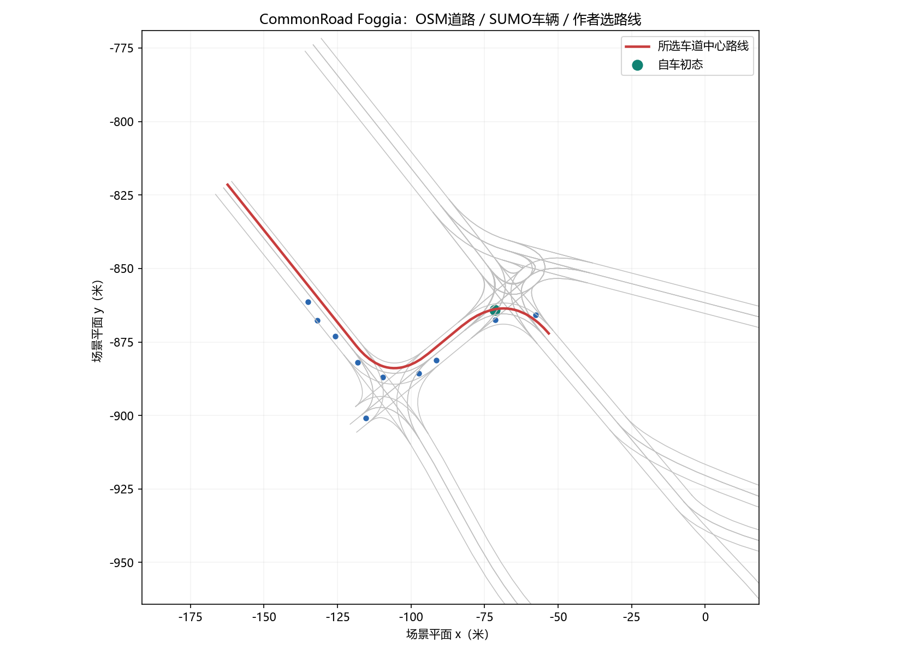
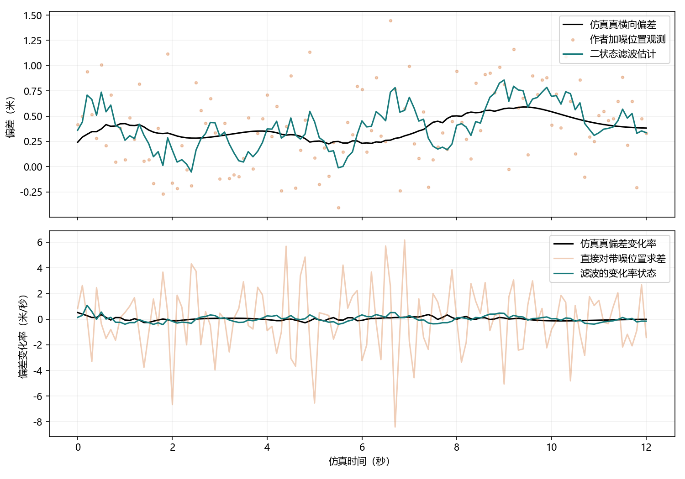
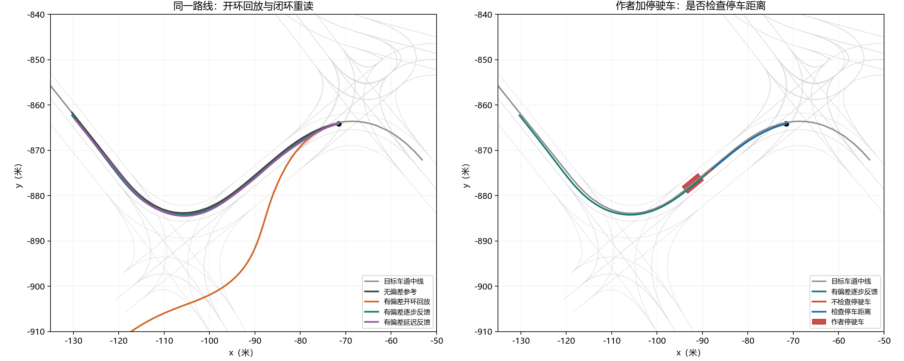
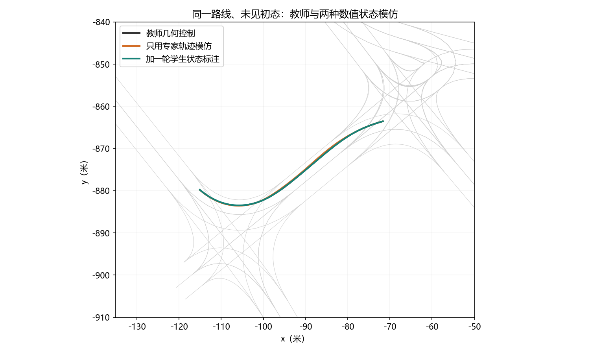

# 第四十二章　动作落地以后，怎样跟着世界改方向

## 一条正确的命令，为什么还不是一次正确的行驶

上一章的两个本机服务都能接收符合协议的任务，也都能把结果装进标准的产物。接收方写下“已完成”，只能说明它怎样报告自己的工作；如果产物缺少可核来源，主作者仍须拒收。[第四十一章末尾](第四十一章_接口会说话之后谁来负责完成任务.md#fortyfirst-next)把问题再向前推了一步：把“读取段落”换成“让车辆转向”，发出合法命令以后，位置、方向和速度会在下一次请求到来之前变化。道路也不因一条命令已获确认而停止变化。

第二十一章那辆配送车有一张精确的后果表；那使我们看清动作如何改变未来，却没有告诉我们一辆有长度、有转向机构的车在两次决策之间会走到哪里。第二十四章在CartPole里让控制器反复读到模拟器给出的四个数，也看见了学得模型的一步误差可能在开环试走时积累。这里要补的是另一层：**物理状态由连续运动产生，控制器只能在有限时间、有限观测下不断修正它。** 因此本章会有路径、估计、控制、模仿和安全检查，但它们始终围着同一辆作者规定的车、同一条有来源的道路工作；每加入一项，都要说明它看见什么、改变什么、还有什么没有被证明。[状态与观测的真实前页](第二十一章_一次行动为何改变以后.md#twentyfirst-observation)；[学模型与重规划的真实前页](第二十四章_未来可以从哪里算出来.md#twentyfourth-learn-model)

我们选择的路来自CommonRoad公开的Foggia示例。XML有101个车道片段、一个给定的起点和目标车道、十辆别车的模拟轨迹。地名与道路形状来自OpenStreetMap，其他车的运动由SUMO模拟；文件没有提供一帧相机影像、一份司机方向盘记录或真实轮胎抓地系数。作者在可达的车道后继关系里选出`82212→78050→83276→79895`四段，沿两侧边界的中点拼成147.101米的路线。这个选择使“沿哪条线走”可以重复，不意味着原文件指定了唯一好路线。[原XML、许可与可见内容](../data/c42_commonroad/SOURCE.md)；[本机实际解析报告](../runs/c42_scene_first/report.json)

图上绿色点是待控制车辆的初态，蓝点是XML给出的其他模拟车初态；红线是作者选的路线。控制器在这张图里能取得**准确的二维坐标和路线**。它没有学会从第十三章的真照片辨认车道，也没有把第三十三章的多帧运动网络装上车。视觉给了我们可以研究传感器的上游知识，但本章数值控制器的输入是场景文件解析出的状态。若把真像素识别的错误和时延接上来，得到的就会是另一项需要训练、评价和约束的系统。[视觉局部形状的现行讲解](第十三章_同一种局部形状为何能在别处认出.md#thirteenth-sharing)；[同一画面不同运动方向](第三十三章_视频不只是许多图片.md#thirtythird-frame-object)

## 人为什么早就知道“量到偏差再改”，却仍要研究怎样改

道路上的闭环问题比人工智能这个学科的命名早得多。1868年，麦克斯韦在《On Governors》讨论的是蒸汽机调速器：转速变了，调速机构改变蒸汽输入，新的输入又改变转速。如果只说“偏快就减，偏慢就加”，似乎已经有了办法；但机构有质量和阻尼，调节太强时，偏差可能一次次越过目标，振幅甚至增加。他研究的正是哪些运动会衰减、哪些会持续或放大。把一辆车的速度误差写成今天的离散更新，是我们为了教学所作的重构，不是说麦克斯韦当年写过本章的汽车控制程序。[麦克斯韦1868原文](https://www.maths.ed.ac.uk/~v1ranick/papers/maxwell1.pdf)

接下来的几十年，控制对象和所需的测量逐渐改变。1922年Minorsky发表关于自动操舵物体的**方向稳定**研究，目标已不再是蒸汽机转速，而是一个会朝错误方向继续运动的船体；本次能直接核到原期刊题名、刊期和页码，没有读其全文，所以不把某条现代转向公式说成他的原式。1932年Nyquist在电话放大器的再生问题上研究反馈与稳定，讨论的是另一种硬件和误差信号。1940年MIT成立伺服机构实验室，战争时期的定位和跟踪要求让“测量、执行、延迟”成为实际工程问题。1948年维纳的《控制论》又把控制与通信并列讨论，跨越机器与生物体。它们不构成“船舵论文必然生出自动驾驶”的单向家谱；相通的问题是：过去给出的控制量怎样通过一个会变化的对象，返回新的、可能有噪声的测量。[Minorsky原期刊页](https://onlinelibrary.wiley.com/doi/10.1111/j.1559-3584.1922.tb04958.x)；[Nyquist原刊卷期入口](https://vtda.org/pubs/BSTJ/vol11-1932/bstj-vol11-issue01.html)；[MIT实验室沿革](https://www.mit.edu/~lids/about-lids/history.html)；[MIT Press对维纳原书的说明](https://mitpress.mit.edu/9780262355919/cybernetics-or-control-and-communication-in-the-animal-and-the-machine/)

到1960年，卡尔曼提出的线性随机过滤与预测问题把另一个缺口摆到中央：控制需要知道对象当前处境，可测数值却常带噪声，有些重要状态根本没有直接仪表。在一种给定的状态转移与测量模型里，可以把上一步估计带到本步，再按测量的不确定程度修正。我们只核到了他原刊页与摘要；稍后的二状态矩阵递推由本章明确假设重新推出，不把未读的原文推导冒充已核史料。[卡尔曼1960原刊页与摘要](https://doi.org/10.1115/1.3662552)

人工智能里的移动机器人后来又碰到空间规划与行动时效。SRI在1968—1972年间的Shakey工作把有限感知、世界表示、计划和真实移动放到同一实验系统里；这里依据的是项目参与者后来的整理，不虚构某次现场的传感读数。工业控制也走出一条并行路线：Cutler与Ramaker在1979年报告、1980年发表的动态矩阵控制，针对有延迟的化工过程，用可测响应系数预测将来几步，并在下一次测量后重算。1985年Brooks讨论移动机器人的异步分层反应，提醒人们别让高层表示和计划的等待阻止低层及时动作。他最初文件包含模拟设计，不是任意公路安全实验。**先预测较远后果**与**先保证眼前及时反应**是面对不同信息和时间约束的候选；后面的路口会同时需要两者。[Shakey参与者事后报告](https://ai.stanford.edu/~nilsson/OnlinePubs-Nils/shakey-the-robot.pdf)；[1980年动态矩阵控制原文](https://skoge.folk.ntnu.no/puublications_others/1980_Cutler-Ramaker_Dynamic-matrix-control_JACC1980.pdf)；[Brooks1985 MIT原备忘录](https://dspace.mit.edu/entities/publication/362a32d0-a821-4a9d-a5ff-9e2b71c5539d)

从这段历史带到我们的不是一个必须原样继承的仪器箱，而是三项可分开检查的工作：用观测推断目前状态，依据运动规律推算命令会带来什么，然后在下一次观测到来时纠正先前预测。少了第一项，反馈程序可能是在纠正一个并不存在的偏差；少了第二项，它只能凭感觉试转；少了第三项，再准确的起点预测也会对执行误差失明。

## 坐标相同的两辆车，可以需要相反的转向

先不把“状态”写成一排字母。想象此刻两辆车的后轴都在同一地图点，速度表同为9.189米/秒，但车头一个略偏左，一个略偏右。若只保存坐标和速度标量，程序给两者的输入完全相同；下一刻它们前进的方向却不同，回到路线的转角也不该相同。前章一张球的画面不能表示球究竟往哪个方向飞，在这里对应的是**位置之外还需航向、速度方向和转向执行机构的位置**。不是所有机器都恰好需要这些五个量；这是为当前车模型选择的足够信息。[C21的状态充分性](第二十一章_一次行动为何改变以后.md#twentyfirst-observation)

本机把后轴点和速度固定，只使航向相对原初值偏移`−0.15、0、+0.15`弧度。后面即将推导的同一个几何控制器分别要求转向`+0.19153、+0.09316、−0.00915`弧度。第三种甚至跨过了零。这是一项完全可重复的计算，不是说现实中的摄像头已经量出了朝向；它说明若未来传感器只给当前点位，控制所需的一部分状态仍没被交给控制器。[同位置数值核验](../runs/c42_same_position.json)；[对应代码](../code/c42_same_position_probe.py)

我们把车在第\(t\)个0.1秒时刻的模型状态选为\(s_t=(x_t,y_t,\psi_t,v_t,\delta_t)\)：\((x,y)\)是后轴位置，\(\psi\)是车身朝向，\(v\)是沿车身前进的速度，\(\delta\)是**已经达到的**前轮转角。控制器要求的转角可叫\(u_t^\delta\)，它不一定立刻变成\(\delta_t\)；转向机每秒最多改变0.7弧度。加速度命令叫\(u_t^a\)。这一区别会防止我们在数学里写“要求左转”而在代码里假设车轮已瞬间转到位。[实际车辆状态与执行代码](../code/c42_bicycle_control.py)

实际车上不是直接打开一个XML得到这五个真数。相机给像素，卫星定位或轮速仪表给有误差的读数，惯性传感器也会漂移；此时\(o_t\)是观测，\(s_t\)是希望描述的物理状态，过去观测与动作能帮助估计\(s_t\)。为看清估计在做什么，我们从**本机已经生成的一条轨迹**取出真横向偏差\(e_t\)，由作者再加独立的标准差0.4米的高斯噪声\(\eta_t\)，形成只能看见的\(z_t=e_t+\eta_t\)。这是刻意造出的噪声，不是声称Foggia XML给了GPS读数。

若只拿两次带噪位置作差以猜横向变化率，噪声也被除以0.1秒；两次独立噪声之差的方差是\(2\sigma^2\)，差分率的标准差便是\(\sqrt2\sigma/0.1\)。代入\(\sigma=0.4\)米，约为5.66米/秒——它是按噪声假设算出的尺度，并不是这121个有限样本实测RMSE。要少受单次噪声摆布，可以把\((e_t,\dot e_t)\)作为**估计器的**二状态，暂假定一个0.1秒内变化率大致保持：

\[
q_{t+1}=Aq_t+w_t,\qquad z_t=Cq_t+\eta_t,\qquad
A=\begin{pmatrix}1&0.1\\0&1\end{pmatrix},\quad C=\begin{pmatrix}1&0\end{pmatrix}.
\]

这个\(q_t\)只是横偏的局部统计近似，**不是整辆车的动力学状态**。在转弯处\(\dot e\)会改变，所以我们用过程误差\(w_t\)承认近似不准，并自行选协方差\(Q=\operatorname{diag}(0.0025,0.03)\)；观测噪声方差\(R=0.16\)。若上一步估计的误差协方差是\(P\)，先让模型走一步：\(\hat q^-_t=A\hat q_{t-1}\)，\(P^-_t=AP_{t-1}A^\top+Q\)。观测到\(z_t\)后，不是总相信测量，也不是总相信旧预测。令残差\(r_t=z_t-C\hat q^-_t\)，若用\(K r_t\)修正，在线性、零均值且所列协方差正确的假设下，最小化更新后均方误差给出

\[
K_t=P^-_tC^\top(CP^-_tC^\top+R)^{-1},\qquad
\hat q_t=\hat q^-_t+K_t r_t,\qquad
P_t=(I-K_tC)P^-_t.
\]

为什么增益分母恰是两份不确定度之和？把预测误差记为\(h_t=q_t-\hat q^-_t\)，校正后的误差便是\((I-KC)h_t-K\eta_t\)。假定这两种误差零均值且相互独立，它们的协方差是\((I-KC)P^-(I-KC)^\top+KRK^\top\)。对矩阵\(K\)选择使各状态误差方差之和（矩阵的迹）最小，展开二次式的驻点条件为\(K(CP^-C^\top+R)=P^-C^\top\)，就得到上面的增益；再代回可把最优协方差写成\((I-KC)P^-\)。这里的逆只作用于一个标量：\(CP^-C^\top+R\)是预测位置误差与测量误差合起来的不确定度。预测很不可靠时，\(K\)会使新测量更有分量；测量很吵时，它更依赖运动预测。第一步的两个增益实际为约`0.867、0.333`，第二个数表明只量位置仍可借时间变化修正未直接量到的横向变化率。若噪声有系统性偏差、不是独立白噪声，或曲路的常速近似严重失真，上述最小均方解释及数值效果都要重新检查。[本机滤波代码](../code/c42_lateral_state_filter.py)；[完整运行和假设](../verification/C42_control_imitation_protocol.md)

这121个采样点里，直接带噪位置的横偏RMSE为0.369米，滤后为0.186米；直接把带噪位置差分的变化率RMSE为2.554米/秒，二状态估计为0.254米/秒。图的转弯处也能看见估计相对真线有偏差和滞后。最要紧的是：**下面的车辆控制实验仍读取仿真真状态，没有把这个滤波输出送去转向。** 所以这些较小的估计误差不能悄悄换成“闭环车因此更安全”。[数值收据](../runs/c42_filter_verified/report.json)

## 从前轮朝向，到下一个位置

现在才轮到“车会怎样动”。把车想成前后两个轮轴相距\(L\)的简化自行车，轮胎不横滑，前轮相对车身转角为\(\delta\)。若后轴沿以半径\(R_c\)的圆走，后轮的运动方向沿车身，前轮方向沿前轮朝向；画出两轮法线交于同一瞬时圆心的直角三角形，就得\(\tan\delta=L/R_c\)。角速度等于线速度除以半径，于是

\[
\dot x=v\cos\psi,\qquad \dot y=v\sin\psi,\qquad
\dot\psi={v\over L}\tan\delta,\qquad \dot v=a.
\]

它把转向角和下一刻航向连了起来。\(\delta=0\)时\(\dot\psi=0\)；同样的轮角在速度更高时，每秒转过的朝向更多。反过来，若轮胎侧滑、车体有动态横摆或转向柱跟不上，\(\tan\delta/L\)就不再是那辆真车的全部转弯规律。这是明确列出条件的**运动学模型**，不是从CommonRoad XML推回了真实轮胎参数。[Stanley论文对理想自行车与现实延迟的分别讨论，§9.2](https://ai.stanford.edu/~gabeh/papers/thrun.stanley05.pdf)

代码每次走\(\Delta t=0.1\)秒。先在转向速率上限内使已达到的\(\delta_t\)靠近命令\(u_t^\delta\)，再把作者设置的固定执行偏差\(b_\delta\)加到**实际**轮角上。航向用\(\psi_{t+1}=\psi_t+\Delta t\,v_t\tan(\delta_{t+1}+b_\delta)/L\)更新，位置用新旧航向的中间方向前进\(\Delta t\,v_t\)。速度则依加速度命令、刹车和非负速度约束更新。中间方向积分比只拿旧朝向前进更精细，但仍是离散近似。它没有求解四轮车辆的真实动力学，也没有自己发现轴距；这些数是作者明确给的。[实际一步函数与限制](../code/c42_bicycle_control.py)

这里顺便把“开环误差为何能长大”算一个局部近似：若路暂时笔直、车速近6米/秒、理想命令接近零，而实际轮角持续偏0.06弧度，则\(\dot\psi\approx6(0.06)/2.8\approx0.129\)弧度/秒。小偏角下横向速度约为\(v\psi\)，所以三秒里的横向位移量级约\(v\dot\psi\,3^2/2\approx3.47\)米。这里把车速、道路与转角都近似常数，只说明积累机制；真正的Foggia路有曲线、速度在起点下降、转角有上限，下一节使用运行轨迹而非拿这个3.47米冒充实测。[作者车参数和真实轨迹](../runs/c42_control_verified/report.json)

## 地图给出路，圆几何给出眼前的转角

知道车怎样运动，还没给它目标。CommonRoad把道路分成有边界和后继关系的车道片段。本机先从起点落入的片段在有向后继图上找通向目标车道的链，再把每段左右边界的中点连接成路线。这是**路径规划**的一种极简情况：图决定经过哪些车道，几何线给局部控制器一个追随目标。起点在这份文件里恰有唯一一条可达候选，代码会在0条或多条候选时停止要求作者决定；不能把“恰好唯一”说成一般道路规划总有唯一解。[路线解析和图搜索源码](../code/c42_commonroad_scene.py)

沿路线，把当前后轴投到最近位置\(s\)，再向前找一个路上目标点。程序把前瞻的**沿线长度**定为\(\max(6,0.9v)\)米；从后轴到目标点的**直线距离**另记\(D\)。弯路上这两个长度不同。设目标点相对车头方向的夹角是\(\alpha\)。若希望后轴沿一段圆弧朝目标点走，在以车头为水平正向的局部坐标里，目标点是\((D\cos\alpha,D\sin\alpha)\)；圆心位于侧方\((0,R_c)\)。把目标点代入圆方程\(x^2+(y-R_c)^2=R_c^2\)，消去相同的\(R_c^2\)，得到\(D^2=2R_cD\sin\alpha\)。因此要试的曲率和轮角是

\[
\kappa={1\over R_c}={2\sin\alpha\over D},\qquad
u^\delta=\arctan(L\kappa),
\]

公式中的弦长、夹角和命令在真正的[纯追踪函数](../code/c42_bicycle_control.py)里是这些行，`atan2`由平面坐标给出目标方向，`wrap`把两方向之差收进一个完整转角范围；程序同时检查\(D\)不为零，再把轮角截到机构允许的范围：

~~~python
dx, dy = target.x - car.x, target.y - car.y
chord = max(1e-6, math.hypot(dx, dy))
alpha = wrap(math.atan2(dy, dx) - car.yaw)
curvature = 2 * math.sin(alpha) / chord
steer_cmd = clip(math.atan(WHEELBASE * curvature), -MAX_STEER, MAX_STEER)
~~~

随后再按转向极限截住命令。目标在正前方\(\alpha=0\)，要求直走；目标在左侧，曲率为正；右侧为负。公式不是说车只要转这一次就必到目标：过了0.1秒，最近位置、车身方向和目标点都要重新找。1992年Coulter公开这套纯追踪法的实现与几何。他记录了其在更早的Terragator、NavLab上的使用，还写到一次旧程序两处前瞻距离竟分别设为4.5和18米，仍大致能跟路，但表现不稳。这段历史让我们认真对待“前瞻长度”这个设计选择：它影响拐弯早晚与误差，却不是从圆公式唯一算出的常数。[Coulter原技术报告，第1—3节](https://publications.ri.cmu.edu/storage/publications/pub_files/pub3/coulter_r_craig_1992_1/coulter_r_craig_1992_1.pdf)

在Coulter整理1992年报告以前，研究者已试过另一种输入分工。1988年会议、1989年论文中的Pomerleau ALVINN把相机与激光输入送进三层网络，学习道路行驶方向；训练用过生成的道路图，在NavLab上也报告了有限现场试验。它面对道路视觉变化时，想让表示随资料而变，而不是每一种光照与路况都手写固定视觉规则。**训练标签、生成的训练图、车载传感器和现场范围都没有消失**；“输入端到输出端可学习”不等于只凭最终奖励、也不等于无需任务设计。本机选择几何路线，正是为了先把动作和轨迹之间的关系算清楚；不能因此说早期学习路线不存在或必然较差。[ALVINN原论文的输入、模拟训练图与现场范围](https://proceedings.neurips.cc/paper/1988/file/812b4ba287f5ee0bc9d43bbf5bbe87fb-Paper.pdf)

## 同一组命令走两遍，世界会不会照第一遍回应

现在可以把“反馈”变成一次公平的本机对照。先在没有额外转向偏差的作者自行车模型里跑120步，记录每步纯追踪控制器要求的转角和加速度。这条名义轨迹正常沿着道路走，给我们一份**可以实际播放的命令序列**。接着只改执行条件：前轮实际角度在命令基础上长期多偏`0.06`弧度。开环车仍按旧序列播放；闭环车在每个新状态重新投影路线、重选前瞻点、重新算命令。两辆车用同一动力学、路界、起点和扰动，差别是下一步命令有没有使用新状态。还有一辆闭环车故意晚四个采样才读到状态，即0.4秒延迟。[运行程序中的六种分支](../code/c42_bicycle_control.py)

旧序列\(u_0,u_1,\ldots\)并不是“不用算法”：它来自一次正常闭环计算的记录。问题是记录完成之后，\(u_t\)不再依实际偏离而变。用符号说，在偏差条件下，开环的行动仍是\(u_t^{\mathrm{old}}\)，闭环的行动是\(\pi(\hat s_t,\text{路线})\)。本实验的\(\hat s_t\)就是模拟器真状态；现实机器还须通过刚才的估计层。若执行过程没有偏差且世界真按模型走，旧序列在这条起点上也能成功，闭环并非因为名字而额外“聪明”。反馈的价值出现在**模型、执行或外界与预计不同时**。

我们还可以用一个很小的速度误差式看见麦克斯韦担心的事。若实际速度近似满足\(v_{t+1}=v_t+\Delta t a_t\)，选比例控制\(a_t=k(v^*-v_t)\)，则误差\(e_t=v^*-v_t\)满足\(e_{t+1}=(1-k\Delta t)e_t\)。\(0<k\Delta t<1\)时误差同号收缩；\(1<k\Delta t<2\)时它交替过冲却在缩小；\(k\Delta t>2\)时这个简式会放大误差。这个判据属于所列线性离散模型，**不证明**弯路上的纯追踪控制器稳定。它具体说明为什么“有反馈”不足以代替增益、时延和执行机构的检查。本机速度控制器另选\(a=\operatorname{clip}(1.4(6-v),-4,2)\)，但它和转向合起来仍要看真实模拟轨迹。[速度命令源码](../code/c42_bicycle_control.py)

在同一12秒的**静态道路几何**上，我们记录了后轴到作者路线的平均距离，以及121个采样状态中有多少次整块车身没有被可行道路面覆盖：

| 行驶方式 | 平均路线距离 | 车身离开路界的采样次数 | 12秒内曾进目标车道 |
|---|---:|---:|---|
| 无转角偏差的名义行驶 | 0.105米 | 0 | 是 |
| `+0.06`弧度偏差，照旧命令开环播放 | 13.269米 | 90 | 否 |
| 同样偏差，每0.1秒用当前状态闭环重算 | 0.382米 | 0 | 是 |
| 同样偏差，但状态晚0.4秒才给控制器 | 0.417米 | 0 | 是 |

数字的最后几位在[完整报告](../runs/c42_control_verified/report.json)里。图的左半边显示了为什么均值差很大：橙线不是只比目标线偏一点，而是在弯道后向另一条方向离去；绿色和紫色两条仍跟着作者路线。报告中的“进目标车道”只看作者自行车与**不随时间变化的路界**，没有补造另车第4秒后的轨迹。即使按这个宽松定义，两条闭环支正常工作也有各自代价：延迟支在主设置下看上去还行，不表示延迟普遍无害。我们**看过**主试验之后，另把转角偏差增到0.09弧度、延迟增到0.8秒，延迟支12秒平均路线距离升到2.503米、离路52个采样；这是有意施压的事后变体，不是假装第一次盲测。[更强扰动报告](../runs/c42_control_sensitivity_verified/report.json)

原XML十辆别车的可用轨迹更短：十辆在0—33步都有状态，也就是共同的3.3秒窗口；有些文件记录多到第36步。我们只在**0—33这些离散时刻**画各车身多边形检查相交。开环支在第24步第一次与一辆SUMO模拟车的多边形重叠；如果把这条已经相交的反事实轨迹仍照原命令续算，在这个窗口共有十个重叠采样时刻。这不是十场独立事故。无延迟闭环支在同窗口没有采样重叠，最小车身间隔约1.038米；晚0.4秒的支也没有采样重叠，最小间隔约0.999米。这些检查会漏掉两个采样时刻之间的碰撞，不含别车因自车改变而改变行为，更谈不上第4—12秒真实交通安全。[动态车辆范围与碰撞口径](../verification/C42_control_imitation_protocol.md)

从这里也能看见三种常被混叫成“规划”的动作。选车道后继链，是先确定空间路线；纯追踪每0.1秒重新找局部目标，是沿既定路线的反馈控制；对别车和停车距离预想接下来的危险，才是带时间的运动预测与约束。第二十二章的Bellman递归在已知状态转移和目标时可以计算多步价值，第二十四章的CartPole在一个**学到的**动力学模型上试走候选动作。车辆也可以在每次观测后，用运动模型模拟未来\(H\)步，选择使路线偏差、速度偏差和命令变化较小、同时不越边界的动作序列。把前文的加速度命令与转向命令合记为\(u_t=(u_t^a,u_t^\delta)\)，一个可讨论的目标是：

\[
\min_{u_t,\ldots,u_{t+H-1}}
\sum_{j=0}^{H-1}\left(q_e e_{t+j}^2+q_v(v_{t+j}-v^*)^2+q_u\|u_{t+j}-u_{t+j-1}\|^2\right)
+q_f e_{t+H}^2,
\]

受约束于每一步的车辆转移、路界和障碍。这里\(q_e,q_v,q_u,q_f\)是人选的非负权重，分别衡量贴路、速度、命令平顺与末端；优化得到一串动作也只执行第一步，然后用新观测**重新规划**，这就是模型预测控制的一般思路。本机并未求解这整个约束优化问题，下一节只对**一个作者加入的静止障碍**实行了可以独立验算的停车条件。写出完整目标是为了让读者看清它与静态路线、纯追踪器的职责差别，不能用这个式子冒充我们跑过真实道路MPC。[C22已知转移与样本学习](第二十二章_怎样把余下的路算进眼前的选择.md#twentysecond-bellman)；[C24模型误差与反复重规划](第二十四章_未来可以从哪里算出来.md#twentyfourth-replanning)；[1980工业预测控制原文](https://skoge.folk.ntnu.no/puublications_others/1980_Cutler-Ramaker_Dynamic-matrix-control_JACC1980.pdf)

## 轨迹贴着路，不等于能在障碍前停住

让纯追踪器只负责沿路走，它可以把横向误差控制得很小，却不会因为路上突然停了车就自动刹车。我们在路线的46米处**自己放入**一辆静止的矩形车，和原XML中的十辆动态模拟车分开。关闭专门停车检查时，自车照样在路上，却到第30步（约3秒）与这辆作者车首次几何相交，程序当场终止这条轨迹。这个对照不是宣称原Foggia场景真有一辆停驶车；它让“跟线”和“避开占用”成为两个可以检验的责任。[停驶车构造和碰撞终止](../code/c42_bicycle_control.py)

把速度记为\(v\)，若能以大小不超过\(b\)的恒定减速度制动，从\(v\)停到零所需时间是\(v/b\)。速度从\(v\)线性降到0，平均速度\(v/2\)，制动段路程于是\(v^2/(2b)\)。若真正开始制动以前还要经历\(\tau\)秒的感知、计算和执行迟滞，按仍保持原速度估计，还会先多走\(v\tau\)。所以，只有在前方可用直线距离\(d_{\rm free}\)满足

\[
v\tau+\frac{v^2}{2b}\le d_{\rm free}
\]

时，这个**恒减速、平直路、障碍不动**的估算才说得上有足够空间。我们用\(b=4\)米/秒²、\(\tau=0.3\)秒，先从路线投影间隔中扣除两辆车各自沿路的半长，再扣作者另留的2米余量，得到程序里的\(d_{\rm free}\)。这几项不是同一种东西：车身半长是占用几何，2米是作者保守缓冲，\(\tau\)是反应距离假设。真正的物理车若制动力未知或路面湿滑，就不能把4这个数当真保证。[停车判断源码](../code/c42_bicycle_control.py)

在本机当前轨迹，第18步首次满足“若不立即干预，可用距离不大于所需距离”的触发条件：约6.417米可用，而公式要求约6.692米；程序马上命令\(-4\)米/秒²，**没有真的等0.3秒才制动**。这一路12秒停下来，没有在抽样时刻与作者停驶车相交，最小多边形间隔约0.676米，但也没有到达目标车道。这里的好结果只说明该简化条件在这条确定的作者模型轨迹里阻止了这次碰撞；它不证明给所有障碍、所有延迟或任意路面都安全。尤其不要把“公式里留了2米”误说成最后就应该量到2米：中心线投影、车身转向、离散刹车和几何间隔不是相同的长度定义。图的右半边让这段制动和没有制动的轨迹看得见。[主运行停车数值](../runs/c42_control_verified/report.json)

2005年DARPA大挑战获胜车辆Stanley的2006论文正可用来校准“一个漂亮控制公式”和“完整现实系统”的距离。论文在理想自行车模型下给出依据路径航向误差和横向误差的转向反馈，推得**小误差、特定假设下**的指数衰减；同一节立即讨论现实中的可变延迟、转向柱惯性和轮胎侧滑，并写明地图、状态估计、感知与规划等其他组成。这辆车的比赛成绩不能归功于一个从像素到转角的纯黑箱，也不能移给我们只在二维XML上运行的纯追踪器。Coulter的几何前瞻和Stanley的横偏反馈可以都是合理控制候选，公式各自回答的问题和测量位置并不相同；本机并没有运行Stanley原控制器。[Stanley原论文，系统结构及第9.2节](https://ai.stanford.edu/~gabeh/papers/thrun.stanley05.pdf)

## 会模仿老师的一步，为何可能走不好整条路

纯追踪器的每一步都有可算的转向目标。若不想每次都执行圆几何，能不能让一个小网络看状态，直接给出与它相近的转角？这是**模仿学习**的一条路线：监督信号来自已经会做该动作的老师，不必让随机车靠碰撞后的一个总奖励，盲试出第一次能跟路的转向。它也不是网络自己从数据中发现了车道目标——老师和给它看的资料决定了它学什么。[早期ALVINN原论文](https://proceedings.neurips.cc/paper/1988/file/812b4ba287f5ee0bc9d43bbf5bbe87fb-Paper.pdf)

然而模仿驾驶比给一堆互不影响的静态图片分类多一个麻烦。若老师在离路线很近的状态上总是正确转弯，训练资料就主要来自它自己走过的那些状态。学生哪怕每步只差一点，它接下来看到的道路相对位置也是**它自己造成的**；偏得更远以后，训练时老师也许根本没有到过那里。2010年预稿、2011年发表的Ross、Gordon与Bagnell工作把这种学生访问分布与老师轨迹分布的差异写成问题，提出反复让学生走、再请老师在**学生到达的状态**上标动作的资料聚合办法，通常称DAgger。其理论保证有自己的损失和可恢复性条件；这里借它的核心采样思想做**一轮**教学实验，没有复现完整论文算法或继承其保证。[DAgger原论文，第1—3节](https://arxiv.org/pdf/1011.0686)

把这个差异写清比只说“误差会累积”更有用。若老师策略是\(\pi_E\)、学生网络是\(\pi_\theta\)，普通行为克隆在老师造成的状态分布\(d_{\pi_E}\)上最小化

\[
L_{\mathrm{BC}}(\theta)=
\mathbb E_{s\sim d_{\pi_E}}
\bigl[\bigl(\pi_\theta(s)-\pi_E(s)\bigr)^2\bigr].
\]

实际独自驾驶要看的，却是\(d_{\pi_\theta}\)上产生的路线偏差、离路或碰撞。在数学上，两个期望的**取样权重**不同；即使左式很小，也不推出学生经常访问的陌生状态上转角正确。若假想每一步在老师分布上独立出错概率\(\epsilon\)，80步至少出现一次误差的机会是\(1-(1-\epsilon)^{80}\)；\(\epsilon=0.01\)时约0.552。但现实误差并不独立，真正危险的不是这个示意数，而是一次偏差会改变后续输入，令“每一步都来自老师分布”的前提失效。资料聚合让老师标注**学生访问过的**新状态，目的是把训练资料朝实际运行时的输入移动。[本机训练和测试时序](../verification/C42_control_imitation_protocol.md)

我们没有真人驾驶日志可供这个本机实验。为避免把计算导师冒名为司机，本书明确规定：老师就是刚才的纯追踪程序，只给**转向目标**；纵向加减速仍由那条显式速度规则控制。学生输入也不是相机像素，而是从准确仿真车态与路线算出的六个数：有符号横偏、路线方向与车头差、当前速度、当前已到达的轮角、前方一点的弯曲提示、剩余路线比例。网络是两层各64个`tanh`单元的可训练函数，输出一个轮角命令；其MSE梯度由PyTorch反向传播，`optimizer.step()`才改参数。[六输入与网络源码](../code/c42_steering_imitation.py)

每次模仿训练把一批六维状态放进网络，拿它的转角输出和老师的转角做逐项平方后平均。对应的[真实训练循环](../code/c42_steering_imitation.py)里，`zero_grad`清上批导数，`backward`只计算当前梯度，最后`step`才改网络权重；它并不会修改老师或场景XML：

~~~python
loss = (net(tx[ids]) - ty[ids]).square().mean()
optimizer.zero_grad(set_to_none=True)
loss.backward()
optimizer.step()
~~~

第一次训练让老师从40个作者抽取、车体起初在路内的状态各走80步，共有3200个“状态→老师转向”配对。另取10个初态作验证，按**一步转向MSE**选普通学生第73轮。随后让已训练的学生从那40个**训练用初态**各自走80步。每当它到一个状态，我们重新问同一老师此时该怎样转；这又增加3200个标签。把两批合成6400对，从头训练相同宽度的新学生，验证一步MSE选第77轮。两支网络架构相同，却用**不同数量和分布的标签**；不宜凭这一次运行宣布“算法A在等资料预算下全面胜B”。[训练报告和来源](../runs/c42_imitation_pretest/train.json)；[事先锁定的择模与测试决定](../verification/C42_imitation_pretest_decision.md)

有意思的是，普通学生在老师状态上的验证一步MSE约`0.00000802`，聚合学生约`0.00003489`，按这个数普通学生较好；但在10条**验证闭环轨迹**上，普通/聚合的平均路线距离分别约0.253/0.155米，两支都未离开路界。我们事先规定先比离路情景数、平手再比路线距离，因此在打开测试以前选定了聚合学生。这个决定刻意让运行中的结果，而不是只见老师状态时的拟合，承担最终任务的判断。[选择记录](../verification/C42_imitation_pretest_decision.md)

固定代码、模型与选择以后，才一次打开两组各10条新初态：一组仍在训练/验证抽样范围，一组允许更大的初始横偏、朝向和执行转角偏差。两组都留在**同一条Foggia道路和同一作者车辆动力学**中。对前一组，老师/普通/聚合每条轨迹平均路线距离再平均约`0.157/0.237/0.156`米，三支都没有离路情景。对更宽的一组，三者约`0.335/0.639/0.345`米；十条中曾离开路界的情景数分别为`1/6/1`。老师自身在更难的初态也有一次离路，不能装作标签来源是一位永不犯错的理想司机。两位学生都只走80步，在这段里没有抵达目标车道；实验没有评估别车碰撞。[第一次同时打开的测试](../runs/c42_imitation_pretest/test.json)

整幅图里三条线几乎相合，提醒我们别为了讲故事故意只找巨大失败。看过全部测试后，作者才挑出更宽条件的第八条放大：普通学生有24个离路采样点，聚合学生没有；橙色透明车身显示普通学生第一次越界时的姿态。这是**事后解释个案**，它帮助辨认“中心线看着很近但整块车体越界”这件事，不能再拿它重选学生、冒称预先挑好的独立测试。[事后局部图](../runs/c42_imitation_pretest/posthoc_zoom.png)

## 学转向、会规划、看见道路，历史上并没有只剩一种拼法

我们的老师是程序，学生读六个已整理好的数。2016年NVIDIA的一项端到端驾驶研究采用了另一输入分工：用真实行车图像和人类转向资料，训练相机图像到转向的映射，还用偏离道路中心的资料增强教模型回正。其“端到端”说明某段可训练计算从图像通到动作，**不表示**路况不用采集、标签不用提供，或者只有终点奖惩。它与1988年的ALVINN也不能写成“那时完全没有神经网络上车，2016年才首次想到”。真正变化包括可用资料、网络、算力、验证场景和系统目标；不同项目不必共用同一权重。[NVIDIA2016原研究](https://arxiv.org/pdf/1604.07316)；[ALVINN原论文](https://proceedings.neurips.cc/paper/1988/file/812b4ba287f5ee0bc9d43bbf5bbe87fb-Paper.pdf)

到2017年，研究者还在改进**怎样比较**这些方法。CommonRoad把道路几何、目标、障碍与可选车辆模型组织成可组合的规划问题，要求同一场景能让他人重复；我们读取的是其公开仓库里一份具体的OSM/SUMO示例，并由作者另选自行车参数。CARLA在可控城市仿真里研究模块化流程、模仿与强化学习等不同路线。模拟场景的贡献是能重复放入危险或少见条件、清楚改变变量并收集结果；即便仿真评价更全面，它仍与真实轮胎、真实传感、其他司机反应和道路监管不是同一个世界。[CommonRoad2017原论文机构页](https://portal.fis.tum.de/en/publications/commonroad-composable-benchmarks-for-motion-planning-on-roads/)；[CARLA2017原论文](https://arxiv.org/pdf/1711.03938)

2022年的RT-1进一步把大量真实机器人操作轨迹用于多任务动作预测；2023年的RT-2让已有视觉语言知识与机器人行动资料相接；2024年的OpenVLA公开视觉语言行动模型及其训练资料/权重路线。它们研究的是机械手等具身任务的不同能力来源，并不表示“把本书第十九章那份4.93M参数WikiText权重接上机械臂接口，就自然会抓东西”。视觉语言模型提供的上游知识、真正操作记录、动作定义、机器人机构和评价环境各有贡献；即使论文在自己机器人任务中有效，也不是对任意车辆道路的安全认证。[RT-1原研究](https://arxiv.org/abs/2212.06817)；[RT-2原论文](https://proceedings.mlr.press/v229/zitkovich23a.html)；[OpenVLA原研究](https://arxiv.org/abs/2406.09246)

从这条历史回来，“规则控制”和“学习控制”也就不必争一个空泛的优胜称号。路界和交通规则可能需要显式处理；相机到道路结构有学习的必要；车辆模型可以从物理先验开始、再由数据修正；行动策略可以模仿教师或由环境回报训练。第21—24章的策略、价值和模型知识告诉我们**怎样谈学习的信号**，却没有替我们量过轮胎附着。第13、33、34章的图像、视频和空间知识告诉我们**哪些观测可能提供状态信息**，却没有自动解决控制延迟。设计一套机器时，应追问每一层谁给它资料、哪一层改变参数、哪一层在运行时即时纠错、哪一层约束不可接受的动作。

## 一次仿真“没撞上”，离现实保证还有哪些缺口

安全要求比平均路线误差更强。若在某个时刻对状态、模型参数、执行偏差和别车后果只知道它们可能落在集合\(\mathcal W\)里，那么一句有条件的安全声明应该检查：对**每一种允许的扰动**\(w\in\mathcal W\)，未来每个相关时刻的整块车身\(B_{t+j}(w)\)都在可行区域\(\mathcal R_{t+j}(w)\)内，并与障碍占用\(O_{t+j}(w)\)不相交：

\[
\forall w\in\mathcal W,\ \forall j\in\{1,\ldots,H\}:
\quad B_{t+j}(w)\subseteq\mathcal R_{t+j}(w),\qquad
B_{t+j}(w)\cap O_{t+j}(w)=\varnothing.
\]

这个式子不是说我们已经算出了\(\mathcal W\)或证明了包含关系。它精确指出当前试验少了什么：原SUMO车只有3.3秒的共同轨迹；我们的车用无侧滑的单一动力学；估计器的噪声是作者画出的高斯数，且没有接入控制；制动没有实测摩擦和反应延迟；碰撞只在0.1秒格点查。若把没覆盖的情况留在\(\mathcal W\)之外，形式上的“对所有”也不能给真实世界作担保。反过来，不能因为本书做不到真车认证，就说这个模型和实验毫无价值：它把一处具体执行偏差怎样导致开环离路、一条反馈规则怎样在同条件下纠正、哪项压力测试又让延迟支离路，分别变成了可重跑的判断。[完整原始数据与执行范围](../verification/C42_control_imitation_protocol.md)

第39章里，宿主对一项写操作要管授权、预算、回执和未知副作用。车的执行也有类似的系统责任，但物理世界不能像教学SQLite笔记一样回滚：一次擦碰不会因重试同一`op_id`而消失。要上现实道路，还需取得明确的传感来源、控制权限与接管机制，连续覆盖不同道路/天气/速度/故障的评价，并满足当地适用的实际规则；本章没有收集这些资料或给法律许可建议。**协议成功、仿真顺利、网络一步误差小、现实运行可靠**是四种不同命题，只有逐项说明条件，后面的可靠性讨论才知道该检查哪里。[C39的执行与副作用](第三十九章_请求发出以后怎样知道它做了什么.md#thirtyninth-acceptance)

## 在自己的电脑上沿同一对象走一遍

以下命令在本书活动包根目录运行。原XML如果已经在`work/data/c42_commonroad/`，第一条只重新核固定字节与清单；不在时才按固定仓库提交下载。其余程序都要求新输出目录，不会覆盖本书的结果。当前Python环境须有本机已用于这些实际运行的NumPy、Shapely、NetworkX、Matplotlib和PyTorch；版本/来源与输入限制写在[实验协议](../verification/C42_control_imitation_protocol.md)。先看地图图，再让同位置朝向探针和车辆对照跑出数字，最后再训练数值状态模仿与合成位置估计：

~~~powershell
Set-Location '.'
$env:PYTHONUTF8='1'
python work/code/fetch_c42_commonroad.py
python work/code/c42_commonroad_scene.py --out-dir work/runs/c42_my_scene
python work/code/c42_same_position_probe.py --out work/runs/c42_my_same_position.json
python work/code/c42_bicycle_control.py --out-dir work/runs/c42_my_control
python work/code/c42_steering_imitation.py train --run-dir work/runs/c42_my_imitation
python work/code/c42_steering_imitation.py test --run-dir work/runs/c42_my_imitation
python work/code/c42_lateral_state_filter.py --out-dir work/runs/c42_my_filter
~~~

为什么把训练与测试拆成两条命令？训练报告先记录40/10条初态、两个模型文件哈希、一步验证与闭环验证选择；测试命令要在这些文件未被改动时才打开另两组初态。这是第六章讲过的选择与独立检查在行驶任务中的具体用法。你在自己的机器重复这些已知种子，是对代码和解释的复核；作者第一次测试已经打开过，重复运行不产生一份新的盲测。若自己改变模型或初态分布，应另定训练/验证/测试方案，不能看过测试再反过来挑“最好看”的改法。[先锁选择的记录](../verification/C42_imitation_pretest_decision.md)

在代码里找一条计算链，数字和公式会逐个对上：`load_scene()`从XML取车道和障碍；`initial_car()`把XML起始位置按作者假设转换为后轴；`pure_pursuit()`投影后轴、向前取目标、算\(D,\alpha,\kappa\)并给命令；`step()`让执行轮角按速率上限追命令、加上偏差，再推进\((x,y,\psi,v)\)；`metrics()`把后轴路线误差、车身是否在路上、与其他模拟车的间隔分开。训练程序把同一个控制器的\(u^\delta\)当监督标签，`loss.backward()`算参数梯度，`optimizer.step()`才更新网络。滤波程序另从已保存轨迹加作者噪声，递推\(\hat q,P\)；它的输出**不**被`step()`读取。任何一项若在改程序时换了数据来源，改的就不只是一个超参数。[车辆源码](../code/c42_bicycle_control.py)；[模仿源码](../code/c42_steering_imitation.py)；[估计源码](../code/c42_lateral_state_filter.py)

若想真正动手改条件，可以从两处有解释的变化开始。第一，把车辆命令里的`--feedback-delay 4`改为`8`，同时把转向偏差从0.06改到0.09，先预测哪条分支最容易离开路界，再看`report.json`和图；本书[事后压力运行](../runs/c42_control_sensitivity_verified/report.json)可供核对，却不能当普遍定律。第二，把合成观测的`--sigma 0.4`改为`0.8`，用新目录运行，先根据增益分母\(CP^-C^\top+R\)预测：观察噪声方差变大时，单次测量在估计中的权重应向哪个方向变？运行后同时看横偏和变化率的RMSE，不要只看一张变平滑的图宣布估计更准。这两个变化都仍在作者仿真世界内，不应使用书中的车代码去给真实设备下控制命令。

## 把“会动”放回整本书的能力地图

我们从已经能用协议送达请求的系统出发，给它添了一项协议本身不提供的责任：运动中的对象会改变下一次可见的信息和可行的行动。用同一份Foggia道路，我们先说明相同坐标不够，还要有航向与速度；用有条件的自行车几何算出轮角怎样改变航向；由路线图和前瞻圆弧把“到哪儿”接到“眼前怎样转”；在执行角度偏差下，旧命令开环播放严重离路，逐步重读状态的分支正常跟路；为一辆作者加入的停驶车单独建立制动距离检查；最后把老师的转向行动交给网络学习，并检验它在**自己造成的**状态上会怎样走。

没有一种部件自动授予其余部件的能力。精确路径不等于精确定位，闭环名义成功不等于全部延迟稳定，老师轨迹上的低MSE不等于新初态上安全，仿真无碰撞不等于真路保证。反过来，学得转向并没有让几何控制和明示约束过时；当误差出现，我们仍可问它来自观测、动力学、目标、训练资料还是执行器。下一章将沿这套可定位的错误继续：一次网络判断或系统回答看似有理由时，怎样知道内部证据真支撑了决定、条件稍变还能否可靠，而不是把一个流畅的解释直接当作因果证明。

## 留给自己核算的三个变化

1. 车辆速度保持6米/秒、轴距2.8米，轮角0.06弧度且暂不受限。用自行车式估每秒航向变化，说明为什么“每一步轮角只错0.06”不意味着12秒终点只偏0.06米。这个估算能直接预测Foggia橙线第120步的位置吗？
2. 同一辆车在路线投影中心间隔12.917米处面对作者停驶车。两车各长4.5米，还留2米额外缓冲，此时可用距离约多少？若车速约6米/秒、\(b=4\)、\(\tau=0.3\)，停车所需大约多少？为什么程序马上制动，而不真的等0.3秒？
3. 普通模仿的老师状态验证一步MSE较小，聚合模仿的验证闭环路线误差较小。若只把测试初态的航向范围放宽，这两个指标哪个直接评价我们真正要求的“持续在路上”？能否由十条同一道路测试推出另一城市的路上成绩？

核对思路

第一题\(\dot\psi=6\tan(0.06)/2.8\approx0.129\)弧度/秒；方向误差每时刻都改变后续位移方向，位置差会累计。Foggia有弯路、初速不同、转角和速度上限，所以简式只给局部量级，不能代替真实轨迹。第二题\(12.917-4.5-2\approx6.417\)米；若直接用6米/秒，\(6(0.3)+6^2/(2\cdot4)=6.3\)米。原运行首触发时的实际速度稍大，所以报告所需约6.692米，已经超过自由距离；程序把0.3秒当提前预留量，检测到门槛后立即下刹车命令。第三题应看闭环轨迹上的离路与路线距离，同时问统计范围与车辆/道路模型是否变了；老师轨迹MSE不直接等于学生访问状态的风险。十条更宽初态仍用Foggia和同一作者动力学，不能外推到另一城市或现实车。

