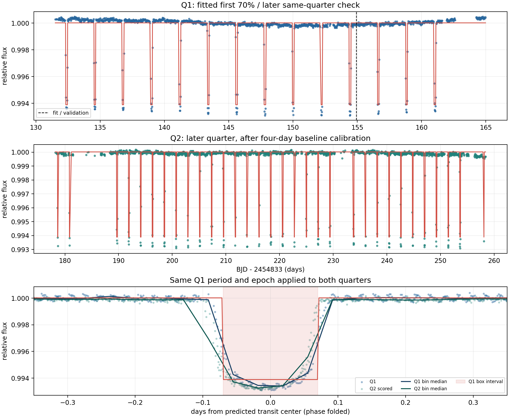
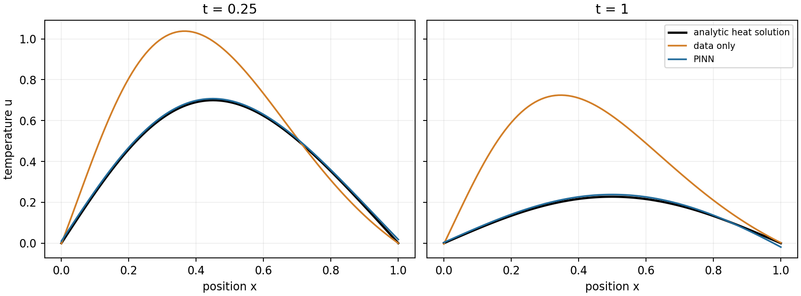

<a id="fortyfifth-question"></a>
# 第四十五章　科学里的预测怎样变成可信的解释

上一章拿一份旧人口资料问：谁进入了表，表里的标签究竟指什么，一个总体分数会盖住哪些人。把资料换成望远镜或实验仪器，这些问题并不会自动消失。仪器先产生信号；校正程序再把它变成可分析的数；研究者选择哪种变化值得寻找。一个模型即使把这些数预测得很好，也还没有说明**为什么**会这样，更没有独自证明某个天体、分子或物理定律存在。

科学里至少有两类不同的计算工作。我们可能只有观测，先找能反复检验的规律；也可能已有一条方程，却要在给定初始条件下算出以后会怎样。前者会遇到候选搜索和假阳性，后者会遇到求解误差、边界条件和多次求解的成本。本章先用一颗真实恒星的测光记录把第一类问题走完，再用一个能严格求解的热扩散问题分别看物理约束网络、学习整族解的算子和从数据猜方程。两种资料的身份会一直分开：望远镜的亮度是处理过的**观测**，热扩散数值是我按明示方程**生成**的教学世界。[望远镜原件与边界](../data/c45_kepler_hatp7/SOURCE.md)；[热方程运行范围](../verification/C45_science_protocol.md)

<a id="fortyfifth-history-transit"></a>
## 一条亮度曲线之前，天文学家先看见了什么

1995 年，Mayor 和 Queloz 报告的 51 Peg 伴星证据来自恒星光谱的**径向速度**：光谱线随恒星朝向或远离我们的运动发生周期性位移，研究者由此推测有一个伴星牵引它。这里量到的是恒星的运动，并没有直接拍到行星。速度的周期给出轨道周期线索；速度幅度与质量有关，但仅凭它还留着轨道相对视线倾角的不确定性。[1995年原论文](https://doi.org/10.1038/378355a0)

接下来的难题不是“能不能再画一条周期曲线”，而是同一伴星还能留下什么**不同种类**的证据。若轨道恰好让它从恒星与我们之间经过，它会挡掉一小部分星光。1999 年，Charbonneau 等人已经知道 HD 209458 有径向速度候选，便在预期时刻检查亮度，观测到两次对得上的下降。光谱运动和亮度凹陷彼此约束：前者给质量相关的量，后者给尺寸、倾角相关的量；只有结合恒星本身的估计，才能进一步讨论行星密度。两次测量不是同一算法在两个文件上重复打分。[1999年原论文§1—2](https://arxiv.org/html/astro-ph/9911436)

这也改变了要在很多恒星里寻找的形状。普通的周期亮度变化可能近似正弦，傅里叶分解、找相位折叠后最平滑的周期都各有正常用途。但行星过境只占一个周期的小段时间，其他时刻亮度大体平稳；单条正弦把变化铺满整圈，会把那段短凹陷分散给许多频率。Kovács、Zucker 和 Mazeh 在 2002 年研究的 **Box Least Squares**（BLS，矩形最小二乘）就把“短时间降到较低水平，随后回到较高水平”作为搜索形状。原论文还比较了此前的多频拟合和相位离散办法，没有声称它们在一切周期问题上失效。[2002年原论文§1—2](https://arxiv.org/html/astro-ph/0206099)

我们将读的星是 **HAT-P-7**。2008 年，Pál 等人已经综合 HATNet 的地面光度、后续光度和 Keck 径向速度报道 HAT-P-7b；论文还检查过混合食双星等会模仿行星信号的情形。他们的联合结果给周期约 \(2.2047299\) 天、总凌日时长约 \(0.1685\) 天。2009 年，开普勒飞船继续测量这颗星。本章取得的是飞船后来归档的 2009 年第一、第二季度长采样记录，**不是**2008 年研究者当时用的原始数据；我们重新从第一季度的一段亮度曲线找周期，也不能把结果叫作新发现 HAT-P-7b。[2008年原论文§II—IV及表3](https://arxiv.org/html/0803.0746)；[MAST原档案目录](https://archive.stsci.edu/pub/kepler/lightcurves/0106/010666592/)

为什么“遮住一块星光”值得成为候选？先只作一个便于算的模型：恒星的可见圆盘各处亮度相同，行星是完全不透光的小圆盘，恰好整个落在恒星盘内，没有别的星光混入。设两个半径分别为 \(R_\star,R_p\)，原来收到的通量正比于圆盘面积 \(\pi R_\star^2\)，被挡住的部分正比于 \(\pi R_p^2\)。相对下降量于是约为

\[
\delta\;\approx\;\frac{\pi R_p^2}{\pi R_\star^2}
=\left(\frac{R_p}{R_\star}\right)^2.
\]

这不是“从数据直接读到半径”的恒等式。恒星边缘通常没有中心亮，行星进入和离开时只挡住部分圆盘；偏心穿过、另一颗星的混光、仪器长时间曝光也会改变谷形。方程给我们一个**值得寻找的量级和方向**：若确实在若干预计时刻反复下降，遮挡是假设之一。要从谷底推半径，需更完整的亮度模型、恒星半径和其它观测约束。2002 年 BLS 故意把这些细节暂时搁下，是为了先从许多时间点里有效地找短凹陷；它的两水平矩形本身不承担最终天体性质的拟合。[BLS原论文§5](https://arxiv.org/html/astro-ph/0206099)

<a id="fortyfifth-measurement"></a>
## 一条“真实曲线”已经经过多少选择

MAST 文件不是摄像头像素直接变成一个答案。开普勒管线先校准像素，再选孔径把这颗星附近的像素计成 `SAP_FLUX`；随后 **Pre-search Data Conditioning**（PDC）处理仪器和航天器的系统变化，给出我们采用的 `PDCSAP_FLUX`。文件另有误差列与逐次观测的 `SAP_QUALITY` 标志。第一季度共 1,639 行；要求时间、亮度和误差有限、误差为正且质量标志为零，实际留下 1,434 行。它们的时间 `TIME` 是以 BJD 2454833 为零点、TDB 时标的**天数**，亮度原单位是电子每秒；除以训练段亮度中位数后，下面的 \(y_i\) 才成为约等于 1 的无量纲相对亮度。[NASA管线原说明PA/PDC](https://keplergo.github.io/KeplerScienceWebsite/pipeline.html)；[本机原文件与列](../data/c45_kepler_hatp7/SOURCE.md)

这一步与上一章的人口资料筛选有相同的责任：不知道谁/什么被挡在样本外，就不能把后来得分说成整个世界的成绩。这里质量标志非零并不等于一颗“坏恒星”；它表示这一次测量处在仪器或处理需谨慎的条件。飞船每季度转位，目标可能落到不同的 CCD 和不同孔径，两个季度的原始电子每秒数不能直接接成一根没有接缝的线。我们为第二季度另设一个只用其最初一小段合格亮度求的零点，后文会交代它如何影响测试身份。

<a id="fortyfifth-box-math"></a>
## 矩形是怎样从一组候选时刻算出来的

现在固定一个待试的周期 \(P\)（单位天）、一次凹陷的中心时刻 \(t_0\) 和持续时间 \(D\)。把任一观测时刻 \(t_i\) 按 \(P\) 折回同一圈：若它距最近的 \(t_0+kP\) 不超过 \(D/2\)，就标为“预计在凹陷内”，记 \(z_i=1\)；否则 \(z_i=0\)。这里 \(k\) 是让距离最小的整数，不是第 \(k\) 次训练轮次。这个标记完全由**候选**的 \(P,t_0,D\) 决定，尚未使用该点亮度的高低来改标记。

一个候选规定了两组点后，先别急着让优化器搜索所有五个数。令凹陷外预测高度为 \(H\)、内为 \(L\)，第 \(i\) 点的相对亮度为 \(y_i\)，报告的测量误差换成相对单位后为 \(\sigma_i>0\)，取权重 \(w_i=1/\sigma_i^2\)。我们想让

\[
S(H,L)=\sum_{i:z_i=0}w_i(y_i-H)^2
       +\sum_{i:z_i=1}w_i(y_i-L)^2
\]

尽量小。对 \(H\) 求导，第一组给 \(2\sum_{z_i=0}w_i(H-y_i)=0\)，所以

\[
\widehat H=\frac{\sum_{z_i=0}w_i y_i}{\sum_{z_i=0}w_i},\qquad
\widehat L=\frac{\sum_{z_i=1}w_i y_i}{\sum_{z_i=1}w_i}.
\]

也就是说，给定一个周期/中心/时长，最配合数据的两个水平只是各自的加权平均。它们都要有观测点，分母才不为零。下降深度是 \(\widehat\delta=\widehat H-\widehat L\)；若它不为正，这个候选就没有我们想找的“变暗”形状。把所有点只用一个平均值来预测，与按内外分两组来预测，两者最小平方误差之差可直接由两组加权平均展开：若组权重和为 \(W_{\rm in},W_{\rm out}\)，\(W=W_{\rm in}+W_{\rm out}\)，改进量为

\[
\frac{W_{\rm in}W_{\rm out}}{W}
 (\widehat H-\widehat L)^2.
\]

公式不仅奖励深谷，也要求谷里与谷外都有足够的**被测点权重**。同一个 0.6% 的下降，只有一条噪声很大的孤点与多个周期反复出现，分数不该一样。若误差可近似独立高斯，这个加权平方还与相应对数似然比较相接；有系统相关或周期在大量候选中被挑到时，不能把搜索分数本身当一个不用校正的“行星存在概率”。原 BLS 论文用中心化与归一化后的另一套 \(r,s\) 记号得到同类残差改进；这里保留两个组均值，是为了让我们实际文件中的电子计数、误差与程序输入对得上。[BLS原文式(1)—(5)](https://arxiv.org/html/astro-ph/0206099)

有竞争力的替代也要认真对待。若亮度起伏真的遍布整圈，一条正弦 \(a+b\sin(2\pi t/P)+c\cos(2\pi t/P)\) 可能既紧凑又准确；在我们这个短凹陷问题，它须用较少参数表示一段很尖的变化，单个频率未必够。本机让正弦方法**自己**在同一个 1—5 天范围搜索频率，并拟合 \(a,b,c\)，不是硬塞一个不对的周期叫它输。常数、正弦与矩形三种办法使用同一批第一季度拟合点；后两个各自带有结构假设，比较结果只回答**这颗星、这两个季度、这些处理条件**下的预测任务。[预先比较决定](../verification/C45_kepler_pretest_decision.md)

代码里这条数学路没有变成“调用一个模型就得到行星”。下面摘出[完整脚本](../code/c45_kepler_transit.py)的承重顺序；q1_file 是上面取得的固定 FITS 路径，数组每个位置仍指同一次观测：

~~~python
import numpy as np
from astropy.io import fits
from astropy.timeseries import BoxLeastSquares

q1_file = "work/data/c45_kepler_hatp7/kplr010666592-2009166043257_llc.fits"
with fits.open(q1_file) as hdul:
    row = hdul[1].data
    time = np.asarray(row["TIME"], dtype=float)
    flux = np.asarray(row["PDCSAP_FLUX"], dtype=float)
    error = np.asarray(row["PDCSAP_FLUX_ERR"], dtype=float)
    quality = np.asarray(row["SAP_QUALITY"])
good = (np.isfinite(time) & np.isfinite(flux) & np.isfinite(error)
        & (error > 0) & (quality == 0))
order = np.argsort(time[good])
time, flux, error = time[good][order], flux[good][order], error[good][order]
fit = time < time[0] + 0.7 * (time[-1] - time[0])
scale = np.median(flux[fit])
bls = BoxLeastSquares(time[fit], flux[fit] / scale, dy=error[fit] / scale)
periods = np.linspace(1, 5, 4000)
trial = bls.power(periods, [0.10, 0.14, 0.18, 0.22], objective="likelihood")
best = int(np.argmax(trial.power))
~~~

good 是与原 FITS 行一一对应的布尔选择，**不是训练标签**；order 只把合格行按时间重排，随后三数组仍同序。fit 由时间划前段，不由亮度高低划；scale 只读此前段。bls.power 根据每个候选周期、中心与时长，把刚才推得的两个水平与残差比较交给 Astropy 算；argmax 选的是**拟合段上的候选**，没有改变某个神经网络的权重。完整程序还会在粗扫峰旁做一次只用拟合段的细扫，随后把参数冻结；读这几行时不应把它误认成连 Q2 一起调参的完整流程。

<a id="fortyfifth-kepler-result"></a>
## 第一季度找到的时刻，第二季度还准吗

Q1 合格的 1,434 点按时间前 70% 的范围切：前段 1,056 点拟合，后来 378 点检查。矩形法只在前段搜 \(P\) 从 1 到 5 天、四种候选时长 0.10/0.14/0.18/0.22 天，再在前段最高分附近细扫周期，选出 \(P=2.2050213\) 天、矩形 \(D=0.14\) 天、相对下降 \(\widehat\delta\approx0.006128\)。单正弦自己选出的最佳周期约 **1.10232 天**，大致是矩形周期的一半：狭窄重复凹陷可以让正弦把较强变化放在谐波上，不能不经分析就把其最强频率宣称为真实绕转一圈。我们在搜索时没有把 2008 年发表的精确周期填进训练器。[Q1拟合与验证原报告](../runs/c45_kepler_q1_locked/q1_train_validation.json)

预测误差为相对亮度的均方根误差；1 个单位就是训练段中位亮度的量级。数小不自动代表物理解释正确，但它能检查“先前找到的时刻后来是否还有相似下降”：

| 规则 | Q1拟合1,056点 | Q1后时378点 | Q2后来1,982点 |
|---|---:|---:|---:|
| 常数水平 | 0.001534 | 0.001356 | 0.001552 |
| 各自搜索频率的单正弦 | 0.001417 | 0.001295 | 0.001431 |
| Q1拟合的短矩形 | 0.000349 | 0.000396 | 0.000565 |

Q2 是飞船后来另一季度的文件，不能等同又从同一 Q1 随机抽几行。原定 Q2 起始校准窗要求最初三天至少 50 个质量合格点，第一次运行在**计分之前**发现仅有 30 点；因为原文件开头整段都带非零质量标志。我们只据时间与质量标志把窗扩到**首个合格点后的四天**，取得 55 点求无标签亮度中位数，不计这 55 点的预测分。此项修订、第一次停机以及脚本版本都在[预试决定](../verification/C45_kepler_pretest_decision.md)里留下；不曾拿 Q2 预测成绩来重选 Q1 的周期、相位或深度。之后对余下的 1,982 个合格点作首次跨季度比较，得到表的最后一列。[Q2首次报告](../runs/c45_kepler_q1_locked/q2_first_test.json)

总误差之外还得看它哪里做得不好。Q1 后段按**训练时确定的矩形窗口**有 17 点被预计为凌日内，平均相对亮度约 0.99378；其它 361 点均值约 1.00001。Q2 评分区有 131 点落在同一组预计窗口，均值约 0.99406；其它 1,851 点约 0.99988。Q2 的矩形窗口内 RMSE 升至约 0.00137，明显高于同季 Q1 验证内的 0.00056。图里也能看到真实亮度慢慢下降、在中间形成有弧度的谷、再慢慢回升；红色矩形在窗口边界突然跳下去，描述不了这些进出过程。某些红色预计时刻附近没绿点，是质量筛选留下的时间空缺，不能把“没有点”读成“星光没有变”。[图的原资料和绘制收据](../runs/c45_kepler_figure_first/receipt.json)



把图按三层读。上图横轴是 Q1 的 `BJD−2454833` 天数，虚线左侧被拿来选周期，右侧没有；中图横轴延伸到 Q2，绿色点只含四天校准**之后**的合格读数；下图把每个时刻移到离最近预计中心的天数，故很多次凹陷叠到零附近。下图的弯边告诉我们，预测每次“何时”与完整解释每次“为什么这种形状”是不同成绩。由本机矩形深度硬套前面的均匀星面式，只会得到 \(\sqrt{0.006128}\approx0.0783\) 这个**在简化条件下**的半径比量级；2008 年多资料联合拟合的约 0.0763 与它接近，但二者使用不同资料/模型，接近不把遮光假设变成严格定理，更不让我们从单条光度曲线量出行星质量。[源论文表3](https://arxiv.org/html/0803.0746)

周期估计的微小差别到了远处会放大。我们从约 23 天 Q1 前段估的 \(2.2050213\) 天，比 2008 年多种地面资料联合拟合的 \(2.2047299\) 天多约 \(0.0002914\) 天，即一圈约 25 秒。若暂把后者当稳定的比较周期，并从同一中心时刻向 Q2 末段推约 57 圈，预计中心的差可累到 \(57\times0.0002914\approx0.0166\) 天，即约 24 分钟。这是两个**周期数字**在明确假设下的算术后果，说明短段估计的相位外推会有代价；不能据此单独断言 Q2 窗口内误差增加全由周期差造成，因为真实谷形、仪器变化和缺测仍在。我们在首次 Q2 测试时也没有拿 2008 年的精确数回来修模型。

到这里可以给真实科学流程划一道界：**候选**由形状和训练资料提出；**预测**由后续时刻检查；**解释**要把恒星亮度、遮挡几何、仪器处理、可能的双星或星面变化和另一类测量放进同一可比较框架。我们的 Q2 结果支持“这条经处理的亮度序列里有可持续预测的短周期凹陷”，没有独立完成当年论文的假阳性排查与质量/半径推断。这一界与第十章的观察—干预区别相通：观察相关可以准确，却没有自动告诉我们改变一个物理条件之后必会怎样。[第十章观察与干预](第十章_看见相关之后能否判断改变的后果.md#tenth-intervention)

<a id="fortyfifth-known-equation"></a>
## 换一类科学工作：若方程已经知道，网络还做什么

前半章留下的是由重复信号走到完整物理解释的距离；很多计算科学问题的顺序恰好反过来：基本方程已经写出，难在给一份具体初值和边界后算出全场。现在沿这条并行的数值计算史往前回看。Richardson 1922 年把天气的动量、密度、水分和热量变化写成可逐项数值推进的关系，尝试用当时的资料去算未来天气。到 1950 年，Charney、Fjørtoft 和 von Neumann 的原论文用有限区域的正压涡度方程和真实 500mb 大气场作四次 24 小时预测，专门讨论边界选择、差分稳定条件和误差来源；他们把部分偏差归于空间格子过粗和所选简化方程未纳入的斜压作用。这里的困难是**方程、初场、边界、格距和计算资源怎样一起成为有用预报**，不能写成“旧物理不懂，神经网络才会预测”。[Richardson1922原书与同期评述](https://www.nature.com/articles/110762a0)；[Charney等1950原刊摘要](https://onlinelibrary.wiley.com/doi/10.1111/j.2153-3490.1950.tb00336.x)

我们用比天气小得多、却能把各种计算分开的对象：一根长度归一为 1 的细棒，\(x\in[0,1]\) 是位置，\(t\in[0,1]\) 是时间，\(u(t,x)\) 是相对温度。这里长度与时间都已按各自尺度归一；若用现实中的米与秒，扩散系数的单位应是平方米每秒，本机的 \(0.15\) 则是在归一坐标下选的数。假设材料均匀、没有热源，两端始终保持零温差；热流沿温度降低的方向走。若把相应常数合进扩散系数 \(\kappa=0.15\)，令局部热流 \(J=-\kappa u_x\)，一个小段的温度变化率来自流入减流出，取极限得

\[
u_t=-J_x=\kappa u_{xx},\qquad
u(t,0)=u(t,1)=0.
\]

这里的一阶时间导数问**温度怎样随时间改**，二阶空间导数问这点比两侧形成怎样的弯曲；它们不是两个随意写在损失里的“特征”。本机固定初始温度为

\[
u(0,x)=\sin(\pi x)+\tfrac14\sin(2\pi x).
\]

正弦项在两端都是零，所以初值与边界相容。为什么挑这两项？不是自然物体必长这样，而是它们让我们**先有严格答案**，能检验程序究竟学到什么。对任一 \(n\ge1\)，\(\partial_{xx}\sin(n\pi x)=-(n\pi)^2\sin(n\pi x)\)。若只看该形状的时间幅度 \(a_n(t)\)，代入方程便得 \(a_n'(t)=-\kappa(n\pi)^2a_n(t)\)。这个一元方程解为 \(a_n(t)=a_n(0)e^{-\kappa(n\pi)^2t}\)。于是本章单条初值的**解析解**是

\[
u(t,x)=e^{-0.15\pi^2t}\sin(\pi x)
       +\tfrac14e^{-0.15(2\pi)^2t}\sin(2\pi x).
\]

第二项频率高，指数里有 \(n^2\)，所以它消退得更快。这是热方程与特定初边值**模型内部**的结论；并没有在天文FITS里测过任何温度。[解析数据与程序](../code/c45_heat_science_lab.py)

<a id="fortyfifth-finite-difference"></a>
## 在引入神经网络之前，普通差分走得怎样

电脑拿不到连续无穷多 \(x,t\)，可以在空间每隔 \(\Delta x\) 放一个数 \(u_j^m\)：上标 \(m\) 是第 \(m\) 个时间层，下标 \(j\) 是第 \(j\) 个位置。用两侧高度估二阶空间导数，再向前走 \(\Delta t\)，得到

\[
u_j^{m+1}=u_j^m+r(u_{j+1}^m-2u_j^m+u_{j-1}^m)
=(1-2r)u_j^m+r u_{j-1}^m+r u_{j+1}^m,
\qquad r=\frac{\kappa\Delta t}{(\Delta x)^2}.
\]

当 \(0\le r\le1/2\) 时，右边三个系数非负且和为1；新温度是旧温度与两邻温度的加权平均，不会因一次步进凭空越过这三个值的范围。这是这条显式差分规则的一项稳定线索，不是所有边界与求解器的万能保证。本机取 51 个空间点，\(\Delta x=0.02,\Delta t=0.001\)，所以 \(r=0.375\)。从已知初值走 1000 步到 \(t=1\)，相对上面的解析曲线，终点格点 RMSE 约 \(9.71\times10^{-5}\)。有限格/时间步仍有离散误差，但在这道简单方程上，它已经非常有用。[差分与解析对照报告](../runs/c45_heat_projected_current.json)

若把网格缩细而时间步不动，\(r\) 反而按 \(1/(\Delta x)^2\) 变大，这条更新可能失去稳定条件。所以“物理方程已知”并不等于任意数值程序都自动可靠。反过来，看到后面神经网络在当前设置胜过**只看初值和边界资料**的网络，也不能据此说它胜过已经适配问题的传统数值求解器。

<a id="fortyfifth-pinn"></a>
## 方程怎样成为可训练的约束，又为什么仍不是证明

物理信息神经网络（physics-informed neural network，PINN）回答的是另一种可用信息条件：我们拿一个以 \((t,x)\) 为输入、输出温度的网络 \(u_\theta(t,x)\)，让它一面贴合已给初值/边界，一面在域内也尽量遵守方程。2017 年预稿、2019 年发表的 Raissi、Perdikaris 和 Karniadakis 研究了这种利用自动微分构造方程残差的办法，既讨论给定方程求状态，也讨论在观测里辨部分方程参数。本书只做前一种，且用容易核对的热方程；原论文的 Burgers 方程等非线性例子不能由我们这条小曲线抵扣。[PINN原文§1.1—2.1](https://arxiv.org/html/1711.10561)

要知道新的训练信号从哪来，先在任一域内配点 \((t_j,x_j)\) 上算

\[
R_\theta(t_j,x_j)
=\partial_tu_\theta(t_j,x_j)-0.15\,\partial_{xx}u_\theta(t_j,x_j).
\]

若网络恰好是方程的光滑真解，**所有位置、所有时间**的 \(R\) 都为零。我们现在却只能抽有限个点，让残差平方平均加入原有的初值和两端误差：

\[
L(\theta)=L_{\rm initial}(\theta)+L_{\rm boundary}(\theta)
            +\lambda\,\frac1M\sum_{j=1}^{M}R_\theta(t_j,x_j)^2.
\]

本机取 \(\lambda=1\)、每步 \(M=128\) 个新随机配点；这是一项明说的训练权重选择，换方程单位或温度尺度时未必仍合适。`torch.autograd.grad`先对**输入坐标** \(t,x\) 求导以构造残差，再让总损失对**参数** \(\theta\) 反向求导，`optimizer.step()`才真正改网络权重。这和第四章学过的“算出梯度≠已经更新参数”是同一接口，只是这里为了方程多求一次空间导数：[本章完整源码](../code/c45_heat_science_lab.py)；[第四章的参数更新](第四章_把已懂的计算交给PyTorch.md)。

```python
u = model(x, t)
u_x = torch.autograd.grad(u, x, torch.ones_like(u), create_graph=True)[0]
u_t = torch.autograd.grad(u, t, torch.ones_like(u), create_graph=True)[0]
u_xx = torch.autograd.grad(u_x, x, torch.ones_like(u_x), create_graph=True)[0]
residual = u_t - 0.15 * u_xx
loss = initial_loss + boundary_loss + residual.square().mean()
loss.backward()                  # 把导数放进参数的 .grad
optimizer.step()                 # 才改参数
```

两支小网络从**相同随机初值**开始，都是 2,241 个可调参数，2000 次更新；都只取得初时 65 个位置和两端各 65 个时刻的温度，**没有**看到内部真解标签。只用这些边界资料的网络把已给点损失降到约 \(1.64\times10^{-5}\)，但在从未给它的 \(81\times81\) 内部网格上 RMSE 仍有 0.279；在 \(t=1\) 的整条曲线上约 0.324。加入方程残差的一支，内部网格约 0.00993，终点约 0.00848。它们面对同一精确数学答案；传统差分在终点又约为 0.000097。**此处谁赢哪项任务是实际运行所得**，不是“物理网络理论上总更好”的结论。[热实验完整数字与已核图](../verification/C45_science_protocol.md)



为什么可以期待方程约束帮助？只给初值和边界，有无数个内部函数会碰巧穿过这些已给点；方程从域内部排除了许多可能。若**严格**有两个光滑解 \(u,v\) 都满足同一个热方程、相同初值和两端值，令 \(w=u-v\)，则 \(w_t=\kappa w_{xx}\)，初值/边界都为0。把方程乘 \(w\)，对空间积分并在两端用 \(w=0\) 消去分部积分的边界项：

\[
\frac{d}{dt}\frac12\int_0^1w(t,x)^2\,dx
=\kappa\int_0^1w w_{xx}\,dx
=-\kappa\int_0^1w_x^2\,dx\le0.
\]

左边初时为零，积分又永远非负，只能一直是零；在这些光滑条件下解唯一。注意量词：这个论证需要**整个区域里**方程严格成立和初边条件严格成立。PINN 只在有限随机点把残差压小，优化也未必找全局最好，不能把上面的唯一性定理原封不动贴给它的有限权重。我们的另取 60 个未参与训练的域内点，残差 RMSE 约 0.00694，仍是**样本上的数值检查**；图上贴近解析解是因为此处有解析答案可比，并非一般问题都能这样验证。有限差分的更小误差也提醒我们：先看已知方程与传统求解器能做什么，再决定网络是否解决了额外问题。

<a id="fortyfifth-operator"></a>
## 若每次换一根棒的初始温度，学习的对象变了

刚才的 \(u_\theta(t,x)\) 为**一条固定初值**寻找整个时空的解。工程里可能要换成千百种初始温度，或者不同材料系数；反复从头解方程很费时，此时值得问能否把“输入一条函数，输出一条函数”的关系学下来。把初始温度场记为 \(u_0(x)\)，固定未来时刻 \(T\)，这条关系写成解算子

\[
\mathcal G_T:u_0(\cdot)\longmapsto u(T,\cdot).
\]

字母 \(\mathcal G_T\) 不是新的一次温度测量，而是**整个任务**：每换一个初始函数，就给一整条未来函数。对我们选的热方程，若初始函数恰是前三个正弦形状的组合 \(u_0(x)=\sum_{n=1}^{3}a_n\sin(n\pi x)\)，上一节的推导立刻给

\[
\mathcal G_Tu_0(x)
=\sum_{n=1}^{3}a_n\,e^{-0.15(n\pi)^2T}\sin(n\pi x).
\]

每个频率的系数只需乘一个与 \(T\) 有关的衰减量。这里的两个方向要分清：位置 \(x\) 在一条函数内部变，初始系数三元组 \((a_1,a_2,a_3)\) 则在**不同问题实例之间**变。本机用 256 组三系数按解析式造输入/目标函数对，只训练三个乘数；另 64 组系数不参加训练。固定 \(T=0.1\) 的时间量纲在这个数学世界只是归一时间，三项解析乘数约 \(0.86239,0.55312,0.26384\)，学出的三项与它们几乎重合。64 个未见系数组合在 64 格上的 RMSE 约 \(2.72\times10^{-10}\)；把**同一组**函数改采 128 格、复用同三个乘数，约 \(2.74\times10^{-10}\)。这展示了“参数属于函数关系，格点可改变”的一面。[谱乘子实码与报告](../code/c45_heat_science_lab.py)；[实际结果](../runs/c45_heat_projected_current.json)

但格子数能改变，并不意味着**任何新形状**都已学会。如果初温再加 \(\sin(4\pi x)\)，我们的三频模型根本没有第4项的乘数，它在 128 格上将那部分直接漏掉；同一预定试验的 RMSE 约 0.0659。这个失败与“64→128 格没事”并存：前者改了**函数族的内容**，后者只改了**已知三形状的采样密度**。传统解析解马上能给第4项的衰减量；在这个已知线性方程上，重新学它反而没有必要。

2020 年预稿、2021 年发表的 **Fourier Neural Operator**（FNO，傅里叶神经算子）是更广的尝试。它不是我们这三个数：一层把多通道场作傅里叶变换，对一部分频率上的通道系数施加学习到的矩阵，再逆变换，加上位置上的通道变换并接非线性；多层组合可拟合远比三个线性衰减复杂的函数关系。论文用数值求解器产生 Burgers、Darcy 与 Navier–Stokes 方程的输入—输出训练对，在其特定资料与网格上比较泛化与推理速度。“学习算子”在这里指**用很多已求过的问题教一个替代求解器**，不是它从无方程、无训练解的自然观测里直接推导出定律。若生成训练解本身很昂贵，成本还得把生成资料算进去；若新输入超出训练过的函数族或分辨率没保留重要频率，复用权重也没有神奇保证。[FNO原论文§2—5、§6](https://arxiv.org/html/2010.08895)

把这一层写出来，可以看清它和三频乘子的关系。若第 \(\ell\) 层每个位置有一组通道数 \(v_\ell(x)\)，傅里叶变换 \(\mathcal F\) 把“随位置变化”换成“各频率有多少”；训练所得矩阵 \(R_\ell(k)\) 在被保留的频率 \(k\) 上混合通道，再由 \(\mathcal F^{-1}\) 还原位置。另一个同位置线性变换 \(W_\ell v_\ell(x)\) 保留直接按位置处理的信息，最后经非线性 \(\sigma\)：

\[
v_{\ell+1}(x)
=\sigma\!\left(
W_\ell v_\ell(x)+
\mathcal F^{-1}\!\left(R_\ell(k)\,(\mathcal Fv_\ell)(k)\right)(x)
\right).
\]

本机的三个增益只相当于**一个通道、三个已知频率、没有多层非线性**的极简片段。FNO共享频率权重使不同格点数上重用参数成为可能，但离散采样仍须能分辨输入中的重要频率；用更多格点画出已漏掉的第4模，不会自动让一个只学三模的程序补出它。[原论文傅里叶层§4](https://arxiv.org/html/2010.08895)

<a id="fortyfifth-unknown-equation"></a>
## 方程未知时，能否从已测变化中找一条简洁关系

再换一次信息条件，也沿候选搜索这条并行的历史线回到 2009 年。现在不先把 \(u_t=0.15u_{xx}\) 告诉算法，只交给它随时间变化的一些量，问是否能提出小而可检验的方程。Schmidt 与 Lipson 等人的符号表达式搜索代表一条路：组合可用的运算，比较表达式解释观测的程度与复杂度；2016 年 Brunton、Proctor 和 Kutz 提出的 **SINDy** 则先让研究者给一组候选函数，例如常数、状态本身、平方项，再用稀疏回归挑少数项。这两路都不是“原始数字自己发明了数学语言”：观测变量、可用运算或候选库、简洁的代价和怎样估导数，都由研究者设计。[Schmidt/Lipson团队项目与2009论文位置](https://www.creativemachineslab.com/eureqa.html)；[SINDy原文§2—3](https://arxiv.org/html/1509.03580)

在我们的热棒里，可以先把整条温度场投到第一正弦形状上，得到它在时刻 \(t\) 的幅度

\[
a(t)=2\int_0^1u(t,x)\sin(\pi x)\,dx.
\]

前面的系数 2 来自 \(\int_0^1\sin^2(\pi x)\,dx=1/2\)：它把第一模原有的幅度取回来；不同正弦模在这个区间的乘积积分为零，故第二模不会混进来。这是我们特意选择、并能从完整场算出的**观测变量**，不是未知仪器自动告诉程序“该看第一模”。上一节**我们知道**真实关系是 \(a'(t)=-0.15\pi^2a(t)\)。现在暂时把右边遮住，作者给搜索器候选列

\[
\Theta(a)=(1,\ a,\ a^2),\qquad
\widehat{a'}(t)=c_0+c_1a(t)+c_2a(t)^2.
\]

每个观测时刻是一行，三列分别表示“常漂移”“与当前幅度成比例”“随平方改变”。普通最小二乘可同时给三个非零数；若目标是一条可读的短式，可把很小的系数归零、再在保留的列上重新拟合。用六条不同初幅度、解析生成的 \(a,a'\) 做这件事，只剩 \(c_1\approx-1.48044\)，正好等于 \(-0.15\pi^2\)。这一步之所以对得上，是因为**真项就在我们先写出的库里**、输入也是按该方程造的。它证明我们的小程序按规则能辨自己造的例子，不证明从一台未知实验仪器自动发现热定律。[本机稀疏拟合](../runs/c45_heat_projected_current.json)

现实中最棘手的一步可能是“导数从哪里来”。如果每个幅度读数有独立的 0.01 噪声，用相距 \(\Delta t\) 的两个读数作差再除 \(\Delta t\)，噪声差也被除以 \(\Delta t\)；把时间间隔缩小并不自动让导数更准。本机给那六条模拟轨迹加此噪声，逐点差分导数相对解析导数的 RMSE 约 0.733；把许多点一起投到预置的三列库，仍得 \(c_1\approx-1.477\)。两数字可以同时成立：单点求导很吵，有限库与多条轨迹的平均约束仍可稳住本次一个系数。换成真实未知变量、缺真项的库、相互关联的误差或未测外力，它可能给一条漂亮却错的短式。2012 年对早期“无物理先验”强说法的[原批评](https://arxiv.org/abs/1210.7273)也提醒我们要把隐含结构说出来。方程搜索给的是**候选及其在规定资料/库下的表现**；若想称它解释自然，还需改变初值/条件作新预测，再让新的测量去驳倒或支持它。

<a id="fortyfifth-science-now"></a>
## 同一种界线，怎样走进分子与天气

这些路线不是一条“BLS 升级成 PINN，再升级成 FNO”的流水线。它们分别用不同的信息答不同问题：BLS 把短周期凹陷当候选结构，从实测亮度里找它；PINN 已拿到方程，借域内残差求一条具体解；算子学习拿到许多已求解的输入—输出对，学重复求解的映射；稀疏或开放表达式搜索假定可测状态和某种候选语言，试着辨未知关系。算法名字本身不填补资料和验证的空格。[前章的真实数据身份](第四十四章_数据来自谁预测又影响谁.md#fortyfourth-documentation)

分子结构预测让这个区别很具体。1971 年宣布建立的 Protein Data Bank（PDB）把实验解析出的蛋白等大分子坐标集中保存，给后来人提供了可比较的结构；它不是未来模型自动生成的“正确答案库”。不同研究者同时还在用已有相似结构作模板、从序列的进化关联推残基接触、或尝试物理能量搜索。为知道这些路线面对**没公开过的结构**到底能走多远，Moult 等人在 1994 年发起 CASP 盲评，1995 年发表第一次大型方法评价：先给待解结构的序列，预测提交后再与实验解析出的结构比较。这套评价制度和持续增加的实验结构，让后来的神经网络有了训练与外部检验的不同资料角色。[PDB 1971原刊公告](https://www.nature.com/articles/newbio233223b0)；[CASP原始组织论文书目](https://pubmed.ncbi.nlm.nih.gov/8710822/)；[CASP14论文的盲评说明](https://www.nature.com/articles/s41586-021-03819-2)

2018 年 CASP13 里的第一代 AlphaFold 并非 2020 年 CASP14 那台模型的较小权重版。它从序列和相关序列得到信息，网络预测不同残基对的距离分布，再把这些分布变成可优化的几何势，经过结构形成与搜索交出三维候选；2020 年发表的原论文报告，43 个自由建模域里有 24 个达到其所列高准确门槛，紧随其后的方法有 14 个。这里的**神经预测、几何优化、盲评**分别作了不同的工作，既不是只写一条公式就折出蛋白，也不是其它同时代方法毫无价值。[AlphaFold CASP13原论文摘要与方法](https://www.nature.com/articles/s41586-019-1923-7)

有了这些实验结构、序列数据库和跨团队评价的积累，AlphaFold2 才在重新设计的网络和训练流程上，2020 年 CASP14 对尚未公开的已解结构作盲评，2021 年论文报告多数案例达到与实验结构接近的精度。这里强模型的能力有**上游实验资料**和独立检查，不是从一串氨基酸字母凭空知道所有力学。2024 年 AlphaFold3 把预测对象扩到蛋白与核酸、小分子等的联合结构，并采用更新的扩散结构生成；其论文仍承认各类相互作用的精度挑战。给出一个三维候选坐标有利于决定下一步实验，却没有直接量到结合强度、反应速率或药物对人体的效果。[AlphaFold2原论文与CASP14评估条件](https://www.nature.com/articles/s41586-021-03819-2)；[AlphaFold3原论文摘要、方法与限制](https://www.nature.com/articles/s41586-024-07487-w)

天气是另一条更早形成、并行前进的线。1950 年那几次有真实大气初场的数值预测之后，观测覆盖、计算机和模式都逐步改变。欧洲各国于 1975 年建立 ECMWF 来合用资源，1979 年开始业务中期预报；一条确定性轨迹不能表达初值不确定怎样扩散，中心 1992 年又开始业务集合预报。今天我们读到的全球历史天气场也不是所有站点一开始就铺满格子：ERA-15、ERA-40、ERA-Interim 到 2019 年公开的 ERA5，逐代把历史观测与当时的数值模式重新合成连续场。这里各代资料的观测覆盖、模型版本和同化方式会改变“过去的天气”这份训练目标；它们是科学与工程长久累积的产物。[ECMWF官方历史](https://www.ecmwf.int/en/about/who-we-are/history)；[ECMWF再分析谱系](https://www.ecmwf.int/en/about/media-centre/science-blog/2017/era5-new-reanalysis-weather-and-climate-data)

“同化”先用一个可算的小桥梁理解：某时某地模式给温度先验估计 \(x_f\)、误差方差 \(\sigma_f^2\)，仪器给读数 \(y\)、误差方差 \(\sigma_o^2\)。若两误差独立、近似无偏且把平方误差作目标，选共同温度 \(x\) 时最小化 \((x-x_f)^2/\sigma_f^2+(x-y)^2/\sigma_o^2\)，求导便得到

\[
x_a=\frac{x_f/\sigma_f^2+y/\sigma_o^2}
          {1/\sigma_f^2+1/\sigma_o^2}.
\]

两者各按**精度，即方差的倒数**发言：仪器若更不准，它的权重更小；模式若不准，观察贡献更大。真实 ERA5 在三维空间和时间窗中处理许多相关变量、不同仪器与偏差，绝不是这一个标量算式；算式只让“全球格点标签同时继承模型假设与观测信息”变得可见。它和我们的 Q2 零点标定一样，提醒人们检查预测输入前发生过什么处理。[ECMWF对资料同化的解释](https://www.ecmwf.int/en/about/media-centre/science-blog/2017/era5-new-reanalysis-weather-and-climate-data)

正因为有了可反复取用的全球历史场，2010 年代后期至 2020 年代，研究者才有条件把许多“当前大气场→六小时后大气场”的配对拿来训练新的预报器。2022 年预稿、2023 年发表的 GraphCast 用 ERA5 再分析的状态序列学习这样的前进一步，再把自己的输出逐步回送，走成多日预报。它的来源既有观测，也有构造 ERA5 的物理模式；多日预测的成绩须按具体变量、时效和同期对照系统分别量，不能把“预测一幅全球格点图”说成从仪器原读数重新发现所有大气方程。到 2025 年 2 月，ECMWF 让自己的 AIFS AI 预报与传统 IFS 物理预报并行运行；其官方资料页记载 2026 年 5 月确定性与集合版 AIFS 都升为 v2。这里“AI 已进业务”是真实进展，也说明现行系统仍要有观测、同化、版本、物理系统对照和持续核验，不是单一网络校验损失下降就能承担所有天气决策。[GraphCast原研究](https://arxiv.org/abs/2212.12794)；[ECMWF当前AIFS版本](https://www.ecmwf.int/en/forecasts/datasets/aifs-machine-learning-data)

如果让一个会检索、写代码的语言模型参与科研，还要沿第三十八至四十一章已分过的来源追问：谁提候选，谁运行数值模拟，谁决定下一项实验，哪些数据是旧论文或工具返回，谁能签收新测量。搜索出一条式子、在仿真里验证它、向仪器下达实验、得到可重复的自然观测，是四项不同的工作；模型的流畅报告不会让后一项自动发生。[工具返回的来源界](第三十八章_模型怎样学会请求工具并使用返回.md#thirtyeighth-four-voices)；[宿主执行与验收](第三十九章_请求发出以后怎样知道它做了什么.md#thirtyninth-acceptance)

<a id="fortyfifth-practice"></a>
## 把同一个问题从文件读到可反驳的结果

在本书活动包根目录，下面六条命令分别取官方两个固定FITS、用Q1前段选模型、按已记录的质量覆盖修订检查Q2、画真实测光图；最后一条独立运行**作者解析热方程**的求解/学习/辨识实验。每个输出目录请用尚不存在的新名字，避免覆盖本章第一次报告。两支程序的结果不能互换身份：望远镜不提供热真解，热方程解析式不提供行星存在标签。[Kepler来源与预试方案](../data/c45_kepler_hatp7/SOURCE.md)；[两支源码及完整边界](../verification/C45_science_protocol.md)

~~~powershell
Set-Location '.'
python -I -X utf8 work/code/c45_fetch_kepler.py q1
python -I -X utf8 work/code/c45_kepler_transit.py train --run-dir work/runs/c45_my_kepler
python -I -X utf8 work/code/c45_fetch_kepler.py q2
python -I -X utf8 work/code/c45_kepler_q2_amended.py --run-dir work/runs/c45_my_kepler
python -I -X utf8 work/code/c45_plot_kepler.py --run-dir work/runs/c45_my_kepler --out-dir work/runs/c45_my_kepler_figure
python -I -X utf8 work/code/c45_heat_science_lab.py --steps 2000 --out work/runs/c45_my_heat.json
~~~

第一份 `q1_train_validation.json` 保存拟合/验证时间范围、两种周期搜索得到的参数和按矩形窗口再分的误差。`q2_first_test.json` 先核原Q1文件与源码没有变，才只以Q2前四天的无标签中位数调整零点并对后段打分；因为本书已经看过Q2，读者重跑是**复现**，若再改时长候选就属于已看过测试后的敏感性分析。热报告则把**同一组初值/边界**下的纯数据网络、加残差网络、普通差分、三频算子和有限候选库分在不同键里；`c45_my_heat.png` 能目视它们在 \(t=0.25,1\) 的实际曲线。你能追到哪一行只算坐标导数、哪一行改变参数，也能把“解析真值已知”与“真实星光只有观测”始终分开。

改条件时，先试一项会真正改变结论的变化。把热程序顶部的 \(\kappa\) 从 0.15 改为 0.30，先按 \(e^{-\kappa(n\pi)^2t}\) 预测两个温度形状谁衰得更快，并重算显式差分的 \(r\)：当前 \(\Delta x=0.02,\Delta t=0.001\) 会给 \(r=0.75\)，不再符合我们刚证明的凸组合条件；要保持那项条件，可把 `finite_difference` 里的时间步减半并增加相同步数到 \(t=1\)。这只是本模型内的稳定性推理，不要求等神经网络跑崩才相信。另一项更接近观测研究：Q1矩形时长从0.14改试别的候选，再问Q2的谷边拟合怎样变；由于Q2已看过，报告它为**事后分析**，不能选一个最好看的时长重新叫作首次跨季预测。

<a id="fortyfifth-close"></a>
## 预测、求解、发现各自交了什么答卷

从真实星光，我们得到一条经处理测光上的短周期凹陷，Q1前段选出的矩形到Q1后段和Q2仍有预测力；我们也在图上看见矩形忽略了真实谷形。对已知热方程，解析式给了严格可核的模型答案，传统差分与加残差网络分别近似它；单实例网络、跨初值谱乘子和有限库稀疏辨识所需的训练信息并不相同。**这些结果各自回答了它实际被要求的问题**，没有一项让望远镜自动做光谱确认、让有限配点变成全域数学证明，或让模拟热衰减成为自然界新发现。

真实科研把候选、已有理论、仪器和新实验接成循环：哪一步可由证明确定，哪一步只是数值近似，哪一步需要下一次不参与选择的测量，都要在结论附近说清。到下一章，另一个问题才真正出现：即使一条模型曾在 Q1 和 Q2 有用，当仪器、对象或任务继续变化，是否应更新它；更新时旧能力又会怎样保存或丢失？这里已经有了本章的测量、模型和检验身份，可以在这些对象上讨论适应，而不从一个“会自我改进”的口号开场。

## 用三个变化检查自己是否把层次接对

1. 固定一组候选 \(P,t_0,D\)。若预计凹陷内一共只有**零**个合格读数，上面 \(\widehat L\) 与残差改进式哪里先失去定义？若内外都有数且平均差很大，是否已经能由此独自断定它是行星？
2. 两个光滑热场都严格满足相同方程/初边值时，为什么它们的差 \(w\) 的平方积分只能一直为零？若一个网络只在128个随机点使方程残差很小，哪一个定理前提还没有被建立？
3. 三频谱乘子从64格换128格仍好，却在新添第4正弦时漏掉那一项。哪个变化只是采样位置变了，哪个变化让输入函数离开了训练家族？若新实验读数再带噪声，为什么把相邻时刻差值除以更小的 \(\Delta t\) 未必更容易辨出真实微分方程？

<details>
<summary>核对思路</summary>

第一题中凹陷内权重和为0，\(\widehat L\) 的分母先为0；既不能求深度，也不能凭一个空窗口得到有意义的改进。两组平均差即使可算，周期搜索偏差、恒星活动/双星与仪器过程等仍要另检。第二题给零初值且 \(d\int w^2/2dt=-\kappa\int w_x^2\le0\)，非负积分从零起不可能降低，所以保持零；有限配点没有确立**所有** \(t,x\) 的方程等号。第三题64→128在本例只换了已知三个形状的取样格；加入第4模改变了函数族，而模型缺其增益。独立测量噪声差仍有非零尺度，除以更小的时间差会把它放大；须另研究平滑、更多重复/轨迹或与微分不同的验证办法。

</details>
