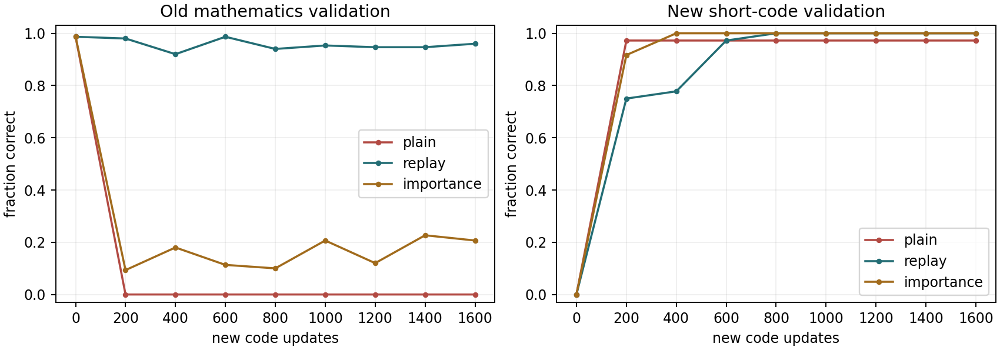
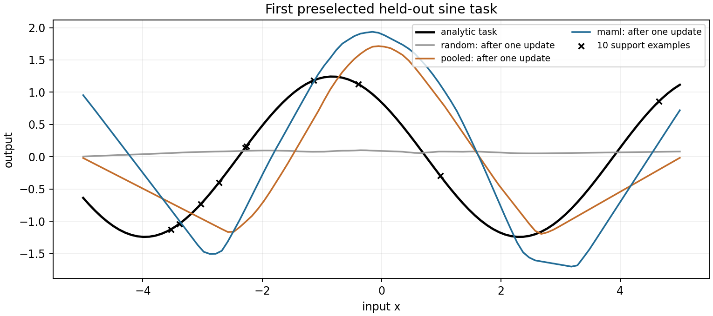

# 第四十六章　新任务进来，旧本领去哪了

上一章那条从 Q1 选出的亮度矩形到了 Q2 仍能预报凹陷，只是测量质量和零点条件变了。我们用 Q2 开头的合格读数调整**输入亮度的标度**，没有让矩形模型再学一遍。若后来碰到一颗新的星，或者新仪器使凹陷的时长和形状都变了，这个办法也许不够；这时“适应”究竟是给模型新资料、在提示里放例子、修改保存的参数，还是换一份专门模型？几个动作会在不同地方留下变化，不能都叫“它自己学会了”。[上一章的Q1/Q2边界](第四十五章_科学里的预测怎样变成可信的解释.md#fortyfifth-close)

本章把**真的会写入参数的一次继续训练**放在中心。第二十七章已有一份同第十九章随机权重模型一路延续而来的数学检查点：它能在作者规定的“三位字段加一位数”格式里答对大多数未见组合，却还不会另一项短 Python 表达式任务。现在若让它继续学代码，旧数学会怎样？如果旧数学资料可留下，我们能怎样一起复习；若不能全部留下，给重要参数加限制能保护多少？沿这件已经发生的本机学习，再区分三条容易被混成“自我提升”的问题：测试时只有无标签输入怎样调整，许多任务中怎样学一个易于快速适应的起点，以及训练者怎样安排样本顺序。[旧模型真实起点与资料身份](../data/c46_continual/SOURCE.md)

## 顺序学新事会忘旧事，为什么不是近几年才发现

神经网络的权重会共同服务许多输入，这是它比逐条查表有用的一面，也是后来训练可能改坏旧输出的原因。1989 年 McCloskey 与 Cohen 研究的正是连接主义网络里的**顺序干扰**：学过一批对应关系后再调整同一组连接去适应另一批，先前的对应可能剧烈退化。要注意这不是说网络连第一件任务都学不会，也不是说人脑与我们的软件参数机制已被证明相同；它把“会在当前资料上下降损失”与“以前的事情仍会做”拆成了两个检查。[1989年原书章的可见出版说明](https://www.sciencedirect.com/science/article/pii/S0079742108605368)

如果旧资料还在，1995 年 Robins 已认真研究一种朴素而强的候选：教新任务时穿插旧任务练习，这叫**回放**（rehearsal/replay）。若旧资料不能保存，他还讨论用系统生成的近似旧例作**伪回放**。它们不是无成本的魔法：真回放要保留或重取有权使用的旧资料；伪例的生成器本身可能错、可能把过去的分布压窄。那篇工作在 1995 年的期刊卷里，网页后来上线的 2010 年日期不能写成思想到 2010 年才有。[Robins原论文摘要与刊行信息](https://www.tandfonline.com/doi/abs/10.1080/09540099550039318)

另一道问题在 2009 年的课程学习研究中变得明确：即使所有训练资料都在，**先给哪些、后给哪些**也会改变非凸模型的优化过程。Bengio 等人比较过按顺序引入样本和其它安排，并把“从容易到复杂可能改变优化路径”作为有根据的研究方向；这不等于所有任务都由简单题先训最好。到 2016 年，Rusu 等人的渐进式网络代表另一种取舍：保留旧任务参数，给新任务另增网络部分、让它读取旧特征；旧部件少受覆盖，新增容量和识别当前任务的责任却随之增加。2017 年，Kirkpatrick 等人的 EWC 用“旧任务重要参数尽量别动”的惩罚，Lopez-Paz 与 Ranzato 的 GEM 则用少量旧例的梯度约束新更新方向。它们并行地针对**旧任务信息能否保留、参数能否增加、哪些更新可接受**作不同选择，既不是同一算法年年自动升级，也不是一份权重必须依历史顺序依次安装所有部件。[课程原研究](https://mlanthology.org/icml/2009/bengio2009icml-curriculum/)；[渐进网络原预稿](https://arxiv.org/abs/1606.04671)；[EWC原论文§2](https://arxiv.org/html/1612.00796)；[GEM原论文§3](https://arxiv.org/html/1706.08840)

## 同一份小模型里，先前究竟留下了什么

模型的家谱必须在看成绩前说清。第十九章先在 WikiText 的真实文章上从随机权重训练约 493 万参数的四层 Transformer；第二十五章又让**同一权重**在 Dolly 的短英文示范回答上训练，并用一小份旧 WikiText 训练块减缓退化。第二十七章从这个检查点另起数学专门支：作者给字段化的三位加一位数与正确的三位回答，目标只在回答/EOS位置计损失，2400 步后数学原验证 148/150 自由答对。它不是第二十六章那台尝试过窄二元奖励的权重，也不是外部强基座。短代码任务有自己的真实训练行和可检查 AST 允许集；旧数学检查点在代码验证里是 0/36。先前数学专门支的**150道数学测试**和短代码专门支的**45道代码测试**作者都已经看过，本章以后回到这些题只能叫同题事后比较。[第十九章已训语言模型](第十九章_从随机权重训练到真实生成.md)；[第二十五章适配与旧文章损失](第二十五章_文章模型怎样学着回应要求.md#twentyfifth-full)；[第二十七章一份权重的取舍](第二十七章_会写步骤与真正做对之间.md#twentyseventh-joint)

令数学旧任务的平均回答损失为 \(L_A(\theta)\)，短代码新任务的平均回答损失为 \(L_B(\theta)\)。这里 \(\theta\) 是**目前这同一台网络的所有可调数**；新任务不是把C27数学最优文件和代码最优文件拼在一起。一次只看代码的更新，会用代码示范的输入、回答目标和当前输出求梯度 \(g_B=\nabla L_B(\theta)\)，再由优化器改变 \(\theta\)。旧数学标签不会自动出现在这个梯度里。我们先给三支完全相同的数学起点、相同的代码训练抽样顺序与 1600 次新任务更新：只训代码；每批加旧数学训练例回放；只保留旧数学参数和一份“重要性”数表来罚偏离。第三支不是原EWC论文代码的精确复刻，它会在下节交代实际估法。[事前比较与测试身份](../verification/C46_sequential_pretest_decision.md)

即使只迈**一步**，旧能力也不是抽象担忧。本机代码-only小探针从数学验证148/150、代码0/36起步，读取16条代码训练例完成一次AdamW更新，数学验证变为133/150，代码答对仍为0/36；数学教师前缀损失从约0.0221升0.0984，代码损失从约15.287降到10.942。一小步已把对新任务的目标概率推高，也使一些旧答案的自由输出不稳；它尚没有让代码题成功，更不是普遍每步都恰损15道数学题。[单步真实收据](../runs/c46_sequential_smoke_plain/train.json)

## 一个新任务梯度，为什么可能推高旧任务的损失

先暂时把优化器简化成一小步普通梯度下降：\(\theta'=\theta-\eta g_B\)，步长 \(\eta>0\)。旧损失在目前参数附近若可微，沿这一步作一阶展开：

\[
L_A(\theta-\eta g_B)
=L_A(\theta)-\eta\,g_A^\top g_B
  +\text{二阶及更高阶的余项},\qquad g_A=\nabla L_A(\theta).
\]

这个内积不难解释：它把每个参数上旧任务想降低损失的方向与新任务的方向逐项相乘再相加。若 \(g_A^\top g_B<0\)，两个下降方向局部相争；向负 \(g_B\) 走，会让**这个位置、这份旧损失**的一阶变化为正。它不是“旧知识已永久删除”的定理。换旧样本、换步长、用AdamW动量/裁剪、走许多步，二阶项和后来的梯度都会改变；若内积为正，也只给这一步局部的线索。

我们在固定数学检查点另挑16条旧数学**训练**例和16条新代码训练例，用FP32算同一点的两组梯度，得到内积约 \(-0.4886\)、余弦约 \(-0.0220\)。这说明本例两方向总体只轻微反向，不能说所有参数都严格冲突。若仅为核公式，用 \(10^{-6}\) 的纯 SGD 步长朝代码方向挪一极小步，一阶预报旧小批损失增加 \(4.886\times10^{-7}\)，实际重算增加约 \(4.577\times10^{-7}\)。最初用BF16去分辨这么微小的损失差时，舍入掩过一阶变化；我们保留那个数值探针失败，改用FP32才作此比较。这项局部数学核算**不是**后面1600步AdamW训练的效果说明，后者须实际评价。[FP32同批梯度核算](../runs/c46_gradient_conflict_fp32.json)

这也帮助看懂2017年GEM的选择。它留下少量旧任务例子，先在这些例子上算旧梯度；若建议的新梯度会与旧梯度形成负内积，就把新方向改为满足内积非负的近方向。由上面的展开，非负约束在足够小的SGD步里能防**被存下的那些旧例**损失的一阶上升，却不保证没存的旧分布、有限步长或换了任务条件后永远无损。本书只跑内积和极小步探针，**没有**解GEM的约束二次规划或训练过GEM网络。[GEM原文式(5)—(8)](https://arxiv.org/html/1706.08840)

若存了多个旧任务的少量记忆，GEM可以把这个动作写成一个明确的求近问题：原新任务梯度是 \(g_B\)，想找改后的 \(\widetilde g\)，使它尽可能接近 \(g_B\)，同时对每份旧记忆的梯度 \(g_{A,k}\) 都不逆行：

\[
\min_{\widetilde g}\tfrac12\|\widetilde g-g_B\|^2
\quad\text{使}\quad
\widetilde g^{\top}g_{A,k}\ge0\quad\text{对每个已存旧任务 }k.
\]

约束只谈**保存的记忆例子**和当下的一阶方向，仍有训练资料要保存、每步要重算旧梯度的成本。这与上面只算了一次负内积的本机探针是不同层次：给出可行方向的方程不等于本机已经实现了求解和长期训练。

## 旧例仍可用时，回放把哪一项送回目标

如果旧数学训练例有保存权且能再次使用，一个直接办法是在每次代码批之外，再取16条旧数学例。代码批和数学批各自把**实际回答与EOS目标**的负对数概率平均，接着取

\[
L_{\rm mix}(\theta)=\tfrac12L_B(\theta)+\tfrac12L_A(\theta).
\]

此时一次梯度是 \(\tfrac12g_B+\tfrac12g_A\)：旧任务终于能在更新时表达自己的代价。两个“各一半”是**两个批均值的系数**，不是半数训练token，更不是说旧资料原库只有一半。代码回答长度各不相同，本机1600步里实际见到约142,233个新代码回答/EOS目标；数学回放另见102,400个旧目标。两支虽同样有1600次代码更新，回放还多读旧行、多作一次前向与反向；若旧资料因许可、隐私或存储条件不可再用，整条路的前提就变了。[真实代码与目标数](../code/c46_sequential_math_code.py)；[运行口径](../verification/C46_continual_protocol.md)

回放也没有证明每一步都同时改进两任务。若两个梯度在某位置相反，平均后的一项可能抵掉另一项；旧任务要保护多少，仍依权重和目标真实重要性选择。第二十七章为了**一份权重**同时保有数学/代码/Dolly/Wiki四项，曾取不同的四项权重；本章换成“数学先练好、之后代码来”的顺序，研究的是一次任务到达后的选择。新旧资料同时出现在每一步，不应倒写成1989研究者当年使用了本书这个语言模型。[前章四目标回放的实际成绩](第二十七章_会写步骤与真正做对之间.md#twentyseventh-joint)

在这份实码里，一批记录先经旧词表成为形状为“批大小×本批时间位置数”的整数表；输入位置都可被左侧注意力读，标签为 −100 的提示/PAD位置**不计当前目标**，回答和EOS才计。数学批恰有16×4个有效目标；代码答案长短不同，所以单独算它本批的有效目标数作分母。关键更新可直接和上式对照：

~~~python
code_loss = mean_nll(model, code_batch, code_task.batch, tokenizer, device)
math_loss = mean_nll(model, math_batch, math_task.batch, tokenizer, device)
objective = 0.5 * code_loss + 0.5 * math_loss
optimizer.zero_grad(set_to_none=True)
objective.backward()  # 只把两个目标的导数放进参数梯度
torch.nn.utils.clip_grad_norm_(model.parameters(), 1.0)
optimizer.step()      # 这一行才写入同一组模型参数
~~~

这里的模型是已加载C27数学检查点的**同一个对象**，两种资料的损失在它的一次更新前相加；不是分别训练两份“专家”最后挑输出。梯度裁剪能限制这一步的总梯度范数，却不会凭自身知道该保哪项旧能力。读取旧数学训练行、读新代码训练行和真正改权重，程序都在不同函数/语句里，给得出具体的资料来源。

## 旧数据不能每步重放，只护住“重要参数”够吗

另一条路线是在旧任务训练完成时保留**当前权重与一份参数重要性估计**，新任务到达后尽量少动对旧任务重要的位置。EWC（elastic weight consolidation，弹性权重巩固）的原论文从旧资料下的参数后验作局部高斯近似，以 Fisher 信息的对角项代表每个参数附近的曲率，把学新任务写成“新损失加一项到旧参数的加权平方距离”。这并不是一条从“神经元是记忆”直接严格推出的自然定律：真实后验难求、参数间相关被对角近似丢掉，任务B也未必在旧解附近有兼顾两者的解。[EWC原文§2与式(1)—(3)](https://arxiv.org/html/1612.00796)

这项选择为何能从旧任务的概率模型想到？如果旧资料 \(D_A\) 与新资料 \(D_B\) 在给定参数后按相应假设分开，贝叶斯乘法给

\[
p(\theta\mid D_A,D_B)
\propto p(D_B\mid\theta)\,p(\theta\mid D_A).
\]

最大化它的对数，等于让新资料的负对数损失低，同时不离开旧资料支持的高概率参数区域。但 \(p(\theta\mid D_A)\) 对深网络难算；EWC在旧参数 \(\theta^A\) 附近，用一个**对角的局部高斯**近似其负对数形状。若每个参数方向的局部精度为 \(F_i\)，旧项近似成 \(\tfrac12\sum_iF_i(\theta_i-\theta_i^A)^2\)。在概率模型里，Fisher对角项可写成旧资料条件下的分数导数平方的期望 \(F_i=E[(\partial_{\theta_i}\log p_\theta(y\mid x))^2]\)；这个期望怎样取、在旧最优附近是否真能近似损失曲率，都带条件。由“后验乘法”得到**考虑旧任务**的理由；由“对角高斯、Fisher和有限估计”才得到这一种具体可计算惩罚，不能把后者说成唯一数学后果。

本机作的是**EWC式的经验代理**。先在旧数学的96条训练例上逐条算平均回答损失对每个参数的梯度平方，取平均，称为 \(I_i\)；为使惩罚系数可读，再把全体 \(I_i\) 除以其原均值。这个 \(I_i\) 非负，**不是**精确Hessian，也不是照原论文用模型分布计算的Fisher。保存旧数学参数 \(\theta^A_i\) 后，新代码训练的目标变为

\[
L_{\rm new}(\theta)=L_B(\theta)
+\frac{\lambda}{2N}\sum_{i=1}^{N}I_i(\theta_i-\theta^A_i)^2,
\qquad N=4{,}930{,}304.
\]

这里 \(N\) 是参数数目，避免把“求和随模型大小变大”暗藏进同一个 \(\lambda\)；本机 \(\lambda=100000\) 是按首批新任务梯度和一个假设的参数位移量级**事前固定**的对照值，不是经最终测试调到最优。罚项对第 \(i\) 个参数的梯度为 \((\lambda/N)I_i(\theta_i-\theta^A_i)\)。刚开始 \(\theta=\theta^A\) 时它为零，所以这项惩罚不会在第一笔新梯度出现前神奇地替旧数学提供一份标签；随着权重偏离才逐渐拉回。训练B时不再读A的原行，但仍占用旧参数和同规模重要性数组，也仍须有旧数学代表样本先算 \(I\)。[96样本重要性探针](../runs/c46_importance_first/report.json)；[三支固定计划](../verification/C46_sequential_pretest_decision.md)

2016年的渐进式网络又给一个同层替代：把旧网络冻住，只训练新网络并允许新网络读旧特征。若路由到旧任务仍调用原旧部件，其函数在同一数值环境下可不变；要同时交给一台系统运行，就须保存新增参数并判断眼前是哪项任务。第二十五章低秩支路也提醒我们：冻结**旧矩阵**不等于开启新支路后整个函数不变。回放、参数约束、分模块各用不同资源保护不同对象，不应把“都能防遗忘”说成同一保证。[渐进网络原预稿](https://arxiv.org/abs/1606.04671)；[第二十五章低秩支路真实界线](第二十五章_文章模型怎样学着回应要求.md#twentyfifth-lora)

## 三条路线都学到新代码了吗，谁仍会旧数学

三支从同一数学检查点另起，代码训练抽样顺序、AdamW学习率 \(0.0002\) 和1600次更新相同；所有模型都在已用于C27选择的数学/代码验证行上每200步核一次。图左纵轴是旧数学150道的自由完全正确比例，右边是新短代码36题在本章限定AST规则下的符号等价比例；横轴是新代码更新步数。它显示的是**验证轨迹**，不是第二份新测试。[三支真训练收据](../verification/C46_continual_protocol.md)

| 从同一数学权重出发 | 1600步后旧数学验证（满150） | 新代码验证（满36） | 已开过的旧数学/新代码同题测试（满150/45） |
|---|---:|---:|---:|
| 原数学权重，还未学代码 | 148 | 0 | 146 / 0 |
| 只续训代码 | 0 | 35 | 0 / 45 |
| 新代码每步配旧数学回放 | 144 | 36 | 143 / 44 |
| 新代码加本机重要性惩罚 | 31 | 36 | 31 / 45 |

旧数学的教师前缀验证损失在仅学新代码支升到约6.73，而新代码降到0.0184；自由数学0/150不是单独一次解码采样碰巧失手。本次回放支数学损失约0.0325、代码损失约0.000042，旧数学验证仍144/150；新代码代码同题44/45而plain是45/45，不能为夸回放只报数学一侧。重要性支旧数学验证仅31/150，即便按 \(I\) 加权的参数均方移动约 \(6.82\times10^{-8}\)，远小于plain的约 \(1.05\times10^{-4}\)。按这个代理量“移动很小”，没有推出旧数学函数保持正确；忽略的参数联动、代表例、归一和固定 \(\lambda\)、容量及优化路径都可能相关，本次没有实验把它们逐一隔离，故不宣布“EWC这种方法失败”。[逐支验证、同题与参数距离原报告](../runs/c46_sequential_comparison_first/report.json)

我们还把更旧的 Dolly 回答和 WikiText 文章验证重新计分，防止“保住数学”被误叫“保住一切”。数学专门父模型在进入本章时，这两项NLL已经从C25起点约5.493/5.942退到13.710/19.589。回放**只针对数学**再学代码后，它们约16.993/23.969，并没有恢复；旧资料没有进入这次回放目标，不应要求它靠名字自行回来。这正是继续训练必须保存**按任务分开**的读数，而不能把代码35/36当总智力上升。[旧目标各支实际损失](../runs/c46_sequential_comparison_first/report.json)

## Q2没有标签的时候，“自己变得更确定”提供什么信息

回到前章的 Q2：我们知道它的亮度，却没有在第一眼就拿到一个“此点是不是行星、模型错在哪”的可靠标签。若只用最初55条合格读数求一个零点中位数，再按旧矩形推时刻，改变的是**输入表示的尺度**；参数仍是Q1的周期、中心、深度。这是有测量依据的局部校准，不是权重持续训练。另一种情形是新条件已有带答案的样本，像上面代码示范那样可以直接给响应损失，调用优化器改权重；它需要人或可检验程序供真目标。[Q2确实没改矩形权重](第四十五章_科学里的预测怎样变成可信的解释.md#fortyfifth-kepler-result)

如果新条件只有输入、没有目标，研究者会寻找在这些输入上**仍可算**的替代反馈。2020 年 Sun 等人的 test-time training 在源资料训练时就同时建立一个自监督辅助任务，测试时让新输入自己提供该辅助目标再改权重。2021 年的 Tent 则针对可微概率分类器，在一批未标注新输入上减小模型输出的**熵**，只更新归一化相关的少数参数。它们解决的是不同信息与架构条件；不能把 Tent 的“测试时更新”套在我们的无归一化小语言模型或Kepler矩形上，说只需开个开关便会更准。[TTT原论文摘要与方法身份](https://proceedings.mlr.press/v119/sun20b.html)；[Tent原论文§2—3](https://arxiv.org/html/2006.10726)

熵目标为什么既可能有用又危险，可以不靠术语看一格。二类概率为 \(p\) 与 \(1-p\)，模型的预测熵是

\[
H(p)=-p\log p-(1-p)\log(1-p).
\]

若 \(p=\sigma(z)\)，对可调分数 \(z\) 用链式法则：

\[
\frac{dH}{dz}=p(1-p)\log\frac{1-p}{p}.
\]

当模型已给第一类 \(p=0.9\)，这个导数为负；沿减少熵的梯度方向更新，\(z\) 更大，第一类更接近1。若它原本报错，**这项无标签目标照样把错误答得更坚决**。第43章那张已有监督标签与模型意见不合的服饰图就是提醒：高置信不自动正确，旧验证上选的概率温度在右下平移后甚至使校准误差变坏。Tent原论文在它的批次/归一化限制和腐蚀基准上有实际改善；上面的两类推导只给出“没有真标签时不能保证纠错”的边界，不是本机已实现Tent后观察到它一定变差。[第43章旧图和分布变动](第四十三章_模型说得有把握时怎样查它的理由.md#fortythird-calibration)

测试时改权重还要问谁保存、何时重置。若对一个测试批更新后立即用同批已知真标签改方案，再宣称它是独立测试，评价已经泄露；若把这次更新永久写进服务权重，别的用户/旧任务也会受影响。第三十九、四十章的执行回执、模型文件版本与可更正资料分开，正可用于记录“这个请求只改变了临时计算状态”还是“模型版本真的写回磁盘”。目前本书实际的顺序语言训练有写权重；Q2零点校准没有；这段测试时无标签学习只由数学和原论文说明，还**没有**在本机C13 CNN上跑Tent或TTT。[模型副作用与收据](第三十九章_请求发出以后怎样知道它做了什么.md#thirtyninth-acceptance)

## 学新任务要快，为什么需要很多旧任务来训练“起点”

刚才的问题是：学完数学A后，代码B来到，同一权重如何保A。元学习换了另一问：**未来会不断出现不同任务，能否预先找到一组参数，让每个新任务只给少量有答案的例子，改几步就能在该任务的其它输入上表现好？**这里即使未来任务从未出现过，训练者必须先有一批**相关任务族**可供练习。不给这些任务、不给少量示范的反馈，只说“模型学会学习”不会产生第一次有效梯度。

把一项任务记作 \(\mathcal T\)，它带自己的数据关系和损失；训练时从任务分布 \(p(\mathcal T)\) 抽许多项。对每项先分两份不同资料：支持集 \(S_{\mathcal T}\) 给少量已知目标，查询集 \(Q_{\mathcal T}\) 用来问“只学了支持例以后，面对该任务其它输入能怎样”。若共同起点为 \(\theta\)，一小步内层学习是

\[
\theta'_{\mathcal T}
=\theta-\alpha\nabla_\theta L_{S_{\mathcal T}}(\theta).
\]

Model-Agnostic Meta-Learning（MAML，模型无关元学习）的外层目标不直接奖励起点对所有互相矛盾的任务一开始就同答，而是比较**更新以后**在各自查询资料上的损失：

\[
\min_\theta\;
\mathbb E_{\mathcal T\sim p(\mathcal T)}
\left[L_{Q_{\mathcal T}}\!\left(
\theta-\alpha\nabla_\theta L_{S_{\mathcal T}}(\theta)
\right)\right].
\]

外层真要更新旧的 \(\theta\)，必须把查询损失的导数穿过内层那一步；在光滑情形，内层参数对旧参数的导数含 \(I-\alpha\nabla^2 L_S(\theta)\)。这解释为什么完整MAML比普通“先把所有训练点混在一起”多一层计算，也解释外层为何能偏向那些**学少量支持点后容易变好**的参数起点。2017 年 Finn、Abbeel 与 Levine 的原论文在正弦、少样本图像与控制上研究此目标，还讨论省略二阶项的近似；它没有保证任意未曾见过的任务族都可十例学成。[MAML原论文§2与§5.1](https://arxiv.org/html/1703.03400)

本机让机制能在这台电脑上直接复现：每项是 \(y=A\sin(x+\phi)\)，但 \(A\in[0.1,5]\)、相位 \(\phi\in[0,\pi]\) 每任务不同；这是真函数由作者算出的**数学任务族**，不是天文光变或语言模型。网络是两层各40单元的ReLU回归器。普通合并预训练直接对许多任务的查询点降误差；MAML式训练每轮四任务、每任务10个支持点先作一步更新、另20个查询点的误差再回传到共同起点。三支初始随机权重相同，后两支各1000外层轮；MAML额外付内层和穿过内层求导的成本。本机固定64项新抽任务，评价时各给**同样的10个带真值支持点**，再看不适应/一步/同支持点五步在每任务100个查询位置上的平均平方误差。[真实训练与任务来源](../verification/C46_meta_pretest_decision.md)；[完整元任务代码](../code/c46_meta_sine.py)

本机[完整正弦程序](../code/c46_meta_sine.py)的承重行也正好分两层。functional_call让同一网络先按一份**暂时更新后的参数表**计算查询输出；create_graph=True使内层导数本身仍能被外层追溯，而不是求完梯度就丢了计算关系：

~~~python
support_loss = ((functional_call(model, parameters, (support_x,)) - support_y) ** 2).mean()
gradients = torch.autograd.grad(support_loss, tuple(parameters.values()), create_graph=True)
adapted = {name: value - inner_lr * grad
           for (name, value), grad in zip(parameters.items(), gradients)}
query_loss = ((functional_call(model, adapted, (query_x,)) - query_y) ** 2).mean()
query_loss.backward()  # 梯度穿过 adapted，回到更新前的共同参数
outer_optimizer.step()
~~~

一个任务的 adapted 只是内层副本，不能在下一任务偷带上一任务的答案；许多任务的查询损失在真实程序里先平均，再做一次外层更新。若去掉 create_graph，仍可写一阶近似算法，却不再是本机这次确实执行的完整二阶路线。支持答案来自作者解析式，查询答案也由同式生成；模型本身起初并不“知道正弦任务应该怎么画”。下表是**最终固定的第1000轮**在此前未参与元训练的64项上的结果，不是上面这段单任务代码执行一遍就有的成绩。

| 起点 | 新64任务零步均方误差 | 给10例后一步 | 同10例共五步 |
|---|---:|---:|---:|
| 未训练的随机网络 | 3.493 | 3.257 | 3.141 |
| 普通合并预训练 | 2.853 | 2.445 | 2.059 |
| MAML式元训练 | 2.947 | 1.769 | 1.132 |

零步时普通预训练反而略好，这符合它直接对任务混合的查询值拟合；MAML式把能力放在**看到支持点后容易调整**上。对64项的平均，一步和五步都更接近真函数，但别让这张均值表抹掉单个任务：程序预先取出的**第一项**里，MAML式一步均方约0.827，普通预训练约0.630，蓝线比橙线离黑色真曲线更远。支持点十个黑叉已经给了，它仍会在其它区间偏离；这是真实失败，不是从图里挑了一个看似更容易赢的展示。本机MAML外层约12.13秒，普通合并预训练约3.76秒；“少量新例后适应得快”也不等于整套元训练更省计算。[64任务平均及首项原报告](../runs/c46_meta_sine_1000/report.json)

这项元实验教的是目标**怎样形成**。如果未来任务不是另一条正弦，而是长篇数学证明、现实仓库修复或全新仪器标注，\(p(\mathcal T)\) 的支持范围、可得的十个正确示范和可验证的查询任务都换了。我们没有对4.93M语言权重做这次元训练，也没有证据说它凭十条提示就能在新学科内部学会严谨证明。对话里把十例放进当前上下文时，可能是模型在**固定权重**下按输入条件变化；若要称MAML式参数适应，必须能指出内层梯度和实际参数副本。

## 谁决定下一批练什么，是否就能无限自我提升

回放解决旧资料是否还给模型，元学习决定起点怎样利用新任务少量示范；还有一个属于**训练者**的问题：手上若有容易、困难、不同形式的训练题，下一批给哪一类？2009年的课程学习把呈现顺序变成可实验选择；2017年Graves等人的自动课程工作甚至让一个外部选题器根据网络在不同资料上的**学习进展**，调整抽取它们的概率。选题器的反馈来自模型在既定损失/检查上的变化；它不是替模型凭空造出正确解、真实实验或新奖励。若一直选当前最容易降低损失的题，难而重要的分布可能再也轮不到；若一类题全错且只给零一总成败，进展测量又可能根本没有信息。E05那句“还不会做对时怎么办”在这里仍指向监督、可达性和任务表示，而非“让自动课程多探索几轮”。[2009课程原研究](https://mlanthology.org/icml/2009/bengio2009icml-curriculum/)；[2017自动课程原研究](https://proceedings.mlr.press/v70/graves17a)

第二十七章在同一道字段加法任务上，800步短计划的验证只有26/150，2400步较长计划达到148/150；这说明**本次更多有标签更新**改变了结果，并没有实验比较“先不进位、再进位”与打乱顺序，更没有运行一个自动选题器。真要试课程，至少固定总训练计算、初始权重、资料和验证组，让两种顺序各自正常取得同样信息，再看少见的连续进位、换问法与旧Dolly/Wiki保持。模型报自己“学到了”不是选择器的外部正确标签；一个训练分数升高也不能用来替独立目标验收。[第二十七章真实短/长计划与进位错例](第二十七章_会写步骤与真正做对之间.md#twentyseventh-arithmetic-result)

例如，若训练者可选“不进位”“个位进位”“连续进位”三个题源，一项可计算的教学重构是在各自预留的检查题上看前后损失：上一轮某源从0.9降到0.7，记进展0.2；另一源从1.2降到1.18，只记0.02，再给抽题概率一次有限调整。这些数字是**作者用来说明选择器输入输出的假例**，不是本机C27运行结果，也不是Graves等人论文一模一样的奖励式。它揭出两难：进展大的不进位题也许已很容易、继续练它会挤掉目标所需的连续进位；全错任务若只给“是否最终全对”的零一反馈，进展又可能一直显示0。训练者须同时保留最终任务权重、各类资料可获得的正确标签和检查预算；课程选择只能安排已有学习信号，不能从零分凭空造出推导步骤。

到2025—2026年，预训练大模型、可加适配支路、外部记忆和工具系统使“旧能力保留”出现新的资源选择，却没有把问题消灭。2025年一项对无回放预训练模型路线的原研究发现，复杂参数高效方法在其基准上的一些优势需要重新与更简单支路比较；2025年举行、2026年发表的持续学习研讨会仍把可信基准、旧知识忘记怎样量和大模型回放列为开放任务。不能以这些论文和会议标题宣布“永不遗忘已经解决”或“所有大模型必忘”。本书自己的4.93M模型、96个旧样本重要性代理和一个正弦任务族，比现实基础模型小得多；它们给出可追的机制和明确反例，不给封闭生产系统一份未经公开的终极训练配方。[2025原研究摘要范围](https://proceedings.mlr.press/v274/thede25a.html)；[2026研讨会原报告摘要](https://drops.dagstuhl.de/entities/document/10.4230/DagRep.15.10.119)

## 亲自沿同一权重做一次更新、一次保护、一次快速适应

在本书活动包根目录运行下列命令。第一组读取本书已经存在的C27数学权重、两项作者任务及旧验证；它只写 work/runs 下的新目录。第二组另建正弦小网络，不动前一组语言权重。已有运行结果的原目录由源码拒绝覆盖，所以请用**还不存在**的 my 目录。三支顺序训练各从同一数学检查点重新起步，彼此之间没有偷偷接力。[所有旧/新资料文件与评价身份](../data/c46_continual/SOURCE.md)；[完整命令及误差条件](../verification/C46_continual_protocol.md)

~~~powershell
Set-Location '.'
python work/code/c46_importance_probe.py --out-dir work/runs/c46_my_importance --examples 96
python work/code/c46_sequential_math_code.py plain --steps 1600 --out-dir work/runs/c46_my_plain
python work/code/c46_sequential_math_code.py replay --steps 1600 --out-dir work/runs/c46_my_replay
python work/code/c46_sequential_with_my_importance.py --importance-dir work/runs/c46_my_importance --steps 1600 --out-dir work/runs/c46_my_importance_train
python work/code/c46_gradient_conflict.py --out work/runs/c46_my_gradient.json
python work/code/c46_meta_sine.py --out-dir work/runs/c46_my_meta --steps 1000
~~~

正式比较的importance支**核固定的本章原重要性文件SHA**，因为三支结果在训练前已锁；上面给读者另备了一条[接收新重要性收据的入口](../code/c46_sequential_with_my_importance.py)，它先核 my_importance 里的96旧数学训练例、父权重和文件SHA，再把你刚算的数表交给同一训练函数。这样一轮练习确实使用你新生成的文件；若源码和环境与本章相同，字节与数值也可能与原实验一致，仍是你重新执行的工作，更不会让已经见过的C27测试重新变盲。其它两支和正弦程序各有独立输出目录，运行时间随机器而变。看报告时先比第0、200、1600步的数学/代码**验证**，再回到旧任务是否有正确标签参与这一步；不要把画出的曲线、一个产物文件或模型选择动作都叫参数学习。

## 何时该保留，何时该更新

若新资料来了，先定它提供什么反馈：只是新输入，还是可信的正确答案、可执行测试或可重做的实验；再定改变存在哪一层。给输入做零点校准、给提示加上下文、从旧检查点恢复、训练适配支路、对一份权重作梯度更新、为下一任务重新安排课程，承担的风险与证据各不相同。C46的同一小语言权重从数学走到代码，把这种区别变成了可数的结果：只训代码，旧数学在本次评估掉到0；回放旧数学，较多旧能力得以保留但有额外资料和计算；本机一次固定重要性罚只部分保留，不抹掉原EWC在其它条件下的成果。MAML式小正弦则说明，在**许多相关任务和真实支持答案**存在时，外层可以训练一个更好做少样本更新的起点；第一条任务不赢和元训练计算开销同样要看。

这些并未使一台小模型自动知道下一件值得研究的事，更没有让历史上每个方法成为它必须走的阶段。下一章把这些已分清的输入、反馈、权重和评价带到推荐、时间序列与人机学习等应用：不同领域要先决定谁给行为后的信号、资料怎样随系统行为变化、什么目标值得长期保留，不能把一份已有语言模型的数学/代码成绩直接盖到所有现实任务上。[下一章责任与当前书结构](../../地图/全书知识结构.md)

## 用三个反问检查更新真正发生在哪里

1. 同一数学权重学代码时，若某一小批的旧数学梯度与新代码梯度内积为负，为什么一小步普通SGD会先提高那批旧损失？如果实际训练改用AdamW走1600步，哪一段刚才的推论不再足以判终局？
2. 本机经验重要性罚把加权参数距离压得极小，旧数学验证仍只31/150。它否定的是“这项代理、这项权重、这个任务序列能保旧数学”还是“任何EWC都无效”？若旧数学训练行能合法重放，回放比惩罚多了哪种即时信息，又多付了什么？
3. Q2开头求亮度中位数、测试时减预测熵、在正弦新任务的10个支持点上作梯度更新、把正确示范写进当前提示——四项里分别哪些会改变权重？哪些有真实任务标签？若某输出本来高置信而错，仅靠减熵能否从信息上知道应改成另一类？

核对思路

第一题的一阶变化是 \(-\eta g_A^\top g_B\)，内积负而步长正时为正；有限步、批次变化、曲率、AdamW预条件/动量/裁剪不由这项局部式独自控制。第二题只能否定本机这项具体设置在旧数学保持上的充分性；回放每步直接拿旧正确回答的梯度，但需有权保留旧例、要额外计算，且回放哪项任务就主要保护哪项。本书只回放数学，没有让Dolly/Wiki自动恢复。第三题 Q2中位数只是输入尺度状态，不写模型参数；给提示放示范也不写权重；减熵若真的对可调参数求导并执行优化、正弦支持集更新都写参数（后者有解析式给的真目标，前者无真实类别标签）。一个高置信错误靠自身熵无法知道正确类是谁，还需额外可信信息或假设。

