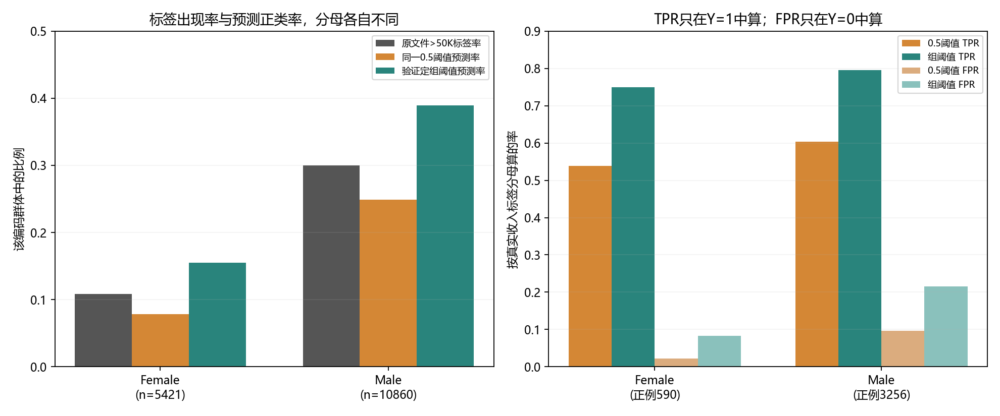

# 第四十四章　数据来自谁，预测又影响谁

## 总体数字之外，还有谁正在承受错误

上一章那套服饰分类器在已打开的官方测试图上答对87.79%，按十个概率区间汇总的误差也不大；一张与数据标签不合的高分图和一组整体右下平移的图，却已经让“总数好看”不足以说明每一次判断。到真人资料上，这个问题不能只补几张显著性热图。我们还须知道：**谁进入了资料，历史记录中的目标代表什么，哪类人得到正预测，错过的又是谁，训练和发布允许带走哪些信息。** [第四十三章留下的问题](第四十三章_模型说得有把握时怎样查它的理由.md#fortythird-next)

为让这些问句有可计算的对象，本章使用UCI仓库的Adult资料。它记录的是从**1994年美国Census资料中经过条件筛选**的一批行，目标为记录中的年收入是否超过五万美元。1996年进入UCI后，它被许多机器学习和公平性研究反复用于可比实验。我们在用户电脑上按官方原压缩包的字节和许可核对，保留原`adult.data`、`adult.test`及说明文件。今天若问是否该雇用某人、向谁贷款、谁值得获得机会，**都不是这份旧文件的标签已经回答的事**。下面训练的程序只预测这份历史资料的收入分段，用它检验指标和资料流，不给现实个人下决定。[UCI原数据页及当前许可](https://archive.ics.uci.edu/dataset/2/adult)；[本机原件和字节来源](../data/c44_adult/SOURCE.md)

## 一份“公共基准”在进模型前已经作过哪些选择

原`adult.names`说得比数据集名更具体：Barry Becker从1994年数据库中抽出年龄、收入、最终样本权重和工作时长满足指定条件的记录；MLC++工具再将保留下来的记录**随机**分成约三分之二训练、三分之一测试。因此原32,561条训练行与16,281条测试行并非先后年份，不能拿测试成绩叫作“跨时代预测”。有些字段写`?`，原训练文件有2,399条至少带一项这种缺值。本书把`?`当“原文件没有填明的类别”保留；若先把这些行全部删掉，哪个群体被删得更多也会影响后来可见的比率。[UCI原说明文件](../data/c44_adult/adult.names)；[固定压缩包与安全解出范围](../data/c44_adult/manifest.json)

文件里的`sex`只有`Female`、`Male`两个编码，`race`也只给五个很粗的类别。它们说明**这个旧文件怎样记录**，并不规定所有人的身份都能由这些列完整表达。收入标签也受1994年的劳动机会、人口抽样和五万美元阈值影响。2021年Ding、Hardt、Miller与Schmidt追索其原Census来源后指出：这个阈值在当年总体收入中约是第76百分位，在Black人口与女性收入中约为第88、第89百分位；固定美元数并没有在各群体中表示同样常见的收入位置。这是他们利用更完整来源所作的估计，**不是**下面我们从UCI文件不加权行数算出的美国人口分位。[2021原论文，第1—3页](https://proceedings.neurips.cc/paper_files/paper/2021/file/32e54441e6382a7fbacbbbaf3c450059-Paper.pdf)

这样的历史背景改变本章的数学任务。如果只为练习软件接口，把`Y=1`称作“优良”、把`Y=0`称作“不合格”，往后所谓“公平地识别优良者”就已经在定义处替现实作了未经授权的价值判断。我们只把\(Y=1\)定义为**原行写`>50K`**，\(Y=0\)为原行写`<=50K`；群体变量\(A\)先取原文件`sex`的两种编码。真实人是否受到了不平等对待，不能由这三个符号自动推出。第十章的两套小世界曾有完全一样的观察表，却给主动改变的结果不同；本章也只能先作**观察资料里的条件统计**，若要讲社会过程的因果，还须另给采集、招聘、收入形成等机制与可信比较。[第十章观察和干预的实际区别](第十章_看见相关之后能否判断改变的后果.md#tenth-intervention)

## 先让一个普通预测器完成它真正能做的任务

我们仍需一条正常、可检查的预测规则。作者选逻辑回归：把一行中年龄、受教育年数、工作时长、资本收益/损失等数值先按**拟合资料**的均值和尺度转换；把职业类别、婚姻状态等离散项变成各自的零一位。五个数值列和五个类别列在本机共成为84个模型输入数。类别名称与尺度只从训练行拟合，验证及原测试只是按已定规则转换，遇未见类别不在测试时重建词表。[真预处理与模型代码](../code/c44_adult_group_study.py)

模型对一行\(x\)算可调分数\(z=w^\top x+b\)，再用

\[
p_w(Y=1\mid x)=\sigma(z)=\frac1{1+e^{-z}}
\]

报出本文件收入标签为1的模型概率。给已知标签\(y_i\)，逐行损失为\(-y_i\log p_i-(1-y_i)\log(1-p_i)\)；它正是第五章的“给实际发生的标签留多少概率”在二类问题上的写法。程序用训练行更新\(w,b\)，并给过大的系数加二次惩罚；库参数`C`控制这项正则的强弱，**它是模型选择量，不是另一个人群标签**。我们事先只试`C=0.1、1、10`，按原训练文件另分出的验证行负对数损失挑选，而不看测试谁赢。[第五章损失的前页](第五章_同一条件下为什么还会有不同结果.md#fifth-logloss)；[先于测试的选择记录](../verification/C44_pretest_decision.md)

这一轮模型**没有直接接收**`sex`或`race`列；它们留在分组评价里。为什么仍要量分组结果？别的输入与这些列可能有关：婚姻状态、职业和工作时长本身经历社会过程，也可能成为预测群体编码的线索。去掉一列只能证明程序没有**直接读取那一列**，不能证明模型对群体没有不同效果；反过来，看见效果不同也不能只凭数字断定模型怎样在现实中造成收入差。当前模型的用途是把这些关系放在能测、能讨论的位置。

原32,561条训练文件行先按`(sex编码,收入标签)`固定种子分成26,048条拟合与6,513条验证。三项`C`的验证平均负对数损失依次约0.322220、0.321751、0.321675，所以依事前规则定`C=10`。权重与阈值都固定后，程序才为**本章**第一次解释原16,281条测试行；原测试正确率在统一0.5阈值下是85.23%，概率的负对数损失约0.31884 nat/行。它检验了这份**同一1994抽取机制随机分出**的资料，不能推到2026年某个真实求职者。[训练/验证实数](../runs/c44_adult_pretest/train.json)；[原测试聚合收据](../runs/c44_adult_pretest/test.json)

## 85.23%的总正确率落到两个分母上

若模型报“超过五万美元”的概率至少0.5，我们记\(\widehat Y=1\)。先问最简单的两个数：原文件里某编码群体实际写\(Y=1\)的比率，与模型给该群体\(\widehat Y=1\)的比率。官方原测试文件中，`Female`编码有5,421行，其中590行的标签是1，比例10.88%；`Male`编码有10,860行，其中3,256行是1，比例29.98%。统一0.5阈值给两组预测正类的比率分别7.88%和24.87%。这些是**UCI文件行计的条件比率**，没有按原`fnlwgt`加权，更不是今天美国每一种身份的真实收入比例。[分组分母与两条决策规则](../verification/C44_adult_privacy_fairness_protocol.md)

若把“不同编码群体收到正预测的机会相等”本身规定为目标，通常叫**人口统计均等**（demographic parity）：比较的是\(P(\widehat Y=1\mid A=a)\)，不先看原标签。它可以是一项值得讨论的约束，但它与“原标签是什么”“哪些真正写着1的行没被找回”都不是同一个问句。

“预测正类率不同”仍未回答哪一类错误由谁承担。对每个原编码\(A=a\)，令

\[
\mathrm{TPR}_a=P(\widehat Y=1\mid Y=1,A=a),\quad
\mathrm{FPR}_a=P(\widehat Y=1\mid Y=0,A=a),\quad
\mathrm{PPV}_a=P(Y=1\mid \widehat Y=1,A=a).
\]

TPR的分母是该组**原标签为1**的行，问其中找回多少；FPR在原标签为0者里数被错报正的比例；PPV的分母则是**模型已经预测正**的行，问其中多少真有原标签1。把竖线右边互换，问题就换了，不能用一个“公平率”统称。统一0.5阈值时，原测试`Female/Male`的TPR约为53.90%/60.41%，FPR约2.26%/9.65%，PPV约74.47%/72.82%。总体85.23%并没有把这些分母之间的差别讲出来。[原测试两组完整TP/FP/TN/FN](../runs/c44_adult_pretest/test.json)

2012年Dwork等人从**个体公平**的另一方向提出问题：若希望“任务中相似的人受到相似处理”，**谁给出该任务该用的相似度**？只在两组之间调一个率，看不见同组内部两个处境不同的人，也无法自己生出一把公认的相似度。2016年Hardt、Price与Srebro选择一项较具体、可用标签计算的群体条件：让真实\(Y=1\)者在指定群体里同样有机会取得正预测，即**等机会**所要求的TPR相同。他们也讨论更强的等化赔率，同时要求\(Y=0\)时的FPR相同。两项研究不是同一尺子的早晚版本：一个要求先规定个体任务距离，另一个给可从\(A,Y,\widehat Y\)求的群体条件；在原收入标签可能反映历史机会的场景里，任何一个数字条件都不是完整的社会公正定义。[Dwork等2012原论文](https://www.cs.yale.edu/homes/jf/Dwork.pdf)；[Hardt等2016原论文第2节](https://www.cs.utexas.edu/~ecprice/papers/fairness.pdf)

## 试着对齐一种机会，别的量会怎样

要实际研究一个选择，本机保留同一套已训概率，只改从分数到正负答案的阈值。作者在**验证行**里分别查看原文件`Female`与`Male`编码且实际\(Y=1\)者的模型分数，取各自20%分位当阈值：约0.24018与0.30365。这样验证集里两组约80%的原正标签会被找回；这是刻意向等机会的一项TPR靠近。使用这种规则时，**推断端又读取了`sex`编码以选阈值**，与“训练特征里没放`sex`”是两个阶段；这项示范并不是本书建议现实机构实行分组门槛。[为何这样选择及测试前的固定记录](../verification/C44_pretest_decision.md)

锁定后在原测试上量到的结果如下。表的每一个分数都只来自同一个模型、同一批16,281条1994旧行；“组阈值”没有重训网络：

| 原文件编码 | 规则 | 预测正类率 | TPR：原正标签被找回 | FPR：原负标签被错报正 | PPV：正预测中原标签为正 |
|---|---|---:|---:|---:|---:|
| Female，5,421行 | 同一0.5阈值 | 7.88% | 53.90% | 2.26% | 74.47% |
| Male，10,860行 | 同一0.5阈值 | 24.87% | 60.41% | 9.65% | 72.82% |
| Female，5,421行 | 验证定0.24018 | 15.53% | 74.92% | 8.28% | 52.49% |
| Male，10,860行 | 验证定0.30365 | 38.93% | 79.58% | 21.53% | 61.28% |

验证时的两组TPR确曾约为80.08%与79.95%；原测试变成74.92%与79.58%，没有“保证相等”。两组TPR更接近的同时，FPR都上升且仍相距很远，预测正类率与PPV也没自动一致；总体准确率从85.23%降到82.49%。当训练者说“公平改进”，必须说**对哪一项条件、付出了什么代价、谁决定这项条件该优先**。概率的负对数损失没有因阈值变化而变，因为没有改模型的概率输出。[报告和图的可复核范围](../verification/C44_adult_privacy_fairness_protocol.md)

图左的灰柱是原文件标签率，橙/绿是**两种决策规则的预测正类率**，它们的分母都是各自编码群体所有行。图右的TPR柱只在该组原标签1中算，FPR柱只在原标签0中算；两幅图不能按柱高直接互换“公平”的含义。尤其`Male`组标签本来就有较高的正类率，按组调阈值使TPR趋近并不会使两组被报正的比率自动相同。

## 同时要求几种率相等，为何有时相互顶住

这份资料给我们一组实际数字，也给一个不依赖于某个拟合程序的数学问题。对任一编码群体设\(\pi_a=P(Y=1\mid A=a)\)，\(t_a=\mathrm{TPR}_a\)，\(f_a=\mathrm{FPR}_a\)。要算“已经给正预测的人中多少真是正标签”，先用条件概率将分子、分母按\(Y\)拆开：

\[
\mathrm{PPV}_a
=\frac{P(\widehat Y=1,Y=1\mid A=a)}
       {P(\widehat Y=1\mid A=a)}
=\frac{t_a\pi_a}
       {t_a\pi_a+f_a(1-\pi_a)}.
\]

这个比值只有在该组确实有人被预测成正类、分母大于0时才有定义；若无人被报正，PPV应标“不可计算”，不能填0。式中第一项\(t_a\pi_a\)是该组同时“原标签1且被预测1”的机会；第二项\(f_a(1-\pi_a)\)是原标签0却被预测1的机会，二者相加才是所有预测正类。现在即使人为规定两组TPR同为0.8、FPR同为0.1，把本机**文件行**里约0.109和0.300的标签率代入，PPV仍分别约0.494和0.774。只要两组\(\pi\)不同且\(t,f\)都为正，这个分式随\(\pi\)增加；严格理由是对\(\pi\)求导为\(tf/[t\pi+f(1-\pi)]^2>0\)。在\(f=0\)等退化边界或两组标签率本就相同的条件下，上述不同不必出现，不能把它说成“任何公平条件都永远不兼容”。

2016年的Kleinberg、Mullainathan与Raghavan及Chouldechova各从风险分数、不同群体事件率和误差要求研究过更完整的条件冲突。我们刚推的分式只是这类取舍中**一项可手算的关系**，不是替代他们全部定理，更不是说数学替受影响者选择哪种公平目标。那些定理的结论仍以给定标签、群体和评分问题为前提；若\(Y\)来自不平等的历史，证明一个统计指标无法共存并不会决定社会应接受哪个历史事实。[Kleinberg等2016原论文](https://arxiv.org/abs/1609.05807)；[Chouldechova2016/17原论文](https://arxiv.org/abs/1703.00056)

## 一张分组表仍不能告诉我们差距从哪里产生

模型里没有`sex`/`race`直接输入，同一阈值结果却有差距，说明“删列”不足以保证这组观察指标相等；这**不是**在因果上证明婚姻字段、工作时长或某个特征单独造成了差距。原资料的职业、收入与标签采集可能同时受家庭、雇主、地区和旧政策影响。把`sex`字样从输入删掉，既没有把这些历史过程逆转，也没有实施第十章意义上的现实干预。[第十章两世界为何同观察不等同干预](第十章_看见相关之后能否判断改变的后果.md#tenth-observation)

分组定义本身还会藏人。原`race`列有五种旧编码，官方原测试`Other`仅135行，原标签1仅25行；若再交叉`sex`、年龄或行业，有的格子更小。一个格子的比率若只由几个人改变，就不能拿精确到小数点后四位的表格当稳固的群体事实；也不能因样本少而永不查看那些人的错误。需要更适合的采集、合法授权、被影响者的说明和变年份/地域检验。2021年的“Retiring Adult”研究没有只换一个正则系数，而是回到Census原来源、改时间/地点与任务，正因旧Adult的同年随机测试答不出这些问题。[2021原研究的资料重构与限度](https://proceedings.neurips.cc/paper_files/paper/2021/file/32e54441e6382a7fbacbbbaf3c450059-Paper.pdf)

## 想让人相信一项统计，又不泄露单个人的记录

“分组率应该写清分母”与“单人资料不应随便外流”可能同时成立，解决它们却不是把姓名一删就完事。即使没有姓名，年龄、职业、收入与地区的组合也可能让持有其他信息的人重新辨认某行。更重要的是，允许谁看原行、哪些总数能对外发布、模型参数是否会暴露训练信息、一个人要求更正或删除时应改哪里，涉及**不同的载体和操作**。这个UCI基准本来就公开，我们不会说在其上加一次噪声后，原来可下载的压缩包忽然变成秘密。下面的数学是为了让读者看清一种**假如资料原本不公开**时该怎样约束统计发布的机制。

从公平指标的2012—2017讨论，先回看隐私的另一条来路。1965年Warner面对敏感调查里人不愿坦白的问题，设计让受访者私下借随机装置决定回答哪个版本的问题；研究者可以在总体中推比例，却不能从某人的“是/否”直接读出那个人究竟回答哪一问。本次能核到原论文摘要，这项做法的对象是**一位受访者给出答复时的保护**，不是我们稍后给中心数据库四格查询加噪的全部定理。[Warner1965原论文摘要](https://pubmed.ncbi.nlm.nih.gov/12261830/)

到了2006年，Dwork、McSherry、Nissim与Smith研究的是持有敏感数据库的可信服务器：用户问一个统计函数，服务器在真答案上加依**函数敏感度**选择的噪声，使有无一人的相邻数据库不容易从公开回答区分。这个方案的特别之处是先列一条对**所有可能输出**都成立的比值约束，再让噪声大小由一人最多能改多少答案决定；它不是“随机数够大就安全”的模糊建议。原文还有互动查询与更一般的机制，本章只取一条可以从密度直接重建的四格计数路径。[Dwork等2006原论文示例1和第3节](https://people.csail.mit.edu/asmith/PS/sensitivity-tcc-final.pdf)

## 一人进或出，四格总数会改变多少

用本机那26,048条**拟合行**排一个四格向量\(q(D)\)：次序是文件编码的`Female,<=50K`、`Female,>50K`、`Male,<=50K`、`Male,>50K`，精确公开行数分别是

\[
q(D)=(7673,\;943,\;12102,\;5330).
\]

现在**定义**两份资料相邻，当且仅当其中一份比另一份多或少**一个人的一行**。任一人只落进四格中的一格，所以四维计数向量在一行加入或离开时，四项绝对变化之和最多为1，写作\(\|q(D)-q(D')\|_1\le1\)。这是当前相邻关系下的L1**敏感度**。若把相邻改成“用另一人的一行替换”，旧格可以减一、新格加一，四项绝对变化之和可达2；不能保留下面的尺度却偷偷换了相邻定义。[四格来自何处](../runs/c44_privacy_federated_first.json)

选择一个正数\(\varepsilon\)作为单次发布的可区分程度上界，每格独立加一个均值0、密度与\(e^{-\varepsilon|u|}\)成比例的Laplace噪声。这里用的**尺度**是\(1/\varepsilon\)，噪声后发布的四个数\(Z=q(D)+N\)可以不是整数。给一个可能的发布结果\(z\)，四项独立噪声的联合密度在略去与资料无关的归一化常数后为

\[
p(z\mid D)\ \propto\ \exp\!\bigl(-\varepsilon\|z-q(D)\|_1\bigr).
\]

为什么一人不能令两种资料的输出分布差很多？对同一个\(z\)，比较两份相邻资料的密度，指数的差由\(\bigl|\|z-q(D)\|_1-\|z-q(D')\|_1\bigr|\)控制。三角不等式让它不超过\(\|q(D)-q(D')\|_1\le1\)，故两个密度的比不超过\(e^\varepsilon\)，把分子分母互换也一样。对任意输出集合把这条逐点不等式积分，得到同样的概率界。这就是本章这**一个加/删相邻、四格、单次发布机制**的\(\varepsilon\)差分隐私说明；它没有要求真实四格数字被加成什么“看起来模糊”的程度，保障对象是**发布分布在相邻资料之间有多接近**。

本机在这份**已经公开**的资料上用固定种子各演一次：\(\varepsilon=0.5\)时每格噪声尺度2，输出约`(7670.712,941.121,12101.888,5329.668)`；\(\varepsilon=2\)时尺度0.5，输出约`(7673.011,942.787,12101.472,5330.974)`。第二份常常更接近真数，却让相邻数据库的理论可区分界更宽。实际抽到的一次数只用于核程序；上段三角不等式才对无穷多个可能结果作了论证。若对**本来私密**的同一资料把两次回答都发给外界，不能各拿\(\varepsilon=0.5\)那张单独宣传整体保证，最朴素的顺序组合预算应记为\(0.5+2=2.5\)。我们这里同时给了原公开zip与**精确四格**，所以绝不声称这些原本公开的人因两张加噪教学表而获得实际差分隐私。[噪声与代码、两次预算的实跑说明](../verification/C44_adult_privacy_fairness_protocol.md)

还要把效用和私密度放回原任务。每个格子的Laplace典型绝对误差量级随\(1/\varepsilon\)增长，不会因为这个格子的人很少就自动缩小。一个有几千人的格子加减两人可能不显眼；一个本来只有二十多人的交叉格，同样的噪声就会明显改变率。由此不能简单规定“所有统计必须用同一个\(\varepsilon\)”——还得问要发布什么、哪些小组不能被抹掉、预算如何累积、谁能查原数。发布加噪统计也没有删除数据库或让训练过的权重遗忘单人的能力。

## 原始行不送到中心，模型仍能怎样改变

另一条常被和“加噪就是隐私”一起说的路，是把资料留在原设备、只汇总训练更新。2017年McMahan等人面对手机上大量、可能敏感而且分布不均的资料，提出用本地训练再平均权重的实际联邦学习方案，研究通信轮数与不均衡客户端。它让模型有机会在不集中原记录的安排下学习，**不自动证明**各次传出的梯度或参数无法泄露训练信息。我们的电脑并无两台真实手机，只把这份公共训练资料按原`sex`编码切为两段数组，借它们查清最基本的数学接口。[2017联邦平均原论文](https://proceedings.mlr.press/v54/mcmahan17a/mcmahan17a.pdf)

先让两份模拟客户从同一个参数向量\(w_0\)起步；本段为看清算术，使用**无L2项**的logistic逐行损失，和上面已经选好的带L2分类器共享同一套已拟合输入特征，**不是**回头悄悄重训那份分类器。客户\(c\)有\(n_c\)行，平均梯度是\(g_c(w)=n_c^{-1}\sum_{i\in c}\nabla\ell_i(w)\)。若所有行合起来有\(n=\sum_c n_c\)行，同一个\(w\)处的集中全批梯度必为

\[
g(w)=\frac1n\sum_i\nabla\ell_i(w)
=\sum_c\frac{n_c}{n}g_c(w).
\]

每客户只走**一步**、步长\(\eta\)，然后按自己行数加权平均参数，就得到

\[
\sum_c\frac{n_c}{n}\bigl(w_0-\eta g_c(w_0)\bigr)
=w_0-\eta g(w_0).
\]

等号来自**所有客户此刻都在同一个旧\(w_0\)求梯度**，不是“分散训练总与集中训练等价”。本机两段分别有8,616和17,432行；以\(w_0=0,\eta=0.2\)作一步，参数逐项最大差仅约\(6.18\times10^{-16}\)，符合刚才严格等式的浮点误差。若每段先沿自己的资料各走五步，它们从第二步开始在**不同参数**上计算梯度，再平均与集中五步的参数L2距离约0.00948；同一拟合行上的无L2平均损失分别约0.53495和0.53308。本次中央稍低，是本次步数/步长/资料的结果，不能推出“分散训练必差”；它告诉我们多次局部更新换掉了什么等式前提。[同特征上的实际梯度和损失](../runs/c44_privacy_federated_first.json)

这个短程序没有把资料真的留在两个互不相见的设备。它在同一个Python进程里读取了全部行，自己再作两段；没有客户端身份认证、通信、加密汇总、抗恶意参与者或对模型参数加差分私密噪声。因此它只把“数据—局部更新—加权平均”的算法算透，不宣称本书在用户电脑上建立了一套可保护真实人口记录的联邦系统。[联邦探针的具体边界](../verification/C44_adult_privacy_fairness_protocol.md)

## 写清资料和模型的身份，也是可继续研究的一部分

人类研究不能只在用完资料以后再写一句“请谨慎”。2018年Gebru等人的Datasheets提议为资料记录：为何收集、谁进入与谁没进入、标注怎样产生、已知适用任务与值得追问的伦理/法律条件。2018年预稿、2019年发表的Mitchell等人Model Cards又要求给已训模型的预期用途、评价条件、按人群或交叉条件分开的表现与限制。它们出现时，许多数据集和模型已能在互联网上快速传播，拿到文件的人却未必知道原样本怎样被筛选、哪个群体在总准确率里几乎没声音。[Datasheets原论文](https://www.microsoft.com/en-us/research/uploads/prod/2019/01/1803.09010.pdf)；[Model Cards原论文](https://arxiv.org/pdf/1810.03993)

这两项建议在本章可落到真实问题上，而不是多发两张表格：UCI归档的1994年筛选与随机切分改变可外推的时间范围；`Female/Male`与五个旧`race`编码不足以描述所有人；`?`若被删除可能改群体构成；模型虽然没直接读`sex/race`，别的输入仍可能是代理；按验证集对齐TPR时，原测试并未严格齐，FPR与PPV另有变化；“加噪”只针对规定的**一次查询**，两段客户只是本机模拟。把这些事实与模型权重、原始资料和代码的SHA连起来，后来的读者才有机会判断能否改变问题，而非把一份开放模型误认成其全部训练数据与方法都已公开。[本章原件来源卡](../data/c44_adult/SOURCE.md)；[预先选择与真实结果](../verification/C44_adult_privacy_fairness_protocol.md)

公开资料的许可、统计私密机制和个人资料的使用/更正/删除责任也不能互当凭据。UCI网页标其发布数据集为CC BY 4.0，要求署名；那是这份发布物的许可信息，**不能**独自回答另一个组织是否有权拿人口变量作现实个人判断。上章和第四十章已区分活动库的用户事实、旧回执、模型参数和源文件：删除一个活动数据库字段不会擦掉过去所有报告字节，更不自动使权重忘记资料。若现实中出现一项具体删除请求，必须先识别责任主体、数据原件/副本/衍生物、适用约定与当期法域规则，再决定每处实际能做什么；本章没有接收真实人的请求，也不把公开统计表上的教学噪声叫成已经完成了法律义务。[第四十章的更正、过期与删除](第四十章_找到资料之后怎样记住仍然有效的事实.md#fortieth-fact-rule)

## 在同一份1994资料上重新核四种结果

在本书活动包根目录，第一条会按固定SHA检查官方zip和三个白名单文件；第二条只读原`adult.data`，按既定特征训练/验证并写模型、切分、验证阈值；第三条确认这三份文件与源码未变，才读取原`adult.test`作一次聚合评价。第四条仅拿这个聚合报告画分组图，第五条在原训练拟合行上演四格加噪和两模拟客户梯度；没有任何命令对现实个人作决定，也不上传人口资料。输出目录请用还不存在的新名字。[完整可运行代码和分母范围](../verification/C44_adult_privacy_fairness_protocol.md)

~~~powershell
Set-Location '.'
$env:PYTHONUTF8='1'
python work/code/fetch_c44_adult.py
python work/code/c44_adult_group_study.py train --run-dir work/runs/c44_my_adult
python work/code/c44_adult_group_study.py test --run-dir work/runs/c44_my_adult
python work/code/c44_group_figure.py --test-report work/runs/c44_my_adult/test.json --out-dir work/runs/c44_my_figure
python work/code/c44_privacy_federated_probe.py --run-dir work/runs/c44_my_adult --out work/runs/c44_my_privacy_federated.json
~~~

检查时先在`train.json`追所用特征、三个验证NLL、被选\(C\)与两种验证阈值；在`test.json`按每个群体的`tp/fp/tn/fn`复算上表的条件率，别只摘一个总准确率。转到`c44_my_privacy_federated.json`，把四格精确公开数与两次噪声数分开，亲自用“一行只进一格”核敏感度；再从两客户行数\(n_c\)核加权梯度的分母为什么是全体\(n\)。代码中“读取原文件”“拟合编码器”“更新逻辑回归”“验证选\(C\)”“测试只评分”“模拟客户局部更新”发生在不同函数，不应因为都用一份CSV就叫同一次训练。[固定源码](../code/c44_adult_group_study.py)；[隐私/联邦短程序](../code/c44_privacy_federated_probe.py)

自己改变一个真实条件时，可以从**新输出目录**和明示任务变化开始。例如，在\(Y=1\)验证分数的`np.quantile(..., 0.2, method="higher")`一行，把0.2改成0.3，相当于把目标TPR从约0.8改为0.7；先预测哪个群体的阈值会上升、正预测率和FPR怎样动，并从新训练目录开始重跑，因为测试入口会核脚本SHA；同一原测试已被本书打开，再跑只能称后续敏感性分析，不可继续挑出“本章第一次测试”的最好看目标。又如把“加或删一行”换成“替换一行”，先在四格计数中分别给旧格减一、新格加一，检查原\(1/\varepsilon\)噪声尺度为何不再支持原\(\varepsilon\)界；应换到敏感度2的计算，而不是只改标题。两项变化分别考验**评价目标**和**数学假设**，不能把一个结果不好说成另一个证明失效。

## 把人放回模型形成的过程

从旧Adult文件到这章的实验，我们没有求出一把可以宣布“公平”的万能刻度。我们取得的是可继续判断的结构：原1994资料为何进入、标签阈值在人群中的含义、谁被预测成正类、TPR/FPR/PPV各自问哪批人、验证定的阈值在原测试怎样变化；单人是否在统计发布中留下可分辨痕迹，需要先定义相邻资料和公开对象；原行若分在不同设备，参数怎样凭局部资料更新、共享更新又会暴露什么，都需另列条件。每一项有数学和程序，不靠一句“伦理”代替。

接下来若把同样的学习办法带去天气、分子或其他科学对象，也会遇到相同的先行问题：观测从什么仪器和筛选得到，标签与目标是否代表我们真正想发现的规律，模型在未见条件下的预测误差是不是科学证据。下一章进入科学计算与发现，不把预测率好自动叫成新理论；本章已经建立的数据来源、目标、隐私和人的责任会跟着那条科学路线走，而非留在书尾的注意事项。

## 自己核算三个会改变结论的条件

1. 假设两组原标签率分别约0.109与0.300，但某规则的TPR在两组都为0.8、FPR都为0.1。由本章分式分别算PPV；若把FPR改成严格0，原来“PPV必不同”的推理在哪一项条件下消失？
2. 同一份本来不公开的资料，只发布四格计数的Laplace加噪版。若邻接由“加或删一行”改成“替换一行”，四格向量最大L1变化是多少？仍想给相同的\(\varepsilon\)保证，噪声尺度应如何变？若同一人群再发布另一张\(\varepsilon=2\)表，能否把两次整体都叫\(\varepsilon=0.5\)？
3. 两客户行数不同，却从同一\(w_0\)各算一遍平均梯度。为什么须按\(n_c/n\)而不能各给一半权重，才和中央全批一步一致？若先各走五步，哪一项“在同一个参数求梯度”的条件不再成立？即使程序等式核过，这台电脑的两段数组能否保证现实个人资料不外泄？

核对思路

第一题代\(PPV=\pi t/[\pi t+(1-\pi)f]\)，约得0.494与0.774；\(f=0,t>0\)时所有被报正者在该假定模型里都来自原正标签，PPV同为1，不能继续使用“\(t,f\)均正”的严格单调论证。第二题替换可能让旧格减一、新格加一，L1敏感度2；若仍用独立Laplace，本书同一推导需将每格尺度从\(1/\varepsilon\)增为\(2/\varepsilon\)。两次对同一私密资料发布，朴素组合给出隐私参数不超过\(0.5+2=2.5\)的保证；本书真实UCI数据原本已公开，不能因此宣称真正保护了它。第三题\(g(w_0)=\sum_c(n_c/n)g_c(w_0)\)按**行**展开才与全批平均相同；给两组各一半会让较小客户的每行权重变大。多步时客户已走到不同\(w_c\)，不再共用这项线性合并的输入点；本机又始终持有两组原行，没有设备/安全聚合/私密训练保护。

